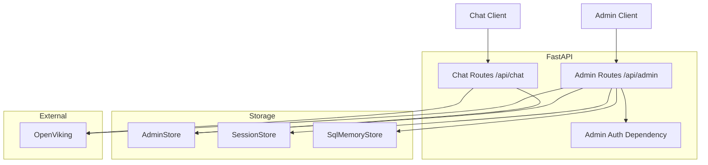

# 设计文档

## 概述

**目的**: 为 DBAgent 运维管理员提供轻量 HTTP API 模块，实现 HDC namespace 映射管理、SQL Memory 远程管理、namespace 目录浏览和系统概览功能。

**用户**: DBAgent 运维管理员（通过 HTTP API 管理 namespace 分配和 SQL 记忆维护）。

**影响**: 在现有架构上新增 `app/api/admin_routes.py`（管理端点）、`app/memory/admin_store.py`（映射表存储），扩展 `StorageBackend` 和 `SqlMemoryBackend` Protocol，在 `routes.py` 中新增 namespace 自动解析逻辑。

### 目标
- 管理员通过 HTTP API 管理 HDC namespace 映射，无需登录服务器
- 管理员通过 HTTP API 管理 SQL Memory 记录，替代 CLI 操作
- 最终用户无需手动指定 namespace，系统根据映射自动解析
- 所有管理端点受 Bearer token 保护

### 非目标
- 用户注册/登录系统
- Web 管理面板 UI
- 细粒度 RBAC
- 运行时配置热更新
- 审计日志
- 多 token 管理

## 边界承诺

### 本 Spec 拥有
- HDC namespace 映射的 CRUD 存储和 API
- 管理 API 端点的认证逻辑（Bearer token 验证）
- chat 请求流程中的 namespace 自动解析逻辑
- SQL Memory 管理 HTTP API（status/list/clean/re-embed/stats）
- HDC namespace 目录浏览 API
- 系统概览统计 API
- `AdminStoreBackend` Protocol 及 Sqlite 实现（`InMemoryAdminStore` 仅用于单元测试）
- `StorageBackend.count_sessions()` / `count_distinct_users()` 扩展
- `SqlMemoryBackend.list_records()` / `count_records()` / `delete_records()` 扩展
- `OpenVikingClient.list_directory()` 公开方法

### 边界外
- `ChatRequest` 的 `hdc_namespace` 字段（保留，但优先级降为最高覆盖）
- HDC 知识库的生成和存储结构（属于 `hdc-datavault-knowledge-base`）
- SQL Memory 的 recording 和 retrieval 逻辑（属于 `sql-memory-store`）
- OpenViking 的 HDC 存储路径（属于 `hdc-datavault-knowledge-base`）
- 前端 UI
- WebSocket chat 端点的 namespace 支持

### 允许的依赖
- `app.config.Settings` — 新增 `admin_api_token` 字段
- `app.memory.store.StorageBackend` — 扩展 Protocol
- `app.memory.sql_memory.SqlMemoryBackend` — 扩展 Protocol
- `app.memory.manager.StorageManager` — 新增 `admin_store` 参数
- `app.knowledge.openviking.OpenVikingClient` — 新增 `list_directory()` 方法
- `app.datavault.uploader` — 复用 `_HDC_ROOT`、`_db_uri`、`storage_key` helper
- `app.api.schemas` — 新增 admin 相关请求/响应模型
- `app.api.routes` — 新增 `resolve_hdc_namespace()` 函数

### 重新验证触发器
- `AdminStoreBackend` Protocol 方法签名变更
- `StorageBackend` 或 `SqlMemoryBackend` 新增方法签名变更
- `resolve_hdc_namespace()` 函数签名或优先级规则变更
- `/api/admin/*` 端点路径或认证方式变更
- `user_hdc_mappings` 表 schema 变更

## 架构

### 现有架构分析

当前系统采用 4 层管道架构：HTTP/WS 层（FastAPI）→ Agent 编排层（ReAct 循环）→ 领域服务层（NL2SQL、工具）→ 外部服务层（OneDBA、OpenViking、Langfuse）。存储层通过 Protocol 抽象，`StorageManager` 统一管理生命周期。

本 spec 在 HTTP 层新增 `/api/admin/*` 路由组，在存储层新增 `AdminStoreBackend` 并扩展两个现有 Protocol。改动跨越三个现有层但每层改动量小。

### 架构模式 & 边界图



**依赖方向**: `API Routes → Storage Backends → SQLite / OpenViking`。Admin Routes 通过 Protocol 访问存储，不直接访问 SQLite 内部实现。

### 技术栈

| 层 | 选择 / 版本 | 角色 | 备注 |
|---|-------------|------|------|
| 后端服务 | FastAPI + Uvicorn | HTTP 路由和 SSE 流式 | 与现有一致 |
| 认证 | FastAPI `Depends` | Bearer token 验证 | 标准 FastAPI 依赖注入 |
| 数据存储 | aiosqlite（复用 `data/sessions.db`） | HDC 映射表持久化 | 与现有 SqliteStore 共享同一文件 |
| 外部服务 | OpenVikingClient（HTTP） | namespace 目录浏览 | 复用现有客户端 |

## 文件结构计划

### 新建文件

**文件结构计划** 下的 admin_store.py 描述:

```
app/
├── api/
│   └── admin_routes.py          # Admin API 路由（/api/admin/* 端点 + auth 依赖）
├── memory/
│   └── admin_store.py           # AdminStoreBackend Protocol + SqliteAdminStore（运行时）+ InMemoryAdminStore（测试用）
```

### 修改文件

```
app/
├── config.py                    # 新增 admin_api_token 字段
├── main.py                      # 挂载 admin_router → app.include_router(admin_router, prefix="/api")
├── memory/
│   ├── store.py                 # StorageBackend 新增 count_sessions(), count_distinct_users()
│   ├── sql_memory.py            # SqlMemoryBackend 新增 list_records(), count_records(), delete_records()
│   └── manager.py               # StorageManager.__init__ 新增 admin_store 参数；get_storage() 新增 admin store 创建
├── knowledge/
│   └── openviking.py            # 新增 list_directory(uri) 公开方法
└── api/
    ├── routes.py                # 新增 resolve_hdc_namespace()；在 HDC 检索前调用
    └── schemas.py               # 新增 admin 请求/响应模型
```

## 需求追溯

| 需求 | 摘要 | 组件 | 接口 | 流程 |
|------|------|------|------|------|
| 1.1 | Bearer token 验证 | Admin Routes, Auth Dependency | `Depends(verify_admin_token)` | 每个 admin 请求 → 验证 Authorization header |
| 1.2 | 未配置时返回 503 | Admin Routes, Auth Dependency | 同上 | 验证前检查 `admin_api_token` 是否为空 |
| 1.3 | token 不匹配返回 401 | Auth Dependency | 同上 | 比较 Bearer token 与 `admin_api_token` |
| 1.4 | 缺少 header 返回 401 | Auth Dependency | 同上 | 检查 Authorization header 是否存在 |
| 2.1 | POST 创建映射 | AdminStore, Admin Routes | `POST /api/admin/hdc-mappings` | 校验输入 → upsert 到 `user_hdc_mappings` |
| 2.2 | GET 查询映射 | AdminStore, Admin Routes | `GET /api/admin/hdc-mappings` | 按过滤条件查询 |
| 2.3 | DELETE 删除映射 | AdminStore, Admin Routes | `DELETE /api/admin/hdc-mappings` | 按主键删除 |
| 2.4 | 缺少必填字段 422 | Admin Routes | Pydantic 请求体验证 | FastAPI 自动校验 |
| 2.5 | 输入校验 | AdminStore, Admin Routes | 非空字符串 + 正整数 | 创建/更新前校验 |
| 2.6 | 持久化 | AdminStore (Sqlite) | `user_hdc_mappings` 表 | SQLite INSERT/UPDATE |
| 3.1 | 显式 namespace 最高优先级 | resolve_hdc_namespace, routes.py | 函数返回值 | 检查 `request.hdc_namespace` |
| 3.2 | 无显式时查映射 | resolve_hdc_namespace, AdminStore | `AdminStoreBackend.get_mapping()` | 查 `user_hdc_mappings` |
| 3.3 | 无映射时返回 None | resolve_hdc_namespace | 函数返回 None | 默认行为不变 |
| 3.4 | 三层优先级 | resolve_hdc_namespace | 函数逻辑 | request > mapping > None |
| 3.5 | chat 和 chat/sync 共用 | resolve_hdc_namespace, routes.py | 同一函数调用 | 两个入口均调用 |
| 3.6 | 从 session_state 读取 | resolve_hdc_namespace, routes.py | `session_state.selected_database` | 在 fields 合并后执行 |
| 3.7 | 缺失时跳过 | resolve_hdc_namespace | 条件判断 | `schema_id`/`database_name` 缺失 → None |
| 4.1 | 列出子目录 | OpenVikingClient, Admin Routes | `list_directory()` | `GET /api/admin/hdc/namespaces/{schema_id}/{db}` |
| 4.2 | 排除保留目录 | Admin Routes | 过滤 `_tables`/`_relationships` | 在返回结果中过滤 |
| 4.3 | 仅返回显式 namespace | Admin Routes | 不返回默认 namespace | 过滤逻辑 |
| 4.4 | 无目录时返回空列表 | Admin Routes | HTTP 200 + `[]` | |
| 4.5 | 根路径不存在返回空列表 | Admin Routes | HTTP 200 + `[]` | |
| 4.6 | OpenViking 不可达 503 | Admin Routes | try/except → 503 | |
| 5.0 | SQL Memory 未启用 503 | Admin Routes | 检查 `sql_memory_enabled` | 所有 `/admin/sql-memory/*` 端点 |
| 5.1 | 状态概览 | SqlMemoryStore, Admin Routes | `GET /api/admin/sql-memory/status` | 调用 `get_status_summary()` |
| 5.2 | 记录列表 | SqlMemoryStore, Admin Routes | `GET /api/admin/sql-memory/records` | 调用 `list_records()` |
| 5.3 | 输入校验 | Admin Routes | limit 上限 500，offset ≥ 0 | Pydantic 校验 |
| 5.4 | 返回字段 | SqlMemoryStore, Admin Routes | 排除 `embedding_json`，`table_names` 为 `list[str]` | 响应序列化时过滤 |
| 5.5 | 记录清理 | SqlMemoryStore, Admin Routes | `DELETE /api/admin/sql-memory/clean` | 调用 `delete_records()` |
| 5.6 | older_than_days 校验 | Admin Routes | 正整数校验 | Pydantic 校验 |
| 5.7 | 无参数时按 TTL 清理 | SqlMemoryStore, Admin Routes | 使用 `SQL_MEMORY_TTL_DAYS` | |
| 5.8 | Embedding 重建 | SqlMemoryStore, Admin Routes | `POST /api/admin/sql-memory/re-embed` | 调用 `re_embed_all()` |
| 5.9 | 统计分析 | SqlMemoryStore, Admin Routes | `GET /api/admin/sql-memory/stats` | 调用 `get_stats_summary()` |
| 5.10 | 无过滤时全局统计 | SqlMemoryStore, Admin Routes | 空参数 → 全局统计 | |
| 6.1 | list_records | SqlMemoryBackend, sql_memory.py | Protocol 方法签名 | InMemory + Sqlite 实现 |
| 6.2 | count_records | SqlMemoryBackend, sql_memory.py | Protocol 方法签名 | 同上 |
| 6.3 | delete_records | SqlMemoryBackend, sql_memory.py | Protocol 方法签名（含 `status` 参数 + 安全不变量） | 同上 |
| 6.4 | 双实现 | sql_memory.py | InMemorySqlMemoryStore + SqliteSqlMemoryStore | |
| 6.5 | get_status_summary | SqlMemoryBackend, sql_memory.py | Protocol 方法签名 | status API 专用 |
| 6.6 | get_stats_summary | SqlMemoryBackend, sql_memory.py | Protocol 方法签名 | stats API 专用 |
| 7.1 | 系统概览 | Admin Routes, SessionStore, SqlMemStore | `GET /api/admin/overview` | 聚合多项统计 |
| 7.2 | 独立计算 | Admin Routes | try/except per stat | 一个失败不影响其他 |
| 7.3 | 通过 Protocol 计算 | SessionStore, StorageBackend | `count_sessions()`, `count_distinct_users()` | 不直接访问 SQLite |
| 7.4 | 通过 Protocol 计算 SQL 记忆 | SqlMemStore, SqlMemoryBackend | `count_records()` | |
| 8.1 | count_sessions | StorageBackend, store.py | Protocol 方法签名 | InMemory + Sqlite 实现 |
| 8.2 | count_distinct_users | StorageBackend, store.py | Protocol 方法签名 | 同上 |
| 8.3 | 双实现 | store.py | InMemoryStore + SqliteStore | |

## 组件与接口

### 组件摘要

| 组件 | 域/层 | 意图 | 需求覆盖 | 关键依赖 (P0) | 契约 |
|------|-------|------|----------|---------------|------|
| Admin Routes | API/HTTP | Admin API 端点 | 1, 2, 4, 5, 7 | Auth Dependency (P0), AdminStore (P0), SqlMemoryStore (P0) | API |
| Auth Dependency | API/HTTP | Bearer token 验证 | 1 | Settings (P0) | Service |
| AdminStoreBackend | Storage | HDC 映射持久化 Protocol | 2, 3 | — | Service |
| resolve_hdc_namespace | API/Logic | Namespace 自动解析 | 3 | AdminStore (P0) | Service |
| OpenVikingClient.list_directory | External | 目录列表 | 4 | OpenViking HTTP API (P0) | Service |
| SqlMemoryBackend 扩展 | Storage | 跨用户管理方法 | 5, 6 | — | Service |
| StorageBackend 扩展 | Storage | 会话统计方法 | 7, 8 | — | Service |

### API / HTTP 层

#### Admin Routes

| 字段 | 详情 |
|------|------|
| 意图 | 提供 `/api/admin/*` 下的所有管理端点 |
| 需求 | 1, 2, 4, 5, 7 |
| 所有者 | `app/api/admin_routes.py` |

**职责 & 约束**
- 所有端点通过 `Depends(verify_admin_token)` 进行认证
- 参数校验使用 Pydantic 模型，与现有 `schemas.py` 风格一致
- 不直接访问 SQLite — 通过 Protocol 方法操作存储
- 错误响应格式与现有 API 一致（`{"detail": "..."}`）

**依赖**
- Inbound: Admin Client — HTTP 请求 (P0)
- Outbound: `AdminStoreBackend` — HDC 映射 CRUD (P0)
- Outbound: `SqlMemoryBackend` — SQL Memory 管理操作 (P0)
- Outbound: `StorageBackend` — 会话统计 (P0)
- External: `OpenVikingClient` — namespace 目录列表 (P1)

**契约**: Service [ ] / API [x] / Event [ ] / Batch [ ] / State [ ]

##### API 契约

| 方法 | 端点 | 请求 | 响应 | 错误 |
|------|------|------|------|------|
| GET | `/api/admin/overview` | — | `OverviewResponse` | 401, 503 |
| POST | `/api/admin/hdc-mappings` | `HdcMappingCreate` | `HdcMappingResponse` (201) | 401, 422 |
| GET | `/api/admin/hdc-mappings` | query: `user_id`, `schema_id`, `database_name` | `list[HdcMappingResponse]` | 401 |
| DELETE | `/api/admin/hdc-mappings` | query: `user_id`, `schema_id`, `database_name` | `{"deleted": true}` | 401, 404 |
| GET | `/api/admin/hdc/namespaces/{schema_id}/{database_name}` | — | `list[str]` | 401, 503 |
| GET | `/api/admin/sql-memory/status` | — | `SqlMemoryStatusResponse` | 401, 503 |
| GET | `/api/admin/sql-memory/records` | query: `user_id`, `database_name`, `status`, `limit`, `offset` | `SqlMemoryListResponse` | 401, 503 |
| DELETE | `/api/admin/sql-memory/clean` | body: `{"user_id", "database_name", "older_than_days"}` | `{"deleted_count": N}` | 401, 422, 503 |
| POST | `/api/admin/sql-memory/re-embed` | body: `{"user_id"}` | `{"updated_count": N}` | 401, 503 |
| GET | `/api/admin/sql-memory/stats` | query: `user_id`, `database_name`, `status` | `SqlMemoryStatsResponse` | 401, 503 |

**实现说明**
- 集成: `admin_router = APIRouter(prefix="/admin", dependencies=[Depends(verify_admin_token)])`，在 `main.py` 中 `app.include_router(admin_router, prefix="/api")`
- 校验: `HdcMappingCreate` 中 `user_id`/`database_name`/`hdc_namespace` 为 `str(min_length=1)`，`schema_id` 为 `int(gt=0)`；`limit` 为 `int(ge=1, le=500)`，`offset` 为 `int(ge=0)`
- 风险: 如果 `sql_memory_store` 为 `None`（未启用），所有 `/admin/sql-memory/*` 返回 503

#### Auth Dependency

| 字段 | 详情 |
|------|------|
| 意图 | 验证 Bearer token 是否匹配 `ADMIN_API_TOKEN` |
| 需求 | 1.1, 1.2, 1.3, 1.4 |
| 所有者 | `app/api/admin_routes.py` |

**职责 & 约束**
- 从 `Authorization` header 提取 Bearer token
- 与 `get_settings().admin_api_token` 比较
- 不做 token 轮换、过期、多 token 管理

**依赖**
- Outbound: `app.config.Settings` — 读取 `admin_api_token` (P0)

**契约**: Service [x] / API [ ] / Event [ ] / Batch [ ] / State [ ]

##### 服务接口

```python
async def verify_admin_token(
    authorization: str = Header(None),
    settings: Settings = Depends(get_settings),
) -> None:
    """验证 Bearer token。失败时 raise HTTPException。"""
```

- 前置条件: `ADMIN_API_TOKEN` 已配置或返回 503
- 后置条件: 验证通过则无返回值（继续执行），失败则 raise `HTTPException`
- 不变量: `settings.admin_api_token` 在进程生命周期内不变

#### resolve_hdc_namespace

| 字段 | 详情 |
|------|------|
| 意图 | 根据优先级规则解析最终使用的 HDC namespace |
| 需求 | 3.1, 3.2, 3.3, 3.4, 3.6, 3.7 |
| 所有者 | `app/api/routes.py` |

**职责 & 约束**
- 优先级: `explicit_hdc_namespace > admin mapping > None`
- 从 `session_state.selected_database` 读取 `schemaId`/`schemaName`
- 缺失 `schema_id` 或 `database_name` 时跳过映射查询

**集成位置**（`app/api/routes.py`）:
- `/api/chat` 和 `/api/chat/sync` 两个入口在合并 `schema_id`/`database_name` 到 `session_state` 后调用 `resolve_hdc_namespace()`
- 解析结果写入 `session_state["_hdc_namespace"]`
- **关键: 清理策略** — `session_state` 会被持久化并在下一轮恢复。如果 `resolve_hdc_namespace()` 返回 `None`，必须显式删除 `session_state["_hdc_namespace"]`（`pop` 或设为 `None`），确保不会复用上一轮的 namespace 值

**依赖**
- Outbound: `AdminStoreBackend.get_mapping()` — 查询映射 (P0)

**契约**: Service [x] / API [ ] / Event [ ] / Batch [ ] / State [ ]

##### 服务接口

```python
async def resolve_hdc_namespace(
    user_id: str,
    schema_id: int | None,
    database_name: str | None,
    explicit_namespace: str | None,
) -> str | None:
    """返回解析后的 namespace 或 None。"""
```

- 前置条件: user_id 为非空字符串
- 后置条件: 返回 namespace 字符串或 None
- 不变量: 返回 None 时行为与未传 namespace 完全一致

### 存储层

#### AdminStoreBackend

| 字段 | 详情 |
|------|------|
| 意图 | HDC namespace 映射持久化抽象 |
| 需求 | 2.1, 2.2, 2.3, 2.6, 3.2 |
| 所有者 | `app/memory/admin_store.py` |

**职责 & 约束**
- 为 `user_hdc_mappings` 表提供 CRUD 操作
- 复合主键: `(user_id, schema_id, database_name)`
- POST 为 upsert 语义（创建或更新）
- `SqliteAdminStore` 为运行时实现，始终使用 `settings.storage_file_path`（`data/sessions.db`）
- `InMemoryAdminStore` 仅用于单元测试
- Admin mapping 不跟随 `STORAGE_BACKEND=memory` 配置切换，因为 requirements 要求映射持久化到现有 SQLite 文件

**依赖**
- Inbound: Admin Routes — CRUD 调用 (P0)
- Inbound: resolve_hdc_namespace — 查询映射 (P0)

**契约**: Service [x] / API [ ] / Event [ ] / Batch [ ] / State [x]

##### 服务接口

```python
class AdminStoreBackend(Protocol):
    async def upsert_mapping(self, user_id: str, schema_id: int, database_name: str, hdc_namespace: str) -> dict: ...
    async def get_mapping(self, user_id: str, schema_id: int, database_name: str) -> dict | None: ...
    async def get_mappings(self, user_id: str = "", schema_id: int = 0, database_name: str = "") -> list[dict]: ...
    async def delete_mapping(self, user_id: str, schema_id: int, database_name: str) -> bool: ...
    async def initialize(self) -> None: ...
    async def close(self) -> None: ...
```

##### 状态管理
- 状态模型: `user_hdc_mappings` 表，每行一个映射
- 持久化: SQLite（`data/sessions.db`），与现有存储共享同一文件
- 并发策略: aiosqlite WAL 模式，与现有 `SqliteStore` 一致

#### SqlMemoryBackend 扩展

| 字段 | 详情 |
|------|------|
| 意图 | 新增跨用户管理方法 |
| 需求 | 6.1, 6.2, 6.3, 6.4 |
| 所有者 | `app/memory/sql_memory.py` |

**职责 & 约束**
- 新增方法支持空参数以查询所有用户
- 与现有方法签名风格一致
- 不影响现有 recording/retrieval 流程

**delete_records 安全不变量**:
- Admin route 在无过滤参数时必须传入 `older_than_days=settings.sql_memory_ttl_days`
- Backend 如果收到全空过滤（`user_id=""`, `database_name=""`, `status=""`）且 `older_than_days is None`，必须拒绝并返回 0
- 如需清空全部记录，必须使用独立的 `delete_all=True` 参数，当前 spec 范围内不实现此功能
- `delete_records()` 签名含 `status` 参数，与 `list_records()`/`count_records()` 过滤能力一致

**依赖**
- Inbound: Admin Routes — 管理操作 (P0)

**契约**: Service [x] / API [ ] / Event [ ] / Batch [ ] / State [ ]

##### 服务接口（新增方法）

```python
class SqlMemoryBackend(Protocol):
    # ... existing methods remain unchanged ...
    
    async def list_records(self, user_id: str = "", database_name: str = "", status: str = "", limit: int = 100, offset: int = 0) -> list[dict]: ...
    async def count_records(self, user_id: str = "", database_name: str = "", status: str = "") -> int: ...
    async def delete_records(self, user_id: str = "", database_name: str = "", status: str = "", older_than_days: int | None = None) -> int: ...
    async def get_status_summary(self, user_id: str = "", database_name: str = "", status: str = "") -> dict: ...
    async def get_stats_summary(self, user_id: str = "", database_name: str = "", status: str = "", min_records: int = 20) -> dict: ...
```

`/api/admin/sql-memory/status` 通过 `get_status_summary()` 获取概览数据，`/api/admin/sql-memory/stats` 通过 `get_stats_summary()` 获取分布和模式数据。不使用分页 `list_records()` 拼接全局统计。

`list_records()` 每条返回记录的字段契约：
```python
{
    "id": str,
    "user_id": str,
    "question": str,
    "sql_text": str,
    "sql_truncated": str,
    "table_names": list[str],
    "database_name": str,
    "schema_id": int,
    "execution_status": str,
    "created_at": str,
    "has_embedding": bool,
}
```
不返回 `embedding_json`。

#### StorageBackend 扩展

| 字段 | 详情 |
|------|------|
| 意图 | 新增会话统计方法 |
| 需求 | 8.1, 8.2, 8.3 |
| 所有者 | `app/memory/store.py` |

**依赖**
- Inbound: Admin Routes — 概览统计 (P0)

**契约**: Service [x] / API [ ] / Event [ ] / Batch [ ] / State [ ]

##### 服务接口（新增方法）

```python
class StorageBackend(Protocol):
    # ... existing methods remain unchanged ...
    
    async def count_sessions(self) -> int: ...
    async def count_distinct_users(self) -> int: ...
```

### 外部服务层

#### OpenVikingClient.list_directory

| 字段 | 详情 |
|------|------|
| 意图 | 公开目录列表方法，供 namespace 浏览使用 |
| 需求 | 4.1 |
| 所有者 | `app/knowledge/openviking.py` |

**依赖**
- External: OpenViking HTTP API `/api/v1/fs/ls` (P0)

**契约**: Service [x] / API [ ] / Event [ ] / Batch [ ] / State [ ]

##### 服务接口

```python
class OpenVikingDirectoryEntry(BaseModel):
    name: str
    uri: str
    is_dir: bool

class OpenVikingClient:
    async def list_directory(self, uri: str) -> list[OpenVikingDirectoryEntry]:
        """列出 OpenViking 中指定 URI 下的子目录/文件。

        原始 fs/ls 返回的 name 可能为空。
        list_directory() 必须用 entry["name"] or basename(entry["uri"]) 回退解析名称。
        namespace API 只使用 is_dir=True 且名称不在 [_tables, _relationships] 的条目。
        """
```

- 前置条件: OpenViking 服务可达
- 后置条件: 返回归一化的条目列表，每个条目包含 `name`、`uri` 和 `is_dir`

## 数据模型

### 域模型

**聚合**: `HdcMapping` — 一个 `(user_id, schema_id, database_name)` → `hdc_namespace` 的映射关系。

**实体**: `HdcMapping` 以 `(user_id, schema_id, database_name)` 为唯一标识。

**不变量**:
- `hdc_namespace` 不为空
- `user_id` 不为空
- `schema_id` 为正整数

### 物理数据模型

**新表: `user_hdc_mappings`**（存储于 `data/sessions.db`）

```sql
CREATE TABLE IF NOT EXISTS user_hdc_mappings (
    user_id TEXT NOT NULL,
    schema_id INTEGER NOT NULL,
    database_name TEXT NOT NULL,
    hdc_namespace TEXT NOT NULL,
    updated_at TEXT NOT NULL,
    PRIMARY KEY (user_id, schema_id, database_name)
);
```

**索引**: 主键索引已覆盖查询模式。如需按 `database_name` 查询，可添加 `CREATE INDEX IF NOT EXISTS idx_mappings_db ON user_hdc_mappings(database_name);`

### 数据契约 & 集成

**API 请求/响应模型**（`app/api/schemas.py` 新增）:

```python
class HdcMappingCreate(BaseModel):
    user_id: str = Field(..., min_length=1)
    schema_id: int = Field(..., gt=0)
    database_name: str = Field(..., min_length=1)
    hdc_namespace: str = Field(..., min_length=1)

class HdcMappingResponse(BaseModel):
    user_id: str
    schema_id: int
    database_name: str
    hdc_namespace: str
    updated_at: str

class SqlMemoryStatusResponse(BaseModel):
    total_records: int
    embedding_coverage: float
    status_distribution: dict[str, int]
    earliest_record: str | None
    latest_record: str | None

class SqlMemoryRecordResponse(BaseModel):
    id: str
    user_id: str
    question: str
    sql_text: str
    sql_truncated: str
    table_names: list[str]
    database_name: str
    schema_id: int
    execution_status: str
    created_at: str
    has_embedding: bool

class SqlMemoryListResponse(BaseModel):
    records: list[SqlMemoryRecordResponse]
    total: int
    limit: int
    offset: int

class SqlMemoryStatsResponse(BaseModel):
    table_distribution: dict[str, int]
    database_distribution: dict[str, int]
    daily_histogram: dict[str, int]
    mined_patterns: dict | None

class HdcNamespaceSummary(BaseModel):
    schema_id: int
    database_name: str
    namespace_count: int

class OverviewResponse(BaseModel):
    distinct_users: int
    total_sessions: int
    sql_memory_records: int
    hdc_namespaces: list[HdcNamespaceSummary]  # best-effort: 只统计 admin mapping 中出现过的 (schema_id, database_name)
```

## 错误处理

### 错误策略

所有 admin 端点遵循 FastAPI 标准错误响应格式。

### 错误类别和响应

**认证错误**:
- 401 — Bearer token 缺失或不匹配 → `{"detail": "Missing admin token"}` / `{"detail": "Invalid admin token"}`
- 503 — `ADMIN_API_TOKEN` 未配置 → `{"detail": "Admin API not configured"}`

**输入错误**:
- 422 — 字段校验失败 → Pydantic 标准 `{"detail": [{"loc": [...], "msg": "...", "type": "..."}]}`

**业务错误**:
- 404 — 映射不存在 → `{"detail": "Mapping not found"}`
- 503 — SQL Memory 未启用 → `{"detail": "SQL Memory not enabled"}`

**系统错误**:
- 503 — OpenViking 不可达 → `{"detail": "OpenViking unavailable: <error>"}`

### 监控

- Admin 端点记录应用日志（标准 `print()` 输出，与现有日志风格一致）
- 认证失败记录 WARN 日志（不记录 token 值）

## 测试策略

### 单元测试
- `verify_admin_token` 的四种场景：token 正确、token 错误、无 header、未配置
- `resolve_hdc_namespace` 的优先级逻辑：显式传入、映射命中、映射不存在、字段缺失
- `AdminStoreBackend` 的 CRUD 操作：create、upsert、get、list、delete、not found
- `SqlMemoryBackend` 新增方法：list_records 分页、count_records 过滤、delete_records 按条件
- `StorageBackend` 新增方法：count_sessions、count_distinct_users

### 集成测试
- Admin API 端点完整请求-响应链路（含认证）
- `/api/admin/overview` 聚合统计的正确性
- HDC namespace 目录浏览（需要 OpenViking 集成环境）
- SQL Memory 管理操作（需要 SQLite 集成环境）

### E2E 测试
- 管理员创建映射 → 用户发起 chat 请求 → 验证 namespace 自动解析
- 管理员清理 SQL Memory → 验证记录被删除
- 管理员重建 embedding → 验证 embedding 已更新

### 性能测试
- `list_records` 分页查询在 10 万条记录下的响应时间（目标 < 500ms）
- `/api/admin/overview` 聚合查询响应时间（目标 < 1s）