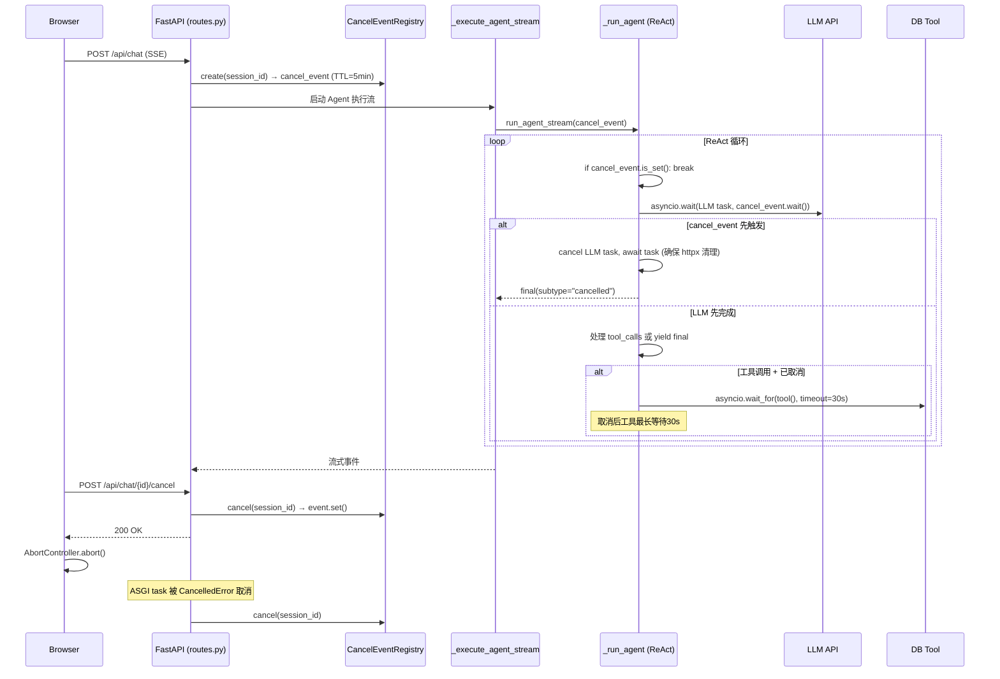
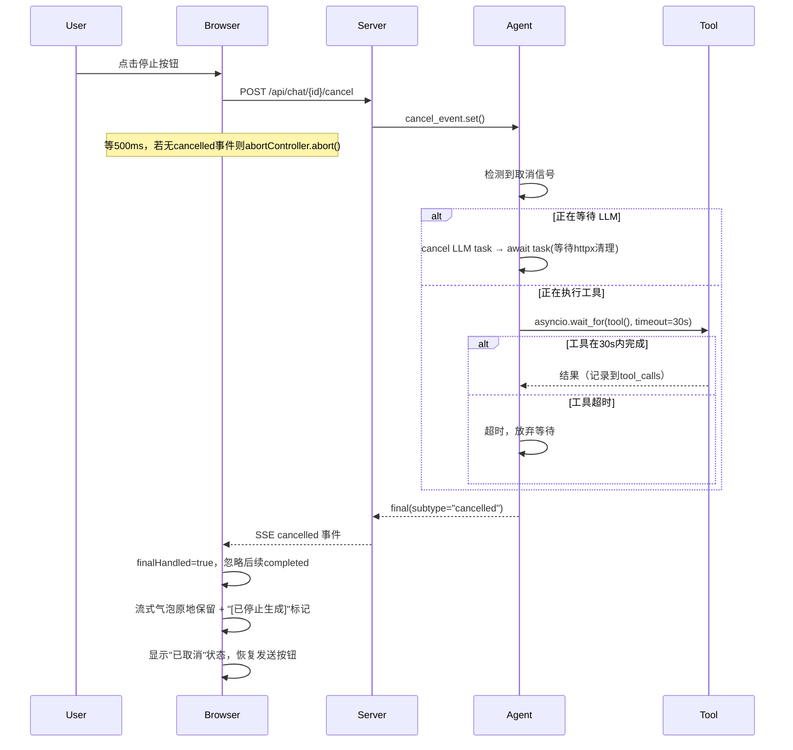
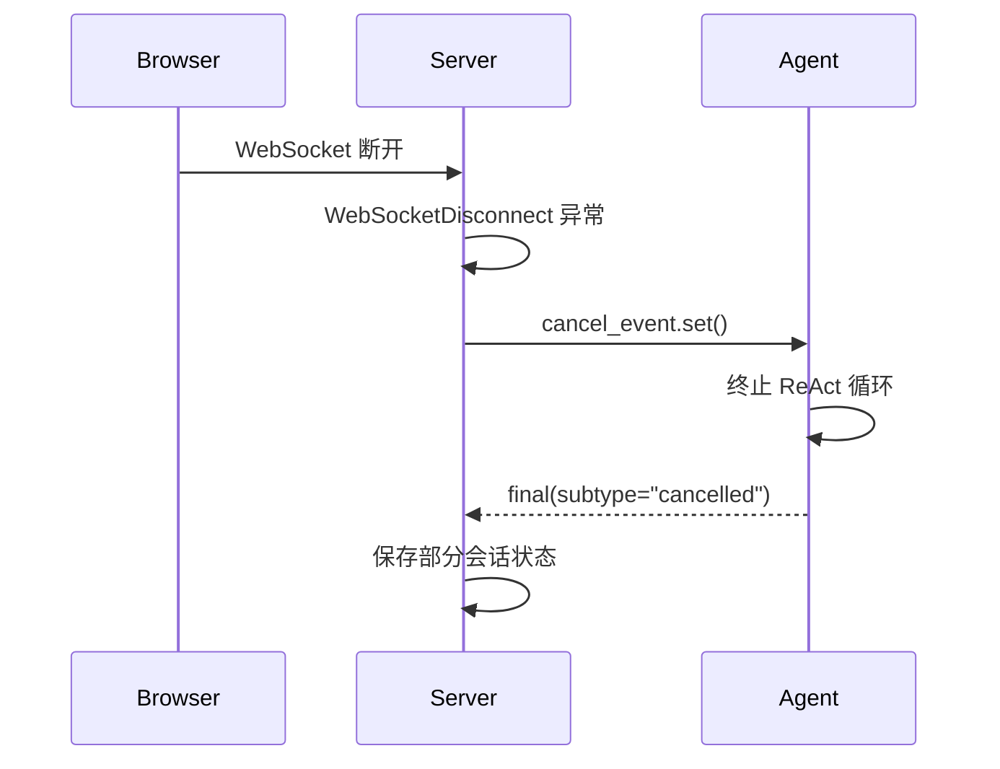

# 设计文档

## Overview
**目的**：为 DBAgent 增加用户主动终止 Agent 执行的能力，用户在回答过程中点击"停止"按钮后，系统立即终止 ReAct 循环，保留已产生的思考文本和工具调用记录，返回部分结果，保持会话状态完整性。

**用户**：DBAgent 的最终用户。当 Agent 思考时间过长、工具调用卡住或问题描述有误时，用户点击"停止"按钮中断当前执行。

**影响**：修改 Agent 执行引擎（`_run_agent`）和 API 路由层（`_execute_agent_stream`），新增取消事件注册表和 HTTP 取消端点，前端增加停止按钮和 AbortController 集成。

### Goals
- 支持用户在 Agent 执行任何阶段（思考/工具调用）主动触发取消
- 取消后保留已产生的思考文本和工具调用记录，追加到会话历史
- 通过 SSE 和 WebSocket 双协议均支持取消
- 取消操作不影响其他活跃会话
- 取消异常时静默降级，不影响核心对话流程
- 取消后工具执行有超时保护，防止无限等待

### Non-Goals
- 回滚已发送的 LLM 请求（token 已消耗）
- 回滚已执行的数据库操作
- 取消后的自动重试
- 取消操作的权限控制
- 工具执行中途的强制 kill（只能等待当前工具完成或超时）

## Boundary Commitments

### This Spec Owns
- `CancelEventRegistry` 类：会话级取消事件的注册、触发和清理，含 TTL 过期机制
- `_run_agent()` 的取消感知逻辑：迭代边界检查 + LLM 调用竞速中断 + 工具执行超时保护
- `_execute_agent_stream()` 的取消事件生命周期管理
- `POST /api/chat/{session_id}/cancel` 取消端点
- SSE `event_stream()` 中的客户端断开检测（`CancelledError` 捕获 + `request.is_disconnected()` 轮询）
- WebSocket 断开时的自动取消触发
- 前端停止按钮、AbortController 集成、双重 final 事件防抖、取消状态 UI

### Out of Boundary
- LLM API 调用本身（无法撤回已发送的请求）
- 数据库工具执行的内部逻辑（`query_database`、`execute_sql` 等）
- 会话存储层（`store.py`）的修改
- 取消后已消耗 token 的退费或计费调整
- `agent-streaming-display` 中的动画效果（取消时停止动画属于该 spec）

### Allowed Dependencies
- `app/agent/runner.py` — `_run_agent()`、`run_agent_stream()` 函数签名扩展
- `app/api/routes.py` — `_execute_agent_stream()`、`event_stream()`、WebSocket handler
- `app/api/schemas.py` — 新增 `CancelResponse`
- `app/static/app.js` — `sendMessage()` 函数修改
- `app/static/index.html` — 停止按钮 DOM
- `app/static/styles.css` — 取消状态样式
- `asyncio`（标准库）— Event、create_task、wait
- `starlette.requests.Request` — `is_disconnected()` 方法

### Revalidation Triggers
- `_run_agent()` 函数签名变更（新增/移除参数）
- `_execute_agent_stream()` 函数签名变更
- `CancelEventRegistry` 公开方法签名变更
- SSE event_stream 结构变更（影响 `request.is_disconnected()` 的调用位置）
- 前端 `sendMessage()` 函数重构

## Architecture

### Existing Architecture Analysis
当前 Agent 执行流程为单线异步流：
```
POST /api/chat → event_stream() → _execute_agent_stream() → run_agent_stream() → _run_agent()
```
没有任何取消机制。`_run_agent()` 中的 ReAct 循环只有 `max_iterations=15` 这一个退出条件。SSE 生成器不检测客户端断开。

### Architecture Pattern & Boundary Map



**Architecture Integration**:
- **Selected pattern**: 事件驱动取消（Event-driven cancellation）— 通过 `asyncio.Event` 在取消端点和 Agent 执行流之间传递取消信号，不修改 ReAct 循环内部逻辑
- **Domain/feature boundaries**: `CancelEventRegistry` 是取消信号的唯一权威来源；`_run_agent` 仅消费取消信号，不关心信号来源
- **Connection lifecycle**: 每个 Agent 执行在开始时创建 cancel_event（5分钟 TTL），在结束时（正常/取消/异常）通过 finally 清理
- **LLM 任务清理**: `task.cancel()` 后必须 `await task` 等待 `CancelledError` 传播完成，确保 SDK 内部 `finally` 块关闭 httpx 连接
- **工具超时保护**: 取消信号触发后，工具执行使用 `asyncio.wait_for(tool(), timeout=30s)` 包装，防止长时间查询导致取消无响应
- **Existing patterns preserved**: 遵循钩子模式（在 `_execute_agent_stream` 中集成），保留现有的静默降级错误处理策略
- **Steering compliance**: 单一职责（CancelEventRegistry 只管事件注册/触发/清理），依赖方向（API → Runner，不反向依赖）

### Technology Stack

| Layer | Choice / Version | Role in Feature | Notes |
|-------|------------------|-----------------|-------|
| 取消信令 | `asyncio.Event` (Python 3.12 stdlib) | 跨 task 取消信号传递 | 无外部依赖 |
| LLM 中断 | `asyncio.wait(FIRST_COMPLETED)` | 竞速 LLM 调用与取消事件 | task.cancel() + await task 确保 httpx 清理 |
| 工具超时保护 | `asyncio.wait_for(tool(), timeout=30)` | 取消后工具执行最长等待 30s | 防止长时间 DB 查询导致取消无响应 |
| 客户端断开检测 | `asyncio.CancelledError` + `request.is_disconnected()` | 双重检测 SSE 客户端断开 | CancelledError 为主，is_disconnected 兜底 |
| 前端取消 | `AbortController` (Web API) | 中断 fetch + ReadableStream | 浏览器原生 API |
| 事件注册表 | 内存 dict + asyncio.Event + TTL | 会话级取消事件管理 | 5min TTL 自动过期，投机清理 |

## File Structure Plan

### Directory Structure
```
app/
├── agent/
│   ├── cancel.py           # NEW: CancelEventRegistry 类
│   └── runner.py           # MODIFY: _run_agent() 接受 cancel_event，run_agent_stream() 透传
├── api/
│   ├── routes.py           # MODIFY: SSE event_stream 集成 disconnect 检测；新增 cancel 端点；WebSocket 断连取消
│   └── schemas.py          # MODIFY: 新增 CancelResponse
└── static/
    ├── app.js              # MODIFY: AbortController + 停止按钮逻辑
    ├── index.html          # MODIFY: 停止按钮 DOM
    └── styles.css          # MODIFY: 停止按钮和取消状态样式
```

### Modified Files
- `app/agent/runner.py` — `_run_agent()` 新增 `cancel_event` 参数，在迭代边界检查取消，在 LLM 调用处使用 `asyncio.wait` 竞速；`run_agent_stream()` 透传 `cancel_event`
- `app/api/routes.py` — `_execute_agent_stream()` 创建/清理 cancel_event（finally 块保证清理）；`event_stream()` 接受 `Request` 参数，主检测通过 `CancelledError` 捕获（ASGI 任务在客户端断开时被取消），兜底通过 `request.is_disconnected()` 轮询；新增 `POST /api/chat/{session_id}/cancel`；WebSocket 断开时触发取消
- `app/api/schemas.py` — 新增 `CancelResponse` 模型
- `app/static/app.js` — `sendMessage()` 使用 `AbortController`；新增停止按钮事件处理；取消状态 UI 更新
- `app/static/index.html` — 在 composer 区域添加停止按钮
- `app/static/styles.css` — 取消按钮、取消徽章、取消消息样式

## System Flows

### 正常取消流程



### WebSocket 断开取消流程



## Requirements Traceability

| Requirement | Summary | Components | Interfaces | Flows |
|-------------|---------|------------|------------|-------|
| 1.1 | 安全点终止 ReAct 循环 | CancelEventRegistry, _run_agent | cancel_event | 正常取消流程 |
| 1.2 | 中断 LLM 等待 | _run_agent | asyncio.wait 竞速 | 正常取消流程 |
| 1.3 | 等待工具完成后终止 | _run_agent | 迭代边界 is_set() 检查 | 正常取消流程 |
| 1.4 | 发送取消事件 | run_agent_stream, _execute_agent_stream | final(subtype="cancelled") | 正常取消流程 |
| 1.5 | 幂等取消 | CancelEventRegistry | Event.set() 幂等 | — |
| 2.1 | 保留思考文本 | run_agent_stream | 已收集的 all_texts | 正常取消流程 |
| 2.2 | 保留工具调用记录 | _execute_agent_stream | tool_calls_info | 正常取消流程 |
| 2.3 | 追加到会话历史 | _execute_agent_stream | save_session() | 正常取消流程 |
| 2.4 | 无产出时返回空 | _execute_agent_stream | 空 final 事件 | 正常取消流程 |
| 3.1 | "正在取消"状态 | app.js | setBadge("取消中", "busy") | 正常取消流程 |
| 3.2 | "已取消"徽章 | app.js | setBadge("已取消", "cancelled") | 正常取消流程 |
| 3.3 | 恢复发送按钮 | app.js | sendBtn.disabled = false | 正常取消流程 |
| 3.4 | 取消提示信息 | app.js | appendMessage("assistant", "已停止生成") | 正常取消流程 |
| 4.1 | SSE 停止按钮 | app.js, index.html | AbortController + 停止按钮 | 正常取消流程 |
| 4.2 | WebSocket 断连取消 | routes.py | WebSocketDisconnect → cancel_event.set() | WS 断开取消流程 |
| 4.3 | HTTP 取消端点 | routes.py, schemas.py | POST /api/chat/{id}/cancel | 正常取消流程 |
| 5.1 | 持久化会话 | _execute_agent_stream | save_session() | 正常取消流程 |
| 5.2 | 刷新恢复历史 | store.py（已有） | get_session() | — |
| 5.3 | 新消息不受影响 | _execute_agent_stream | 新 cancel_event | — |
| 5.4 | 会话隔离 | CancelEventRegistry | session_id key 隔离 | — |
| 6.1 | 异常时静默降级 | _execute_agent_stream | try/except 包裹 | — |
| 6.2 | 保存失败记录日志 | _execute_agent_stream | print() 日志 | — |
| 6.3 | 重复取消幂等 | CancelEventRegistry | Event.set() 幂等 | — |

## Components and Interfaces

### Agent Layer

#### CancelEventRegistry

| Field | Detail |
|-------|--------|
| Intent | 管理会话级取消事件的注册、触发和清理，含 TTL 过期机制防止内存泄漏 |
| Requirements | 1.1, 1.5, 5.4, 6.3 |

**Responsibilities & Constraints**
- 维护 `dict[str, tuple[asyncio.Event, float]]`，以 session_id 为 key，存储事件及其创建时间戳
- 线程安全不是必需的（纯 asyncio 上下文）
- 不持久化，进程重启后所有事件丢失
- **TTL 机制**：事件创建超过 5 分钟自动过期，`create()` 时投机清理过期条目
- **防御性清理**：`create()` 时如果 session_id 已存在，先清理旧事件再创建新的

**Dependencies**
- Inbound: `routes.py` — `create()`, `cancel()`, `remove()` 调用
- Outbound: 无
- External: `asyncio.Event`, `time.monotonic()` — 取消信号载体和 TTL 计时

**Contracts**: Service [x]

##### Service Interface
```python
class CancelEventRegistry:
    """会话级取消事件注册表（进程内单例，含 TTL 过期机制）"""

    _TTL_SECONDS = 300  # 5 分钟

    def __init__(self) -> None:
        self._events: dict[str, tuple[asyncio.Event, float]] = {}

    def _purge_expired(self) -> None:
        """投机清理所有过期事件，在 create() 时调用"""
        ...

    def create(self, session_id: str) -> asyncio.Event:
        """为会话创建取消事件（自动清理过期条目）。若 session_id 已有事件则先清理旧的"""
        ...

    def cancel(self, session_id: str) -> bool:
        """触发取消信号。返回 True 表示事件存在并已触发"""
        ...

    def remove(self, session_id: str) -> None:
        """清理会话的取消事件"""
        ...


# 模块级单例
_registry: CancelEventRegistry | None = None

def get_cancel_registry() -> CancelEventRegistry:
    """获取 CancelEventRegistry 单例"""
    ...
```
- Preconditions: `session_id` 非空
- Postconditions: `create()` 后事件存在于注册表中；`cancel()` 后 `event.is_set()` 为 True；`remove()` 后事件从注册表移除
- Invariants: 同一 session_id 同时最多一个事件；任何事件在 TTL 后会被投机清理

#### _run_agent() (修改)

| Field | Detail |
|-------|--------|
| Intent | ReAct 循环增加取消感知，含 LLM 任务安全清理和工具超时保护 |
| Requirements | 1.1, 1.2, 1.3 |

**Responsibilities & Constraints**
- 在每次迭代开始检查 `cancel_event.is_set()`，若已设置则 yield `final(subtype="cancelled")` 并返回
- 在 LLM 调用处使用 `asyncio.wait(FIRST_COMPLETED)` 竞速 LLM task 和 `cancel_event.wait()` task
- **LLM 任务清理**: 若取消先触发，调用 `llm_task.cancel()` 后必须 `await llm_task`（用 try/except CancelledError 包裹），确保 SDK 内部 httpx 连接的 `finally` 清理逻辑执行完毕
- **工具超时保护**: 取消信号已触发时，工具执行使用 `asyncio.wait_for(_execute_tool(name, input_data), timeout=30)` 包装；若工具在 30s 内未完成则抛出 `TimeoutError`，Agent 直接终止；若工具在超时前完成则正常记录结果
- 若 LLM 先完成：正常处理响应，工具调用结束后再次检查 `cancel_event.is_set()` 决定是否继续迭代

**Dependencies**
- Inbound: `run_agent_stream()` — 传入 `cancel_event`
- Outbound: `_get_llm_client()` — LLM 调用；`_execute_tool()` — 工具执行
- External: `asyncio.Event`, `asyncio.wait`, `asyncio.wait_for` — 取消信令和超时控制

**Contracts**: Service [x]

##### Service Interface
```python
async def _run_agent(
    prompt: str,
    tool_schemas: list[dict[str, Any]],
    cancel_event: asyncio.Event | None = None,
) -> AsyncIterator[dict[str, Any]]:
    """新增 cancel_event 参数，为 None 时行为不变（向后兼容）"""
    ...
```
- Preconditions: `prompt` 非空
- Postconditions: 取消时 yield `{"type": "final", "subtype": "cancelled", ...}`；LLM task 被 cancel 后 httpx 连接已关闭
- Invariants: `cancel_event` 为 None 时行为与修改前完全一致；每次 LLM 调用结束后不留下未清理的 task

### API Layer

#### POST /api/chat/{session_id}/cancel (新增)

| Field | Detail |
|-------|--------|
| Intent | 接受用户取消请求，触发 Agent 执行终止 |
| Requirements | 4.3 |

**Contracts**: API [x]

##### API Contract
| Method | Endpoint | Request | Response | Errors |
|--------|----------|---------|----------|--------|
| POST | /api/chat/{session_id}/cancel | — | CancelResponse (200 OK) | — |

所有响应均返回 200 OK，通过 `CancelResponse.cancelled` 字段区分是否成功触发取消：
- `cancelled=true`：事件存在并已触发
- `cancelled=false`：事件不存在（Agent 未执行或已完成），message 字段说明原因

```python
class CancelResponse(BaseModel):
    cancelled: bool       # 是否成功触发取消
    session_id: str       # 会话 ID
    message: str          # 状态描述
```

#### _execute_agent_stream() (修改)

| Field | Detail |
|-------|--------|
| Intent | 管理取消事件生命周期，处理取消后的部分结果保存 |
| Requirements | 2.1, 2.2, 2.3, 2.4, 5.1, 6.1 |

**Responsibilities & Constraints**
- 在函数开始时调用 `CancelEventRegistry.create(session_id)`
- 在 finally 块中调用 `CancelEventRegistry.remove(session_id)`
- 捕获取消事件，yield 取消 final 事件后保存部分会话状态

### Frontend Layer

#### sendMessage() (修改) / 停止按钮 (新增)

| Field | Detail |
|-------|--------|
| Intent | 支持用户点击停止按钮中断 Agent 执行，防止双重 final 事件错误，取消时不闪烁 |
| Requirements | 3.1, 3.2, 3.3, 3.4, 4.1 |

**Responsibilities & Constraints**
- 使用 `AbortController` 包装 `fetch()` 调用
- 停止按钮点击时：发送取消 HTTP 请求 → 等待 cancelled 事件 → 仅当取消事件未在 500ms 内到达时才调用 `abortController.abort()`（优先优雅取消，超时后强制断开）
- **双重 final 事件防抖**：维护 `finalHandled` 标志，优先处理 `subtype="cancelled"` 事件；收到 cancelled 后忽略后续 completed 事件
- **取消时不删除流式气泡**：取消时调用 `finalizeStreamingMessage()` 原地保留已渲染内容（移除 streaming class 停掉动画），追加"[已停止生成]"标记，而不是删除再重建
- 捕获 `AbortError`，不显示为错误
- 取消完成后更新 UI 状态（徽章、按钮、消息区域）

**取消时流式消息处理流程**：
1. 设置 `sendBtn.disabled = true`（防止重复发送）
2. 显示"取消中"徽章
3. 发送 `POST /api/chat/{id}/cancel`
4. SSE 收到 `subtype="cancelled"` 的 final 事件：
   a. 设置 `finalHandled = true`
   b. `finalizeStreamingMessage()` → 移除 `.streaming` class + 追加"[已停止生成]"标记
   c. 渲染已收集的思考文本和工具调用结果
   d. 更新徽章为"已取消"
   e. 恢复 `sendBtn.disabled = false`

**Dependencies**
- Inbound: 停止按钮 DOM 事件
- Outbound: `POST /api/chat/{id}/cancel`
- External: `AbortController` (Web API)

## Data Models

### CancelEventRegistry 内部状态
```
_registry: dict[str, tuple[asyncio.Event, float]]
```
- Key: `session_id` (str)
- Value: `(event, created_at)` 元组，`created_at` 来自 `time.monotonic()`
- 生命周期：在 `_execute_agent_stream` 开始时通过 `create()` 创建，在 finally 中通过 `remove()` 移除
- TTL 过期：`create()` 时调用 `_purge_expired()` 清理超过 300s 未清理的事件
- 无持久化需求

## Error Handling

### Error Strategy
取消功能采用"尽力而为 + 静默降级"策略。取消操作不是关键路径，任何异常不应影响正常对话流程。

### Error Categories and Responses
**取消信令异常**：`CancelEventRegistry` 操作失败时，catch 异常并打印日志，Agent 继续执行至完成
**LLM task 清理异常**：`llm_task.cancel()` 后的 `await llm_task` 在 try/except CancelledError 中执行，确保无论如何都不阻塞后续流程
**工具超时**：取消信号触发后工具执行超过 30s 抛出 `TimeoutError`，Agent 记录超时日志后直接终止（已执行部分不可回滚）
**会话保存失败**：取消后 `save_session()` 失败时，记录错误日志，向前端返回取消成功但提示"部分结果可能未保存"
**并发取消**：同一会话多次取消请求，`Event.set()` 是幂等的，仅第一次有效
**CancelEventRegistry 内存泄漏防护**：5 分钟 TTL 自动过期 + `create()` 时投机清理 + finally 块保证 `remove()` 调用，三重保障
**双重 final 事件**：前端 `finalHandled` 标志优先处理 cancelled；若 completed final 先于 cancel 请求到达，取消请求在服务端通过幂等检查（`cancel_event.is_set()` 已为 False，Agent 已完成）返回 200 with `cancelled=false`

### Monitoring
- 取消操作触发时打印 `[Cancel] 取消请求: session_id=xxx`
- 取消完成时打印 `[Cancel] 取消完成: session_id=xxx, 已产出思考文本=N chars, 工具调用=N`
- LLM task 取消时打印 `[Cancel] LLM task 已取消: session_id=xxx`
- 工具超时时打印 `[Cancel] 工具超时(30s): session_id=xxx tool=yyy`
- 取消异常时打印 `[Cancel] 异常: session_id=xxx error=...`

## Testing Strategy

### Unit Tests
- `CancelEventRegistry.create()` 创建事件，`remove()` 清理
- `CancelEventRegistry.cancel()` 触发事件，`is_set()` 返回 True
- `CancelEventRegistry.cancel()` 对不存在的 session 返回 False
- `CancelEventRegistry._purge_expired()` 清理超过 5 分钟的过期事件
- `CancelEventRegistry.create()` 对已存在的 session_id 先清理旧事件再创建新的
- `_run_agent()` 在 cancel_event 已设置时立即返回取消事件
- `_run_agent()` 在 cancel_event 为 None 时行为不变
- `_run_agent()` 取消 LLM task 后 `await task` 正确传播 `CancelledError`

### Integration Tests
- SSE 端点：发送取消请求后，Agent 在 2 秒内返回 `subtype="cancelled"` 事件
- SSE 端点：LLM 等待阶段取消后，httpx 连接正确关闭（端口不泄漏）
- SSE 端点：工具执行阶段取消后，工具在 30s 超时内正确终止
- SSE 端点：取消后会话状态包含已产出的思考文本和工具调用记录
- SSE 端点：客户端断开后 ASGI 任务被 `CancelledError` 取消，Agent 停止执行
- WebSocket 端点：客户端断开后 Agent 执行终止
- 取消端点对不存在的 session 返回 404
- 取消端点对已完成的 Agent（无活跃 cancel_event）返回 `cancelled=false`

### E2E Tests
- 用户点击停止按钮 → Agent 终止 → 前端显示"已取消" → 可继续输入新消息
- 取消后流式气泡内容保留（不闪烁），追加"[已停止生成]"标记
- 取消后刷新页面 → 对话历史包含取消前的部分内容
- 取消一个会话 → 另一个活跃会话不受影响
- Agent 已完成时触发取消 → 前端忽略（幂等处理）
- 快速连续点击停止按钮 → 仅一次生效，不产生双重取消事件