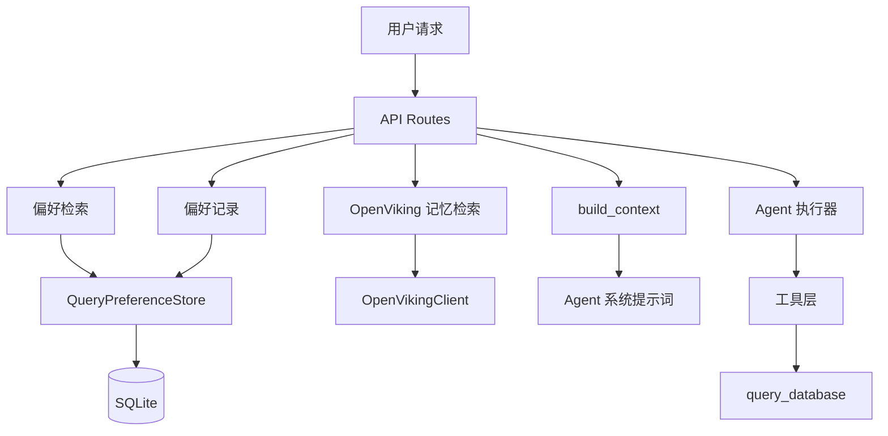
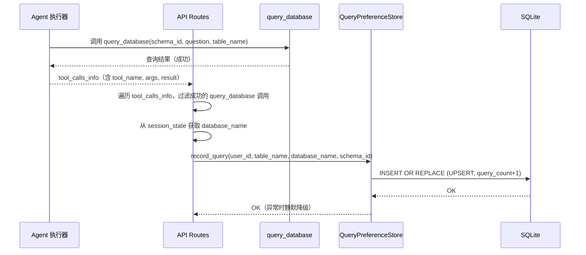
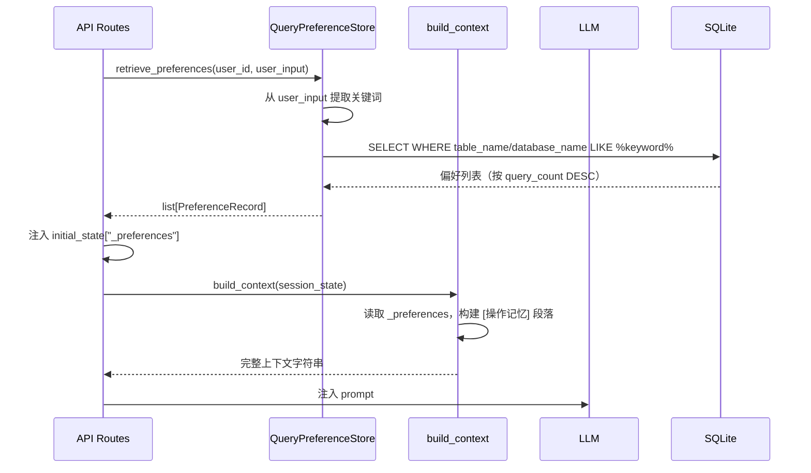

# 设计文档

## Overview
**目的**：为 DBAgent NL2SQL 查询助手增加操作层记忆能力，自动记录每次成功 SQL 查询的技术元数据（表名、数据库名、schema_id、SQL 模式），在后续对话中按需检索并注入 Agent 上下文，减少盲搜轮次。

**用户**：DBAgent 的 NL2SQL 查询助手（Agent）及其最终用户。Agent 利用偏好数据加速表定位；最终用户感知到系统"记住"了其查询习惯。

**影响**：在现有 OpenViking 语义记忆基础上补充结构化操作记忆层。不改变现有工具接口，通过钩子（hook）模式集成到 Agent 执行流程中。

### Goals
- 自动记录每次成功 `query_database` 调用的技术元数据（表名、数据库名、schema_id、查询次数）
- 根据用户输入关键词检索匹配的偏好表，按查询频率降序返回
- 将检索到的偏好表信息注入 Agent 上下文，与 OpenViking 语义记忆并列展示
- 与 OpenViking 语义记忆独立运作，互不干扰

### Non-Goals
- 替换 OpenViking 语义记忆（本功能是补充，不是替代）
- 存储用户身份信息
- 缓存 SQL 查询结果
- 跨用户共享偏好数据
- 偏好数据的自动过期或清理（当前版本通过每用户上限控制规模，见下文存储策略）

## Boundary Commitments

### This Spec Owns
- `query_preferences` 数据库表及其 schema 定义
- `QueryPreferenceStore` 类：偏好记录的增删改查逻辑
- 偏好记录触发逻辑：在 `query_database` 工具成功执行后自动记录
- 偏好检索触发逻辑：在每次对话开始时根据用户输入检索
- 偏好信息注入 Agent 上下文的格式和位置
- 偏好数据的前端展示字段（`preference_count`）

### Out of Boundary
- OpenViking 语义记忆的存储、检索和生命周期管理
- 会话存储（`sessions` 表）的 schema 和逻辑
- `query_database` 工具的内部实现（仅消费其成功/失败信号和参数）
- 用户身份认证和授权
- SQL 查询结果的缓存
- 偏好数据的跨用户聚合分析

### Allowed Dependencies
- `app/memory/store.py` — 复用相同的 SQLite 数据库文件和 aiosqlite 依赖
- `app/config.py` — 通过 `Settings` 读取配置（`storage_file_path`、新增 `preference_enabled`）
- `app/agent/context.py` — `build_context()` 函数，注入偏好信息
- `app/agent/prompts.py` — `AGENT_SYSTEM_PROMPT`，添加偏好使用规则
- `app/api/routes.py` — `_execute_agent_stream()`，集成记录和检索钩子
- `app/api/schemas.py` — `SessionState`，添加 `preference_count` 字段

### Revalidation Triggers
- `query_preferences` 表 schema 变更（添加/删除/重命名列）
- `QueryPreferenceStore` 公开方法签名变更
- `build_context()` 中偏好信息注入格式变更
- `Settings` 中偏好相关配置项的添加或删除
- `query_database` 工具参数签名变更（影响记录触发逻辑）

## Architecture

### Existing Architecture Analysis
当前系统采用分层架构：
- **API 层** (`app/api/routes.py`)：HTTP/WebSocket 接口，管理会话生命周期
- **Agent 层** (`app/agent/runner.py`)：ReAct 循环，LLM 决策 → 工具执行 → 观察结果
- **工具层** (`app/tools/`)：`query_database`、`execute_sql`、`find_table` 等
- **存储层** (`app/memory/store.py`)：`StorageBackend` 协议 + `InMemoryStore`/`SqliteStore` 实现
- **知识层** (`app/knowledge/openviking.py`)：OpenViking HTTP 客户端

现有记忆流程：
1. 对话开始前：`_execute_agent_stream()` 调用 `OpenVikingClient.retrieve_memories()` → 注入 `initial_state["_memories"]`
2. `build_context()` 读取 `_memories` → 注入 LLM prompt
3. 对话结束后：`_record_to_openviking()` 记录对话消息并定期 commit

本设计遵循相同的钩子模式，在对话开始前检索偏好、对话结束后记录偏好。

### Architecture Pattern & Boundary Map



**Architecture Integration**:
- **Selected pattern**: Hook-based integration（钩子模式）— 在现有 Agent 执行流的前后插入偏好检索和记录逻辑，不修改 ReAct 循环内部
- **Domain/feature boundaries**: 偏好存储与会话存储共享同一 SQLite 数据库文件但使用独立连接，两者通过 `user_id` 关联但不互相依赖
- **Connection lifecycle**: 与 `SqliteStore` 一致，`get_preference_store()` 工厂返回进程级单例，在 `lifespan` 启动时初始化、关闭时释放，避免每次请求创建/销毁连接
- **Existing patterns preserved**: 遵循 `get_store()` 工厂 + `lifespan` 初始化的持久连接模式，以及 OpenViking 记忆检索的钩子模式（`_execute_agent_stream` 中检索 → 注入 `initial_state` → `build_context` 消费）
- **Steering compliance**: 单一职责（每个组件一个明确职责）、依赖方向（Config → Store → Routes → Context，不反向依赖）

### Technology Stack

| Layer | Choice / Version | Role in Feature | Notes |
|-------|------------------|-----------------|-------|
| Backend / Services | Python 3.12+ | 偏好记录和检索的核心逻辑 | 无新增依赖 |
| Data / Storage | aiosqlite (已有) + SQLite WAL | 偏好数据持久化 | 复用现有 `data/sessions.db`，新增 `query_preferences` 表。接口层与 SQL 实现分离，预留可移植性 |
| Infrastructure / Runtime | FastAPI + uvicorn | 应用生命周期管理 | 在 `lifespan` 中初始化偏好表 |

## File Structure Plan

### 前置改造：存储层同步兼容层移除

在偏好功能实现前，先清理 `store.py` 中阻碍 Protocol 抽象生效的同步兼容代码。范围局限于两个文件，不改变接口语义，现有测试覆盖即可验证。

**改造内容**：
- 删除 `_run_async()` 函数及其 6 个 `isinstance(store, InMemoryStore)` 分支
- 删除 `_SessionStoreProxy` 类和 `SESSION_STORE` 全局变量
- 删除 6 个同步包装函数（`get_session`、`save_session`、`delete_session`、`list_sessions`、`session_count` 及对应 `__all__` 导出）
- `routes.py` 中 3 处 `get_session()` 调用改为 `await get_store().get_session()`，1 处 `save_session()` 改为 `await get_store().save_session()`
- 全局变量 `_store` 类型从 `Optional[InMemoryStore]` 改为 `Optional[StorageBackend]`

### Directory Structure
```
app/
├── memory/
│   ├── __init__.py          # MODIFY: 导出 QueryPreferenceStore, get_preference_store
│   └── preferences.py       # NEW: QueryPreferenceStore 类 + get_preference_store 工厂
├── agent/
│   ├── context.py           # MODIFY: build_context() 新增偏好注入段落
│   └── prompts.py           # MODIFY: AGENT_SYSTEM_PROMPT 新增偏好使用规则
├── api/
│   ├── routes.py            # MODIFY: _execute_agent_stream() 新增偏好检索和记录钩子
│   └── schemas.py           # MODIFY: SessionState 新增 preference_count 字段
├── config.py                # MODIFY: 新增 preference_enabled 配置项
└── main.py                  # MODIFY: lifespan 中初始化/关闭 QueryPreferenceStore
```

### Modified Files
- `app/memory/store.py` — **前置改造**：删除同步兼容层（`_run_async`、`_SessionStoreProxy`、同步包装函数），`_store` 类型改为 `StorageBackend`
- `app/memory/__init__.py` — 导出 `QueryPreferenceStore` 类和 `get_preference_store` 工厂函数；移除 `SESSION_STORE` 和同步包装函数导出
- `app/memory/preferences.py` — **NEW**: `QueryPreferenceStore` 类 + `get_preference_store` 工厂（单例，持久连接）
- `app/agent/context.py` — `build_context()` 新增 `[操作记忆 — 查询偏好]` 段落
- `app/agent/prompts.py` — `AGENT_SYSTEM_PROMPT` 新增"查询偏好"使用规则
- `app/api/routes.py` — 改用异步 store 方法；`_execute_agent_stream()` 中新增偏好检索和记录钩子
- `app/api/schemas.py` — `SessionState` 新增 `preference_count: int` 字段
- `app/config.py` — `Settings` 新增 `preference_enabled: bool = True`
- `app/main.py` — `lifespan` 中新增 `QueryPreferenceStore` 的初始化和关闭
- `tests/test_knowledge_memory.py` — 移除 `SESSION_STORE` 引用，改用 `reset_store()`
- `tests/test_session_api.py` — 无需改动（已使用 `reset_store()`）
- `tests/test_store.py` — 无需改动（直接使用 `InMemoryStore`/`SqliteStore` 实例）

## System Flows

### 偏好记录流程



**关键决策**：
- 记录在 Agent 执行完成后批量处理，而非在每个工具调用中实时记录
- 多表 JOIN 场景：`table_name` 参数可能包含逗号分隔的多表名，逐表分别记录
- `database_name` 从 `session_state["selected_database"]["schemaName"]` 获取

### 偏好检索流程



**关键决策**：
- 关键词匹配使用 SQL `LIKE` 而非全文搜索（偏好表数据量小，<1000 行/用户）
- 无匹配关键词时回退到 `retrieve_top_preferences`（返回最常用表）
- 检索失败时静默降级，不阻塞对话

## Requirements Traceability

| Requirement | Summary | Components | Interfaces | Flows |
|-------------|---------|------------|------------|-------|
| 1.1 | 成功查询后自动记录表名、数据库名、schema_id、查询时间 | QueryPreferenceStore, routes.py | `record_query()` | 偏好记录流程 |
| 1.2 | 同一用户同一表累计查询次数 | QueryPreferenceStore | `record_query()` (UPSERT) | 偏好记录流程 |
| 1.3 | JOIN 场景为每张表分别记录 | routes.py (多表拆分) | `record_query()` | 偏好记录流程 |
| 1.4 | 记录失败静默降级 | routes.py (try/except) | — | 偏好记录流程 |
| 2.1 | 关键词匹配，按频率降序 | QueryPreferenceStore | `retrieve_preferences()` | 偏好检索流程 |
| 2.2 | 无关键词时返回最常用表 | QueryPreferenceStore | `retrieve_top_preferences()` | 偏好检索流程 |
| 2.3 | 新用户返回空列表 | QueryPreferenceStore | `retrieve_preferences()` | 偏好检索流程 |
| 2.4 | 用户 A 不包含用户 B 数据 | QueryPreferenceStore (WHERE user_id) | 所有方法 | 偏好检索/记录流程 |
| 3.1 | 非空偏好注入 Agent 上下文 | context.py | `build_context()` | 偏好检索流程 |
| 3.2 | 与 OpenViking 记忆并列展示 | context.py | `build_context()` | 偏好检索流程 |
| 3.3 | 空偏好不注入 | context.py | `build_context()` | 偏好检索流程 |
| 4.1 | 前端展示偏好表数量 | schemas.py | `SessionState.preference_count` | — |
| 4.2 | Agent 回答中自然提及偏好 | prompts.py | `AGENT_SYSTEM_PROMPT` | — |
| 5.1 | 独立管理，互不干扰 | QueryPreferenceStore, config.py | `preference_enabled` | — |
| 5.2 | OpenViking 不可用时仍正常 | routes.py (独立 try/except) | — | 偏好检索/记录流程 |
| 5.3 | 偏好存储异常不影响 OpenViking | routes.py (独立 try/except) | — | 偏好检索/记录流程 |

## Components and Interfaces

| Component | Domain/Layer | Intent | Req Coverage | Key Dependencies (P0/P1) | Contracts |
|-----------|--------------|--------|--------------|--------------------------|-----------|
| QueryPreferenceStore | Data / Storage | 偏好数据的 CRUD 和检索 | 1.1, 1.2, 2.1, 2.2, 2.3, 2.4 | aiosqlite (P0), Settings (P1) | Service, State |
| build_context 扩展 | Agent / Context | 注入偏好信息到 Agent 上下文 | 3.1, 3.2, 3.3 | session_state dict (P0) | Service |
| AGENT_SYSTEM_PROMPT 扩展 | Agent / Prompt | 指导 Agent 使用偏好信息 | 4.2 | — | Service |
| _execute_agent_stream 钩子 | API / Routes | 偏好检索和记录的编排 | 1.1, 1.3, 1.4, 5.2, 5.3 | QueryPreferenceStore (P0), OpenVikingClient (P1) | Service |
| SessionState 扩展 | API / Schema | 前端偏好数量展示 | 4.1 | — | API |
| Settings 扩展 | Config | 偏好功能开关 | 5.1 | — | Service |

### Data / Storage Layer

#### QueryPreferenceStore

| Field | Detail |
|-------|--------|
| Intent | 管理操作层查询偏好的持久化存储和检索 |
| Requirements | 1.1, 1.2, 2.1, 2.2, 2.3, 2.4 |

**Responsibilities & Constraints**
- 管理 `query_preferences` 表的完整生命周期（DDL + CRUD）
- 使用 (user_id, table_name, database_name) 作为复合唯一键，确保同表同库不重复
- 记录时使用 UPSERT（INSERT OR REPLACE），自动递增 query_count
- 检索时使用 SQL LIKE 进行关键词匹配，按 query_count DESC 排序
- 所有操作限定 user_id，确保用户隔离

**Dependencies**
- Inbound: `routes.py::_execute_agent_stream()` — 偏好检索和记录调用 (P0)
- Outbound: `aiosqlite.Connection` — 数据库操作 (P0)
- External: SQLite 数据库文件（通过 `Settings.storage_file_path` 定位）(P0)

**Contracts**: Service [x] / State [x]

##### Service Interface
```python
class QueryPreferenceStore:
    """查询偏好存储，管理 query_preferences 表的 CRUD 和检索。"""

    def __init__(self, db_path: str) -> None:
        """
        Args:
            db_path: SQLite 数据库文件路径（与 SqliteStore 共享同一文件）
        """
        ...

    async def initialize(self) -> None:
        """初始化存储：连接数据库、启用 WAL 模式、创建 query_preferences 表和索引。"""
        ...

    async def close(self) -> None:
        """关闭数据库连接。"""
        ...

    async def record_query(
        self,
        user_id: str,
        table_name: str,
        database_name: str,
        schema_id: int,
        max_per_user: int = 50,
    ) -> None:
        """
        记录一次成功的查询偏好。

        使用 UPSERT 语义：如果 (user_id, table_name, database_name) 已存在，
        则 query_count+1 并更新 last_query_at；否则创建新记录。
        多表 JOIN 场景由调用方逐表调用此方法。

        每用户上限控制：INSERT 前检查该用户已有记录数，若已达 max_per_user
        且新记录不命中已有行，则删除 query_count 最小的记录后写入。

        Preconditions:
            - user_id 非空字符串
            - table_name 非空字符串
            - database_name 非空字符串
            - schema_id 为正整数

        Postconditions:
            - query_preferences 表中存在对应记录，query_count 递增
            - last_query_at 更新为当前时间
        """
        ...

    async def retrieve_preferences(
        self,
        user_id: str,
        keywords: str,
        limit: int = 5,
    ) -> list[dict[str, Any]]:
        """
        根据关键词检索匹配的偏好表。

        从 keywords 中提取可能的关键词（按空格/标点分词），
        对 table_name 和 database_name 执行 LIKE 匹配。
        结果按 query_count 降序排列。

        Args:
            user_id: 用户标识
            keywords: 用户输入文本，从中提取关键词
            limit: 最大返回条数

        Returns:
            偏好记录列表，每项包含 table_name、database_name、schema_id、
            query_count、last_query_at。无匹配时返回空列表。
        """
        ...

    async def retrieve_top_preferences(
        self,
        user_id: str,
        limit: int = 5,
    ) -> list[dict[str, Any]]:
        """
        返回用户最常用的偏好表（无关键词匹配时的回退策略）。

        Args:
            user_id: 用户标识
            limit: 最大返回条数

        Returns:
            按 query_count 降序排列的偏好记录列表。无记录时返回空列表。
        """
        ...
```

##### State Management
- **State model**: `query_preferences` 表中的持久化行记录
- **Persistence & consistency**: SQLite WAL 模式，每次记录/检索操作独立事务
- **Concurrency strategy**: aiosqlite 单连接，async/await 串行化访问

**Implementation Notes**
- Integration: 在 `routes.py::_execute_agent_stream()` 中集成，遵循 OpenViking 记忆的钩子模式
- Validation: 所有方法入口检查 `user_id`、`table_name`、`database_name` 非空
- Risks: 关键词提取过于简单可能漏匹配；LIKE 在大数据量下性能下降（当前规模可接受）
- Portability: 对外暴露 3 个方法（`record_query`、`retrieve_preferences`、`retrieve_top_preferences`），调用方不感知底层 SQL。DDL 和 SQL 集中在 Supporting References 中定义，迁移到其他数据库时只需重写 `initialize()` 和 3 个方法内部 SQL，调用方零改动

### Agent / Context Layer

#### build_context 扩展

| Field | Detail |
|-------|--------|
| Intent | 在现有上下文构建逻辑中新增偏好表信息段落 |
| Requirements | 3.1, 3.2, 3.3 |

**Responsibilities & Constraints**
- 读取 `session_state["_preferences"]`，非空时构建 `[操作记忆 — 查询偏好]` 段落
- 偏好段落与 `[长期记忆 — 来自之前的对话]` 段落并列，顺序为：摘要 → 历史 → 数据库 → 长期记忆 → 操作记忆
- 偏好为空时不添加空段落
- 每个偏好条目格式：`- {database_name}.{table_name}（查询 {query_count} 次）`

**Dependencies**
- Inbound: `runner.py::run_agent_stream()` — 调用 `build_context()` (P0)
- Outbound: `session_state` dict — 读取 `_preferences` 字段 (P0)

**Contracts**: Service [x]

##### Service Interface
```python
# build_context() 现有签名不变，新增内部处理逻辑
def build_context(session_state: dict[str, Any]) -> str:
    """
    新增段落（在长期记忆之后）：
    
    # 5. 操作记忆（查询偏好）
    preferences = session_state.get("_preferences", [])
    if preferences:
        lines = ["[操作记忆 — 查询偏好]"]
        for p in preferences:
            lines.append(f"- {p['database_name']}.{p['table_name']}（查询 {p['query_count']} 次）")
        context_parts.append("\n".join(lines))
    """
    ...
```

#### AGENT_SYSTEM_PROMPT 扩展

| Field | Detail |
|-------|--------|
| Intent | 在系统提示词中增加查询偏好信息的使用规则 |
| Requirements | 4.2 |

**Responsibilities & Constraints**
- 在现有"长期记忆"段落之后新增"查询偏好"段落
- 指导 Agent 优先使用偏好表中的已知数据源
- 指导 Agent 在回答中自然提及偏好信息（如"根据你之前的查询记录..."）

**Dependencies**
- Inbound: `runner.py` — 作为系统提示词的一部分注入 (P0)

**Contracts**: Service [x]

##### Service Interface
```python
# AGENT_SYSTEM_PROMPT 新增段落（在"长期记忆"段落之后）：

## 查询偏好

在对话上下文中，你可能会看到一段 `[操作记忆 — 查询偏好]` 内容。
这些是从你之前成功执行的 SQL 查询中自动记录的，包含表名、数据库名和查询次数。

**使用规则**：
- 当用户问题涉及模糊的表名时，优先检查偏好表中是否有匹配项
- 如果偏好表中有相关表，优先使用偏好表中的 schema_id 和 database_name 作为查询上下文
- 在回答中自然地引用偏好信息，如"根据你之前的查询记录，你常用的是 {database}.{table}..."
- 偏好信息是辅助参考，仍需要通过 find_table 和 query_database 验证表存在且结构正确
- 偏好信息与长期记忆的区别：长期记忆是概括性的操作描述，偏好信息是精确的技术元数据
```

### API / Routes Layer

#### _execute_agent_stream 钩子扩展

| Field | Detail |
|-------|--------|
| Intent | 在 Agent 执行前后插入偏好检索和记录逻辑 |
| Requirements | 1.1, 1.3, 1.4, 5.2, 5.3 |

**Responsibilities & Constraints**
- 在 Agent 执行前：检索偏好并注入 `initial_state["_preferences"]`
- 在 Agent 执行后：遍历 `tool_calls_info`，过滤成功的 `query_database` 调用，逐表记录偏好
- 偏好检索和记录使用独立的 try/except，失败时静默降级，不影响对话流程
- 偏好检索不依赖 `kb_enabled`，独立运作

**Dependencies**
- Inbound: `routes.py` 的 HTTP/WebSocket 端点 (P0)
- Outbound: `QueryPreferenceStore` — 偏好检索和记录 (P0)
- Outbound: `OpenVikingClient` — 语义记忆检索（已在现有代码中）(P1)

**Contracts**: Service [x]

##### Service Interface
```python
# _execute_agent_stream() 新增逻辑：

# ── 检索操作记忆（查询偏好）──
preferences: list[dict[str, Any]] = []
preference_count = 0
from app.config import get_settings as _get_settings
_settings = _get_settings()
if _settings.preference_enabled:
    try:
        from app.memory.preferences import get_preference_store
        pref_store = get_preference_store()
        # 从 user_input 提取关键词进行检索
        keywords = initial_state.get("user_input", "")
        preferences = await pref_store.retrieve_preferences(user_id, keywords)
        if not preferences:
            preferences = await pref_store.retrieve_top_preferences(user_id)
        preference_count = len(preferences)
    except Exception as e:
        print(f"[Pref] 偏好检索失败: {type(e).__name__}: {e}")

if preferences:
    initial_state["_preferences"] = preferences
initial_state["_preference_count"] = preference_count

# ... Agent 执行 ...

# ── 记录操作记忆（查询偏好）──
if _settings.preference_enabled and final_payload:
    tool_calls = final_payload.get("tool_calls", [])
    try:
        from app.memory.preferences import get_preference_store
        pref_store = get_preference_store()
        for tc in tool_calls:
            if tc.get("tool") == "query_database" and tc.get("result") is not None:
                args = tc.get("args", {})
                table_name = args.get("table_name", "")
                schema_id = args.get("schema_id", 0)
                # 从 session_state 获取 database_name
                db_info = initial_state.get("selected_database") or {}
                database_name = db_info.get("schemaName", "")
                if table_name and database_name:
                    # 多表 JOIN 场景：逐表记录
                    for t_name in table_name.split(","):
                        t_name = t_name.strip()
                        if t_name:
                            await pref_store.record_query(
                                user_id, t_name, database_name, schema_id
                            )
    except Exception as e:
        print(f"[Pref] 偏好记录失败: {type(e).__name__}: {e}")

final_payload["updated_state"]["_preference_count"] = preference_count
```

### API / Schema Layer

#### SessionState 扩展

| Field | Detail |
|-------|--------|
| Intent | 在会话状态响应中增加偏好表数量字段 |
| Requirements | 4.1 |

**Contracts**: API [x]

##### API Contract
```python
class SessionState(BaseModel):
    # ... 现有字段 ...
    preference_count: int = Field(default=0, description="操作记忆中的偏好表数量")
```

### Config Layer

#### Settings 扩展

| Field | Detail |
|-------|--------|
| Intent | 增加偏好功能的开关配置 |
| Requirements | 5.1 |

**Contracts**: Service [x]

##### Service Interface
```python
class Settings(BaseSettings):
    # ... 现有配置 ...
    
    # ========== 操作记忆（查询偏好）==========
    preference_enabled: bool = True
```

## Data Models

### Domain Model
- **Aggregate Root**: `QueryPreference` — 以 (user_id, table_name, database_name) 为唯一标识
- **Entity**: 每条偏好记录代表一个用户对一张特定表在一个特定数据库中的查询历史
- **Value Object**: `sql_patterns` — JSON 数组，存储最近使用的 SQL 模式（预留字段，当前版本不实现自动提取）
- **Invariants**: 同一 (user_id, table_name, database_name) 组合最多一条记录；query_count >= 1

### Logical Data Model

**Entity**: QueryPreference
- `user_id` (TEXT, PK part) — 用户标识，与 sessions 表保持一致
- `table_name` (TEXT, PK part) — 表名
- `database_name` (TEXT, PK part) — 数据库名
- `schema_id` (INTEGER) — OneDBA schema ID
- `query_count` (INTEGER, DEFAULT 1) — 累计查询次数
- `last_query_at` (TEXT, DEFAULT datetime('now')) — 最近一次查询时间
- `sql_patterns` (TEXT, DEFAULT '[]') — JSON 数组，预留字段

**Relationships**:
- 与 `sessions` 表无外键约束，通过 `user_id` 逻辑关联
- 与 `selected_database` 会话状态通过 `schema_id` + `database_name` 逻辑关联

### Physical Data Model

```sql
CREATE TABLE IF NOT EXISTS query_preferences (
    user_id TEXT NOT NULL,
    table_name TEXT NOT NULL,
    database_name TEXT NOT NULL,
    schema_id INTEGER NOT NULL,
    query_count INTEGER NOT NULL DEFAULT 1,
    last_query_at TEXT NOT NULL DEFAULT (datetime('now')),
    sql_patterns TEXT NOT NULL DEFAULT '[]',
    PRIMARY KEY (user_id, table_name, database_name)
);

CREATE INDEX IF NOT EXISTS idx_pref_user_freq
    ON query_preferences(user_id, query_count DESC);

CREATE INDEX IF NOT EXISTS idx_pref_user_table
    ON query_preferences(user_id, table_name);
```

**索引设计说明**：
- `idx_pref_user_freq` 支持 `retrieve_top_preferences`（按频率降序获取用户最常用表）
- `idx_pref_user_table` 支持 `retrieve_preferences`（按表名关键词搜索）
- 复合主键自动创建唯一索引，支持 UPSERT 操作

**存储容量分析**：

| 维度 | 数据 |
|------|------|
| 每行大小 | ~120 bytes（user_id 20 + table_name 40 + database_name 30 + schema_id 4 + query_count 4 + last_query_at 19 + sql_patterns 2） |
| 核心增长机制 | UPSERT（不是 append），同一张表无论查多少次只占 1 行 |
| 典型用户 | 日常涉及 10-50 张表 ≈ 1.2-6 KB |
| 极端用户 | 跨 500 张表 ≈ 60 KB |
| 1000 用户 × 100 表/人 | ≈ 12 MB |
| SQLite 默认上限 | 约 281 TB |

**每用户上限策略**：`record_query()` 在 UPSERT 前检查该用户已有记录数，若已达上限且新记录不命中已有行，则删除该用户 `query_count` 最小的记录后写入。上限通过 `retrieve_preferences()` 的 `limit` 参数隐式控制：`limit` 决定了检索窗口大小，`max_per_user = limit * 10`（默认 50）作为记录上限，确保有用数据不被低频数据挤出检索窗口。

**为什么不需要更复杂的清理策略**：
- 每行极小（~120 bytes），即使 1000 用户 × 1000 表 = 120 MB，仍在 SQLite 舒适范围内
- 偏好数据是元数据（表名 + 计数），不是日志/内容数据，天然不会膨胀
- 后续版本如需更精细控制，可添加 `last_query_at` 阈值清理（如一年未查询的表自动清理），属于优化而非当前必需

## Error Handling

### Error Strategy
偏好存储的所有操作采用静默降级策略：任何异常（数据库连接失败、写入失败、检索失败）均被捕获并记录日志，不中断、不影响正常对话流程。

### Error Categories and Responses
- **存储初始化失败** (aiosqlite 连接错误)：捕获异常，打印日志，`preference_enabled` 实际降级为 False
- **记录失败** (写入异常)：捕获异常，打印日志，对话继续
- **检索失败** (查询异常)：捕获异常，打印日志，返回空偏好列表
- **用户隔离** (WHERE user_id)：SQL 查询层保证，不依赖应用层逻辑

### Monitoring
- 偏好记录成功/失败通过 `print()` 输出日志（与现有 `[KB]` 日志风格一致，使用 `[Pref]` 前缀）
- 偏好检索结果数量通过 `print()` 输出日志
- 后续可接入 Langfuse 观测（不在当前范围内）

## Testing Strategy

### Unit Tests
- `QueryPreferenceStore.record_query()`: 新记录创建、已有记录 query_count 递增、多用户隔离、空参数校验
- `QueryPreferenceStore.retrieve_preferences()`: 精确关键词匹配、部分关键词匹配、无匹配返回空列表、结果按频率降序、limit 限制
- `QueryPreferenceStore.retrieve_top_preferences()`: 返回最常用表、新用户返回空列表、limit 限制
- `build_context()` 偏好注入: 非空偏好生成正确段落格式、空偏好不生成段落、与长期记忆并列顺序

### Integration Tests
- `_execute_agent_stream` 偏好检索: 用户输入匹配到偏好表时注入 `_preferences`、无匹配时回退到 top 偏好、`preference_enabled=False` 时跳过
- `_execute_agent_stream` 偏好记录: `query_database` 成功后自动记录、多表 JOIN 逐表记录、记录失败不影响对话响应
- 用户隔离: 用户 A 的偏好检索不包含用户 B 的数据、用户 A 的记录不影响用户 B 的检索

### E2E Tests
- 完整偏好生命周期: 用户查询表 → 偏好自动记录 → 新对话中检索到偏好 → Agent 上下文包含偏好信息
- 偏好累积: 多次查询同一表 → query_count 递增 → 检索结果排序反映频率
- 静默降级: 数据库文件损坏时 → 偏好功能不可用 → 对话正常进行
- 与 OpenViking 共存: 偏好检索独立于 kb_enabled → 关闭 OpenViking 时偏好仍正常运作

## Supporting References

### QueryPreferenceStore 完整接口定义
```python
from __future__ import annotations

from typing import Any, Optional

from app.config import get_settings


# ============================================================================
# QueryPreferenceStore
# ============================================================================

class QueryPreferenceStore:
    """查询偏好存储，管理 query_preferences 表的 CRUD 和检索。"""

    def __init__(self, db_path: str) -> None:
        self._db_path = db_path
        self._conn: Any = None

    async def initialize(self) -> None:
        """初始化存储：连接数据库、启用 WAL 模式、创建表和索引。"""
        import aiosqlite
        self._conn = await aiosqlite.connect(self._db_path)
        self._conn.row_factory = aiosqlite.Row
        await self._conn.execute("PRAGMA journal_mode=WAL;")
        await self._conn.execute("""
            CREATE TABLE IF NOT EXISTS query_preferences (
                user_id TEXT NOT NULL,
                table_name TEXT NOT NULL,
                database_name TEXT NOT NULL,
                schema_id INTEGER NOT NULL,
                query_count INTEGER NOT NULL DEFAULT 1,
                last_query_at TEXT NOT NULL DEFAULT (datetime('now')),
                sql_patterns TEXT NOT NULL DEFAULT '[]',
                PRIMARY KEY (user_id, table_name, database_name)
            );
        """)
        await self._conn.execute(
            "CREATE INDEX IF NOT EXISTS idx_pref_user_freq "
            "ON query_preferences(user_id, query_count DESC);"
        )
        await self._conn.execute(
            "CREATE INDEX IF NOT EXISTS idx_pref_user_table "
            "ON query_preferences(user_id, table_name);"
        )
        await self._conn.commit()

    async def close(self) -> None:
        if self._conn is not None:
            await self._conn.close()
            self._conn = None

    async def record_query(
        self, user_id: str, table_name: str, database_name: str, schema_id: int,
        max_per_user: int = 50,
    ) -> None:
        import datetime
        now = datetime.datetime.now().isoformat()

        # 检查该用户已有记录数，若已达上限且新记录不命中已有行，先淘汰最不常用记录
        cursor = await self._conn.execute(
            "SELECT COUNT(*) as cnt FROM query_preferences WHERE user_id = ?",
            (user_id,),
        )
        row = await cursor.fetchone()
        if row and row["cnt"] >= max_per_user:
            # 检查是否命中已有行
            exist = await self._conn.execute(
                "SELECT 1 FROM query_preferences WHERE user_id = ? AND table_name = ? AND database_name = ?",
                (user_id, table_name, database_name),
            )
            if await exist.fetchone() is None:
                # 删除该用户 query_count 最小的记录后写入
                await self._conn.execute(
                    """
                    DELETE FROM query_preferences
                    WHERE rowid = (
                        SELECT rowid FROM query_preferences
                        WHERE user_id = ?
                        ORDER BY query_count ASC, last_query_at ASC
                        LIMIT 1
                    )
                    """,
                    (user_id,),
                )

        await self._conn.execute(
            """
            INSERT INTO query_preferences
                (user_id, table_name, database_name, schema_id, query_count, last_query_at)
            VALUES (?, ?, ?, ?, 1, ?)
            ON CONFLICT(user_id, table_name, database_name) DO UPDATE SET
                query_count = query_count + 1,
                last_query_at = excluded.last_query_at,
                schema_id = excluded.schema_id;
            """,
            (user_id, table_name, database_name, schema_id, now),
        )
        await self._conn.commit()

    async def retrieve_preferences(
        self, user_id: str, keywords: str, limit: int = 5
    ) -> list[dict[str, Any]]:
        import re
        tokens = [t for t in re.split(r'[\s,，。！？、]+', keywords) if t]
        if not tokens:
            return await self.retrieve_top_preferences(user_id, limit)
        
        clauses = " OR ".join(
            ["table_name LIKE ? OR database_name LIKE ?"] * len(tokens)
        )
        params = []
        for token in tokens:
            params.extend([f"%{token}%", f"%{token}%"])
        
        cursor = await self._conn.execute(
            f"""
            SELECT table_name, database_name, schema_id, query_count, last_query_at
            FROM query_preferences
            WHERE user_id = ? AND ({clauses})
            ORDER BY query_count DESC
            LIMIT ?;
            """,
            [user_id] + params + [limit],
        )
        rows = await cursor.fetchall()
        return [dict(row) for row in rows]

    async def retrieve_top_preferences(
        self, user_id: str, limit: int = 5
    ) -> list[dict[str, Any]]:
        cursor = await self._conn.execute(
            """
            SELECT table_name, database_name, schema_id, query_count, last_query_at
            FROM query_preferences
            WHERE user_id = ?
            ORDER BY query_count DESC
            LIMIT ?;
            """,
            (user_id, limit),
        )
        rows = await cursor.fetchall()
        return [dict(row) for row in rows]


# ============================================================================
# 工厂函数 — 进程级单例，与 get_store() 模式一致
# ============================================================================

_preference_store: Optional[QueryPreferenceStore] = None


def get_preference_store() -> QueryPreferenceStore:
    """
    获取 QueryPreferenceStore 单例。

    与 get_store() 模式一致：进程级持久连接，在 lifespan 中初始化。
    未初始化时自动创建并初始化（first-use fallback）。
    """
    global _preference_store
    if _preference_store is not None:
        return _preference_store

    settings = get_settings()
    _preference_store = QueryPreferenceStore(settings.storage_file_path)
    return _preference_store


def reset_preference_store() -> None:
    """重置全局实例（仅用于测试）"""
    global _preference_store
    _preference_store = None
```