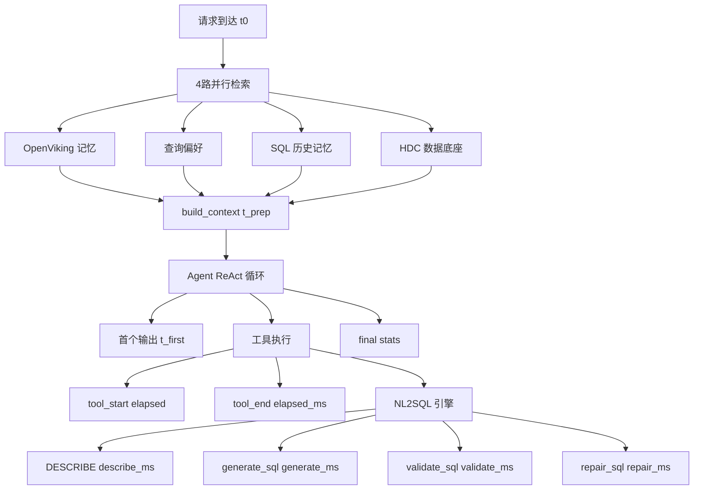
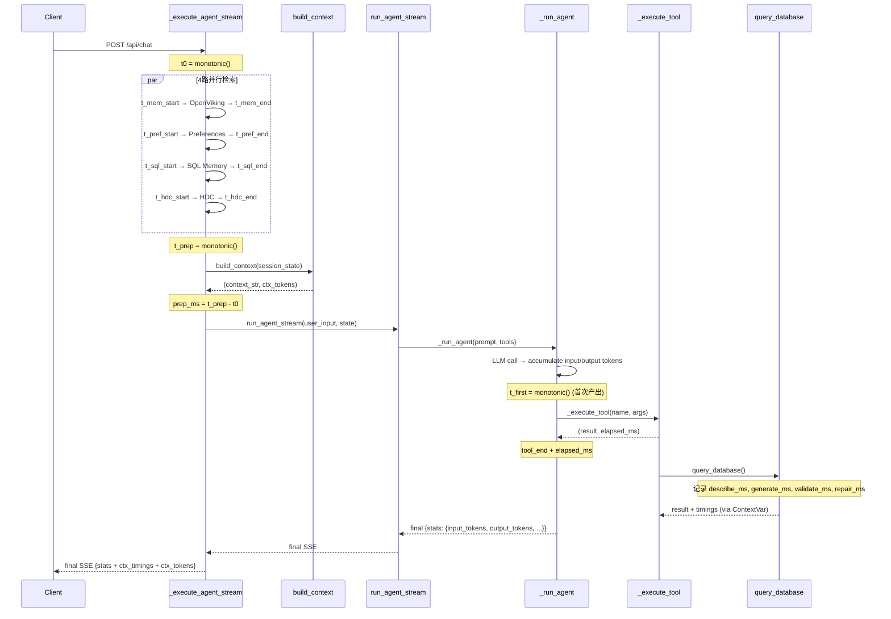

# 设计文档

## 概述
**目标**：为 DBAgent 补充细粒度可观测性，在不改变现有架构的前提下，将已计算但未传播的指标（工具耗时、Token 拆分）以及完全缺失的指标（TTFB、上下文检索耗时、NL2SQL 引擎耗时、上下文 Token 占比）注入到 SSE 事件流和 final stats 中。

**用户**：运维人员和开发者通过 SSE 事件、Langfuse trace 和评测报告消费这些指标。

**影响**：修改 Agent Runner（`runner.py`）、API 路由（`routes.py`）、NL2SQL 工具（`query_database.py`）和上下文构建（`context.py`），总计约 50 行新增代码。所有改动为向后兼容的字段追加。

### 目标
- 将 `ToolCallContext.elapsed_ms` 传播到 `tool_end` SSE 事件和 stats
- 将 `input_tokens` / `output_tokens` 拆分输出到 stats
- 新增 TTFB、上下文准备耗时、上下文检索耗时分解
- 新增 NL2SQL 引擎内部分段耗时（DESCRIBE / generate / validate / repair）
- 新增上下文 Token 占比估算
- 保持所有现有 SSE 事件和 stats 字段不变

### 非目标
- 新的外部监控系统集成（Prometheus、Grafana）
- 美元成本估算
- 告警/通知系统
- 分布式追踪变更
- 新的持久化存储需求

## 边界承诺

### 本规格拥有
- 工具执行耗时从 `ToolCallContext` 到 `tool_end` 事件的传播路径
- stats 字典中新增的 `input_tokens`、`output_tokens`、`prep_ms`、`ttfb_ms`、`ctx_timings`、`tool_timings`、`ctx_tokens` 字段
- `query_database` 内部 NL2SQL 流水线各阶段耗时采集
- `build_context()` 中各段上下文的 Token 估算

### 范围外
- 工具注册表（`app/tools/__init__.py`）中 `ToolCallContext` 的签名变更
- Langfuse span 结构的变更（token 数据注入 Langfuse 为后续工作）
- 评测框架（`tests/evaluation/`）的适配（新增字段为可选消费）
- 前端 SSE 消费者的适配（新增字段为可选渲染）

### 允许的依赖
- **tiktoken**（可选）：Token 估算，不可用时降级为字符数估算
- **time.monotonic()**：已有依赖，不变
- **contextvars**：Python 标准库，用于 NL2SQL 引擎耗时侧通道传递
- **现有 SSE 事件流**：已有依赖，不变

### 重验证触发条件
- stats 字典中已有字段的删除或重命名
- `tool_end` 事件中现有字段的删除或重命名
- `_execute_tool()` 函数签名的变更
- `build_context()` 函数签名的变更

## 架构

### 现有架构分析
当前系统采用 4 层管道架构。可观测性数据流如下：

```
Agent Runner (_run_agent)       API Routes (_execute_agent_stream)
┌──────────────────────┐       ┌──────────────────────────────┐
│ start_time            │       │ (无计时)                      │
│ total_input_tokens    │       │ 4路并行检索 (无计时)           │
│ total_output_tokens   │       │ build_context (无计时)         │
│ tool_call_counter     │       │                              │
│ → stats {duration_ms, │       │ → final SSE {stats}           │
│   num_turns, tokens}  │       │                              │
└──────────────────────┘       └──────────────────────────────┘
```

本设计在现有数据采集点之间插入计时锚点，通过已有的事件流通道传播，不引入新的通信路径。

### 架构模式与边界图



**关键设计决策**：
- 所有计时使用 `time.monotonic()`（不受系统时钟调整影响，与现有代码一致）
- NL2SQL 引擎耗时通过 `contextvars.ContextVar` 侧通道传递，避免修改 6 个工具的统一 `str` 返回接口
- 上下文 Token 估算使用 `tiktoken`，不可用时降级为 `len(text) / 4` 字符估算
- 所有新增字段为可选，前端和评测框架按需消费

## 文件结构计划

### 修改文件
- `app/agent/runner.py` — `_execute_tool()` 返回 `(result, elapsed_ms)` 元组；`_run_agent()` 在 `tool_end` 事件中增加 `elapsed_ms`；stats 增加 `input_tokens`、`output_tokens`、`tool_timings`；`run_agent_stream()` 增加 TTFB 计时
- `app/api/routes.py` — `_execute_agent_stream()` 增加 4 路检索分别计时和 `prep_ms` 计算
- `app/tools/query_database.py` — NL2SQL 流水线各阶段耗时采集，通过 `contextvars` 暴露
- `app/agent/context.py` — `build_context()` 增加各段 Token 估算，返回 `(context_str, ctx_tokens_dict)` 元组

## 系统流程

### 时序：完整可观测性数据流



## 需求可追溯性

| 需求 | 摘要 | 组件 | 接口 | 流程 |
|------|------|------|------|------|
| 1 | 工具执行耗时 | `_execute_tool`, `_run_agent` | `tool_end.elapsed_ms`, `stats.tool_timings` | 时序图 |
| 2 | Token 拆分 | `_run_agent` | `stats.input_tokens`, `stats.output_tokens` | — |
| 3 | TTFB + 准备耗时 | `_execute_agent_stream`, `run_agent_stream` | `stats.prep_ms`, `stats.ttfb_ms` | 时序图 |
| 4 | 上下文检索耗时 | `_execute_agent_stream` | `stats.ctx_timings` | 时序图 |
| 5 | NL2SQL 引擎耗时 | `query_database`, `_execute_tool` | `tool_end.metadata.timings` | 时序图 |
| 6 | 上下文 Token 占比 | `build_context` | `stats.ctx_tokens` | — |
| 7 | 向后兼容 | 所有修改文件 | 仅追加字段 | — |

## 组件与接口

### Agent 层

#### _execute_tool (修改)

| 字段 | 详情 |
|------|------|
| 意图 | 执行工具调用并返回结果和耗时 |
| 需求 | 1 |

**职责与约束**
- 调用 `registry.execute()` 执行工具
- 捕获执行前后的 `time.monotonic()` 计算耗时
- 返回 `(result_str, elapsed_ms)` 元组（原返回 `str`）

**契约**: Service [x]

##### 服务接口
```python
async def _execute_tool(
    name: str,
    input_data: dict[str, Any],
) -> tuple[str, float]:
    """
    返回:
        (result, elapsed_ms) — 工具执行结果字符串和执行耗时（毫秒）
    """

**Implementation Notes**
- 计时在 `_execute_tool` 包装层完成（调用前后各记录 `time.monotonic()`），不修改 `registry.execute()` 及其中间件链的签名
- 取消路径中 `asyncio.wait_for` 超时时 `_execute_tool` 不会正常返回，需在超时处理分支中单设计时逻辑（取 `timeout` 值作为 `elapsed_ms`）
- `contextvars.ContextVar` 读取 `_nl2sql_timings` 在 `_execute_tool` 内部完成，不暴露给上层调用方
```

#### _run_agent (修改)

| 字段 | 详情 |
|------|------|
| 意图 | ReAct 循环，产出增强的 tool_end 事件和 stats |
| 需求 | 1, 2 |

**职责与约束**
- 在 `tool_end` 事件中增加 `elapsed_ms` 字段
- 在 stats 中增加 `input_tokens` 和 `output_tokens`（保留 `tokens` 总和）
- 在 stats 中增加 `tool_timings: dict[str, dict]`（各工具累计耗时和调用次数）
- 在 stats 中增加 `ttfb_ms`（首个输出的时间）

**契约**: Service [x]

##### 服务接口
```python
# tool_end 事件新增字段
{
    "type": "tool_end",
    "name": "query_database",
    "content": "...",
    "elapsed_ms": 1234.5,          # 新增
    # 原有字段不变
}

# stats 新增字段
{
    "duration_ms": 5000,
    "num_turns": 3,
    "tokens": 15000,               # 保留（向后兼容）
    "input_tokens": 12000,         # 新增
    "output_tokens": 3000,         # 新增
    "ttfb_ms": 800,                # 新增
    "tool_timings": {              # 新增
        "find_table": {"count": 2, "total_ms": 450},
        "query_database": {"count": 1, "total_ms": 3200},
    },
}
```

#### run_agent_stream (修改)

| 字段 | 详情 |
|------|------|
| 意图 | Agent 入口，增加 TTFB 计时锚点 |
| 需求 | 3 |

**职责与约束**
- 在 `_run_agent()` 的第一个非 `llm_call` 事件时记录 `t_first`
- 不在 `_run_agent` 内部计算 `ttfb_ms`，而是在 `run_agent_stream` 消费事件流时记录
- 在 `elif event_type == "final"` 分支中合并 `final_stats["ttfb_ms"] = ttfb_ms`

**Implementation Notes**
- 记录时机：`run_agent_stream` 消费事件流时，首个 `text` 或 `tool_start` 事件处记录 `t_first = time.monotonic()`
- 不修改 `_run_agent` 的函数签名——`ttfb_ms` 由外层注入 final stats 合并
- 如果 Agent 在首个事件前被取消，`ttfb_ms` 设为取消时刻与 `start_time` 的差值

### API 层

#### _execute_agent_stream (修改)

| 字段 | 详情 |
|------|------|
| 意图 | 增加 4 路检索耗时和 prep_ms |
| 需求 | 3, 4 |

**职责与约束**
- 请求到达时记录 `t0`
- 4 路并行检索各自计时
- 上下文准备完成时记录 `t_prep`
- 将 `prep_ms` 和 `ctx_timings` 注入 final SSE 的 stats

**契约**: SSE Event

##### 事件契约
```python
# stats 新增字段（在 final SSE 中）
{
    "prep_ms": 350,                # 新增：上下文准备耗时
    "ctx_timings": {               # 新增：4路检索耗时
        "memories_ms": 120,        # OpenViking 长期记忆
        "preferences_ms": 15,      # 查询偏好
        "sql_memories_ms": 45,     # SQL 历史记忆
        "hdc_ms": 280,             # HDC 数据底座
    },
    # 原有字段不变
}
```

### NL2SQL 引擎层

#### query_database (修改)

| 字段 | 详情 |
|------|------|
| 意图 | NL2SQL 流水线分段耗时采集 |
| 需求 | 5 |

**职责与约束**
- 在每个阶段前后记录 `time.monotonic()`
- 将耗时写入 `contextvars.ContextVar`，供 `_execute_tool` 读取
- 不影响现有返回值（仍为 `str`）

**契约**: Service [x]

##### 服务接口
```python
# ContextVar 侧通道（新增）
from contextvars import ContextVar

_nl2sql_timings: ContextVar[dict[str, float]] = ContextVar(
    'nl2sql_timings', default={}
)

# 写入的 timings 结构
{
    "describe_ms": 150.0,          # DESCRIBE 表耗时
    "generate_ms": 1200.0,         # LLM 生成 SQL 耗时
    "validate_ms": 5.0,            # SQL 校验耗时
    "repair_ms": 0.0,              # SQL 修复耗时（0 表示未触发）
}
```

### 上下文层

#### build_context (修改)

| 字段 | 详情 |
|------|------|
| 意图 | 估算各段上下文的 Token 数 |
| 需求 | 6 |

**职责与约束**
- 返回 `(context_str, ctx_tokens_dict)` 元组（原返回 `str`）
- 使用 `tiktoken` 进行 Token 估算，不可用时降级为 `len(text) / 4`
- 估算允许 ±10% 偏差

**依赖**
- 入站：`run_agent_stream` — 调用方（P0）
- 外部：`tiktoken` — Token 估算（P2，可选降级）

**契约**: Service [x]

##### 服务接口
```python
def build_context(
    session_state: dict[str, Any],
) -> tuple[str, dict[str, int]]:
    """
    返回:
        (context_str, ctx_tokens) —
        context_str: 组装后的上下文字符串
        ctx_tokens: 各段上下文估算 Token 数
    
    注意: 保持同步函数签名，Token 估算为纯 CPU 操作（<1ms），
    不需要 async 改造。
    """
```

**Implementation Notes**
- 保持同步函数签名（不改 `async def`），`tiktoken.encode()` 是同步操作，耗时 <1ms
- 调用方 `run_agent_stream` 中已有的 `context = build_context(session_state)` 仅需改为 `context, ctx_tokens = build_context(session_state)` 元组解包

```python
# ctx_tokens 结构
{
    "summary": 150,
    "chat_history": 400,
    "selected_database": 50,
    "memories": 200,
    "rag_reference": 0,
    "preferences": 80,
    "hdc_context": 1200,
    "sql_memories": 300,
}
```

## 数据模型

### 新增 stats 字段汇总

```python
# final stats 完整结构（新增字段标 ★）
{
    # === 原有字段（不变）===
    "duration_ms": 5000,
    "num_turns": 3,
    "tokens": 15000,

    # === P0: Token 拆分 ★ ===
    "input_tokens": 12000,
    "output_tokens": 3000,

    # === P0: 工具耗时 ★ ===
    "tool_timings": {
        "find_table": {"count": 2, "total_ms": 450.0},
        "query_database": {"count": 1, "total_ms": 3200.0},
    },

    # === P1: TTFB ★ ===
    "ttfb_ms": 800,

    # === P1: 准备耗时 ★ ===
    "prep_ms": 350,
    "ctx_timings": {
        "memories_ms": 120,
        "preferences_ms": 15,
        "sql_memories_ms": 45,
        "hdc_ms": 280,
    },

    # === P2: 上下文 Token ★ ===
    "ctx_tokens": {
        "summary": 150,
        "chat_history": 400,
        "selected_database": 50,
        "memories": 200,
        "rag_reference": 0,
        "preferences": 80,
        "hdc_context": 1200,
        "sql_memories": 300,
    },
}
```

### tool_end 事件新增字段

```python
# tool_end 事件完整结构（新增字段标 ★）
{
    "type": "tool_end",
    "name": "query_database",
    "content": "...",              # 原有
    "elapsed_ms": 1234.5,          # ★ 新增
}
```

## 错误处理

### 错误策略
- 计时失败不影响主流程：所有 `time.monotonic()` 调用包裹在 try/except 中，失败时对应字段为 `null`
- Token 估算失败降级：`tiktoken` 不可用时使用字符数估算，并在 `ctx_tokens` 中增加 `_method: "char_estimate"` 标记
- ContextVar 读取失败：`_execute_tool` 读取 `_nl2sql_timings` 时使用 `.get({})` 默认值

### 监控
- 新增字段均为可选，不破坏现有 Langfuse trace 结构
- 评测框架通过 `stats.get("new_field")` 按需消费，不存在时不影响评分

## 测试策略

### 单元测试
- `_execute_tool()` 返回元组格式验证
- `build_context()` 返回 `ctx_tokens` 字典结构和键完整性
- `query_database` 中 `_nl2sql_timings` ContextVar 写入和读取

### 集成测试
- SSE 事件流中 `tool_end` 包含 `elapsed_ms` 字段
- final SSE 的 stats 包含所有新增字段且类型正确
- 禁用某路检索（如 `kb_enabled=false`）时对应 `ctx_timings` 字段为 `null`
- `tiktoken` 不可用时的降级行为

### E2E 测试
- 完整查询流程中 prep_ms < ttfb_ms < duration_ms 时间顺序验证
- 向后兼容：现有评测框架消费 final 事件不报错