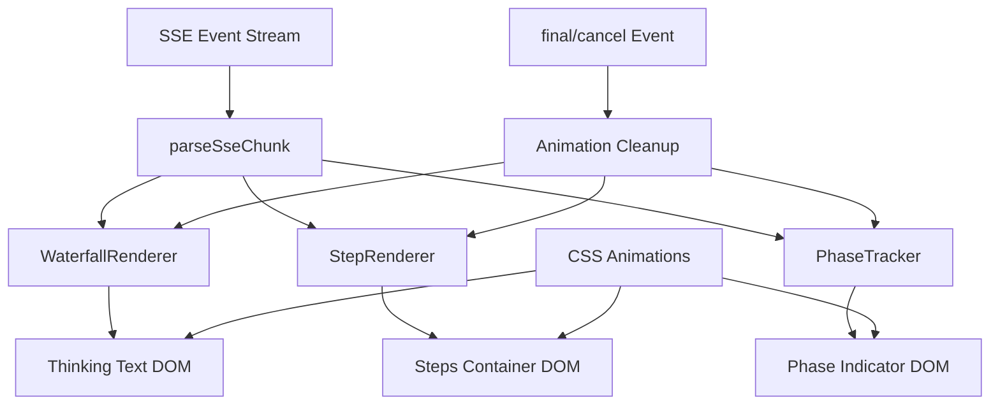
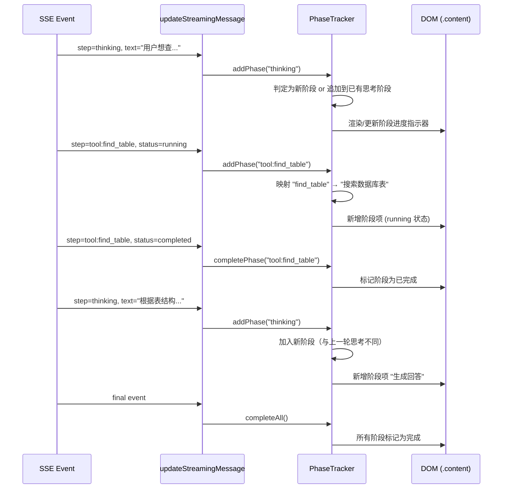

# 设计文档：Agent 流式展示增强

## 概述

**目的**：为 DBAgent 前端提供 Agent 思考过程的实时可视化反馈。核心能力包括：思考文本以瀑布式批量渲染，工具调用步骤显示动态动画，以及以分阶段进度指示器清晰告知用户当前处于哪个执行阶段，让用户实时感知 Agent 的工作进度。

**用户**：DBAgent 的所有 Web 界面用户，通过浏览器使用 NL2SQL 数据探索功能。

**影响**：改变前端 SSE 事件到 DOM 的渲染管线，在现有 `innerHTML` 基础上引入增量 DOM 操作和动画，新增阶段进度追踪组件。不改变后端 SSE 事件格式或发送频率。

### 目标

- 思考文本以瀑布式批量渲染，支持可配置的渲染速度
- 工具调用步骤的 running 状态显示 CSS 动画指示器，状态切换时平滑过渡
- 以分阶段进度指示器清晰展示 Agent 当前执行阶段，已完成阶段可回顾
- 工具名称映射为人类可读的阶段描述
- 所有动画使用纯 CSS 实现，不引入第三方库，支持 `prefers-reduced-motion` 无障碍降级
- 动画异常时降级为静态展示，不影响核心消息内容

### 非目标

- 不修改后端 SSE 事件格式或发送频率
- 不修改 Agent 执行引擎的思考/工具调用逻辑
- 不引入 WebSocket 或改变传输协议
- 不实现图片或复杂 SVG 动画
- 不改变消息气泡的整体布局结构
- 不实现对比报告、评分卡片、资源汇总等验证脚本的输出模式

## 边界承诺

### 本规范拥有

- 思考文本的瀑布式批量渲染逻辑（WaterfallRenderer）
- 工具调用步骤的 CSS 动画效果（pulse-dot、状态过渡）
- **阶段进度追踪与展示（PhaseTracker）**：将 Agent 执行过程映射为人类可读的阶段序列，展示当前阶段和已完成阶段列表
- **工具名称到人类可读描述的映射表**
- CSS 动画定义及 `prefers-reduced-motion` 无障碍支持
- 动画状态的生命周期管理（启动、停止、清理）
- 异常场景的降级渲染（动画失败 → 静态展示）

### 超出边界

- 后端 SSE 事件格式或发送频率的变更（仍使用现有 `step`/`sql`/`final` 事件）
- 后端新增 `phase` 字段或阶段枚举
- Agent 执行引擎的思考/工具调用逻辑修改
- WebSocket 或轮询等替代传输协议
- 消息气泡布局结构或整体页面布局的变更
- 复制按钮、侧边栏步骤面板等现有功能的修改
- 对比报告、评分卡、资源汇总等验证模式的展示

### 允许的依赖

- 现有 SSE 事件流（`step` 中的 `thinking`/`tool:*` 事件）作为阶段判定的数据源
- 现有 `createStreamingBubble()` 创建的 DOM 结构（`article.message.streaming > .bubble > .meta + .content`）
- 现有 `finalizeStreamingMessage()` 的正常/取消分流逻辑
- 现有 `WaterfallRenderer` 和 `StepRenderer` 组件
- `agent-cancel-thinking` 的取消信号，触发所有动画停止
- 现有 CSS 变量体系（`--accent`、`--muted`、`--line`、`--danger` 等）

### 重验证触发条件

- SSE 事件格式变更（新增字段或修改事件类型）
- 流式气泡 DOM 结构变更（`.meta`、`.content` 元素的层级或类名修改）
- 工具名称变更（新增/删除/重命名工具）
- CSS 变量命名体系重构
- 消息渲染管线从 `innerHTML` 改为框架驱动的 DOM 管理（如引入 React/Vue）

## 架构

### 现有架构分析

当前流式渲染管线（`app.js`）：

```
SSE 事件 → parseSseChunk → addStep → updateStreamingMessage → WaterfallRenderer / StepRenderer
                                                                → updatePhaseLabel (.meta 文本)
```

核心问题：
- `updatePhaseLabel` 仅设置两种通用标签（"思考中..." / "正在查询数据库..."），缺乏具体阶段信息
- 无阶段进度追踪，用户不知道 Agent 已执行了哪些步骤、当前在哪一步
- 工具名称（如 `find_table`）为英文技术术语，对非技术用户不够友好

### 架构模式与边界图



**架构集成**：
- 选择模式：**管道增强** — 在现有 `updateStreamingMessage` 渲染管道中替换 `updatePhaseLabel` 为 `PhaseTracker`，不引入新的架构模式
- 领域边界：阶段追踪和展示完全在前端 JS/CSS 层，不跨越前后端边界
- 保留的现有模式：`createStreamingBubble` → `updateStreamingMessage` → `finalizeStreamingMessage` 生命周期
- 新组件理由：`PhaseTracker` 替换 `updatePhaseLabel` 的简单文本更新，提供有状态的阶段序列管理

### 技术栈

| 层 | 选择 / 版本 | 功能角色 | 备注 |
|---|---|---|---|
| 前端 | Vanilla JS (ES2020+) | 阶段追踪状态机 + DOM 操作 | 无框架依赖，与现有代码一致 |
| 样式 | CSS3 Animation + Transition | 阶段动画 + 状态过渡 | 纯 CSS，无第三方动画库 |
| 事件 | SSE (text/event-stream) | 现有数据源，不做修改 | 复用现有 `step`/`sql`/`final` 事件 |
| 运行时 | 浏览器 Web API | `requestAnimationFrame` | 用于瀑布渲染帧同步 |

## 文件结构计划

### 修改的文件

```
app/static/
├── app.js          # PhaseTracker 组件 + 工具名映射表 + 重构 updatePhaseLabel
├── styles.css      # 阶段进度指示器样式 + 动画
└── index.html      # 无结构变更（现有 DOM 已满足需求）
```

- `app/static/app.js` — 新增 `PhaseTracker` 组件（替换 `updatePhaseLabel`），新增 `TOOL_LABEL_MAP` 映射表，重构 `updateStreamingMessage` 中的阶段判定逻辑，`cleanupAnimations` 新增 PhaseTracker 清理
- `app/static/styles.css` — 新增 `.phase-tracker`、`.phase-item`、`.phase-item.active`、`.phase-item.completed`、`.phase-item.cancelled` 样式规则
- `app/static/index.html` — 无 DOM 结构变更（PhaseTracker 在 JS 中动态创建 DOM 元素）

## 系统流程

### 阶段进度追踪流程



### 阶段类型判定逻辑

```
step === "thinking"  →  首次 thinking: "分析问题"
                         后续 thinking: "生成回答"

step === "tool:find_table"       → "搜索数据库表"
step === "tool:describe_table"   → "查看表结构"
step === "tool:execute_sql"      → "执行 SQL 查询"
step === "tool:list_databases"   → "浏览数据库列表"
step === "tool:confirm_sql"      → "确认 SQL 执行"
```

## 需求可追溯性

| 需求 | 摘要 | 组件 | 接口 | 流程 |
|---|---|---|---|---|
| 1.1 | 思考文本瀑布式批量渲染 | WaterfallRenderer | `appendChunk(text)` | 瀑布渲染流程 |
| 1.2 | 渲染速度可配置 | WaterfallRenderer | `WATERFALL_RENDER_DELAY` 配置项 | 瀑布渲染流程 |
| 1.3 | 思考文本瀑布式渲染 | WaterfallRenderer | `appendChunk(text)` | 瀑布渲染流程 |
| 1.4 | 向后兼容 SSE 事件 | WaterfallRenderer + StepRenderer | SSE 事件处理管道 | — |
| 1.5 | 渲染性能保障 | WaterfallRenderer | `MAX_CHUNK` + rAF 分帧 | 瀑布渲染流程 |
| 2.1 | running 状态动态指示器 | StepRenderer + CSS | `.streaming-step.running` + `pulse-dot` 动画 | 工具步骤状态流转 |
| 2.2 | running→completed 平滑过渡 | StepRenderer + CSS | `transition` 规则 | 工具步骤状态流转 |
| 2.3 | running→error 状态显示 | StepRenderer + CSS | `.streaming-step.error` 样式 | 工具步骤状态流转 |
| 2.4 | 仅当前 running 步骤动画 | StepRenderer | 状态类名精确控制 | 工具步骤状态流转 |
| 3.1 | 执行开始时显示阶段进度指示器 | PhaseTracker | `addPhase(step)` | 阶段进度追踪流程 |
| 3.2 | 思考阶段显示具体化描述 | PhaseTracker | 首次→"分析问题"，后续→"生成回答" | 阶段类型判定逻辑 |
| 3.3 | 工具操作映射为人类可读描述 | PhaseTracker + TOOL_LABEL_MAP | 映射表查询 | 阶段类型判定逻辑 |
| 3.4 | 维护已完成阶段列表 | PhaseTracker | `phases[]` 状态 + DOM 渲染 | 阶段进度追踪流程 |
| 3.5 | 工具执行完成时标记阶段 | PhaseTracker | `completePhase(stepId)` | 阶段进度追踪流程 |
| 3.6 | 后续思考阶段更新进度位置 | PhaseTracker | `addPhase("thinking")` 追加新阶段 | 阶段类型判定逻辑 |
| 3.7 | 全部完成时标记所有阶段 | PhaseTracker | `completeAll()` | 阶段进度追踪流程 |
| 3.8 | 阶段进度指示器自动滚动 | PhaseTracker | DOM `scrollTop` 操作 | 阶段进度追踪流程 |
| 3.9 | 取消时保留已完成阶段 | PhaseTracker | `cancelCurrent()` | 阶段进度追踪流程 |
| 4.1 | 纯 CSS 动画实现 | CSS | `@keyframes` 定义 | — |
| 4.2 | finalize 时清除动画 | AnimationCleanup | `waterfall.stop()` + `stepRenderer.clearSteps()` + `phaseTracker.reset()` | 清理流程 |
| 4.3 | 多动画时页面流畅 | CSS | `will-change` + compositor-only 属性 | — |
| 4.4 | 切换会话/新消息时停止 | AnimationCleanup | `cleanupAnimations()` | 清理流程 |
| 5.1 | 渲染队列异常时降级 | WaterfallRenderer | try-catch + 立即显示缓冲文本 | 异常降级 |
| 5.2 | 浏览器不支持 CSS animation | CSS | `@supports` 规则 + 静态降级 | 异常降级 |
| 5.3 | SSE 事件过快时加速渲染 | WaterfallRenderer | 后台标签页批量渲染 | 异常降级 |

## 组件与接口

### 组件摘要

| 组件 | 领域/层 | 意图 | 需求覆盖 | 关键依赖 | 约定 |
|---|---|---|---|---|---|
| WaterfallRenderer | UI/JS | 瀑布式批量渲染思考文本 | 1.1-1.5, 5.1, 5.3 | rAF API (P0) | State |
| StepRenderer | UI/JS | 工具步骤增量 DOM 更新 | 2.1-2.4 | DOM 容器 (P0) | State |
| PhaseTracker | UI/JS | 阶段进度追踪与展示 | 3.1-3.9 | DOM 容器 (P0), TOOL_LABEL_MAP (P1) | State |
| AnimationCleanup | UI/JS | 动画生命周期清理 | 4.2, 4.4 | WaterfallRenderer (P0), StepRenderer (P0), PhaseTracker (P0) | State |
| CSS Animations | UI/CSS | 动画效果定义 | 2.1, 4.1, 4.3, 5.2 | CSS cascade (P0) | — |

### UI / JavaScript 层

#### PhaseTracker

| 字段 | 详情 |
|---|---|
| 意图 | 追踪 Agent 执行阶段序列，将 step 事件映射为人类可读的阶段描述，维护已完成的阶段列表并渲染到 DOM |
| 需求 | 3.1, 3.2, 3.3, 3.4, 3.5, 3.6, 3.7, 3.8, 3.9 |

**职责与约束**
- 维护 `phases` 数组（`{id, label, status, stepType}`），记录所有阶段的完整序列
- 接收 `step` 事件（`"thinking"` 或 `"tool:xxx"`），判定是新增阶段还是更新已有阶段
- 通过 `TOOL_LABEL_MAP` 将工具名称映射为人类可读的中文描述
- 思考阶段自动判定：首次 thinking → "分析问题"，后续 thinking → "生成回答"
- 渲染阶段进度指示器 DOM 到 `.content` 容器顶部，与思考文本和工具步骤容器并列
- 每个阶段项显示图标（⏳ running / ✅ completed / ❌ cancelled）和阶段描述文本
- 当 `completePhase(stepId)` 被调用时，将对应阶段标记为 completed
- 当 `completeAll()` 被调用时（final 事件），所有阶段标记为 completed
- 当 `cancelCurrent()` 被调用时，当前 running 阶段标记为 cancelled
- 每个阶段状态变更后触发 `onRender` 回调（用于自动滚动）

**依赖**
- 入站：`updateStreamingMessage` — 传入 `step` 和 `status` (P0)
- 出站：DOM 阶段容器 — 增量渲染阶段项 (P0)
- 外部：`TOOL_LABEL_MAP` 常量 — 工具名到人类可读描述的映射 (P1)

**约定**：State [x]

##### 状态管理

```typescript
interface PhaseEntry {
  id: string;              // 阶段标识（"thinking-1", "tool:find_table-0"）
  label: string;           // 人类可读的阶段描述
  status: "running" | "completed" | "cancelled";
  stepType: string;        // 原始 step 类型（"thinking" 或 "tool:xxx"）
  element: HTMLElement;    // 对应 DOM 元素引用
}

interface PhaseTrackerState {
  phases: PhaseEntry[];          // 阶段序列（按时间顺序）
  container: HTMLElement | null; // 阶段进度容器 DOM 元素
  thinkingCount: number;         // 思考阶段计数（用于区分"分析问题"和"生成回答"）
  isActive: boolean;             // 是否处于活跃追踪状态
}

interface PhaseTrackerAPI {
  addPhase(step: string, status: string): void;
  completePhase(step: string): void;
  completeAll(): void;
  cancelCurrent(): void;
  reset(): void;
  setContainer(element: HTMLElement): void;
  setOnRender(callback: () => void): void;
}
```

- 状态模型：数组序列，记录完整的阶段执行轨迹
- 持久化：不持久化，页面刷新或会话切换时重置
- 并发策略：同步操作，无并发问题

**实现说明**
- 集成：在 `updateStreamingMessage` 中，每次调用时执行 `phaseTracker.addPhase(step, status)`
- 验证：`container` 存在性检查，`step` 参数非空检查
- 风险：快速连续事件可能导致阶段项频繁创建；通过 `_renderPhase` 增量更新而非全量重建来避免

##### 工具名称映射表

```javascript
const TOOL_LABEL_MAP = {
  "find_table": "搜索数据库表",
  "describe_table": "查看表结构",
  "execute_sql": "执行 SQL 查询",
  "list_databases": "浏览数据库列表",
  "confirm_sql": "确认 SQL 执行",
};
```

##### 阶段判定规则

| 条件 | 阶段标签 | 说明 |
|---|---|---|
| 首次 `thinking` | "分析问题" | Agent 开始理解用户意图 |
| 后续 `thinking` | "生成回答" | Agent 综合信息生成最终回答 |
| `tool:find_table` | "搜索数据库表" | 映射自 TOOL_LABEL_MAP |
| `tool:describe_table` | "查看表结构" | 映射自 TOOL_LABEL_MAP |
| `tool:execute_sql` | "执行 SQL 查询" | 映射自 TOOL_LABEL_MAP |
| `tool:list_databases` | "浏览数据库列表" | 映射自 TOOL_LABEL_MAP |
| `tool:confirm_sql` | "确认 SQL 执行" | 映射自 TOOL_LABEL_MAP |
| 未知工具 | 工具英文名 | 降级显示原始名称 |

#### WaterfallRenderer

| 字段 | 详情 |
|---|---|
| 意图 | 以瀑布式批量渲染思考文本，支持可配置延迟和后台标签页恢复 |
| 需求 | 1.1, 1.2, 1.3, 1.4, 1.5, 5.1, 5.3 |

**职责与约束**
- 使用 `requestAnimationFrame` + 时间戳控制渲染节奏
- 维护 `buffer` 字符串缓冲区，按 `WATERFALL_RENDER_DELAY` 间隔消费
- 单帧最大渲染 `MAX_CHUNK = 200` 字符，防止阻塞主线程
- 后台标签页恢复时一次性渲染全部 buffer
- 当 `stop()` 被调用时停止渲染但不 flush buffer
- 当 `reset()` 被调用时清空 buffer 和状态

**依赖**
- 入站：`updateStreamingMessage` — 传入增量文本 (P0)
- 出站：DOM 思考文本元素 — 更新 `textContent` (P0)
- 外部：`requestAnimationFrame` API — 定时循环 (P0)

**约定**：State [x]

**实现说明**
- 集成：在 `updateStreamingMessage` 中，当 `step === "thinking"` 时调用 `waterfall.appendChunk(text)`
- 验证：`targetElement` 存在性检查
- 风险：`requestAnimationFrame` 在后台标签页会暂停，通过 `elapsed > 200ms` 检测并批量渲染

#### StepRenderer

| 字段 | 详情 |
|---|---|
| 意图 | 增量更新工具步骤 DOM，管理动画类名和状态过渡 |
| 需求 | 2.1, 2.2, 2.3, 2.4 |

**职责与约束**
- 维护步骤 DOM 元素的 Map 映射（`stepId → StepEntry`），避免全量 `innerHTML` 重建
- 新步骤出现时创建 DOM 元素并追加到步骤容器
- 步骤状态变更时仅更新对应元素的类名和图标
- 使用 CSS `animation`（非 `transition`）确保新插入元素立即开始动画

**依赖**
- 入站：`updateStreamingMessage` — 传入步骤状态变更 (P0)
- 出站：DOM 步骤容器 (`.streaming-steps`) — 增量子元素 (P0)
- 外部：CSS 动画定义 — 类名驱动的动画 (P1)

**约定**：State [x]

#### AnimationCleanup

| 字段 | 详情 |
|---|---|
| 意图 | 确保所有动画在适当时机停止并清理资源 |
| 需求 | 4.2, 4.4 |

**职责与约束**
- `finalizeStreamingMessage` 调用时停止 WaterfallRenderer、清除 StepRenderer 步骤、重置 PhaseTracker
- 用户取消时（`cancelled = true`）调用 `phaseTracker.cancelCurrent()` 后执行清理
- `switchSession` 和 `sendMessage` 开始时调用 `cleanupAnimations()`
- 清理后移除 `will-change` 属性释放 GPU 资源

**依赖**
- 入站：`finalizeStreamingMessage`、`switchSession`、`sendMessage` (P0)
- 出站：WaterfallRenderer.stop()、stepRenderer.clearSteps()、phaseTracker.reset() (P0)

**约定**：State [ ]

### CSS 层

#### Phase Tracker 样式

```css
/* 阶段进度容器 */
.phase-tracker {
  margin-bottom: 12px;
  padding: 8px 12px;
  background: var(--panel);
  border-radius: 8px;
  border: 1px solid var(--line);
}

/* 单个阶段项 */
.phase-item {
  display: flex;
  align-items: center;
  gap: 8px;
  padding: 4px 0;
  font-size: 0.875rem;
  color: var(--muted);
  transition: color 0.3s ease;
}

/* 进行中的阶段 */
.phase-item.active {
  color: var(--fg);
  font-weight: 500;
}

/* 已完成的阶段 */
.phase-item.completed {
  color: var(--ok);
}

/* 已取消的阶段 */
.phase-item.cancelled {
  color: var(--muted);
  text-decoration: line-through;
}

/* 阶段图标 */
.phase-item .phase-icon {
  width: 16px;
  text-align: center;
  flex-shrink: 0;
}

/* 阶段描述 */
.phase-item .phase-label {
  flex: 1;
}
```

#### 无障碍降级（追加）

```css
@media (prefers-reduced-motion: reduce) {
  .phase-item {
    transition: none;
  }
}
```

## 数据模型

### 领域模型

本功能不引入持久化数据模型。所有状态为运行时 JavaScript 对象，生命周期与单个流式请求绑定。

- **WaterfallState**：瀑布渲染状态（buffer、渲染进度、定时器引用）
- **StepEntry**：工具步骤实体（步骤标识、状态、DOM 引用）
- **PhaseEntry**：执行阶段实体（阶段标识、人类可读标签、状态、DOM 引用）
- 事务边界：单个 SSE 连接的生命周期（从 `sendMessage` 到 `finalizeStreamingMessage`）

### 数据约定与集成

**SSE 事件约定（现有，无变更）**：

| 事件类型 | 触发条件 | 数据字段 |
|---|---|---|
| `step` (thinking) | LLM 推理文本 | `{step: "thinking", status: "running", text: string}` |
| `step` (tool:*) | 工具调用开始/完成 | `{step: "tool:<name>", status: "running"\|"completed"}` |
| `sql` | SQL 提取 | `{sql: string}` |
| `final` | 对话结束 | `{reply, cancelled, tool_calls, stats, ...}` |

**TOOL_LABEL_MAP 映射表（新增，前端常量）**：

| 工具名（step 值） | 人类可读标签 |
|---|---|
| `find_table` | "搜索数据库表" |
| `describe_table` | "查看表结构" |
| `execute_sql` | "执行 SQL 查询" |
| `list_databases` | "浏览数据库列表" |
| `confirm_sql` | "确认 SQL 执行" |

## 错误处理

### 错误策略

前端动画渲染失败不应影响核心消息展示。所有动画逻辑包裹在 try-catch 中，失败时降级为静态渲染。

### 错误类别与响应

**PhaseTracker 异常**：
- 未知工具名（不在 `TOOL_LABEL_MAP` 中）→ 降级显示原始工具英文名
- `container` 不存在 → 静默跳过渲染，不抛异常
- `step` 参数为 null/undefined → 忽略本次调用

**渲染异常**（JS 层）：
- WaterfallRenderer 状态异常 → 立即 flush 全部缓冲文本，停止定时器
- DOM 元素引用丢失 → 回退到 `innerHTML` 全量重建（当前行为）
- `requestAnimationFrame` 不可用 → 降级为直接设置 `textContent`

**动画异常**（CSS 层）：
- 浏览器不支持 `@keyframes` → 通过 `@supports (animation: 1s) { ... }` 渐进增强
- GPU 资源不足 → `will-change` 仅应用于当前活跃动画元素，完成后移除

### 监控

- 前端 console 日志：PhaseTracker 阶段变更事件（开发模式下）
- 现有后端观测体系不受影响

## 测试策略

### 单元测试（JS 层）

1. **PhaseTracker.addPhase — thinking**：模拟首次 thinking 事件，验证阶段标签为"分析问题"
2. **PhaseTracker.addPhase — 二次 thinking**：模拟工具调用后再次 thinking，验证阶段标签为"生成回答"
3. **PhaseTracker.addPhase — tool**：模拟 `tool:find_table` 事件，验证阶段标签为"搜索数据库表"
4. **PhaseTracker 工具名降级**：模拟未知工具名，验证降级显示原始英文名
5. **PhaseTracker.completePhase**：模拟工具完成事件，验证阶段状态变为 completed
6. **PhaseTracker.completeAll**：模拟 final 事件，验证所有阶段标记为 completed
7. **PhaseTracker.cancelCurrent**：模拟取消事件，验证当前 running 阶段标记为 cancelled
8. **PhaseTracker.reset**：验证 reset 后 phases 数组清空
9. **WaterfallRenderer.appendChunk**：验证 buffer 正确累积，渲染循环正常启动
10. **StepRenderer 状态变更**：验证步骤从 running→completed 时 DOM 类名正确更新

### 集成测试

1. **SSE 事件 → 阶段追踪管道**：模拟完整 thinking→tool→thinking→final 事件序列，验证阶段列表正确
2. **阶段切换 → 滚动**：模拟阶段新增事件，验证消息区域自动滚动
3. **取消流程 → 阶段取消**：模拟 cancel 事件，验证 PhaseTracker 取消当前阶段
4. **会话切换 → 状态重置**：模拟 `switchSession` 调用，验证 PhaseTracker 被重置
5. **异常降级**：模拟未知工具名，验证降级为显示原始名称

### E2E 测试

1. **完整思考-工具-回答流程**：发送真实查询，验证阶段进度指示器正确显示各阶段
2. **取消中流程**：在 Agent 执行中点击停止按钮，验证当前阶段标记为取消
3. **多轮对话**：连续发送多条消息，验证每轮阶段追踪独立、上一轮被正确清理
4. **prefers-reduced-motion**：在系统设置中启用"减少动画"，验证阶段动画降级为静态

### 性能测试

1. **快速 SSE 事件**：模拟 10ms 间隔的 SSE 事件，验证 PhaseTracker 增量渲染不卡顿
2. **多动画并发**：同时运行 PhaseTracker + 瀑布渲染 + 3 个工具步骤动画，验证页面帧率保持 30fps 以上
3. **内存泄漏**：连续 10 轮对话后检查 PhaseTracker 状态是否正确释放