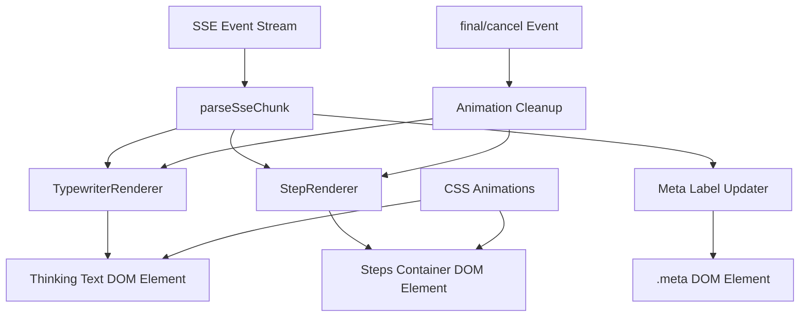
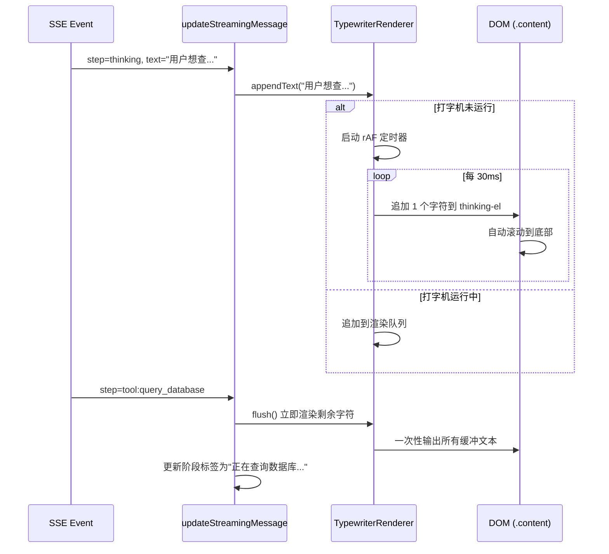

# 设计文档：Agent 流式展示增强

## 概述

**目的**：为 DBAgent 前端提供 Agent 思考过程的实时可视化反馈，将当前一次性整段输出的思考文本改为逐字打字机渲染，并为工具调用步骤增加动态动画效果，让用户直观感知 Agent 正在活跃工作而非卡住。

**用户**：DBAgent 的所有 Web 界面用户，通过浏览器使用 NL2SQL 数据探索功能。

**影响**：改变前端 SSE 事件到 DOM 的渲染管线，将当前 `innerHTML` 全量重建改为增量 DOM 操作 + CSS 动画驱动，不改变后端 SSE 事件格式或发送频率。

### 目标

- 思考文本以打字机效果逐字渲染（每字符约 30ms），支持新文本到达时追加到渲染队列
- 工具调用步骤的 running 状态显示 CSS 动画指示器，状态切换时平滑过渡
- 思考阶段与工具调用阶段在气泡标签上有明确视觉区分
- 所有动画使用纯 CSS 实现，不引入第三方库，支持 `prefers-reduced-motion` 无障碍降级
- 动画异常时降级为静态展示，不影响核心消息内容

### 非目标

- 不修改后端 SSE 事件格式或发送频率
- 不修改 Agent 执行引擎的思考/工具调用逻辑
- 不引入 WebSocket 或改变传输协议
- 不实现图片或复杂 SVG 动画
- 不改变消息气泡的整体布局结构

## 边界承诺

### 本规范拥有

- 思考文本的逐字打字机渲染逻辑（TypewriterRenderer 状态机）
- 工具调用步骤的 CSS 动画效果（pulse-dot、text-pulse、状态过渡）
- 流式消息气泡的阶段标签更新（"思考中..." / "正在查询数据库..."）
- CSS 动画定义及 `prefers-reduced-motion` 无障碍支持
- 动画状态的生命周期管理（启动、停止、清理）
- 异常场景的降级渲染（动画失败 → 静态展示）

### 超出边界

- 后端 SSE 事件格式或发送频率的变更（仍使用现有 `step`/`sql`/`final` 事件）
- Agent 执行引擎的思考/工具调用逻辑修改
- WebSocket 或轮询等替代传输协议
- 消息气泡布局结构或整体页面布局的变更
- 复制按钮、侧边栏步骤面板等现有功能的修改

### 允许的依赖

- 现有 SSE 事件流（`step` 中的 `thinking`/`tool:*` 事件）作为数据源
- 现有 `createStreamingBubble()` 创建的 DOM 结构（`article.message.streaming > .bubble > .meta + .content`）
- 现有 `finalizeStreamingMessage()` 的正常/取消分流逻辑
- `agent-cancel-thinking` 的取消信号，触发所有动画停止
- 现有 CSS 变量体系（`--accent`、`--muted`、`--line`、`--danger` 等）

### 重验证触发条件

- SSE 事件格式变更（新增字段或修改事件类型）
- 流式气泡 DOM 结构变更（`.meta`、`.content` 元素的层级或类名修改）
- CSS 变量命名体系重构
- 消息渲染管线从 `innerHTML` 改为框架驱动的 DOM 管理（如引入 React/Vue）

## 架构

### 现有架构分析

当前流式渲染管线（`app.js` 第 597-638 行）：

```
SSE 事件 → parseSseChunk → addStep → updateStreamingMessage → innerHTML 全量重建
```

核心问题：
- `updateStreamingMessage` 每次调用都用 `innerHTML` 全量重建 `.content` 内容，导致 CSS 过渡效果无法在 DOM 元素间保持
- 思考文本一次性追加到 `streamingText` 并直接渲染全部内容，无逐字动画
- 工具步骤仅显示静态 emoji 图标（⏳/✅/❌），无动态效果
- `.meta` 标签始终显示 "DBAgent"，不反映当前执行阶段

### 架构模式与边界图



**架构集成**：
- 选择模式：**管道增强** — 在现有 `updateStreamingMessage` 渲染管道中插入打字机状态机和 CSS 动画层，不引入新的架构模式
- 领域边界：打字机逻辑和动画效果完全在前端 JS/CSS 层，不跨越前后端边界
- 保留的现有模式：`createStreamingBubble` → `updateStreamingMessage` → `finalizeStreamingMessage` 生命周期
- 新组件理由：`TypewriterRenderer` 是独立状态机（有自身定时器和队列），需要与渲染循环解耦；`StepRenderer` 负责工具步骤的 DOM 增量更新

### 技术栈

| 层 | 选择 / 版本 | 功能角色 | 备注 |
|---|---|---|---|
| 前端 | Vanilla JS (ES2020+) | 打字机状态机 + DOM 操作 | 无框架依赖，与现有代码一致 |
| 样式 | CSS3 Animation + Transition | 动画效果 + 状态过渡 | 纯 CSS，无第三方动画库 |
| 事件 | SSE (text/event-stream) | 现有数据源，不做修改 | 复用现有 `step`/`sql`/`final` 事件 |
| 运行时 | 浏览器 Web API | `requestAnimationFrame`、`setTimeout` | 用于打字机定时和帧同步 |

## 文件结构计划

### 修改的文件

```
app/static/
├── app.js          # 打字机状态机 + 增量 DOM 渲染 + 阶段标签更新
├── styles.css      # CSS 动画定义 + 状态过渡 + 无障碍媒体查询
└── index.html      # 无结构变更（仅可能调整 aria 属性）
```

- `app/static/app.js` — 核心变更文件。新增 `TypewriterRenderer` 状态机（`startTypewriter`、`stopTypewriter`、`flushTypewriter`），重构 `updateStreamingMessage` 为增量 DOM 操作（分离思考文本元素和步骤容器），新增 `updatePhaseLabel` 函数更新 `.meta` 标签
- `app/static/styles.css` — 新增 `@keyframes blink-cursor`、`@keyframes pulse-dot`、`@keyframes text-pulse` 动画定义；新增 `.streaming-step` 的 `transition` 规则；新增 `@media (prefers-reduced-motion)` 降级规则；修复缺失的 `--ok` / `--err` CSS 变量；新增 `.phase-label` 样式
- `app/static/index.html` — 无 DOM 结构变更（现有结构已满足需求）

## 系统流程

### 思考文本打字机流程



### 工具步骤状态流转

```mermaid
stateDiagram-v2
    [*] --> Running: tool_start 事件
    Running --> Completed: tool_end 事件 (status=completed)
    Running --> Error: tool_end 事件 (status=error)
    Running --> Cancelled: cancel 事件
    Completed --> [*]
    Error --> [*]
    Cancelled --> [*]

    note right of Running: CSS: pulse-dot 动画 + text-pulse
    note right of Completed: CSS: transition 到静态 checkmark
    note right of Error: CSS: transition 到静态 error 图标
```

## 需求可追溯性

| 需求 | 摘要 | 组件 | 接口 | 流程 |
|---|---|---|---|---|
| 1.1 | 思考文本逐字渲染 | TypewriterRenderer | `appendText(text)`, `flush()` | 思考文本打字机流程 |
| 1.2 | 每字符 20-40ms 渲染速度 | TypewriterRenderer | `charDelay` 配置项 (30ms) | 打字机定时器循环 |
| 1.3 | 新文本追加到渲染队列 | TypewriterRenderer | `appendText(text)` 内部队列 | 打字机流程（运行中分支） |
| 1.4 | 阶段结束立即完成渲染 | TypewriterRenderer | `flush()` | 打字机流程（flush 分支） |
| 1.5 | 渲染时自动滚动 | TypewriterRenderer | DOM `scrollTop` 操作 | 打字机流程（每字符循环） |
| 2.1 | running 状态动态指示器 | StepRenderer + CSS | `.streaming-step.running` + `pulse-dot` 动画 | 工具步骤状态流转 |
| 2.2 | running→completed 平滑过渡 | StepRenderer + CSS | `transition` 规则 | 工具步骤状态流转 |
| 2.3 | running→error 状态显示 | StepRenderer + CSS | `.streaming-step.error` 样式 | 工具步骤状态流转 |
| 2.4 | 仅当前 running 步骤动画 | StepRenderer | 状态类名精确控制 | 工具步骤状态流转 |
| 3.1 | 思考阶段显示"思考中..."标签 | MetaLabel | `updatePhaseLabel('thinking')` | 阶段标签更新 |
| 3.2 | 工具调用阶段显示工具名称 | MetaLabel | `updatePhaseLabel('tool', name)` | 阶段标签更新 |
| 3.3 | 返回思考阶段恢复标签 | MetaLabel | `updatePhaseLabel('thinking')` | 阶段标签更新 |
| 4.1 | 纯 CSS 动画实现 | CSS | `@keyframes` 定义 | — |
| 4.2 | finalize 时清除动画 | AnimationCleanup | `stopTypewriter()` + 类名移除 | 清理流程 |
| 4.3 | 多动画时页面流畅 | CSS | `will-change` + compositor-only 属性 | — |
| 4.4 | 切换会话/新消息时停止 | AnimationCleanup | `stopTypewriter()` + `finalizeStreamingMessage` | 清理流程 |
| 5.1 | 渲染队列异常时降级 | TypewriterRenderer | try-catch + 立即显示缓冲文本 | 异常降级 |
| 5.2 | 浏览器不支持 CSS animation | CSS | `@supports` 规则 + 静态降级 | 异常降级 |
| 5.3 | SSE 事件过快时加速渲染 | TypewriterRenderer | 最大延迟 3 秒检测 + 加速模式 | 异常降级 |

## 组件与接口

### 组件摘要

| 组件 | 领域/层 | 意图 | 需求覆盖 | 关键依赖 | 约定 |
|---|---|---|---|---|---|
| TypewriterRenderer | UI/JS | 逐字打字机状态机和渲染 | 1.1-1.5, 5.1, 5.3 | rAF API (P0) | State |
| StepRenderer | UI/JS | 工具步骤增量 DOM 更新 | 2.1-2.4 | TypewriterRenderer (P1) | State |
| MetaLabel | UI/JS | 阶段标签更新 | 3.1-3.3 | DOM `.meta` 元素 (P0) | State |
| AnimationCleanup | UI/JS | 动画生命周期清理 | 4.2, 4.4 | TypewriterRenderer (P0) | State |
| CSS Animations | UI/CSS | 动画效果定义 | 2.1, 4.1, 4.3, 5.2 | CSS cascade (P0) | — |

### UI / JavaScript 层

#### TypewriterRenderer

| 字段 | 详情 |
|---|---|
| 意图 | 管理思考文本的逐字打字机渲染，维护渲染队列和定时器 |
| 需求 | 1.1, 1.2, 1.3, 1.4, 1.5, 5.1, 5.3 |

**职责与约束**
- 维护 `fullText`（累计文本）、`displayedLength`（已渲染字符数）、`charDelay`（字符间隔，默认 30ms）
- 使用 `requestAnimationFrame` + 时间戳控制渲染节奏，避免 `setInterval` 的累积误差
- 新文本到达时追加到 `fullText`，若定时器未运行则启动；若已运行则自然在后续 tick 中渲染
- 当 `flush()` 被调用时，立即渲染所有剩余字符并停止定时器
- 当 SSE 事件积压导致渲染延迟超过 3 秒时，自动切换到加速模式（`charDelay` 降至 5ms）
- 每个字符渲染后触发 `onRender` 回调（用于自动滚动）
- 异常时（如 `fullText` 为 null/undefined）立即降级为显示全部文本

**依赖**
- 入站：`updateStreamingMessage` — 传入增量文本 (P0)
- 出站：DOM 思考文本元素 — 更新 `textContent` (P0)
- 外部：`requestAnimationFrame` API — 定时循环 (P0)

**约定**：State [x]

##### 状态管理

```typescript
interface TypewriterState {
  fullText: string;           // 累计全部文本
  displayedLength: number;    // 已渲染字符数
  charDelay: number;          // 每字符间隔 (ms)，默认 30
  isRunning: boolean;         // 定时器是否运行中
  rafId: number | null;       // 当前 rAF ID
  lastTickTime: number;       // 上次 tick 时间戳
  targetElement: HTMLElement | null; // 渲染目标 DOM 元素
  onRender: (() => void) | null;     // 每次渲染后回调
  queueStartTime: number;     // 队列开始时间（用于 3 秒超时检测）
}

interface TypewriterAPI {
  appendText(text: string): void;
  flush(): void;
  stop(): void;
  reset(): void;
  setTarget(element: HTMLElement): void;
  setOnRender(callback: () => void): void;
}
```

- 状态模型：单例状态机，全局唯一实例（同一时间只有一个流式消息）
- 持久化：不持久化，页面刷新或会话切换时重置
- 并发策略：`isRunning` 标志位防止重复启动定时器

**实现说明**
- 集成：在 `updateStreamingMessage` 中，当 `step === "thinking"` 时调用 `appendText(text)`，当 `step` 为其他值时调用 `flush()`
- 验证：`fullText` 类型检查，`targetElement` 存在性检查
- 风险：`requestAnimationFrame` 在后台标签页会暂停，恢复时可能一次性渲染大量字符；通过 `lastTickTime` 检测间隔并批量渲染（超过 100ms 时间差时一次渲染 5 个字符）

#### StepRenderer

| 字段 | 详情 |
|---|---|
| 意图 | 增量更新工具步骤 DOM，管理动画类名和状态过渡 |
| 需求 | 2.1, 2.2, 2.3, 2.4 |

**职责与约束**
- 维护步骤 DOM 元素的引用映射（`stepId → HTMLElement`），避免全量 `innerHTML` 重建
- 新步骤出现时创建 DOM 元素并追加到步骤容器
- 步骤状态变更时仅更新对应元素的类名和图标
- 使用 CSS `animation`（非 `transition`）确保新插入元素立即开始动画
- 状态变更时先移除旧状态类名，通过 `requestAnimationFrame` 延迟一帧后添加新状态类名以触发 CSS transition

**依赖**
- 入站：`updateStreamingMessage` — 传入步骤状态变更 (P0)
- 出站：DOM 步骤容器 (`.streaming-steps`) — 增量子元素 (P0)
- 外部：CSS 动画定义 — 类名驱动的动画 (P1)

**约定**：State [x]

##### 状态管理

```typescript
interface StepEntry {
  stepId: string;           // 步骤标识（如 "tool:query_database"）
  status: "running" | "completed" | "error";
  label: string;            // 显示名称
  element: HTMLElement;     // 对应 DOM 元素引用
}

interface StepRendererState {
  steps: Map<string, StepEntry>;  // stepId → StepEntry
  container: HTMLElement | null;   // 步骤容器 DOM 元素
}
```

- 状态模型：Map 结构，键为步骤标识
- 持久化：与 TypewriterRenderer 共享生命周期
- 并发策略：同步操作，无并发问题

**实现说明**
- 集成：在 `updateStreamingMessage` 中，对 `streamingSteps` 数组进行 diff 操作（新增/更新）
- 验证：`container` 存在性检查，步骤状态值合法性检查
- 风险：`innerHTML` 重建会丢失 DOM 引用；需要确保在 `createStreamingBubble` 后立

#### MetaLabel

| 字段 | 详情 |
|---|---|
| 意图 | 更新流式气泡的 `.meta` 标签以反映当前 Agent 执行阶段 |
| 需求 | 3.1, 3.2, 3.3 |

**职责与约束**
- 思考阶段：设置 `.meta` 文本为 "DBAgent · 思考中..."
- 工具调用阶段：设置 `.meta` 文本为 "DBAgent · 正在查询数据库..."（使用工具名称）
- 返回思考阶段：恢复为 "DBAgent · 思考中..."
- 消息最终确定时恢复为 "DBAgent"

**依赖**
- 入站：`updateStreamingMessage` — 传入当前阶段信息 (P0)
- 出站：DOM `.meta` 元素 — 更新 `textContent` (P0)

**约定**：State [ ]

**实现说明**
- 集成：在 `updateStreamingMessage` 中，根据 `step` 参数判断阶段类型并更新标签
- 验证：`.meta` 元素存在性检查
- 风险：无

#### AnimationCleanup

| 字段 | 详情 |
|---|---|
| 意图 | 确保所有动画在适当时机停止并清理资源 |
| 需求 | 4.2, 4.4 |

**职责与约束**
- `finalizeStreamingMessage` 调用时停止 TypewriterRenderer 并清除步骤动画类名
- 用户取消时（`cancelled = true`）同样执行清理
- `switchSession` 和 `sendMessage` 开始时调用清理
- 清理后移除 `will-change` 属性释放 GPU 资源

**依赖**
- 入站：`finalizeStreamingMessage`、`switchSession`、`sendMessage` (P0)
- 出站：TypewriterRenderer.stop()、StepRenderer 类名清理 (P0)

**约定**：State [ ]

### CSS 层

#### CSS Animations

| 字段 | 详情 |
|---|---|
| 意图 | 定义所有动画效果，遵循 compositor-only 原则 |
| 需求 | 2.1, 4.1, 4.3, 5.2 |

**新增 CSS 变量**
```css
:root {
  --ok: #0f766e;       /* 修复：完成状态色 */
  --err: #b42318;      /* 修复：错误状态色（复用 --danger） */
}
```

**新增关键帧动画**

```css
/* 打字机光标闪烁 */
@keyframes blink-cursor {
  0%, 100% { opacity: 0; }
  50% { opacity: 1; }
}

/* 工具步骤运行指示器（脉冲点） */
@keyframes pulse-dot {
  0%, 100% { opacity: 0.3; transform: scale(0.85); }
  50% { opacity: 1; transform: scale(1); }
}

/* 工具步骤标签文字脉冲 */
@keyframes text-pulse {
  0%, 100% { opacity: 0.5; }
  50% { opacity: 1; }
}
```

**新增步骤过渡规则**
```css
.streaming-step {
  transition: color 0.3s ease, opacity 0.3s ease;
}

.streaming-step .step-icon {
  transition: opacity 0.2s ease, transform 0.2s ease;
}
```

**无障碍降级**
```css
@media (prefers-reduced-motion: reduce) {
  .streaming-cursor::after { animation: none; }
  .pulse-dot { animation: none; opacity: 0.6; }
  .text-pulse { animation: none; opacity: 1; }
  .streaming-step { transition: none; }
}
```

**职责与约束**
- 所有动画仅使用 `opacity` 和 `transform`（compositor-only 属性）
- 动画时长 ≤ 2s，避免用户注意力疲劳
- 遵循现有 CSS 命名约定（kebab-case 类名，`--` 变量前缀）

## 数据模型

### 领域模型

本功能不引入持久化数据模型。所有状态为运行时 JavaScript 对象，生命周期与单个流式请求绑定。

- **TypewriterState**：打字机渲染状态（聚合根），包含累计文本、渲染进度、定时器引用
- **StepEntry**：工具步骤实体，包含步骤标识、状态、DOM 引用
- 事务边界：单个 SSE 连接的生命周期（从 `sendMessage` 到 `finalizeStreamingMessage`）

### 数据约定与集成

**SSE 事件约定（现有，无变更）**：

| 事件类型 | 触发条件 | 数据字段 |
|---|---|---|
| `step` (thinking) | LLM 推理文本 | `{step: "thinking", status: "running", text: string}` |
| `step` (tool:*) | 工具调用开始 | `{step: "tool:<name>", status: "running", call_index: int}` |
| `step` (tool:*) | 工具调用完成 | `{step: "tool:<name>", status: "completed", call_index: int}` |
| `final` | 对话结束 | `{reply, cancelled, tool_calls, stats, ...}` |

## 错误处理

### 错误策略

前端动画渲染失败不应影响核心消息展示。所有动画逻辑包裹在 try-catch 中，失败时降级为静态渲染。

### 错误类别与响应

**渲染异常**（JS 层）：
- TypewriterRenderer 状态异常 → 立即调用 `flush()` 显示全部缓冲文本，停止定时器
- DOM 元素引用丢失 → 回退到 `innerHTML` 全量重建（当前行为）
- `requestAnimationFrame` 不可用 → 降级为直接设置 `textContent`

**动画异常**（CSS 层）：
- 浏览器不支持 `@keyframes` → 通过 `@supports (animation: 1s) { ... }` 渐进增强，不支持时保持静态展示
- GPU 资源不足 → `will-change` 仅应用于当前活跃动画元素，完成后移除

**数据异常**：
- SSE 文本字段为 null/undefined → 类型检查 + 默认值 `""`
- 步骤状态值非法 → 默认视为 `"running"`

### 监控

- 前端 console 日志：打字机启动/停止/flush 事件（开发模式下）
- 现有后端观测体系不受影响（Langfuse 继续记录现有指标）

## 测试策略

### 单元测试（JS 层）

1. **TypewriterRenderer.appendText**：验证新文本追加后 `fullText` 正确累积，`displayedLength` 不变
2. **TypewriterRenderer.flush**：验证 `flush()` 后 `displayedLength === fullText.length`，`isRunning === false`
3. **TypewriterRenderer 加速模式**：模拟 `queueStartTime` 超过 3 秒，验证 `charDelay` 降至 5ms
4. **StepRenderer 状态变更**：验证步骤从 running→completed 时 DOM 类名正确更新
5. **MetaLabel 更新**：验证 thinking 阶段设置 "思考中..."，tool 阶段设置工具名称

### 集成测试

1. **SSE 事件 → 打字机管道**：模拟 SSE thinking 事件序列，验证 DOM 中文本逐字增加
2. **阶段切换 → flush**：模拟 thinking→tool_start 事件序列，验证打字机 flush 被触发
3. **取消流程 → 动画清理**：模拟 cancel 事件，验证 TypewriterRenderer 停止、动画类名清除
4. **会话切换 → 状态重置**：模拟 `switchSession` 调用，验证所有动画状态被重置
5. **异常降级**：模拟 `fullText` 为 null，验证降级为静态文本展示

### E2E 测试

1. **完整思考-工具-回答流程**：发送真实查询，验证思考文本逐字出现、工具步骤动画展示、最终回答正常渲染
2. **取消中流程**：在 Agent 执行中点击停止按钮，验证动画立即停止、消息保留取消标记
3. **多轮对话**：连续发送多条消息，验证每轮动画独立、上一轮动画被正确清理
4. **prefers-reduced-motion**：在系统设置中启用"减少动画"，验证所有动画降级为静态展示

### 性能测试

1. **快速 SSE 事件**：模拟 10ms 间隔的 SSE 事件，验证 3 秒超时加速机制触发
2. **多动画并发**：同时运行打字机 + 3 个工具步骤动画，验证页面帧率保持在 30fps 以上
3. **内存泄漏**：连续 10 轮对话后检查 TypewriterRenderer 和 StepRenderer 状态是否正确释放

## 可选章节

### 无障碍考虑

- `prefers-reduced-motion: reduce` 媒体查询：所有动画停止或降级
- 动画元素使用 `aria-hidden="true"` 避免屏幕阅读器重复朗读
- 状态标签（"思考中..."）使用 `aria-live="polite"` 确保屏幕阅读器感知阶段变化
- 打字机光标不影响屏幕阅读器（`::after` 伪元素内容不被朗读）