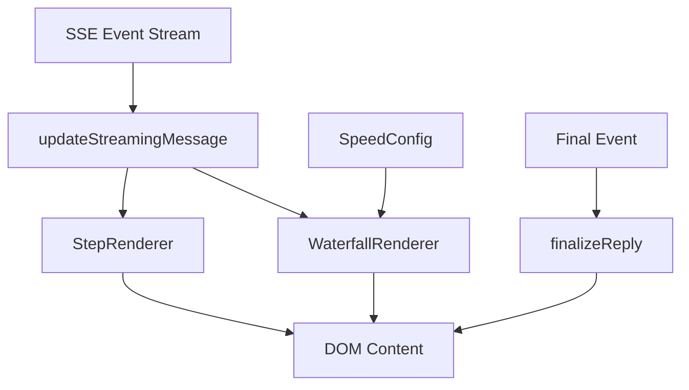
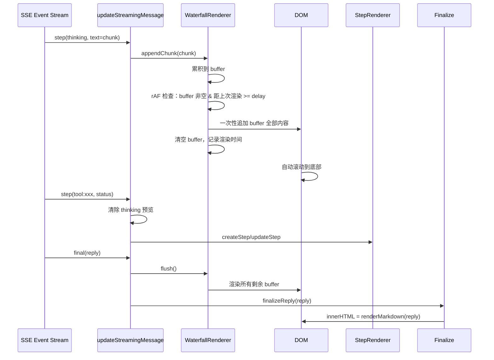

# Design Document

## Overview
**Purpose**: 将 Agent 回答的前端渲染方式从逐字符打字机（Typewriter）改为批量瀑布式（Waterfall）渲染，以内容块为单位一次性追加到显示区域，大幅提升渲染速度。同时提供用户可配置的渲染速度档位。

**Users**: 所有使用 DBAgent Web UI 的前端用户。

**Impact**: 替换 `app/static/app.js` 中的 `TypewriterRenderer` 为 `WaterfallRenderer`，修改 CSS 动画和视觉指示器，在侧边栏添加渲染速度配置控件。

### Goals
- 用瀑布式批量渲染替代逐字符打字机，消除渲染延迟
- 提供快速/标准/慢速三档渲染速度，用户可切换并持久化
- 最终回答直接渲染 Markdown，去除"纯文本预览→Markdown 替换"的两阶段流程
- 保持与现有 SSE 事件流的完全兼容，后端零改动

### Non-Goals
- 不修改后端 SSE 事件生成逻辑
- 不改变 SSE 事件格式或协议
- 不调整 LLM 推理速度或 token 生成策略
- 不改变会话管理、SQL 面板、侧边栏等其他前端功能

## Boundary Commitments

### This Spec Owns
- 前端内容渲染管道：SSE 事件 → 内容块累积 → 批量 DOM 更新
- 渲染速度配置 UI 控件及其 localStorage 持久化
- 流式消息气泡的视觉指示器（替换打字机光标）
- CSS 动画：移除逐字光标动画，添加瀑布式进度指示器

### Out of Boundary
- SSE 事件格式和生成逻辑（属于 `app/api/routes.py` 和 `app/agent/runner.py`）
- 后端 Agent 循环、工具调用、取消机制
- 会话管理、SQL 面板、侧边栏 UI
- Markdown 渲染引擎（`renderMarkdown` 函数保持不变）

### Allowed Dependencies
- 现有 SSE 事件类型：`step`（含 `thinking` 和 `tool:*` 子类型）、`sql`、`final`
- 现有 DOM 结构：`#messages` 容器、`.message.assistant.streaming` 气泡模板
- 现有 `StepRenderer`（工具步骤渲染，保持不变）
- 现有 `createStreamingBubble` / `updateStreamingMessage` / `finalizeReply` 函数签名
- `localStorage` API（渲染速度持久化）
- `requestAnimationFrame` API（分帧渲染）

### Revalidation Triggers
- SSE 事件类型新增或字段变更
- 流式消息气泡 DOM 结构调整
- 渲染速度配置项 key 名变更

## Architecture

### Existing Architecture Analysis
当前前端渲染管道分为三层：

```
SSE 事件流 → TypewriterRenderer（逐字 rAF 循环）→ DOM textContent 更新
           → StepRenderer（增量 DOM）             → DOM 子元素更新
           → finalizeReply（纯文本预览→Markdown 替换）→ DOM innerHTML 替换
```

核心问题是 `TypewriterRenderer.tick()` 以 20-30ms 间隔逐字符推进 `displayedLength`，导致即使后端已推送完整文本，前端仍需数百毫秒到数秒才能显示完毕。

### Architecture Pattern & Boundary Map



**Selected pattern**: Pipeline（事件驱动 + 批量渲染）
- **WaterfallRenderer** 替代 TypewriterRenderer：累积文本，按内容块（chunk）批量写入 DOM
- **SpeedConfig** 新增：管理渲染速度配置 UI 和 localStorage 持久化
- **StepRenderer** 保持不变
- **finalizeReply** 简化：去除打字机预览，直接 `renderMarkdown` + `innerHTML`

### Technology Stack

| Layer | Choice / Version | Role in Feature | Notes |
|-------|------------------|-----------------|-------|
| Frontend | Vanilla JS (ES2020+) | 瀑布式渲染器、速度配置 | 无新依赖 |
| Frontend | CSS3 Animations | 瀑布式进度指示器 | 替换 blink-cursor |
| Storage | localStorage | 渲染速度持久化 | 现有 API |

## File Structure Plan

### Modified Files
- `app/static/app.js` — 核心变更：`TypewriterRenderer` → `WaterfallRenderer`；新增 `SpeedConfig` 模块；修改 `finalizeReply` 去除打字机预览；修改 `createStreamingBubble` 线束瀑布渲染器；修改 `sendMessage` 中的 final 处理
- `app/static/styles.css` — 移除 `.streaming-cursor::after` blink-cursor 动画；新增瀑布式进度指示器样式（`.waterfall-progress`）；新增速度配置控件样式
- `app/static/index.html` — 在侧边栏添加渲染速度配置控件（下拉菜单或按钮组）

## System Flows

### 瀑布式渲染流程



**Key decisions**:
- 内容块到达时先累积到 buffer，由 rAF 循环批量消费
- 渲染间隔由 `SpeedConfig` 控制：快速=0ms（立即），标准=30ms，慢速=80ms
- 工具步骤到达时立即清除 thinking 预览（保持现有行为）
- final 事件时先 flush buffer，再直接渲染 Markdown（无打字机预览）

## Requirements Traceability

| Requirement | Summary | Components | Interfaces | Flows |
|-------------|---------|------------|------------|-------|
| 1.1 | 批量内容块渲染 | WaterfallRenderer | appendChunk, flush | 瀑布式渲染流程 |
| 1.2 | 新块立即追加 | WaterfallRenderer | appendChunk | 瀑布式渲染流程 |
| 1.3 | 直接渲染 Markdown | finalizeReply | renderMarkdown | final 事件处理 |
| 1.4 | 渲染中视觉指示器 | WaterfallRenderer, CSS | waterfall-progress 样式 | 瀑布式渲染流程 |
| 1.5 | 完成时移除指示器 | WaterfallRenderer | flush, finalizeReply | final 事件处理 |
| 2.1 | 三种速度档位 | SpeedConfig | getSpeed, setSpeed | 速度配置流程 |
| 2.2 | 即时切换 | SpeedConfig | setSpeed | 速度配置流程 |
| 2.3 | localStorage 持久化 | SpeedConfig | load, save | 速度配置流程 |
| 2.4 | 快速模式零延迟 | WaterfallRenderer | appendChunk (delay=0) | 瀑布式渲染流程 |
| 2.5 | 标准/慢速可控延迟 | WaterfallRenderer | appendChunk (delay>0) | 瀑布式渲染流程 |
| 3.1 | thinking 阶段瀑布渲染 | WaterfallRenderer | appendChunk | 瀑布式渲染流程 |
| 3.2 | 工具调用时清除预览 | updateStreamingMessage | — | 瀑布式渲染流程 |
| 3.3 | 思考中视觉指示器 | CSS | waterfall-progress 样式 | — |
| 4.1 | SSE step 事件兼容 | updateStreamingMessage | — | SSE 事件处理 |
| 4.2 | SSE final 事件兼容 | sendMessage | finalizeReply | final 事件处理 |
| 4.3 | 取消场景兼容 | sendMessage | finalizeStreamingMessage | 取消流程 |
| 4.4 | 流式消息生命周期不变 | createStreamingBubble | — | — |
| 5.1 | 大块分帧渲染 | WaterfallRenderer | rAF tick | 瀑布式渲染流程 |
| 5.2 | 合并相邻操作 | WaterfallRenderer | buffer 累积 | 瀑布式渲染流程 |
| 5.3 | 自动滚动无抖动 | WaterfallRenderer | onRender callback | 瀑布式渲染流程 |
| 5.4 | 后台标签页暂停 | WaterfallRenderer | rAF tick (elapsed check) | — |

## Components and Interfaces

### Component Summary

| Component | Domain/Layer | Intent | Req Coverage | Key Dependencies | Contracts |
|-----------|--------------|--------|--------------|------------------|-----------|
| WaterfallRenderer | UI/Rendering | 批量内容块渲染引擎 | 1.1-1.5, 3.1, 5.1-5.4 | SpeedConfig (P1), DOM target (P0) | State |
| SpeedConfig | UI/Config | 渲染速度配置与持久化 | 2.1-2.5 | localStorage (P1), WaterfallRenderer (P2) | State |
| SpeedControl UI | UI/Presentation | 速度档位切换控件 | 2.1, 2.2 | SpeedConfig (P0) | — |
| CSS Waterfall Indicators | UI/Style | 瀑布式进度视觉反馈 | 1.4, 1.5, 3.3 | — | — |

### UI / Rendering

#### WaterfallRenderer

| Field | Detail |
|-------|--------|
| Intent | 以批量内容块为单位渲染文本，替代逐字符打字机 |
| Requirements | 1.1, 1.2, 1.4, 1.5, 3.1, 5.1, 5.2, 5.3, 5.4 |

**Responsibilities & Constraints**
- 维护内部文本 buffer，累积来自 SSE 事件的内容增量
- 通过 `requestAnimationFrame` 循环定期消费 buffer，按配置的延迟间隔批量写入 DOM
- 管理渲染状态（running/idle）和视觉指示器的添加/移除
- 支持 `flush()` 立即渲染所有剩余 buffer
- 支持 `stop()` 暂停渲染（取消场景）
- 支持 `reset()` 清空状态（新会话/新轮次）
- 大块内容（>500 字符）自动分帧渲染，不阻塞主线程

**Dependencies**
- Inbound: `updateStreamingMessage` — 推送 thinking 文本增量 (P0)
- Inbound: `finalizeReply` — 触发 flush 完成最终渲染 (P0)
- Inbound: `cleanupAnimations` — 触发 stop 取消渲染 (P1)
- Outbound: DOM target element — 写入 textContent (P0)
- Outbound: `onRender` callback — 触发滚动 (P1)

**Contracts**: State [x]

##### State Management
- State model: `{ buffer: string, targetElement: HTMLElement|null, isRunning: boolean, rafId: number|null, lastRenderTime: number, startTime: number }`
- Persistence & consistency: 纯内存状态，无持久化。renderDelay 从 SpeedConfig 读取
- Concurrency strategy: 单 rAF 循环，SSE 事件和 rAF 回调通过 buffer 字符串解耦

##### Service Interface
```
WaterfallRenderer
  appendChunk(text: string): void
    — 将文本追加到 buffer，若未运行则启动 rAF 循环
  flush(): void
    — 立即渲染所有剩余 buffer，停止循环，移除指示器
  stop(): void
    — 停止 rAF 循环，保留 buffer（不渲染），移除指示器
  reset(): void
    — 停止循环，清空 buffer，重置状态
  setTarget(el: HTMLElement): void
    — 设置渲染目标 DOM 元素
  setOnRender(cb: () => void): void
    — 设置每次渲染后的回调（用于自动滚动）
  setOnComplete(cb: () => void): void
    — 设置全部渲染完成后的回调
  getRenderDelay(): number
    — 从 SpeedConfig 读取当前延迟值
```

**Implementation Notes**
- Integration: 替换 `typewriter` 全局单例，`createStreamingBubble` 中将 `typewriter.setTarget()` 改为 `waterfall.setTarget()`
- Validation: 渲染延迟在 0-80ms 范围内；buffer 不无限增长（flush 确保最终清空）
- Risks: 与 `finalizeReply` 的交互需仔细处理 — flush 后立即 `innerHTML = renderMarkdown()`，中间不留打字机预览阶段

#### SpeedConfig

| Field | Detail |
|-------|--------|
| Intent | 管理渲染速度配置的读取、写入、持久化和 UI 同步 |
| Requirements | 2.1, 2.2, 2.3, 2.4, 2.5 |

**Responsibilities & Constraints**
- 定义三种速度档位：`fast`（0ms）、`normal`（30ms）、`slow`（80ms）
- 从 localStorage 读取持久化的速度设置
- 写入时同步更新 localStorage 和内存缓存
- 提供 delay 值查询接口供 WaterfallRenderer 使用

**Dependencies**
- Inbound: SpeedControl UI — 用户切换速度档位 (P0)
- Outbound: WaterfallRenderer — 提供 renderDelay 值 (P1)
- External: localStorage API (P1)

**Contracts**: State [x]

##### State Management
- State model: `{ speed: 'fast' | 'normal' | 'slow', delays: { fast: 0, normal: 30, slow: 80 } }`
- Persistence & consistency: localStorage key `vkdbagent.renderSpeed`，读写均在主线程同步完成
- Concurrency strategy: 单线程，无并发问题

##### Service Interface
```
SpeedConfig
  getSpeed(): string
    — 返回当前速度档位标识符
  setSpeed(speed: string): void
    — 设置速度档位，写入 localStorage
  getDelay(): number
    — 返回当前档位对应的渲染延迟（毫秒）
  load(): void
    — 从 localStorage 恢复设置
```

**Implementation Notes**
- Integration: 在 `initUserId()` 附近调用 `speedConfig.load()` 进行初始化
- Validation: speed 值必须是 `fast`/`normal`/`slow` 之一，非法值回退到 `normal`
- Risks: localStorage 不可用时（隐私模式、配额满）静默降级为默认值 `normal`

#### SpeedControl UI

| Field | Detail |
|-------|--------|
| Intent | 在侧边栏渲染速度选择控件，响应用户切换 |
| Requirements | 2.1, 2.2 |

**Responsibilities & Constraints**
- 渲染 HTML 控件（推荐下拉菜单 `<select>` 或按钮组）
- 绑定 change 事件，调用 `speedConfig.setSpeed()`
- 初始化时同步控件状态与 `speedConfig.getSpeed()`

**Dependencies**
- Outbound: SpeedConfig.setSpeed() (P0)
- External: DOM — 侧边栏 `#runSteps` 附近或独立 panel (P1)

**Contracts**: 无独立接口，直接操作 DOM + 调用 SpeedConfig

**Implementation Notes**
- Integration: 在 `index.html` 的侧边栏 `<aside>` 中添加渲染速度 panel，包含 `<select>` 元素
- Validation: 切换后观察 WaterfallRenderer 行为变化（快速=立即渲染，慢速=可感知延迟）
- Risks: 移动端触摸目标需足够大（≥44px）

## Data Models

### Domain Model
无新增数据实体。渲染速度配置存储在 localStorage 中：

```
Key: "vkdbagent.renderSpeed"
Value: "fast" | "normal" | "slow"
Default: "normal"
```

### Data Contracts & Integration
无 API 数据契约变更。SSE 事件格式保持不变。

## Error Handling

### Error Strategy
纯前端渲染层错误采用静默降级策略：
- DOM 操作失败 → 跳过该次渲染，下个 rAF 周期重试
- localStorage 不可用 → 使用默认速度 `normal`
- 非法速度值 → 回退到 `normal`
- buffer 异常增长（>100KB 未 flush）→ 强制 flush

### Error Categories and Responses
- **DOM 异常** (catch): 静默跳过，保留 buffer 内容，下次 tick 重试
- **存储异常** (catch): 回退默认值，不影响渲染功能
- **配置异常** (guard): 校验 speed 值，非法值回退默认

## Testing Strategy

### Unit Tests
1. `WaterfallRenderer.appendChunk()` — 验证 buffer 累积正确，首次调用启动 rAF 循环
2. `WaterfallRenderer.flush()` — 验证所有 buffer 渲染到 DOM，指示器移除，循环停止
3. `WaterfallRenderer.reset()` — 验证 buffer 清空，循环停止，状态重置
4. `SpeedConfig.setSpeed()` / `getDelay()` — 验证三档延迟值正确，localStorage 同步
5. `SpeedConfig` 降级 — 模拟 localStorage 不可用，验证回退默认值

### Integration Tests
1. SSE step(thinking) 事件 → WaterfallRenderer.appendChunk → DOM 批量更新
2. SSE final 事件 → WaterfallRenderer.flush → finalizeReply → Markdown 直接渲染
3. 速度切换 → WaterfallRenderer.getRenderDelay() 返回值变化 → 渲染节奏变化
4. 取消流 → WaterfallRenderer.stop() → buffer 保留 → 取消标记追加
5. 后台标签页 → 恢复后批量渲染累积内容

### E2E/UI Tests
1. 发送消息 → 观察回答以内容块形式批量出现（非逐字符）
2. 切换速度档位 → 刷新页面 → 验证速度设置持久化
3. 快速连续发送消息 → 验证渲染不卡顿、不丢失内容
4. 停止生成 → 验证已渲染内容保留，取消标记显示

## Performance & Scalability
- 快速模式（0ms delay）：内容块到达后立即渲染，吞吐量仅受 SSE 事件速率限制
- 标准模式（30ms delay）：每秒最多 ~33 次 DOM 更新，适合一般使用
- 慢速模式（80ms delay）：每秒最多 ~12 次 DOM 更新，适合偏好逐段阅读的用户
- 大块分帧：单块 >500 字符时拆分为多次 rAF 渲染，每帧最多处理 500 字符

## CSS Changes Summary
移除的样式规则：
- `.streaming-cursor::after` — 打字机闪烁光标（不再需要逐字渲染光标）
- `@keyframes blink-cursor` — 光标闪烁动画

新增的样式规则：
- `.waterfall-progress` — 瀑布式进度指示器（底部细线脉冲动画，替代光标）
- `@keyframes waterfall-pulse` — 进度条脉冲动画
- `#renderSpeedPanel` — 速度配置面板样式
