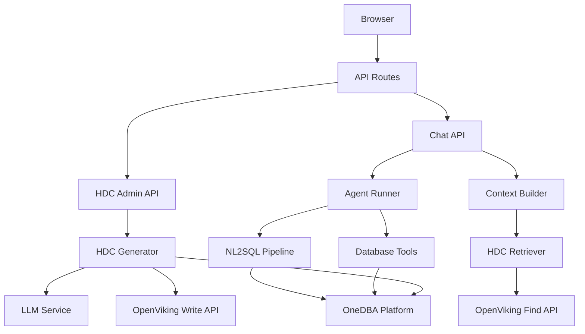
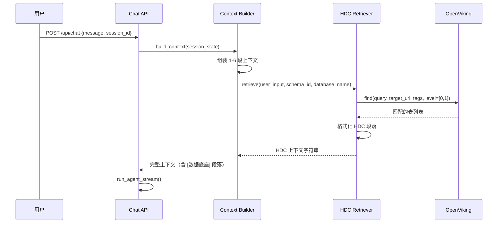
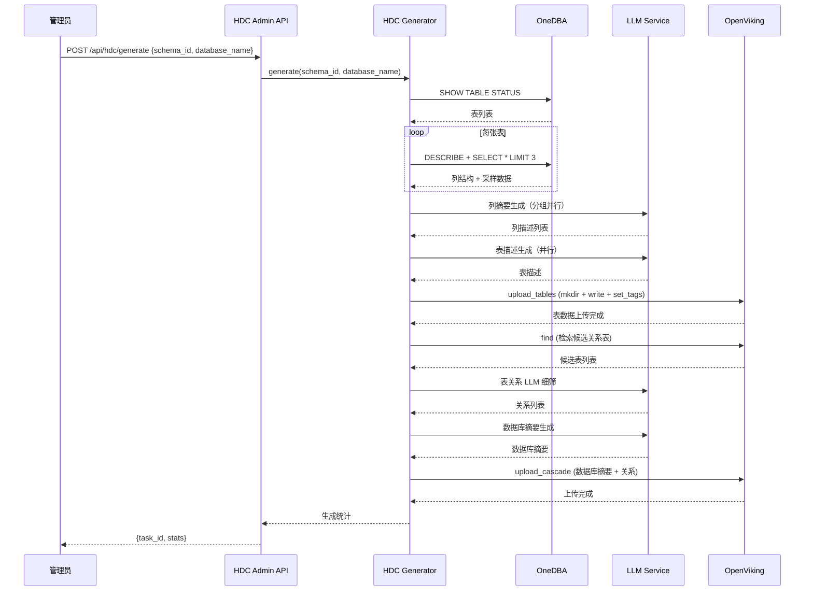

# 设计文档

## 概述

**目标**：为 DBAgent 构建基于 TiInsight HDC 方法论的数据库语义知识底座，通过离线 LLM 生成管线将 OneDBA 数据库 schema 转化为四层业务语义描述（列→表→关系→库），存储于 OpenViking 资源目录，在线检索时注入 Agent 上下文，减少 Agent 面对陌生数据库时的 `describe_table` 往返次数。

**用户**：DBA 管理员（触发 HDC 生成和增量更新）、Agent（在线检索 HDC 并注入上下文）。

**影响**：新增 `app/datavault/` 模块（HDC 生成 + 检索 + 模型）；扩展 `OpenVikingClient`（`find`/`write`/`set_tags` API）；`build_context()` 新增第 7 段 `[数据底座]` 上下文；`app/config.py` 新增 2 个配置项。NL2SQL 流水线、数据库发现工具、OpenViking 语义记忆全部保持不变。

### 目标

- 实现 HDC 离线生成管线：OneDBA schema 采集 → LLM 四层自底向上生成 → OpenViking 上传，支持全库和部分表两种模式
- 实现 HDC 在线检索：OpenViking `find` API 双路召回（tags 精确 + 向量语义），`build_context()` 注入
- 实现增量更新：列签名 hash 对比，仅重算变更表，兼容部分表模式生成的 HDC 知识库
- 实现静默降级：OpenViking 不可用时 Agent 回退到现有 `find_table` + `describe_table` 流程
- 提供管理 API：触发生成、查询状态、删除 HDC 数据

### 非目标

- 不替换 OpenViking 语义记忆（`retrieve_memories`）
- 不替换现有 `find_table`/`describe_table` 工具（HDC 是补充，不是替代）
- 不实现自定义 embedding 模型或向量存储（复用 OpenViking）
- 不做 HDC 内容的可视化展示（前端范围）
- 不做历史版本 HDC 回滚（OpenViking git snapshot 可覆盖）
- 不做分布式任务调度（单进程异步生成即可）
- 不限制"部分表生成"时表名数量的上限（合理使用即可，不设硬上限）

## 边界承诺

### 本规格拥有

- HDC 生成管线：schema 采集、LLM 生成、OpenViking 上传的编排逻辑，支持全库和部分表两种模式
- HDC 检索逻辑：OpenViking `find` API 调用、结果格式化、上下文段落组装
- `build_context()` 中 `[数据底座]` 上下文段落
- `OpenVikingClient` 中 `find`/`search`/`write`/`set_tags` API 封装
- HDC 增量更新：schema 变更检测与选择性重算
- HDC 管理 API 端点（生成触发、状态查询、删除）
- 静默降级：OpenViking 不可用时的 fallback 行为

### 范围外

- `build_context()` 中其他 6 段上下文（属于各自的 spec）
- `find_table`/`describe_table` 工具的行为修改
- NL2SQL 流水线（SQL 生成、校验、修复）
- OpenViking 语义记忆提取和检索（`retrieve_memories`）
- OneDBA 数据库权限管理（OneDBA 平台负责）
- 前端 UI 组件（HDC 状态展示等）

### 允许的依赖

- **OpenViking 服务**：`find`/`search`/`write`/`set_tags`/`mkdir`/`rm` API（HTTP）
- **OneDBA 平台**：`execute_sql` API（`SHOW TABLE STATUS`、`DESCRIBE`、`SELECT * LIMIT 3`）
- **LLM 服务**：OpenAI 兼容 API（复用 `Settings.llm_model`/`llm_base_url`）
- **httpx**：已有 HTTP 客户端库，无需新增
- **asyncio**：标准库，生成任务异步调度

### 重验证触发条件

- OpenViking `find` API 的请求/响应格式变更
- `build_context()` 函数签名变更
- `session_state` 字典中 `_hdc_context` 键的命名或结构变更
- HDC OpenViking 目录结构 `viking://user/hdc-system/memories/hdc/{schemaId}/{db}/_tables/{table}/` 变更
- `Settings` 中 HDC 相关配置项命名或默认值变更
- `HDCGenerator.generate()` 参数签名变更（如 `tables` 参数的类型或语义修改）
- `SchemaCollector.collect_database()` 签名变更

## 架构

### 现有架构分析

当前 DBAgent 采用分层架构，HDC 作为新增子系统插入：

- **API 层**（`app/api/`）：新增 HDC 管理端点
- **Agent 层**（`app/agent/`）：`build_context()` 新增 HDC 段落，`runner.py` 不变
- **知识层**（`app/knowledge/`）：`OpenVikingClient` 扩展 `find`/`write`/`set_tags`
- **工具层**（`app/tools/`）：不变
- **存储层**（`app/memory/`）：不变
- **客户端层**（`app/client/`）：`OneDBAClient` 不变
- **新增 datavault 层**（`app/datavault/`）：HDC 生成 + 检索 + 模型 + 更新

### 架构模式与边界图



**架构集成**：
- **选择模式**：分层架构 + 模块级单例（遵循项目现有模式）
- **域/功能边界**：`app/datavault/` 拥有全部 HDC 逻辑，`OpenVikingClient` 提供 HTTP 传输层，`build_context()` 仅消费检索结果
- **保留的现有模式**：模块级单例工厂函数、try/except 静默降级、`session_state` dict 传递上下文数据
- **新组件理由**：
  - `HDCGenerator`：编排采集→生成→上传全流程，独立于 Agent 运行时
  - `HDCRetriever`：封装 OpenViking `find` 调用和结果格式化，注入前预处理
  - `SchemaCollector`：复用 `OneDBAClient` 采集 schema 元数据
  - `HDCUploader`：封装 OpenViking 目录创建 + 文件写入 + tags 设置

### 技术栈

| 层 | 选择 / 版本 | 在功能中的角色 | 备注 |
|------|-------------|-----------------|-------|
| 后端 | Python 3.12 + FastAPI | HDC 管理 API 端点 | 已有 |
| HTTP 客户端 | httpx | OpenViking API 调用 | 已有 |
| LLM | OpenAI 兼容 API（deepseek-v4-flash） | HDC 生成时的描述生成 | 已有，复用 `Settings.llm_model` |
| 存储 | OpenViking（`viking://user/hdc-system/memories/hdc/{schemaId}/{db}/`） | HDC 知识库持久化 + 向量检索 | 已有 |

**设计决策 — HDC 存储路径选择 (2026-07-23)**：

HDC 数据存储路径从 `viking://resources/hdc/...` 迁移到 `viking://user/hdc-system/memories/hdc/...`。

**理由**：OpenViking 对 `resources` 路径的写入走 `_write_direct_with_refresh` 路径，强制触发 SemanticProcessor（VLM 生成 L0/L1 摘要 + embedding）。VLM 调用慢（30-120s）且对 HDC 冗余（HDC 的 `_INDEX.md` 已是 LLM 精炼的描述）。同时 VLM 连接池无并发限流，多表并行处理时连接池耗尽导致 `PoolTimeout`。

改为 `memories/hdc` 路径后走 `_write_memory_with_refresh` 路径：VLM 被硬编码跳过（`semantic_status="skipped"`），仅保留 embedding 向量化（2-5s），彻底消除 VLM 连接池耗尽问题。

**兼容性验证**：
- `content/read` API（`raw=False`）自动剥除 `MemoryFileUtils` 包装 → `_read_index()` 拿到原始 markdown ✅
- `registry.get("hdc")` 无注册项 → `refresh_schema_overview` 静默跳过 ✅
- `find()` 向量检索不依赖 context_type ✅
- `set_tags()` 不区分 context_type ✅
| Schema 源 | OneDBA 平台 | 数据库 schema 采集 | 已有 |
| 异步 | asyncio | 生成管线并行调度 | 标准库 |

## 文件结构计划

### 目录结构

```
app/
├── datavault/                          # 新增：HDC 数据底座模块
│   ├── __init__.py                     # 导出 get_hdc_generator()、get_hdc_retriever()
│   ├── models.py                       # HDC 数据模型（Pydantic）
│   ├── collector.py                    # Schema 采集器（复用 OneDBAClient）
│   ├── generator.py                    # HDC 生成管线编排
│   ├── retriever.py                    # HDC 检索封装
│   ├── uploader.py                     # OpenViking 上传器
│   └── updater.py                      # 增量更新检测与执行
├── knowledge/
│   └── openviking.py                   # 修改：扩展 find/search/write/set_tags/mkdir/rm API
├── agent/
│   └── context.py                      # 修改：build_context() 新增 HDC 段落
├── api/
│   └── routes.py                       # 修改：新增 HDC 管理端点
├── config.py                           # 修改：新增 hdc_enabled, hdc_auto_generate 配置项
└── main.py                             # 修改：lifespan 中打印 HDC 状态
```

### 修改的文件

- `app/knowledge/openviking.py` — 扩展 `find()`、`search()`、`write()`、`set_tags()`、`mkdir()`、`rm()` 方法
- `app/agent/context.py` — `build_context()` 新增 `[数据底座]` 段落（~20 行），从 `session_state["_hdc_context"]` 读取
- `app/datavault/collector.py` — `collect_database()` 新增可选 `tables` 参数，采集时过滤表名
- `app/datavault/generator.py` — `generate()` 新增可选 `tables` 参数，传递到采集步骤并控制管线范围；部分表模式下仍执行关系和摘要生成
- `app/api/routes.py` — `POST /api/hdc/generate` 请求体新增可选 `tables` 字段
- `tools/hdc/generate.py` — CLI 新增 `--tables` 参数

## 系统流程

### HDC 上下文注入流程



### HDC 生成流程



## 需求可追溯性

| 需求 | 摘要 | 组件 | 接口 | 流程 |
|------|------|------|------|------|
| 1.1 | Schema 采集 | SchemaCollector | OneDBA execute_sql | HDC 生成流程 |
| 1.2 | 四层自底向上生成 | HDCGenerator | LLM API | HDC 生成流程 |
| 1.3 | tags 写入 | HDCUploader | OpenViking set_tags | HDC 生成流程 |
| 1.4 | 触发 SemanticProcessor | HDCUploader | OpenViking write (wait) | HDC 生成流程 |
| 1.5 | 单表失败不中断 | HDCGenerator | — | HDC 生成流程 |
| 1.6 | 生成统计返回 | HDCGenerator | HDC Admin API | HDC 生成流程 |
| 1.7 | 部分表采集和生成 | SchemaCollector, HDCGenerator | — | HDC 生成流程 |
| 1.8 | 部分表模式关系+摘要 | HDCGenerator | LLM API | HDC 生成流程 |
| 1.9 | 不存在的表名容错 | SchemaCollector, HDCGenerator | — | HDC 生成流程 |
| 1.10 | 默认全库向后兼容 | HDCGenerator | — | HDC 生成流程 |
| 1.11 | 增量更新兼容部分表 | HDCUpdater | OpenViking | 增量更新 |
| 1.12 | 部分表 hash 对比范围 | HDCUpdater | — | 增量更新 |
| 2.1 | 数据库摘要注入 | HDCRetriever, build_context | OpenViking find | HDC 上下文注入 |
| 2.2 | 双路召回检索 | HDCRetriever | OpenViking find (tags+vector) | HDC 上下文注入 |
| 2.3 | 无匹配时跳过 | HDCRetriever | — | HDC 上下文注入 |
| 2.4 | 未选定数据库时跳过 | build_context | — | HDC 上下文注入 |
| 2.5 | 与现有记忆并列 | build_context | — | HDC 上下文注入 |
| 2.6 | 列级按需过滤 | HDCRetriever | OpenViking find (level=[2]) | HDC 上下文注入 |
| 3.1 | 列签名 hash 对比 | HDCUpdater | OpenViking find/attrs | 增量更新 |
| 3.2 | 变更表重算 | HDCUpdater, HDCGenerator | — | 增量更新 |
| 3.3 | 删除表清理 | HDCUpdater | OpenViking rm | 增量更新 |
| 3.4 | 级联更新关系/摘要 | HDCUpdater, HDCGenerator | — | 增量更新 |
| 3.5 | 无变更时跳过 | HDCUpdater | — | 增量更新 |
| 4.1 | 不可用时降级 | HDCRetriever | — | HDC 上下文注入 |
| 4.2 | 超时降级 | HDCRetriever | — | HDC 上下文注入 |
| 4.3 | 自动恢复 | HDCRetriever | — | HDC 上下文注入 |
| 4.4 | 用户无感知 | HDCRetriever | — | HDC 上下文注入 |
| 5.1 | 异步生成 API | HDC Admin API | POST /api/hdc/generate | HDC 生成流程 |
| 5.2 | 进度查询 | HDC Admin API | GET /api/hdc/tasks/{id} | HDC 生成流程 |
| 5.3 | 删除 HDC 数据 | HDC Admin API | DELETE /api/hdc/{db} | — |
| 5.4 | 状态查询 | HDC Admin API | GET /api/hdc/status/{db} | — |

## 组件与接口

### 组件摘要

| 组件 | 域/层 | 意图 | 需求覆盖 | 关键依赖 (P0/P1) | 合约 |
|------|------|------|----------|-------------------|------|
| SchemaCollector | datavault | 从 OneDBA 采集原始 schema 元数据，支持全库和指定表过滤 | 1.1, 1.7, 1.9 | OneDBAClient (P0) | Service |
| HDCGenerator | datavault | 编排 HDC 生成全流程，支持全库和部分表两种模式 | 1.2, 1.5, 1.6, 1.7, 1.8, 1.9, 1.10 | SchemaCollector (P0), LLM (P0), HDCUploader (P0) | Service |
| HDCUploader | datavault | 将 HDC 内容写入 OpenViking 目录结构 | 1.3, 1.4 | OpenVikingClient (P0) | Service |
| HDCRetriever | datavault | 封装 OpenViking find 检索和结果格式化 | 2.1, 2.2, 2.6, 4.1-4.4 | OpenVikingClient (P0) | Service |
| HDCUpdater | datavault | 检测 schema 变更并执行增量更新，兼容部分表和全库两种知识库状态 | 1.11, 1.12, 3.1-3.5 | OneDBAClient (P0), HDCGenerator (P0) | Service |
| HDC Admin API | API 层 | HDC 管理 REST 端点 | 5.1-5.4 | HDCGenerator (P0), HDCUpdater (P0) | API |
| Context Builder | Agent 层 | build_context() 新增 HDC 段落 | 2.3, 2.4, 2.5 | HDCRetriever (P1) | Service |

### datavault 层

#### SchemaCollector

| 字段 | 详情 |
|------|------|
| 意图 | 从 OneDBA 采集数据库的原始 schema 元数据（表名、列结构、采样数据） |
| 需求 | 1.1 |

**职责与约束**
- 调用 `OneDBAClient.execute_sql()` 执行 `SHOW TABLE STATUS`、`DESCRIBE`、`SELECT * LIMIT 3`
- 返回结构化 `DatabaseRaw` 对象，不包含任何 LLM 生成的内容
- 单表采集失败不中断整体采集，记录错误并继续
- 接受可选的 `tables` 参数以过滤目标表名；指定了表名列表时仅采集匹配的表，跳过其余表
- 当指定的表名在数据库中不存在时，记录警告并继续处理其余合法表名

**依赖**
- 外部：OneDBAClient (P0) — 执行 SQL 查询

**合约**：Service [x]

##### 服务接口

```python
from dataclasses import dataclass, field

@dataclass
class ColumnRaw:
    name: str
    data_type: str
    nullable: bool
    key: str          # "PRI" / "UNI" / "MUL" / ""
    default: str
    extra: str

@dataclass
class TableRaw:
    name: str
    comment: str
    engine: str
    row_count_estimate: int
    columns: list[ColumnRaw] = field(default_factory=list)
    sample_rows: list[dict[str, object]] = field(default_factory=list)

@dataclass
class DatabaseRaw:
    schema_id: int
    tables: list[TableRaw] = field(default_factory=list)

class SchemaCollector:
    def __init__(self, client: OneDBAClient): ...
    async def collect_database(
        self, schema_id: int, tables: list[str] | None = None
    ) -> DatabaseRaw: ...
    # tables=None 采集全库；tables=["a","b"] 仅采集指定表
```

- 前置条件：`OneDBAClient` 已初始化，`schema_id` 有效
- 后置条件：返回 `DatabaseRaw`，包含所有成功采集的表；失败的表记录在 `errors` 列表中
- 不变量：`DatabaseRaw.tables` 不包含重复表名

#### HDCGenerator

| 字段 | 详情 |
|------|------|
| 意图 | 编排 HDC 四层自底向上生成全流程 |
| 需求 | 1.2, 1.5, 1.6 |

**职责与约束**
- 按自底向上顺序：列摘要 → 表描述 → 表关系 → 数据库摘要
- 接受可选的 `tables` 参数以限定生成范围；指定后仅对指定表执行采集和生成，其余表跳过
- 部分表模式下仍执行表关系和数据库摘要生成：关系仅检测指定表之间的关联，摘要仅基于指定表的核心实体和业务域编写
- 列摘要使用垂直分区策略：每 6 列一组，`asyncio.gather` 并行调用 LLM，`asyncio.Semaphore` 限制并发数
- 表描述采用逐表流式管线：列摘要完成后立即启动该表的描述生成（通过 `_pipeline_one_table`），表间并行但受信号量约束，避免 LLM 连接耗尽
- 支持 LLM 调用超时重试（`max_retries=2`，60s 超时，线性退避）
- 表关系使用两阶段检测：OpenViking `find` 粗筛 → LLM 细筛
- 单表 LLM 调用失败时记录错误并继续，不中断整体流程
- 返回生成统计（成功表数、失败表数、列数、关系数、耗时、模式标识 `mode: "full"|"partial"`、partial 模式时附带 `requested_tables`）

**依赖**
- 入站：SchemaCollector (P0) — 获取原始 schema
- 出站：LLM 服务 (P0) — 生成描述
- 出站：HDCUploader (P0) — 上传结果

**合约**：Service [x]

##### 服务接口

```python
class HDCGenerator:
    def __init__(
        self,
        collector: SchemaCollector,
        llm: LLMService,
        uploader: HDCUploader,
        max_concurrency: int = 10,
    ): ...

    async def generate(
        self,
        schema_id: int,
        database_name: str,
        tables: list[str] | None = None,
        progress_callback: Callable[[str, dict[str, Any]], None] | None = None,
    ) -> dict[str, Any]: ...
    # 返回: {"status": "completed"|"partial"|"failed",
    #         "tables_total": int, "tables_succeeded": int,
    #         "columns": int, "relationships": int,
    #         "duration_seconds": float, "errors": list[str],
    #         "mode": "full" | "partial",
    #         "requested_tables": list[str] | None}    # 仅在 partial 模式下存在
    # tables=None 表示全库模式（向后兼容）
    # tables=["a", "b"] 表示仅对指定表生成

    async def generate_table(
        self, key: str, table: TableRaw
    ) -> TableDescription: ...
    # 单表生成（增量更新时使用）
    # key = storage_key(schema_id, database_name)

    # ── 内部管线 ──
    async def _pipeline_one_table(
        self, table: TableRaw,
    ) -> tuple[TableDescription, list[ColumnSummary]] | None: ...
    # 逐表流式管线：列摘要 → 表描述，信号量限流并发
    # 返回 None 表示该表描述生成失败（列摘要失败可容忍）
```

- 前置条件：`schema_id` 有效，`database_name` 非空
- 后置条件：HDC 内容已上传到 OpenViking，或部分失败记录在 `errors` 中
- 不变量：任一表生成失败不影响其他表

#### HDCUploader

| 字段 | 详情 |
|------|------|
| 意图 | 将 HDC 内容写入 OpenViking 资源目录结构，并设置结构化 tags |
| 需求 | 1.3, 1.4 |

**职责与约束**
- 创建目录结构：`viking://user/hdc-system/memories/hdc/{schemaId}/{db}/_tables/{table}/`、`viking://user/hdc-system/memories/hdc/{schemaId}/{db}/_relationships/`
- 写入 `_INDEX.md` 文件（表级 L2）和 `{column}.md` 文件（列级 L2）
- 调用 `set_tags` 设置结构化元数据（main_entity、table_type、pk）
- 使用 `user/memories/hdc` 路径走 `_write_memory_with_refresh` → 跳过 VLM，仅 embedding 向量化

**依赖**
- 外部：OpenVikingClient (P0) — `mkdir`/`write`/`set_tags` API

**合约**：Service [x]

##### 服务接口

```python
class HDCUploader:
    def __init__(self, ov_client: OpenVikingClient): ...

    async def upload_database(
        self,
        key: str,
        db_summary: DatabaseSummary,
        tables: list[TableDescriptionWithColumns],
        relationships: list[TableRelationship],
    ) -> None: ...
    # key = storage_key(schema_id, database_name)，格式 "{schemaId}/{database_name}"

    async def upload_table(
        self,
        key: str,
        table_desc: TableDescriptionWithColumns,
    ) -> None: ...

    async def delete_database(self, key: str) -> None: ...
    async def delete_table(self, key: str, table_name: str) -> None: ...
```

#### HDCRetriever

| 字段 | 详情 |
|------|------|
| 意图 | 封装 OpenViking `find` API 调用，格式化 HDC 检索结果用于上下文注入 |
| 需求 | 2.1, 2.2, 2.6, 4.1-4.4 |

**职责与约束**
- 阶段 1：`find(query, target_uri, tags=["hdc_level:table"], level=[0,1])` 检索匹配表
- 阶段 2：对命中的 top 5 表，`find(query, target_uri=table_uri, level=[2])` 检索相关列
- 格式化结果为 `[数据底座]` 段落字符串
- OpenViking 不可用时捕获异常，返回空字符串，记录日志

**依赖**
- 外部：OpenVikingClient (P0) — `find` API

**合约**：Service [x]

##### 服务接口

```python
@dataclass
class HDCContext:
    database_summary: str
    matched_tables: list[TableMatch]

@dataclass
class TableMatch:
    table_name: str
    main_entity: str
    table_type: str
    description: str
    relevant_columns: list[str]  # 列描述列表，最多 6 列

class HDCRetriever:
    def __init__(self, ov_client: OpenVikingClient): ...

    async def retrieve(
        self,
        user_input: str,
        schema_id: int,
        database_name: str,
    ) -> HDCContext | None: ...
    # 返回 None 表示降级（OpenViking 不可用或无匹配结果）
    # schema_id + database_name 组成 storage_key，防止不同实例间数据库重名

    def format_context(self, hdc: HDCContext) -> str: ...
    # 返回格式化的 [数据底座] 上下文字符串
```

- 前置条件：`user_input` 非空，`schema_id` 有效，`database_name` 非空
- 后置条件：返回 `HDCContext` 或 `None`（降级）
- 不变量：降级时不抛出异常，不阻塞 `build_context()`

### API 层

#### HDC Admin API

| 字段 | 详情 |
|------|------|
| 意图 | 提供 HDC 知识库生命周期管理的 REST 端点 |
| 需求 | 5.1-5.4 |

**合约**：API [x]

##### API 合约

| 方法 | 端点 | 请求 | 响应 | 错误 |
|------|------|------|------|------|
| POST | `/api/hdc/generate` | `{"schema_id": 142, "database_name": "dwd_trade", "tables": ["t1", "t2"]}` | `{"task_id": "uuid", "status": "started"}` | 400（schema_id 无效）、409（已有进行中的任务） |
| GET | `/api/hdc/status/{database_name}` | 路径参数 | `{"database_name": "...", "exists": true, "generated_at": "...", "table_count": 45, "last_updated_at": "..."}` | 404（数据库无 HDC 数据） |
| GET | `/api/hdc/tasks/{task_id}` | 路径参数 | `{"task_id": "...", "status": "running/completed/failed", "progress": {"phase": "...", "tables_done": 10, "tables_total": 45}}` | 404（任务不存在） |
| DELETE | `/api/hdc/{database_name}` | 路径参数 | `{"deleted": true, "database_name": "dwd_trade"}` | 404（数据库无 HDC 数据） |

**实现说明**
- 生成任务为异步执行，API 立即返回 `task_id`
- 任务状态存储在内存 dict（`{task_id: TaskStatus}`），服务重启后丢失
- 所有端点读取 `hdc_enabled` 配置，未启用时返回 503

## 数据模型

### 域模型

- **DatabaseRaw**：聚合根。包含 `schema_id` 和 `tables: list[TableRaw]`
- **TableRaw**：实体。包含 `name`、`comment`、`columns: list[ColumnRaw]`、`sample_rows`
- **ColumnRaw**：值对象。包含 `name`、`data_type`、`nullable`、`key`、`default`、`extra`
- **DatabaseSummary**：值对象。HDC 生成输出，包含 `representative_entities`、`domain_hint`、`description`、`table_count`
- **TableDescription**：值对象。HDC 生成输出，包含 `main_entity`、`table_type`、`primary_key`、`key_attributes`、`description`
- **ColumnSummary**：值对象。HDC 生成输出，包含 `column_name`、`description`、`sample_values`
- **TableRelationship**：值对象。HDC 生成输出，包含 `source_table`、`target_table`、`relationship_type`、`join_columns`、`confidence`

不变量：
- `TableDescription.main_entity` 必须包含业务同义词（以 `/` 分隔）
- `TableDescription.table_type` 必须是 `fact`、`dimension`、`bridge` 之一
- `TableRelationship.source_table` 和 `target_table` 不能相同
- 同一数据库内 `table_name` 唯一

### 逻辑数据模型

HDC 数据存储在 OpenViking 文件系统中，非关系型数据库。目录结构即数据模型：

- **数据库** → `viking://user/hdc-system/memories/hdc/{schemaId}/{database_name}/` 目录
- **表** → `_tables/{table_name}/` 子目录
- **列** → `{column_name}.md` 文件
- **关系** → `_relationships/{source}__{target}.md` 文件
- **元数据** → OpenViking tags（`main_entity`、`table_type`、`pk`、`hdc_level`）
- **embedding** → MemoryUpdater 纯文本向量化（跳过 VLM L0/L1 摘要）

### 数据合约与集成

- **HDCContext**（检索输出）：`{"database_summary": str, "matched_tables": list[TableMatch]}`
- **TableMatch**（检索输出）：`{"table_name": str, "main_entity": str, "table_type": str, "description": str, "relevant_columns": list[str]}`
- **序列化格式**：纯文本字符串（注入 `build_context()` 的 prompt 段落）
- **session_state 键**：`_hdc_context: HDCContext | None`

## 错误处理

### 错误策略

- OpenViking 不可用：静默降级，日志警告，返回空 HDC 上下文
- LLM 生成失败：单表跳过，记录错误，继续处理其余表
- OneDBA 采集失败：单表跳过，记录错误
- 管理 API 未启用（`hdc_enabled=False`）：返回 503

### 错误类别与响应

- **用户错误**：`schema_id` 无效 → 400 "无效的 schema_id"；`database_name` 为空 → 400
- **系统错误**：OpenViking 不可达 → 降级，日志警告；LLM API 调用失败 → 记录错误，跳过当前表
- **业务逻辑错误**：数据库无 HDC 数据 → 404 "该数据库尚未生成 HDC"；已有进行中任务 → 409 "该数据库已有生成任务进行中"

## 测试策略

### 单元测试

- `SchemaCollector.collect_database()` — mock OneDBAClient，验证采集结果结构
- `HDCGenerator._generate_column_summaries()` — mock LLM，验证垂直分区分组逻辑
- `HDCGenerator._generate_table_description()` — mock LLM，验证输出解析和 tags 提取
- `HDCRetriever.retrieve()` — mock OpenVikingClient，验证降级路径和格式化输出
- `HDCUpdater._compute_columns_hash()` — 验证相同列结构产生相同 hash，变更列产生不同 hash
- 部分表模式生成：mock SchemaCollector 返回过滤后的表，验证仅指定表进入后续管线
- 部分表模式 + 增量更新：首先生成 2 张表的 HDC → 增量更新检测到其余表为"待新增" → 自动扩展覆盖范围

### 集成测试

- HDC 生成全流程：mock OneDBA + OpenViking，验证四层生成顺序和上传调用
- HDC 检索全流程：mock OpenViking `find` 响应，验证 `build_context()` 注入结果
- 降级流程：mock OpenViking 抛出异常，验证 `build_context()` 不包含 HDC 段落
- 增量更新：mock 变更前后的 schema，验证仅重算变更表

### E2E 测试

- 管理员触发 HDC 生成 → 查询任务状态 → 用户发起对话 → 验证 Agent 上下文包含 HDC 段落
- OpenViking 服务停止 → 用户发起对话 → 验证 Agent 正常响应（无 HDC 段落）

## 性能考量

- HDC 检索目标延迟：< 200ms（OpenViking `find` API 典型延迟）
- HDC 生成：异步执行，不阻塞 Agent 正常服务
- 上下文窗口预算：HDC 段落 ≤ 1000 tokens（数据库摘要 ~200 + 表匹配 ~500 + 关系 ~300）
- 列签名 hash 计算：纯内存操作，毫秒级

## 安全考量

- HDC 管理 API 端点无需额外认证（复用 OneDBA 平台已有的网络隔离）
- HDC 数据存储在 `viking://user/hdc-system/memories/hdc/{schemaId}/{db}/`，所有用户共享读取（HDC 是数据库 schema 描述，不包含敏感数据）
- HDC 生成时的 LLM 调用复用项目已有的 API key 配置，不新增凭证
- 不将用户查询数据发送到 HDC 生成管线（生成管线仅使用 OneDBA schema 元数据）