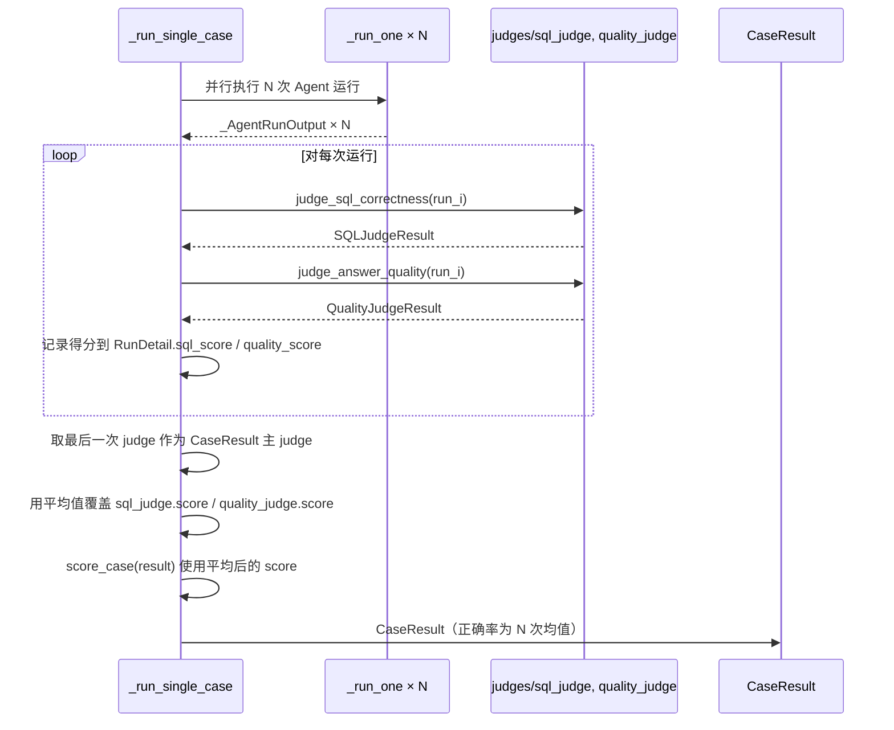

# 设计文档

## 概述

**目标**：完善 `tests/evaluation/` 评测框架中 `--compare-hdc` 对比模式的可靠性、统计准确性和报告完整性。

**用户**：DBAgent 开发者通过 CLI 运行 `--compare-hdc --repeat 4` 评测，阅读 JSON/Markdown 对比报告。

**影响**：修改 `tests/evaluation/` 下 4 个文件（cli.py、runner.py、models.py、reporter.py），不改动 datavault 模块或 Agent 行为。

### 目标

- `--compare-hdc` 启动时强制校验 `hdc_enabled`，防止静默降级浪费评测时间
- `--repeat N` 模式下正确率对 N 次运行取平均，而非仅取最后一次
- HDC 对比报告中顶层聚合幻觉率和首表命中率
- 报告中区分运行时 token 和 HDC 离线生成 token
- `--compare-hdc` 启动时展示预估耗时

### 非目标

- 不修改 `scorer.py` 评分公式
- 不修改 judge 判定逻辑
- 不修改 `_inject_hdc_context()` 内部的静默降级逻辑

## 边界承诺

### 本规格拥有

- `_run_compare_hdc()` 中的 `hdc_enabled` 前置校验逻辑
- `_run_single_case()` 中 repeat 模式下的 judge 循环逻辑
- `RunDetail.sql_score`、`RunDetail.quality_score` 字段
- `EvaluationReport.hdc_generation_tokens` 字段
- HDC 对比报告中的幻觉率/首表命中率聚合渲染
- `--hdc-gen-tokens` CLI 参数

### 范围外

- `_inject_hdc_context()` 的行为修改
- `_AgentRunOutput` 数据结构
- judge 算法修改

### 允许的依赖

- 现有 `CaseResult.hdc_verification`（由 `hdc-evaluation-enhancement` 规格提供，已实现）
- 现有 `RunDetail.first_table_used`、`RunDetail.called_find_table_before_query`（同上）
- 现有 `_compute_hdc_diff()`、`_add_metric_row()` 辅助函数

### 重验证触发条件

- `CaseResult.hdc_verification` schema 变更
- `RunDetail` 字段名变更
- `_run_single_case()` 函数签名变更

## 架构

### 现存架构分析

前一批增强（`hdc-evaluation-enhancement`）已在 `_run_single_case()` 和 reporter 中埋好基础设施：

```
_run_single_case()  →  _verify_hdc_injection()  →  CaseResult.hdc_verification
                    →  _extract_first_tool_info() →  RunDetail.first_table_used / called_find_table_before_query

_render_hdc_comparison_md()  →  _render_per_tool_breakdown()  →  工具调用效率表
                             →  _render_hdc_audit()            →  HDC 正确性审计表
```

本设计在此基础上进行精确修复和增强，不改动架构骨架：

1. **启动校验**：在 `_run_compare_hdc()` 开头插入检查点
2. **repeat 取平均**：在 `_run_single_case()` 中将"仅最后一次 judge"改为"所有运行 judge 后取平均"
3. **聚合指标**：在 reporter 中从已有 `hdc_verification` 和 `run_details` 数据汇总
4. **token 区分**：新增 CLI 参数 → 透传至 report model → reporter 渲染

### 架构集成

- **选择模式**：管道扩展（Pipeline Extension），在此前增强的基础上继续扩展
- **保留的现有模式**：`Optional` 可选字段、`_add_metric_row()` 渲染辅助、`argparse` 参数注册

## 文件结构计划

```
tests/evaluation/
├── cli.py         # 修改: _run_compare_hdc() 增加 hdc_enabled 校验+耗时预估; --hdc-gen-tokens 参数
├── models.py      # 修改: RunDetail 新增 sql_score/quality_score; EvaluationReport 新增 hdc_generation_tokens
├── runner.py      # 修改: _run_single_case() 中 repeat judge 逻辑; HDC 验证聚合
└── reporter.py    # 修改: _render_hdc_audit() 增加首表命中率聚合; _render_hdc_comparison_md() 增加 token 区分行
```

### 修改的文件

- `tests/evaluation/cli.py` — `_run_compare_hdc()` 前插 `hdc_enabled` 校验（约 8 行）；启动前打印预估耗时（约 10 行）；`run` 子命令新增 `--hdc-gen-tokens` 参数（约 3 行）；透传至 `EvaluationReport`（约 3 行）
- `tests/evaluation/models.py` — `RunDetail` 新增 `sql_score: Optional[float]`、`quality_score: Optional[float]`（约 4 行）；`EvaluationReport` 新增 `hdc_generation_tokens: Optional[int]`（约 3 行）
- `tests/evaluation/runner.py` — `_run_single_case()` 中 judge 逻辑改为遍历所有 runs（约 40 行改写）；HDC 验证改为聚合所有 runs（约 25 行改写）
- `tests/evaluation/reporter.py` — `_render_hdc_audit()` 末尾增加首表命中率汇总（约 20 行）；`_render_hdc_comparison_md()` 全局对比表增加 token 区分行（约 8 行）；结论部分增加摊销说明（约 5 行）

## 系统流程

### repeat N 的 judge 循环（新逻辑）



### HDC 验证聚合（新逻辑）

当 repeat > 1 且 enable_hdc=True：

```
对每次运行分别调用 _verify_hdc_injection()
  → per_run_verifications: list[HdcVerificationData]

聚合规则：
  injected:              any(per_run.injected)
  correct_table_in_context: any(per_run.correct_table_in_context)
  agent_used_correct_table: majority(per_run.agent_used_correct_table)
  is_hallucination:       any(per_run.is_hallucination)  ← 保守策略
```

## 需求可追溯性

| 需求 | 摘要 | 组件 | 接口 | 流程 |
|------|------|------|------|------|
| 1.1 | `--compare-hdc` 启动校验 `hdc_enabled` | `_run_compare_hdc()` (cli.py) | `get_settings().hdc_enabled` | CLI 启动 |
| 1.2 | 错误信息含修复指引 | `_run_compare_hdc()` (cli.py) | `sys.exit(1)` + print | CLI 启动 |
| 1.3 | 校验不影响 `--with-hdc` | 仅 `_run_compare_hdc` 路径 | — | CLI 分支 |
| 2.1 | repeat>1 时 SQL judge 取平均 | `_run_single_case()` (runner.py) | `judge_sql_correctness()` | repeat judge 循环 |
| 2.2 | repeat>1 时 quality judge 取平均 | `_run_single_case()` (runner.py) | `judge_answer_quality()` | repeat judge 循环 |
| 2.3 | repeat=1 保持原有行为 | `_run_single_case()` (runner.py) | — | 单次 judge |
| 2.4 | 每次 judge 得分记入 RunDetail | `RunDetail` (models.py) | `sql_score`, `quality_score` 字段 | 数据持久化 |
| 3.1 | 首表命中率汇总指标 | `_render_hdc_audit()` (reporter.py) | `run_details[].first_table_used` | 报告渲染 |
| 3.2 | 幻觉率汇总指标 | `_render_hdc_audit()` (reporter.py) | `hdc_verification.is_hallucination` | 报告渲染 |
| 3.3 | JSON 报告含聚合指标 | `_compute_hdc_diff()` (reporter.py) | diff 结构新增字段 | 报告序列化 |
| 3.4 | repeat>1 时首表命中取严格一致 | `_render_hdc_audit()` (reporter.py) | 所有运行都命中才计 | 报告渲染 |
| 4.1 | `--hdc-gen-tokens` 参数传入时报告展示 | `_render_hdc_comparison_md()` (reporter.py) | `EvaluationReport.hdc_generation_tokens` | 报告渲染 |
| 4.2 | 未传入时不展示行 | `_render_hdc_comparison_md()` (reporter.py) | `is not None` 守卫 | 报告渲染 |
| 4.3 | 结论中补充摊销说明 | `_render_hdc_comparison_md()` (reporter.py) | 结论段落 | 报告渲染 |
| 5.1 | 启动时展示预估耗时 | `_run_compare_hdc()` (cli.py) | 公式计算 + print | CLI 启动 |

## 组件与接口

### 组件摘要

| 组件 | 域/层 | 意图 | 需求覆盖 | 关键依赖 (P0/P1) | 合约 |
|------|------|------|----------|-------------------|------|
| RunDetail 扩展字段 | 数据模型 | 存储每次运行的 judge 得分 | 2.4 | Pydantic (P0) | 数据 |
| EvaluationReport 扩展字段 | 数据模型 | 存储 HDC 离线生成 token 数 | 4.1 | Pydantic (P0) | 数据 |
| `_run_compare_hdc` 校验 | CLI | hdc_enabled 前置检查 + 耗时预估 | 1.1-1.3, 5.1 | get_settings (P0) | 服务 |
| `_run_single_case` judge 循环 | Runner | repeat N 次 judge + 取平均 | 2.1-2.3 | judges (P0) | 服务 |
| 报告聚合渲染 | Reporter | 幻觉率/首表命中率/token 区分渲染 | 3.1-3.4, 4.1-4.3 | CaseResult (P0) | 渲染 |

### 数据模型层

#### RunDetail 新增字段

```python
# 在现有 RunDetail 模型中追加（models.py）
sql_score: Optional[float] = Field(default=None, description="本次运行的 SQL 正确性得分")
quality_score: Optional[float] = Field(default=None, description="本次运行的 LLM 回答质量得分")
```

#### EvaluationReport 新增字段

```python
# 在现有 EvaluationReport 模型中追加（models.py）
hdc_generation_tokens: Optional[int] = Field(default=None, description="HDC 离线生成消耗的 token 数（用户通过 CLI 传入）")
```

### CLI 层

#### `_run_compare_hdc()` 前置校验

```python
def _run_compare_hdc(args, filtered):
    # ── 新增：HDC 开关校验 ──
    from app.config import get_settings as _cfg
    settings = _cfg()
    if not settings.hdc_enabled:
        print("错误: --compare-hdc 需要启用 HDC，但当前 HDC_ENABLED 未设置或为 false")
        print("请先运行: export HDC_ENABLED=true")
        sys.exit(1)
    
    # ── 新增：预估耗时 ──
    estimated_seconds = len(filtered) * args.repeat * 90 * 2  # 每次 ~90s 平均 × 2 轮
    print(f"预估耗时: ~{estimated_seconds / 60:.0f} 分钟（{len(filtered)} 条用例 × 重复{args.repeat}次 × 2 轮）")
    # ... 原有逻辑不变
```

### 运行器层

#### `_run_single_case()` judge 循环改写

关键改动点（伪代码）：

```python
# 改动前（仅最后一次）:
# last_run = runs[-1]
# sql_judge = await judge_sql_correctness(generated_sql=last_run.sqls[-1], ...)
# quality_judge = await judge_answer_quality(agent_response=last_run.final_response, ...)

# 改动后:
per_run_sql_scores = []
per_run_quality_scores = []

for i, run in enumerate(runs):
    gen_sql = run.sqls[-1] if run.sqls else ""
    if not gen_sql and run.final_response:
        extracted = extract_sql_from_text(run.final_response)
        if extracted:
            gen_sql = extracted
    
    sj = None
    if gen_sql or test_case.reference_sql:
        sj = await judge_sql_correctness(gen_sql, test_case.reference_sql, ...)
        per_run_sql_scores.append(sj.score if sj else 0.0)
    
    qj = None
    if use_quality_judge and llm_client and run.final_response:
        qj = await judge_answer_quality(test_case.question, run.final_response, ...)
        per_run_quality_scores.append(qj.score if qj else 0.0)
    
    run_details[i].sql_score = sj.score if sj else None
    run_details[i].quality_score = qj.score if qj else None

# 取最后一次 judge 作为 CaseResult 主 judge（保持结构兼容）
sql_judge = last_sql_judge if per_run_sql_judges else None
quality_judge = last_quality_judge if per_run_quality_judges else None

# repeat>1 时用平均值覆盖 score
if repeat > 1 and per_run_sql_scores:
    avg_sql = sum(per_run_sql_scores) / len(per_run_sql_scores)
    if sql_judge:
        sql_judge.score = avg_sql
if repeat > 1 and per_run_quality_scores:
    avg_quality = sum(per_run_quality_scores) / len(per_run_quality_scores)
    if quality_judge:
        quality_judge.score = avg_quality
```

- 前置条件：`runs` 非空列表
- 后置条件：`sql_judge.score` 为 N 次 SQL judge 均值（repeat>1 时，排除异常值后）
- 不变量：单次运行时行为不变

#### `--verbose-hdc` 在 repeat>1 时的输出行为

前一批增强（`hdc-evaluation-enhancement`）在 `_run_one()` 中通过 `if verbose_hdc and run_index == 0` 限制只输出首次运行的 HDC 注入状态。本设计修改此行为：

- When `repeat > 1` 且 `--verbose-hdc`：`_run_one()` 为每次运行输出 HDC 注入状态（移除 `run_index == 0` 限制），格式为 `[HDC] {case_id}#{run_index}: 已注入({chars}字符) | 正确表在上下文中={yes/no}`
- When `repeat = 1` 且 `--verbose-hdc`：保持原有格式不变（不显示 `#0` 后缀）
- 这样可暴露间歇性 HDC 注入失败（如 OpenViking 短暂不可用导致第 3 次 run 注入失败而第 1/2/4 次成功）

### 报告器层

#### `_render_hdc_audit()` 增加首表命中率汇总

在现有聚合统计后追加，从 `diff` 字典读取 `_compute_hdc_diff()` 已计算的聚合值（确保 JSON 与 Markdown 一致）：

```python
# 从 diff 读取聚合指标（由 _compute_hdc_diff() 计算，确保数据一致性）
first_table_hit_rate = diff.get("first_table_hit_rate")
hallucination_rate = diff.get("hallucination_rate")

if first_table_hit_rate is not None:
    lines.append(f"- **首表命中率**: {first_table_hit_rate:.1%}")
else:
    lines.append(f"- **首表命中率**: N/A")

if hallucination_rate is not None:
    lines.append(f"- **幻觉率**: {hallucination_rate:.1%}")
else:
    lines.append(f"- **幻觉率**: N/A")
```

`_render_hdc_audit()` 的签名需增加 `diff: dict` 参数，由 `_render_hdc_comparison_md()` 传入 `_compute_hdc_diff()` 的返回值。

#### `_render_hdc_comparison_md()` 增加 token 区分行

在全局对比表中 `平均 Token` 行后：

```python
# 如果传入了 hdc_generation_tokens，则展示
if with_hdc.hdc_generation_tokens is not None:
    gen_tokens = with_hdc.hdc_generation_tokens
    lines.append(f"| HDC 离线生成 Token | — | {gen_tokens:,} | —（一次性成本） | — |")
```

在结论部分追加摊销说明。

#### `_compute_hdc_diff()` 增加 JSON 聚合字段

在 `_compute_hdc_diff()` 的返回结构中追加 `first_table_hit_rate` 和 `hallucination_rate`：

```python
# 在 _compute_hdc_diff() 末尾，返回 dict 之前追加：
# 计算首表命中率和幻觉率
first_table_hits = 0
first_table_total = 0
hallucination_count = 0
hallucination_total = 0
for case_id in sorted(no_by_id.keys()):
    with_c = with_by_id.get(case_id)
    if not with_c or not with_c.run_details:
        continue
    for rd in with_c.run_details:
        if rd.first_table_used:
            first_table_total += 1
            ref_table = _extract_table_from_sql(with_c.test_case.reference_sql)
            if ref_table and rd.first_table_used.lower() == ref_table.lower():
                first_table_hits += 1
    if with_c.hdc_verification:
        hv = with_c.hdc_verification
        hallucination_total += 1
        if hv.is_hallucination:
            hallucination_count += 1

first_table_hit_rate = first_table_hits / first_table_total if first_table_total > 0 else None
hallucination_rate = hallucination_count / hallucination_total if hallucination_total > 0 else None

# 追加到 diff dict:
diff["first_table_hit_rate"] = first_table_hit_rate
diff["hallucination_rate"] = hallucination_rate
```

字段约定：`first_table_hit_rate` 为 `float | None`（`None` 表示无数据），`hallucination_rate` 同理。

**数据一致性约束**：`_compute_hdc_diff()` 是 `first_table_hit_rate` 和 `hallucination_rate` 的唯一计算源。`_render_hdc_audit()` 和 `_render_hdc_comparison_md()` 中的 Markdown 渲染直接读取 `diff` 字典中的这两个值（而非各自重新计算），确保 JSON 和 Markdown 报告中的指标数值严格一致。若 `diff` 中值为 `None`，Markdown 中显示 "N/A"。

## 数据模型

### 域模型

- **RunDetail.sql_score / quality_score**：值对象。存储单次 Agent 运行的 judge 得分，用于 repeat 模式下的统计分析。
- **EvaluationReport.hdc_generation_tokens**：用户传入的元数据，非运行时统计值。

### 数据合约与集成

- **RunDetail 扩展**：通过 Pydantic `model_dump` 序列化到 JSON 报告，`Optional` 默认 `None` 向后兼容。
- **EvaluationReport 扩展**：同上。

## 错误处理

### 错误策略

- `hdc_enabled` 校验失败 → 打印明确提示 + `sys.exit(1)`，不进入评测
- 单次 run 的 judge 因外部服务不可用而失败（OneDBA 超时、LLM judge API 错误、网络异常）→ 该次得分标记为异常值（`RunDetail.sql_score = None`），不纳入均值计算，其余正常 runs 的得分仍正常取平均
- 单次 run 的 judge 因 Agent 生成错误而失败（SQL 语法错误、无 SQL 输出）→ 该次得分计 0.0，纳入均值计算
- 区分逻辑：`judge_sql_correctness()` 返回的 `SQLJudgeResult` 中，若 `tier == 0`（未进入任何 tier，即 judge 本身执行失败）且 `error` 来源于外部服务，则标记为异常值；若 Agent 未生成 SQL 导致 score 为 0.0，则正常纳入
- `hdc_gen_tokens` 未传 → 报告中不展示对应行（`is not None` 守卫）

### 错误类别与响应

- **配置错误**：`HDC_ENABLED` 未设 → 立即退出，指引修复
- **judge 失败**：单次 judge 异常 → 得分 0.0，继续处理其余 runs
- **数据缺失**：`hdc_verification` 为 None → 跳过该用例的聚合统计

## 测试策略

### 单元测试

- `--compare-hdc` 在 `hdc_enabled=False` 时 exit code 非零 → mock `get_settings()`
- repeat=3 时 `sql_judge.score` 为 3 次均值 → 构造 3 个已知得分的 mock judge
- repeat=1 时行为不变 → 验证 judge 只调用一次

### 集成测试

- `_run_compare_hdc()` 完整流程（含校验+预估）→ 使用 2 条测例
- 报告含幻觉率/首表命中率行 → 解析生成的 Markdown
- `--hdc-gen-tokens` 传入后报告含对应行 → 检查 Markdown 输出

### E2E 测试

```bash
# 校验失败场景
unset HDC_ENABLED
python -m tests.evaluation.cli run --compare-hdc --ids TC-001
# 预期: exit 1, 打印"请先运行: export HDC_ENABLED=true"

# 正常对比 + repeat 平均 + token 区分
export HDC_ENABLED=true
python -m tests.evaluation.cli run --compare-hdc --ids TC-001,TC-002 --repeat 3 --hdc-gen-tokens 500000
# 预期: 报告正确率基于 3 次平均, 含 token 区分和摊销说明
```

## 性能考量

- repeat 模式下 judge 调用次数从 1× 变为 N×：每条用例增加 (N-1) × (SQL judge + quality judge) 时间
- SQL judge Tier 2（执行 SQL 并对比结果）是主要耗时环节（~2-5s/次），N=4 时额外增加约 15s/用例
- `--concurrency` 参数可一定程度缓解，但 judge 环节在 runner 中非并发执行
- 总体：`--repeat 4` 预计使评测时间增加约 25-40%（judge 时间占比远低于 Agent 执行时间）
