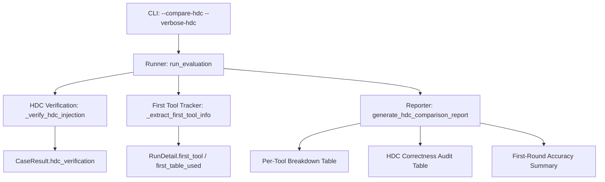
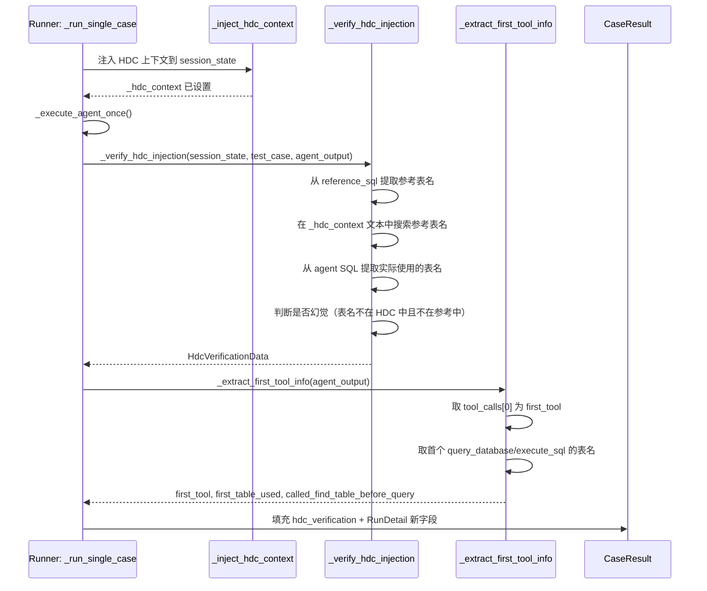

# 设计文档

## 概述

**目标**：增强 `tests/evaluation/` 评测框架的 HDC 对比报告能力，使开发者能够从逐工具效率、HDC 正确性审计、首轮表名准确性三个维度衡量 HDC 的真实效果。

**用户**：DBAgent 开发者（通过 CLI 运行 `--compare-hdc` 评测并阅读报告）。

**影响**：修改 `tests/evaluation/` 下的 4 个文件（models.py、runner.py、reporter.py、cli.py），新增 1 个 Pydantic 模型和 2 个报告渲染函数，不修改生产代码。

### 目标

- 在 `--compare-hdc` 报告中新增逐工具调用效率对比表
- 在 `--compare-hdc` 报告中新增 HDC 正确性审计表
- 追踪每条用例的首轮表名准确性
- 通过 `--verbose-hdc` 支持实时注入状态输出
- 保持现有评测模式和数据格式向后兼容

### 非目标

- 不修改 HDC 知识库生成、检索或上传逻辑（属于 `hdc-datavault-knowledge-base`）
- 不修改 Agent 系统提示词或行为策略
- 不修改评分公式（`scorer.py`）
- 不新增通用 A/B 对比模式（仅增强现有 HDC 对比）
- 不修改 `_execute_agent_once()` 内部循环

## 边界承诺

### 本规格拥有

- `HdcVerificationData` Pydantic 模型定义
- HDC 注入验证逻辑（表名提取、正确性检查、幻觉检测）
- 首轮工具调用和表名追踪字段（`RunDetail.first_tool`、`RunDetail.first_table_used`）
- 逐工具效率对比 Markdown 渲染
- HDC 正确性审计 Markdown 渲染
- `--verbose-hdc` CLI 参数及终端输出逻辑

### 范围外

- `tool_call_details` 字典的数据收集（`_execute_agent_once` 已收集）
- 参考 SQL 的正确性（`TestCase.reference_sql` 由 loader.py 提供）
- OpenViking API 调用或 HDC 检索（由 runner.py 的 `_inject_hdc_context` 负责）
- 报告 JSON 序列化（Pydantic `model_dump` 自动处理）

### 允许的依赖

- **Pydantic**：已有，用于 `HdcVerificationData` 模型定义
- **现有 models.py**：`CaseResult`、`RunDetail`、`EfficiencyMetrics`、`EvaluationReport`、`TestCase`
- **现有 runner.py**：`_AgentRunOutput`、`_inject_hdc_context`、`_run_single_case`
- **现有 reporter.py**：`_render_hdc_comparison_md`、`_add_metric_row`、`_compute_hdc_diff`
- **现有 cli.py**：`_run_compare_hdc`、`cmd_run`、`argparse` 参数注册

### 重验证触发条件

- `RunDetail` 字段名或类型变更
- `CaseResult` 新增字段名变更
- `_compute_hdc_diff` 函数签名变更
- `_render_hdc_comparison_md` 章节顺序变更

## 架构

### 现有架构分析

评测框架采用管道架构：CLI → Runner → Judges → Scorer → Reporter。本设计在 Runner 阶段新增验证钩子，在 Reporter 阶段新增渲染输出。不改动 Judge/Scorer 环节。

现有数据流：
```
CLI (cli.py)
  → run_evaluation() (runner.py)
    → _run_single_case() per test case
      → _execute_agent_once() × repeat  → _AgentRunOutput (含 tool_call_details)
      → _inject_hdc_context()          → session_state["_hdc_context"]
      → judge_sql_correctness()        → SQLJudgeResult
      → compute_efficiency_from_stats() → EfficiencyMetrics (含 tool_call_details)
      → score_case()                   → CaseResult
  → generate_report() / generate_hdc_comparison_report() (reporter.py)
```

新增数据流（本设计）：
```
_run_single_case() 中新增：
  → _verify_hdc_injection()           → HdcVerificationData
  → _extract_first_tool_info()        → 填充 RunDetail.first_tool / first_table_used
  → _populate_case_hdc_verification() → CaseResult.hdc_verification

_render_hdc_comparison_md() 中新增：
  → _render_per_tool_breakdown()      → 逐工具效率对比表
  → _render_hdc_audit()               → HDC 正确性审计表
```

### 架构模式与边界图



**架构集成**：
- **选择模式**：管道扩展（Pipeline Extension），在现有管道中插入验证和渲染节点，不改动管道结构
- **保留的现有模式**：`Optional[dict[str, Any]]` 可选字段模式（参考 `EvaluationReport.baseline_comparison`）、`_add_metric_row()` 渲染辅助函数、`argparse` CLI 参数注册
- **新组件理由**：
  - `_verify_hdc_injection()`：独立函数，负责字符串匹配和 SQL 表名提取，不依赖 Judge/Scorer
  - `_extract_first_tool_info()`：独立函数，从已有 `tool_calls` 列表提取首轮信息
  - `_render_per_tool_breakdown()`：报告渲染函数，遵循现有 Markdown 表格模式
  - `_render_hdc_audit()`：报告渲染函数，遵循现有章节渲染模式

### 技术栈

| 层 | 选择 / 版本 | 在功能中的角色 | 备注 |
|------|-------------|-----------------|-------|
| 后端 | Python 3.12 | Pydantic 模型、async 函数、字符串处理 | 已有 |
| 数据校验 | Pydantic (≥ 2.5.0) | `HdcVerificationData` 模型定义 | 已有 |
| CLI | argparse | `--verbose-hdc` 参数解析 | 已有 |
| 报告 | Markdown 字符串拼接 | 逐工具对比表、审计表渲染 | 已有模式 |

## 文件结构计划

### 目录结构

```
tests/evaluation/                          # 评测框架（已有）
├── models.py                               # 修改：新增 HdcVerificationData + RunDetail 字段 + CaseResult 字段
├── runner.py                               # 修改：新增 _verify_hdc_injection() + _extract_first_tool_info()
├── reporter.py                             # 修改：新增 _render_per_tool_breakdown() + _render_hdc_audit()
└── cli.py                                  # 修改：新增 --verbose-hdc 参数 + 实时输出逻辑
```

### 修改的文件

- `tests/evaluation/models.py` — 新增 `HdcVerificationData` 模型；`RunDetail` 新增 `first_tool`、`first_table_used`、`called_find_table_before_query` 字段；`CaseResult` 新增 `hdc_verification` 字段
- `tests/evaluation/runner.py` — 新增 `_verify_hdc_injection()` 函数、新增 `_extract_first_tool_info()` 函数；`_run_single_case()` 中调用验证逻辑并填充新字段
- `tests/evaluation/reporter.py` — 新增 `_render_per_tool_breakdown()` 函数、新增 `_render_hdc_audit()` 函数；`_render_hdc_comparison_md()` 末尾追加新章节
- `tests/evaluation/cli.py` — `run` 子命令新增 `--verbose-hdc` 参数；`_run_compare_hdc()` 新增每次执行的注入状态打印；运行结束后打印聚合摘要

## 系统流程

### HDC 注入验证流程



## 需求可追溯性

| 需求 | 摘要 | 组件 | 接口 | 流程 |
|------|------|------|------|------|
| 1.1 | 逐工具调用效率对比表 | `_render_per_tool_breakdown()` | 读取 `EfficiencyMetrics.tool_call_details` | HDC 对比报告生成 |
| 1.2 | 每种工具标注效率趋势 | `_add_metric_row()` | 复用现有辅助函数 | HDC 对比报告生成 |
| 1.3 | 零值显示 "0" | `_render_per_tool_breakdown()` | dict.get(tool, 0) | HDC 对比报告生成 |
| 1.4 | 与总次数一致 | `_render_per_tool_breakdown()` | 同一数据源 `tool_call_details` | HDC 对比报告生成 |
| 2.1 | 提取 HDC 表名并检查参考表名 | `_verify_hdc_injection()` | 从 `_hdc_context` 文本和 `reference_sql` 提取 | HDC 注入验证流程 |
| 2.2 | 提取 Agent 实际使用表名 | `_verify_hdc_injection()` | 从 Agent SQL 或 tool_calls 参数提取 | HDC 注入验证流程 |
| 2.3 | HDC 正确性审计表 | `_render_hdc_audit()` | 读取 `CaseResult.hdc_verification` | HDC 对比报告生成 |
| 2.4 | 幻觉表名标注 | `_verify_hdc_injection()` | 表名不在 HDC 文本且不在参考 SQL → 标记 | HDC 注入验证流程 |
| 2.5 | 审计聚合统计 | `_render_hdc_audit()` | 统计 correct_in_context / agent_used_correct / agent_hallucinated | HDC 对比报告生成 |
| 3.1 | 记录首工具和首表名 | `_extract_first_tool_info()` | 读取 `_AgentRunOutput.tool_calls` | 首轮追踪流程 |
| 3.2 | 记录查询前是否调 find_table | `_extract_first_tool_info()` | 遍历 tool_calls 列表到首个 query_database | 首轮追踪流程 |
| 3.3 | 逐用例对比表增加"首轮正确"列 | `_render_hdc_comparison_md()` | 读取 `RunDetail.first_table_used` vs `TestCase.reference_sql` | HDC 对比报告生成 |
| 3.4 | 汇总首轮 find_table 调用率 | `_render_per_tool_breakdown()` | 统计基线 vs HDC 的 find_table 使用率 | HDC 对比报告生成 |
| 4.1 | `--verbose-hdc` 逐用例 HDC 状态 | `_run_compare_hdc()` | print() 到终端 | CLI 执行流程 |
| 4.2 | 评测完成后终端打印摘要 | `_run_compare_hdc()` | 汇总所有用例验证结果 | CLI 执行流程 |
| 4.3 | 注入失败时打印警告不中断 | `_run_compare_hdc()` | try/except 包裹 | CLI 执行流程 |
| 4.4 | 未使用 --verbose-hdc 时保持静默 | CLI 参数 gating | 仅 flag 为 True 时输出 | CLI 执行流程 |
| 5.1 | `--with-hdc` 模式不改动 | 代码路径隔离 | `enable_hdc=True` 且非 `compare_hdc=True` 时不触发新逻辑 | 报告生成流程 |
| 5.2 | `--compare-hdc` 报告结构追加 | `_render_hdc_comparison_md()` | 新章节追加在现有章节之后 | HDC 对比报告生成 |
| 5.3 | JSON 向后兼容 | Pydantic model_dump | `Optional` 新字段，默认 None | 报告序列化 |
| 5.4 | Markdown 章节顺序不变 | `_render_hdc_comparison_md()` | 新章节追加在末尾 | HDC 对比报告生成 |

## 组件与接口

### 组件摘要

| 组件 | 域/层 | 意图 | 需求覆盖 | 关键依赖 (P0/P1) | 合约 |
|------|------|------|----------|-------------------|------|
| HdcVerificationData | 数据模型 | 单次 HDC 注入的验证结果 | 2.1-2.4, 3.1-3.2 | Pydantic (P0) | 数据 |
| _AgentRunOutput.hdc_context | 运行器 | 传递 HDC 上下文文本（从 _run_one 到 _run_single_case） | 2.1, 2.2 | _inject_hdc_context (P0) | 数据 |
| _verify_hdc_injection | 运行器 | 对比 HDC 上下文、参考 SQL、Agent 输出 | 2.1, 2.2, 2.4 | TestCase (P0), _AgentRunOutput (P0) | 服务 |
| _extract_first_tool_info | 运行器 | 从已有 tool_calls 提取首轮信息 | 3.1, 3.2 | _AgentRunOutput.tool_calls (P0) | 服务 |
| _render_per_tool_breakdown | 报告器 | 渲染逐工具效率对比 Markdown 表 | 1.1-1.4, 3.4 | _compute_hdc_diff (P0) | 渲染 |
| _render_hdc_audit | 报告器 | 渲染 HDC 正确性审计 Markdown 表 | 2.3, 2.5 | CaseResult.hdc_verification (P0) | 渲染 |

### 数据模型层

#### HdcVerificationData

| 字段 | 详情 |
|------|------|
| 意图 | 记录单条用例的 HDC 注入验证结果 |
| 需求 | 2.1, 2.2, 2.4 |

**职责与约束**
- 存储 HDC 注入状态、表名正确性、Agent 采纳情况
- 所有字段均为可选（注入失败时 injected=False，其余为 None）
- `agent_table_in_context` 判断 Agent 使用的表名是否在 HDC 上下文字符串中出现
- `is_hallucination` 判断 Agent 使用的表名是否既不在 HDC 上下文也不在参考 SQL 中

**合约**：数据 [x]

```python
from pydantic import BaseModel, Field

class HdcVerificationData(BaseModel):
    """单条用例的 HDC 注入验证结果"""
    injected: bool = Field(default=False, description="HDC 上下文是否成功注入到 session_state")
    context_chars: int = Field(default=0, description="HDC 上下文字符数")
    reference_table: str = Field(default="", description="从参考 SQL 提取的表名")
    correct_table_in_context: bool = Field(default=False, description="参考表名是否出现在 HDC 上下文文本中")
    agent_table_used: str = Field(default="", description="Agent 实际使用的表名（从 SQL 或 tool_calls 提取）")
    agent_used_correct_table: bool = Field(default=False, description="Agent 是否使用了参考表名")
    is_hallucination: bool = Field(default=False, description="Agent 使用的表名是否为幻觉（不在 HDC 中也不在参考中）")
```

**RunDetail 新增字段**：

```python
# 在现有 RunDetail 模型中追加
first_tool: str = Field(default="", description="Agent 第一个调用的工具名")
first_table_used: str = Field(default="", description="首次查询使用的表名（从 query_database/execute_sql 参数提取）")
called_find_table_before_query: bool = Field(default=False, description="首次查询前是否调用了 find_table")
```

**CaseResult 新增字段**：

```python
# 在现有 CaseResult 模型中追加
hdc_verification: Optional[HdcVerificationData] = Field(default=None, description="HDC 注入验证结果（仅 --compare-hdc 模式填充）")
```

### 运行器层

#### _verify_hdc_injection

| 字段 | 详情 |
|------|------|
| 意图 | 对比 HDC 上下文、参考 SQL 和 Agent SQL，判断表名正确性和幻觉 |
| 需求 | 2.1, 2.2, 2.4 |

**职责与约束**
- 从 `hdc_context` 字符串中搜索参考表名（从 `_AgentRunOutput.hdc_context` 传入）
- 从 Agent 生成的 SQL 中提取实际使用的表名（FROM 子句解析）
- 判断 Agent 表名是否为幻觉（不在 HDC 文本中出现）
- HDC 上下文为空时 injected=False，其余字段为默认值
- 不抛出异常，失败时返回默认构造的 HdcVerificationData

**依赖**
- 入站：`hdc_context: str` — HDC 上下文文本（来自 `_AgentRunOutput.hdc_context`）
- 入站：`test_case: TestCase` — 含 `reference_sql` 字段
- 入站：`agent_output: _AgentRunOutput` — 含 `sqls` 列表

**合约**：服务 [x]

##### 服务接口

```python
def _verify_hdc_injection(
    hdc_context: str,
    test_case: TestCase,
    agent_output: _AgentRunOutput,
) -> HdcVerificationData:
    """
    验证 HDC 注入的正确性。

    Args:
        hdc_context: HDC 上下文文本（来自 _AgentRunOutput.hdc_context）
        test_case: 含 reference_sql 字段
        agent_output: 含 sqls 和 tool_calls 列表

    Returns:
        HdcVerificationData 包含注入状态和表名正确性信息
    """
```

- 前置条件：`hdc_context` 可能为空字符串
- 后置条件：返回非空 HdcVerificationData（即使注入失败也返回默认值）
- 不变量：不修改任何输入参数

#### _extract_first_tool_info

| 字段 | 详情 |
|------|------|
| 意图 | 从 Agent 输出的 tool_calls 列表中提取首轮工具调用和表名信息 |
| 需求 | 3.1, 3.2 |

**职责与约束**
- 从 `agent_output.tool_calls` 列表取第一个元素为 first_tool
- 遍历列表找到第一个 `query_database` 或 `execute_sql` 调用，提取其 table_name 参数
- 判断在首次查询之前是否调用了 find_table

**依赖**
- 入站：`agent_output: _AgentRunOutput` — 含 `tool_calls: list[dict]`

**合约**：服务 [x]

##### 服务接口

```python
def _extract_first_tool_info(
    agent_output: _AgentRunOutput,
) -> tuple[str, str, bool]:
    """
    提取首轮工具调用和表名信息。

    Returns:
        (first_tool: str, first_table_used: str, called_find_table_before_query: bool)
    """
```

- 前置条件：`agent_output.tool_calls` 可能为空列表
- 后置条件：空列表时返回 ("", "", False)

### 报告器层

#### _render_per_tool_breakdown

| 字段 | 详情 |
|------|------|
| 意图 | 渲染逐工具调用效率对比 Markdown 表格 |
| 需求 | 1.1, 1.2, 1.3, 1.4, 3.4 |

**职责与约束**
- 从 `_compute_hdc_diff` 的 per_case 数据中提取每条用例的 tool_call_details
- 渲染三列对比表：find_table、describe_table、query_database（基线 / HDC / 变化 / 趋势）
- 对每种工具调用次数汇总：基线平均、HDC 平均、变化
- 遵循 `_add_metric_row()` 的格式和趋势判断逻辑

**依赖**
- 入站：`no_hdc: EvaluationReport` — 基线报告的 case_results
- 入站：`with_hdc: EvaluationReport` — HDC 报告的 case_results

**合约**：渲染 [x]

##### 渲染接口

```python
def _render_per_tool_breakdown(
    lines: list[str],
    no_hdc: EvaluationReport,
    with_hdc: EvaluationReport,
) -> None:
    """向 lines 追加逐工具效率对比 Markdown 章节"""
```

#### _render_hdc_audit

| 字段 | 详情 |
|------|------|
| 意图 | 渲染 HDC 正确性审计 Markdown 表格 |
| 需求 | 2.3, 2.5 |

**职责与约束**
- 遍历 `with_hdc.case_results` 中每条用例的 `hdc_verification` 字段
- 渲染审计表：用例 ID、HDC 含正确表、Agent 用正确表、幻觉
- 末尾渲染聚合统计：HDC 正确用例数、Agent 采纳数、Agent 幻觉数

**依赖**
- 入站：`with_hdc: EvaluationReport` — 含每条用例的 `hdc_verification`

**合约**：渲染 [x]

##### 渲染接口

```python
def _render_hdc_audit(
    lines: list[str],
    with_hdc: EvaluationReport,
) -> None:
    """向 lines 追加 HDC 正确性审计 Markdown 章节"""
```

## 数据模型

### 域模型

- **HdcVerificationData**：值对象。记录单次 HDC 注入的表名级别验证结果。不包含业务逻辑。
- **RunDetail 扩展字段**：`first_tool`（值）、`first_table_used`（值）、`called_find_table_before_query`（标志）— 从已有 tool_calls 列表中提取，不新增存储。

不变量：
- `HdcVerificationData.is_hallucination` 为 True 当且仅当 `agent_table_used` 非空且不在 HDC 上下文文本中
- `HdcVerificationData.agent_used_correct_table` 为 True 当且仅当 `agent_table_used == reference_table`
- `RunDetail.called_find_table_before_query` 为 True 当且仅当首次 query_database/execute_sql 之前的 tool_calls 中包含 find_table

### 数据合约与集成

- **HdcVerificationData**（持久化）：通过 `CaseResult.hdc_verification: Optional[HdcVerificationData]` 序列化到 JSON 报告
- **RunDetail 扩展**：通过 `RunDetail` 序列化到 JSON 报告的 `run_details` 数组
- **序列化格式**：Pydantic `model_dump(mode="json")` 自动处理

## 错误处理

### 错误策略

- HDC 上下文为空：`_verify_hdc_injection()` 返回 `HdcVerificationData(injected=False)`，不抛出异常
- Agent 无 SQL：`agent_table_used=""` 且 `is_hallucination=False`
- tool_calls 列表为空：`_extract_first_tool_info()` 返回 `("", "", False)`
- 报告渲染时 hdc_verification 为 None：跳过该用例行，不渲染

### 错误类别与响应

- **数据缺失**：`_hdc_context` 键不存在 → `injected=False`
- **数据缺失**：`reference_sql` 为空 → `reference_table=""`
- **数据缺失**：`sqls` 列表为空 → `agent_table_used=""`
- **渲染时 None**：`hdc_verification is None` → 审计表中显示 "N/A"

## 测试策略

### 单元测试

- `_verify_hdc_injection()` — 验证：HDC 包含正确表名时 `correct_table_in_context=True`；Agent 使用错误表名时 `agent_used_correct_table=False`；Agent 使用不存在表名时 `is_hallucination=True`
- `_extract_first_tool_info()` — 验证：tool_calls 列表包含 find_table→query_database 时正确填充；空列表时安全返回默认值
- `HdcVerificationData` — 验证：Pydantic 序列化/反序列化往返一致性

### 集成测试

- `_run_single_case()` 填充 `hdc_verification` 字段 — mock Agent 输出，验证 CaseResult 完整
- `_render_per_tool_breakdown()` — 构造含 tool_call_details 的 EvaluationReport 对，验证 Markdown 输出格式
- `_render_hdc_audit()` — 构造含 hdc_verification 的 CaseResult 列表，验证表格和聚合统计

### E2E 测试

- `--compare-hdc` 完整流程 — 运行 2 条 CS 用例的对比评测，验证报告 JSON 含新字段、Markdown 含新章节
- `--verbose-hdc` 实时输出 — 验证终端输出包含每条用例的 HDC 注入状态行和最终聚合摘要

## 性能考量

- `_verify_hdc_injection()`：纯字符串匹配操作，每条用例 < 1ms
- `_extract_first_tool_info()`：遍历 tool_calls 列表（通常 ≤ 10 个元素），< 1ms
- 报告渲染：追加 2 个 Markdown 章节，不增加 I/O 开销
- 总体：评测总耗时不变（主导因素是 Agent 执行和 LLM Judge 调用）

## 安全考量

- 不涉及用户数据或外部 API 调用
- 不在生产代码中引入新依赖
- 所有新增逻辑仅在 `tests/evaluation/` 目录中
