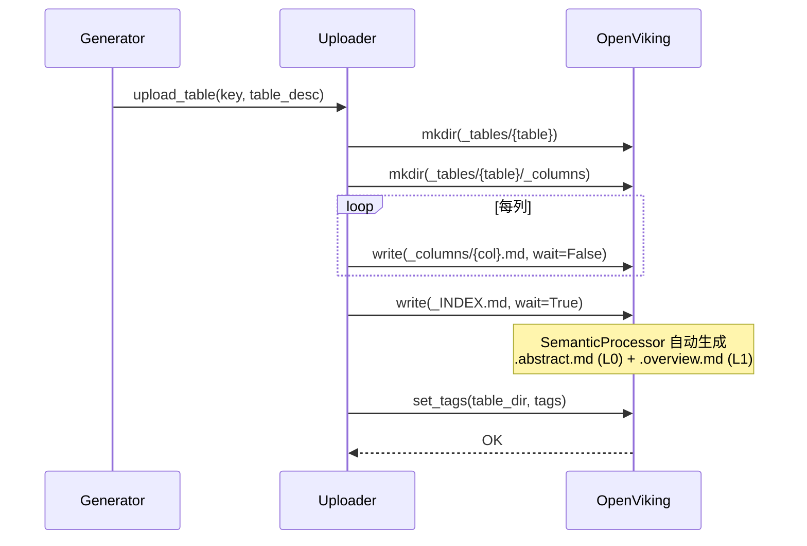
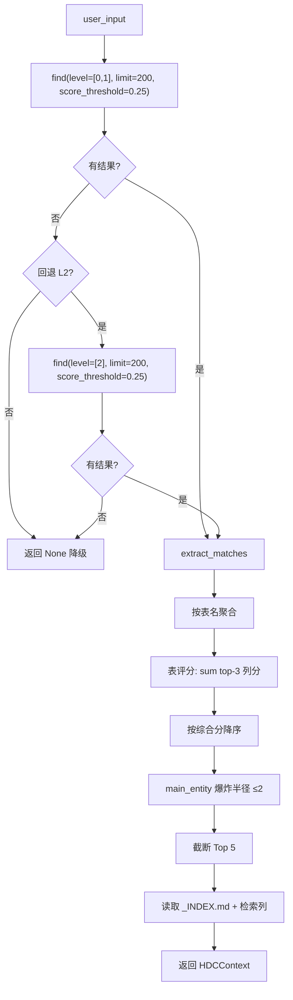

# 设计文档

## Overview

本特性通过四项改进提升 HDC 检索在大规模知识库下的鲁棒性：切换存储路径使 OpenViking SemanticProcessor 自动生成表级 L0/L1、优化检索参数（limit/score_threshold/level）、改进表评分算法（多列证据累积）、以及业务实体去重。所有改动在 DBAgent 侧完成，不改 OpenViking 源码。

**用户**：DBA 管理员（生成侧，路径迁移透明无感）和 Agent 最终用户（检索侧，表匹配准确率提升、相似表混淆减少）。

**影响**：`uploader.py` 的存储路径从 memory 切换到 resources，`retriever.py` 的检索参数和评分逻辑变更。旧格式知识库无需迁移，通过重新生成完成升级。

### Goals

- 表级 L0/L1 生成，使 level=[0,1] 表级语义检索可用
- 检索准确率在大规模知识库（400 表+）下不显著退化
- 低分噪音被过滤，多列匹配证据被累积，同实体表不挤占 Top 5

### Non-Goals

- 不启用 THINKING 模式（需 OpenViking 配置 RerankConfig）
- 不部署 Rerank 服务
- 不修改 collector/generator 的 LLM prompt
- 不提供旧格式知识库的自动就地迁移

## Boundary Commitments

### This Spec Owns

- HDC 知识库的存储根路径定义（`_HDC_ROOT`）
- 表目录与列目录的物理分离（`_columns/` 子目录）
- `find()` 调用的检索参数（limit、score_threshold、level）
- 候选表的评分聚合算法（top-3 列分求和）
- 候选表的业务实体去重逻辑（main_entity 爆炸半径 ≤2）
- 新旧格式知识库的检索兼容

### Out of Boundary

- OpenViking 的 SemanticProcessor 行为（触发由 resources 路径自动完成）
- OpenViking 的 RerankConfig 配置
- HDC 生成的 LLM prompt 内容
- 列描述的生成质量
- 评测框架的报告格式

### Allowed Dependencies

- OpenViking 的 resources 路径写管线（`_write_direct_with_refresh`）
- OpenViking 的 `find` API（已有）
- OpenViking 的 `fs/ls`、`fs/attrs`、`content/read` API（已有）
- `app/knowledge/openviking.py` 的 `OpenVikingClient`（已有）

### Revalidation Triggers

- `_HDC_ROOT` 路径再次变更
- `_columns_dir_uri` 或 `storage_key` 签名变更
- `retrieve()` 返回值 `HDCContext` 结构变更
- OpenViking 的 `find` API 参数语义变更
- SemanticProcessor 对 resources 路径处理逻辑变更

## Architecture

### Existing Architecture Analysis

当前 HDC 子系统的数据流：

```
Generator → Uploader → OpenViking (memory 路径)
                ↓
         Retriever ← OpenViking find API (level=[2])
                ↓
         build_context() → Agent
```

**当前约束**：
- 上传路径：`viking://user/hdc-system/memories/hdc`（memory），`semantic_status="skipped"`
- 目录结构：`_tables/{table}/` 下混合 `_INDEX.md` + 30 列 `.md` 文件
- 检索：`find(level=[2], limit=60)`，无 score_threshold，表评分 = max(单列分)
- 所有 URI 辅助函数集中在 `uploader.py`，`retriever.py` 通过 import 使用

**需要保持的集成点**：
- `generator.py` → `uploader.upload_table(key, table_desc)`：接口不变
- `updater.py` → `uploader.upload_table()` / `uploader.delete_table()`：接口不变
- `retriever.py` → `OpenVikingClient.find()`：参数扩展，兼容旧参数
- `build_context()` → `retriever.retrieve()`：返回值不变

### Architecture Pattern & Boundary Map

```
┌─────────────────────────────────────────────────────┐
│                    DBAgent                           │
│  ┌──────────┐    ┌──────────┐    ┌──────────────┐   │
│  │ Generator│───▶│ Uploader │───▶│  OpenViking   │   │
│  │  (不变)   │    │ (路径变更)│    │ resources路径 │   │
│  └──────────┘    └──────────┘    │ +SemanticProc │   │
│       │               │          └──────┬────────┘   │
│       │          ┌────┴────┐            │            │
│       └─────────▶│ Updater │            │ find()     │
│                  │ (不变)   │            │            │
│                  └─────────┘     ┌──────▼────────┐   │
│                                  │   Retriever    │   │
│                                  │ (参数+评分+去重)│   │
│                                  └──────┬────────┘   │
│                                         │            │
│                                  ┌──────▼────────┐   │
│                                  │ build_context │   │
│                                  │   (不变)       │   │
│                                  └───────────────┘   │
└─────────────────────────────────────────────────────┘
```

**架构决策**：
- 保持现有模块边界：uploader 负责写入，retriever 负责读取，generator/updater 不变
- 新增 `_columns_dir_uri()` 函数，对称于已有的 `_table_dir_uri()`
- 评分和去重逻辑内嵌在 `retrieve()` 管线中，不提取为独立类（避免过度抽象）

### Technology Stack

| 层 | 选择 / 版本 | 角色 | 备注 |
|---|-----------|------|------|
| 后端服务 | Python 3.12 | HDC 上传/检索逻辑 | 已有 |
| LLM 客户端 | openai SDK（已有） | 不变 | generator 使用 |
| 向量存储 | OpenViking（已有） | find API + SemanticProcessor | resources 路径 |
| HTTP 客户端 | httpx（已有） | OpenViking API 调用 | 已有 |

## File Structure Plan

### Modified Files

- `app/datavault/uploader.py` — 新增 `_columns_dir_uri()`、`_HDC_ROOT` 改为 resources 路径、`upload_table()` 增加 `_columns/` 子目录创建和列文件路径变更
- `app/datavault/retriever.py` — `retrieve()` 的 `find()` 调用参数变更（limit/score_threshold/level）、表评分从 max 改为 sum(top-3)、新增 main_entity 爆炸半径控制、`_retrieve_columns()` 的 target_uri 指向 `_columns/`、`_extract_table_name()` 适配 `_columns/` 路径、新增旧格式回退逻辑

### Unchanged Files

- `app/datavault/generator.py` — 接口不变
- `app/datavault/collector.py` — 接口不变
- `app/datavault/updater.py` — 接口不变，内部通过 `upload_table()` 自动使用新结构
- `app/datavault/models.py` — 数据模型不变
- `app/knowledge/openviking.py` — 已有 `find()` 支持 score_threshold/level 参数
- `app/agent/context.py` — `build_context()` 不变

## System Flows

### 上传流程（变更后）



### 检索流程（变更后）



**关键设计决策**：Stage 1 使用 `level=[0,1]` 获取表目录的 L0/L1 语义摘要匹配（不涉及列文件）。L0/L1 的匹配结果以表目录为粒度返回。表评分（top-3 列分求和）应用于 L0/L1 返回结果中同一张表可能出现的多个匹配项（abstract + overview），取其最高的 3 个分数求和。不涉及二次列级检索——列检索仅在 Top 5 确定后的 Stage 2 中执行。

## Requirements Traceability

| Req | 摘要 | 组件 | 接口 | 流程 |
|-----|------|------|------|------|
| 1.1 | 表列分离存储 | Uploader | `_columns_dir_uri()`, `upload_table()` | 上传流程 |
| 1.2 | 检索使用 level=[0,1] | Retriever | `retrieve()` find 调用 | 检索流程 |
| 1.3 | SemanticProcessor 失败不中断 | Uploader | `upload_table()` 异常处理 | 上传流程 |
| 1.4 | 列检索指向子目录 | Retriever | `_retrieve_columns()` target_uri | 检索流程 |
| 2.1 | limit ≥ 200 | Retriever | `retrieve()` find 调用 | 检索流程 |
| 2.2 | score_threshold = 0.25 | Retriever | `retrieve()` find 调用 | 检索流程 |
| 2.3 | 过滤后无结果静默降级 | Retriever | `retrieve()` 空结果处理 | 检索流程 |
| 3.1 | top-3 分数求和 | Retriever | `retrieve()` 评分聚合 | 检索流程 |
| 3.2 | 综合评分降序排列 | Retriever | `retrieve()` 排序逻辑 | 检索流程 |
| 4.1 | 同实体最多 2 表 | Retriever | `retrieve()` 实体去重 | 检索流程 |
| 4.2 | main_entity 为空回退 | Retriever | `retrieve()` 回退逻辑 | 检索流程 |
| 5.1 | 旧格式回退 L2 检索 | Retriever | `retrieve()` 降级分支 | 检索流程 |
| 5.2 | 重新生成完成升级 | — | 操作流程，非代码 | — |

## Components and Interfaces

### Uploader

#### `_columns_dir_uri`（新增）

| Field | Detail |
|-------|--------|
| Intent | 返回表目录下 `_columns/` 子目录的 URI |
| Requirements | 1.1, 1.4 |

**签名**：
```python
def _columns_dir_uri(key: str, table_name: str) -> str:
    """viking://resources/hdc/{schemaId}/{db}/_tables/{table}/_columns/"""
    return f"{_table_dir_uri(key, table_name)}/_columns"
```

#### `upload_table`（修改）

| Field | Detail |
|-------|--------|
| Intent | 上传单表 HDC 内容，列文件写入 `_columns/` 子目录 |
| Requirements | 1.1, 1.3 |

**变更点**：
- 新增 `mkdir(_columns/)` 调用
- 列文件 URI 从 `{table_dir}/{col}.md` 改为 `{columns_dir}/{col}.md`
- `_INDEX.md` 路径和 tags 设置不变

### Retriever

#### `retrieve`（修改）

| Field | Detail |
|-------|--------|
| Intent | 两阶段 HDC 检索，参数优化 + 评分改进 + 实体去重 |
| Requirements | 1.2, 2.1, 2.2, 2.3, 3.1, 3.2, 4.1, 4.2, 5.1 |

**变更点**：

1. **Stage 1 find() 参数变更**：
```python
result = await self._ov.find(
    query=user_input,
    target_uri=tables_uri,
    level=[0, 1],           # [2] → [0, 1]
    limit=200,              # 60 → 200
    score_threshold=0.25,   # None → 0.25
)
```

2. **旧格式回退**（L0/L1 无结果时）：
```python
if not matches:
    result = await self._ov.find(
        query=user_input,
        target_uri=tables_uri,
        level=[2],             # 回退到 L2
        limit=200,
        score_threshold=0.25,
    )
    matches = self._extract_matches(result)
```

3. **表评分从 max 改为 sum(top-3)**：L0/L1 返回表目录匹配项，同一张表可能有多个匹配（abstract + overview）。收集每表的所有分数，取最高的 3 个求和作为综合评分。

```python
table_scores: dict[str, list[float]] = {}
for match in matches:
    table_name = self._extract_table_name(match)
    if not table_name or table_name.startswith("_"):
        continue
    table_scores.setdefault(table_name, []).append(match.get("score", 0.0))

candidates = [(tn, sum(sorted(scores, reverse=True)[:3])) 
              for tn, scores in table_scores.items()]
candidates.sort(key=lambda x: x[1], reverse=True)
```

4. **main_entity 爆炸半径控制**：
```python
MAX_PER_ENTITY = 2
entity_counts: dict[str, int] = {}
diversified = []
for table_name, score in candidates:
    entity = await self._get_main_entity(key, table_name)
    count = entity_counts.get(entity, 0)
    if count < MAX_PER_ENTITY:
        entity_counts[entity] = count + 1
        diversified.append((table_name, score))
    if len(diversified) >= 5:
        break
```

5. **新增 `_get_main_entity` 辅助方法**：读取 `_INDEX.md` 首行，失败时回退到表名。

#### `_retrieve_columns`（修改）

| Field | Detail |
|-------|--------|
| Intent | 检索表的匹配列，target_uri 指向 `_columns/` 子目录 |
| Requirements | 1.4 |

**变更点**：`target_uri` 从 `_table_dir_uri(key, table_name)` 改为 `_columns_dir_uri(key, table_name)`。

#### `_extract_table_name`（修改）

| Field | Detail |
|-------|--------|
| Intent | 从 URI 提取表名，适配 `_columns/{col}.md` 路径 |
| Requirements | 1.4 |

**变更点**：新增 `_columns/` 路径识别——当 URI 包含 `/_columns/` 时，表名为 `_columns` 的父目录（即 `parts[-3]`）。

## Data Models

无新增或变更数据模型。`HDCContext`、`TableMatch`、`ColumnSummary`、`TableDescriptionWithColumns` 结构不变。

## Error Handling

| 错误类型 | 处理方式 |
|---------|---------|
| SemanticProcessor 生成 L0/L1 失败 | `write(wait=True)` 超时后返回警告状态，继续处理后续表 |
| find(level=[0,1]) 返回空 | 自动回退到 level=[2] 检索旧格式知识库 |
| score_threshold 过滤后无候选 | 返回 None，Agent 回退到 find_table 盲搜 |
| main_entity 解析失败 | 回退到 table_name 作为实体标识 |
| `_columns/` 子目录不存在（旧格式） | `_retrieve_columns()` 回退到 `_table_dir_uri()` |
| `_INDEX.md` 读取失败 | 返回空字符串，不中断检索流程 |

## Testing Strategy

### 单元测试

1. **`_columns_dir_uri` 路径生成**：验证生成的 URI 格式正确
2. **`_get_main_entity` 解析**：验证从 `_INDEX.md` 首行提取 main_entity，空内容回退
3. **表评分 sum(top-3)**：构造多 match 列表，验证综合分 = 最高三个分数之和
4. **main_entity 爆炸半径**：构造同实体 4 张表，验证最终 ≤2 张
5. **`_extract_table_name` `_columns/` 路径**：验证正确提取表名

### 集成测试

1. **resources 路径写入 + L0/L1 生成**：写入表后轮询 find(level=[0,1]) 直到返回
2. **旧格式回退**：对 memory 路径知识库检索，验证回退到 level=[2]
3. **列检索路径适配**：新格式下验证列信息正确返回
4. **限量表生成兼容**：验证仅指定表有 `_columns/` 子目录

### E2E 测试

1. **完整生成→检索链路**：生成 → L0/L1 验证 → 检索 → 正确表匹配
2. **增量更新兼容**：修改表结构 → 触发增量更新 → 检索仍正确
3. **大规模检索**：验证延迟和准确率不显著退化

## Migration Strategy

- **Phase 1**：部署新代码。已有 memory 路径知识库自动回退到 L2 检索，不影响服务。
- **Phase 2**：管理员触发重新生成，升级为新格式。
- **回滚**：新格式大面积失败时删除新格式目录，保留旧格式。