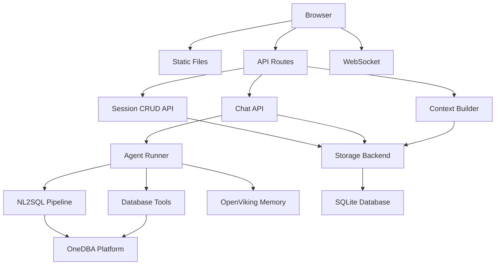
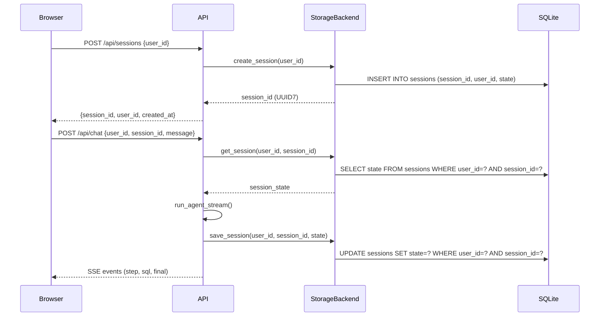

# 设计文档

## 概述
**目标**：为 NL2SQL 查询助手增加持久化会话存储、多用户隔离和会话生命周期管理能力，使系统能在服务重启后保留所有用户数据，并确保不同用户之间的数据完全隔离。

**用户**：DBA 团队及研发人员通过 Web 浏览器访问，使用简单身份标识（user_id）区分用户。

**影响**：将会话存储从进程内 dict 替换为基于 aiosqlite 的持久化存储；增加会话 CRUD API；前端增加用户身份输入和会话管理界面。NL2SQL 核心引擎和数据库发现能力保持不变。

### 目标
- 实现会话数据的持久化存储，服务重启后完整恢复
- 实现基于 user_id 的多用户隔离，用户之间数据不可互相访问
- 提供完整的会话 CRUD API（创建、列表、查看、删除）
- 在 Web 界面增加用户身份输入和会话管理功能
- 保持现有 NL2SQL 查询能力、SSE 流式响应、工具调用逻辑不变

### 非目标
- 完整用户认证系统（密码、SSO、OAuth）
- 高级数据可视化（图表、导出）
- 会话数据加密存储
- 分布式会话共享（多 worker 进程）
- SQL 性能优化与分析

## 边界承诺

### 本规格拥有
- 会话数据的持久化存储和生命周期管理
- 基于 user_id 的多用户命名空间隔离
- 会话 CRUD API 接口定义和实现
- 前端用户身份输入和会话管理 UI 组件
- 会话 ID 生成策略（服务端 UUID7）

### 范围外
- 用户密码认证和授权体系
- 会话数据加密
- 跨服务的分布式会话共享
- OneDBA 数据库权限管理（由 OneDBA 平台负责）
- OpenViking 长期记忆服务（仅消费，不修改其行为）

### 允许的依赖
- **aiosqlite**：异步 SQLite 驱动，用于会话持久化存储
- **uuid6**：UUID7 生成，用于服务端会话 ID 生成
- **OneDBA 平台**：数据库连接与 SQL 执行（已有依赖，不变）
- **OpenViking**：长期记忆存储（已有依赖，不变）
- **FastAPI**：Web 框架（已有依赖，不变）

### 重验证触发条件
- 会话数据模型（`DEFAULT_SESSION` 模板）的字段变更
- `StorageBackend` 协议接口的方法签名变更
- API 端点路径或请求/响应模型的变更
- `user_id` 在请求中的传递方式变更（从 ChatRequest body 迁移到 header 等）

## 架构

### 现有架构分析
当前系统采用分层架构：
- **API 层**（`app/api/`）：FastAPI 路由，处理 HTTP/WS 请求，SSE 流式响应
- **Agent 层**（`app/agent/`）：ReAct Agent 循环，上下文组装，系统提示词
- **NL2SQL 层**（`app/nl2sql/`）：SQL 生成、校验、修复、语义规则
- **工具层**（`app/tools/`）：6 个数据库交互工具
- **存储层**（`app/memory/`）：进程内 dict 会话存储
- **知识层**（`app/knowledge/`）：OpenViking 长期记忆客户端
- **观测层**（`app/observation/`）：Langfuse 追踪

本设计主要修改存储层和 API 层，保持 Agent 层和 NL2SQL 层不变。

### 架构模式与边界图



**架构集成**：
- **选择模式**：分层架构 + 策略模式（StorageBackend 抽象）
- **域/功能边界**：会话存储抽象为 `StorageBackend` 协议，API 层仅依赖协议接口
- **保留的现有模式**：SSE 流式响应、单例工厂模式、优雅降级错误处理
- **新组件理由**：
  - `StorageBackend` 协议：解耦存储实现，支持 memory/sqlite/redis 三种后端
  - `SqliteStore`：实现持久化存储，零基础设施开销
  - Session CRUD API：提供前端所需的会话管理能力

### 技术栈

| 层 | 选择 / 版本 | 在功能中的角色 | 备注 |
|------|-------------|-----------------|-------|
| 前端 | Vanilla JS + HTML + CSS | 用户身份输入、会话管理 UI | 已有，增量修改 |
| 后端 | FastAPI + Python 3.12 | API 路由、SSE 流式响应 | 已有 |
| 存储 | aiosqlite 0.20+ | 会话持久化存储 | 新增依赖 |
| ID 生成 | uuid6 2024+ | UUID7 服务端会话 ID | 新增依赖 |
| 运行时 | Docker + uvicorn | 单容器部署 | 已有 |

## 文件结构计划

### 目录结构
```
app/
├── memory/
│   ├── store.py              # StorageBackend 协议 + InMemoryStore + SqliteStore + 工厂函数
│   └── __init__.py           # (已有)
├── api/
│   ├── routes.py             # 新增 Session CRUD 端点；修改现有端点传递 user_id
│   ├── schemas.py            # 新增 Session CRUD 请求/响应模型
│   └── __init__.py           # (已有)
├── agent/
│   └── runner.py             # 微调：传递 user_id 给 LangfuseObserver
├── config.py                 # 新增 storage_backend 等配置项
├── main.py                   # 新增存储后端生命周期管理
└── static/
    ├── index.html            # 新增 user_id 输入框、会话列表侧边栏
    └── app.js                # 新增会话 CRUD API 调用、会话列表渲染
```

### 修改的文件
- `app/memory/store.py` — 重写：添加 `StorageBackend` 协议、`SqliteStore` 实现、按 `(user_id, session_id)` 复合键索引
- `app/api/schemas.py` — 新增：`SessionSummary`、`SessionListResponse`、`SessionCreateRequest`、`SessionCreateResponse`、`SessionDeleteResponse` 模型
- `app/api/routes.py` — 新增 4 个 Session CRUD 端点；修改现有端点传递 `user_id` 到 `get_session()`
- `app/config.py` — 新增：`storage_backend`、`redis_url`、`storage_file_path` 配置项
- `app/main.py` — 新增：存储后端初始化/关闭生命周期钩子
- `app/agent/runner.py` — 微调：传递 `user_id` 给 `LangfuseObserver`
- `app/static/index.html` — 新增：user_id 输入区、会话列表面板、新建会话按钮
- `app/static/app.js` — 新增：userId 绑定、`listSessions()`、`createSession()`、`deleteSession()`、会话列表 UI 渲染
- `requirements.txt` — 新增：`aiosqlite`、`uuid6`
- `docker-compose.yml` — 确认 `./data:/app/data` 卷挂载已存在，无需修改

## 系统流程

### 会话创建与查询流程



**关键决策**：`get_session()` 必须同时传入 `user_id` 和 `session_id`，确保用户 A 无法访问用户 B 的会话。如果只传 `session_id`，存储层返回 `None`（视为会话不存在）。

## 需求可追溯性

| 需求 | 摘要 | 组件 | 接口 | 流程 |
|------|------|------|------|------|
| 1.1 | 用户首次访问需提供 user_id | UserIdentityProvider (前端) | 前端 localStorage + ChatRequest.user_id | 用户输入 → 存储 → 每次请求携带 |
| 1.2 | 有效标识创建独立上下文 | SessionStore | create_session(user_id) | 会话创建流程 |
| 1.3 | 用户隔离，仅访问自己的数据 | SessionStore | get_session(user_id, session_id) | 所有 API 端点强制 user_id 过滤 |
| 1.4 | 无效标识拒绝访问 | ChatAPI | 400 Bad Request | 请求校验 |
| 2.1 | 创建新会话 | SessionAPI | POST /api/sessions | 会话创建流程 |
| 2.2 | 切换会话恢复上下文 | SessionStore | get_session(user_id, session_id) | 会话创建与查询流程 |
| 2.3 | 查看会话列表 | SessionAPI | GET /api/sessions?user_id= | 前端列表渲染 |
| 2.4 | 删除会话 | SessionAPI | DELETE /api/sessions/{id}?user_id= | 前端确认 → API → DB 删除 |
| 2.5 | 服务重启保留数据 | SqliteStore | SQLite 持久化 | 启动时从 DB 恢复 |
| 3.1-3.4 | 数据库发现 | 已有组件（tools 层） | 已有 API | 不变 |
| 4.1-4.6 | NL2SQL 查询 | 已有组件（NL2SQL 管道） | 已有 API | 不变 |
| 5.1-5.5 | 查询结果展示 | 已有组件（SSE + Markdown） | 已有 API | 不变 |
| 6.1 | 保留对话历史 | SessionStore + ContextBuilder | save_session() | 每次对话后保存 |
| 6.2 | 优先使用已确认的数据源 | ContextBuilder | build_context() | 从 session_state 恢复 |
| 6.3 | 对话记录持久化 | SqliteStore | SQLite 持久化 | 启动时恢复 |
| 6.4 | 对话过长自动摘要 | ContextBuilder | update_session_state() | 已有（chat_history max 20） |
| 7.1 | 聊天式交互界面 | 已有（index.html） | 已有 | 不变 |
| 7.2 | 实时流式展示处理进度 | 已有（SSE 解析） | 已有 | 不变 |
| 7.3 | 展示当前执行步骤 | 已有（step 事件） | 已有 | 不变 |
| 7.4 | 展示当前用户和会话标识 | Frontend UI | 新增 UI 元素 | 页面渲染 |
| 7.5 | 多用户同时访问互不干扰 | SessionStore | user_id 隔离 | 每次请求校验 |

## 组件与接口

### 组件摘要

| 组件 | 域/层 | 意图 | 需求覆盖 | 关键依赖 (P0/P1) | 合约 |
|------|------|------|----------|-------------------|------|
| StorageBackend | 存储层 | 会话存储抽象协议 | 1.2, 1.3, 2.1-2.5, 6.1, 6.3 | 无 | Service |
| InMemoryStore | 存储层 | 内存存储实现（开发/测试用） | 同上 | StorageBackend (P0) | Service |
| SqliteStore | 存储层 | SQLite 持久化存储实现 | 同上 | aiosqlite (P0), StorageBackend (P0) | Service |
| SessionAPI | API 层 | 会话 CRUD REST 端点 | 2.1-2.4 | SqliteStore (P0) | API |
| ChatAPI | API 层 | 聊天端点（修改传递 user_id） | 1.1, 1.3, 1.4 | SessionStore (P0), AgentRunner (P0) | API, WebSocket |
| UserIdentityProvider | UI 层 | 用户 ID 输入和持久化 | 1.1, 7.4 | 无 | State |
| SessionManager | UI 层 | 会话列表、创建、切换、删除 | 2.1-2.4, 7.4 | SessionAPI (P0) | State |
| ContextBuilder | Agent 层 | 从会话状态组装上下文 | 6.1, 6.2, 6.4 | SessionStore (P0) | Service |

### 存储层

#### StorageBackend（协议）

| 字段 | 详情 |
|------|------|
| 意图 | 定义会话存储的标准接口，支持多种后端实现 |
| 需求 | 1.2, 1.3, 2.1-2.5, 6.1, 6.3 |

**职责与约束**
- 定义会话 CRUD 的标准方法签名
- 所有方法必须接受 `user_id` 参数实现用户隔离
- 实现必须是异步的（async/await）

**依赖**
- 无外部依赖

**合约**：Service [x]

##### 服务接口
```python
from typing import Protocol, Optional

class StorageBackend(Protocol):
    """会话存储抽象协议"""

    async def get_session(self, user_id: str, session_id: str) -> Optional[dict]:
        """获取会话状态，不存在返回 None"""
        ...

    async def create_session(self, user_id: str, session_id: str, state: dict) -> None:
        """创建新会话，写入初始状态"""
        ...

    async def save_session(self, user_id: str, session_id: str, state: dict) -> None:
        """保存或更新会话状态"""
        ...

    async def delete_session(self, user_id: str, session_id: str) -> bool:
        """删除会话，返回是否成功"""
        ...

    async def list_sessions(self, user_id: str) -> list[dict]:
        """列出用户的所有会话摘要"""
        ...

    async def initialize(self) -> None:
        """初始化存储（创建表等），启动时调用一次"""
        ...

    async def close(self) -> None:
        """关闭存储连接，关闭时调用一次"""
        ...
```

#### SqliteStore

| 字段 | 详情 |
|------|------|
| 意图 | 基于 aiosqlite 的持久化会话存储实现 |
| 需求 | 1.2, 1.3, 2.1-2.5, 6.1, 6.3 |

**职责与约束**
- 将会话数据持久化到 SQLite 数据库文件
- 使用 WAL 模式支持并发读写
- 会话状态以 JSON 字符串存储在 TEXT 列
- 复合主键 `(user_id, session_id)` 确保隔离
- 数据库文件路径通过 `Settings.storage_file_path` 配置

**依赖**
- 入站：StorageBackend（P0）— 实现协议
- 外部：aiosqlite（P0）— 异步 SQLite 驱动

**合约**：Service [x]

##### 物理数据模型
```sql
CREATE TABLE IF NOT EXISTS sessions (
    user_id TEXT NOT NULL,
    session_id TEXT NOT NULL,
    state_json TEXT NOT NULL DEFAULT '{}',
    summary TEXT DEFAULT '',
    created_at TEXT NOT NULL DEFAULT (datetime('now')),
    last_active_at TEXT NOT NULL DEFAULT (datetime('now')),
    PRIMARY KEY (user_id, session_id)
);

CREATE INDEX IF NOT EXISTS idx_sessions_user_id ON sessions(user_id);
CREATE INDEX IF NOT EXISTS idx_sessions_last_active ON sessions(user_id, last_active_at DESC);
```

**实现说明**
- 集成：在 `app/main.py` 的 `lifespan` 中调用 `initialize()` 创建表和索引
- 校验：`save_session()` 将 state dict 序列化为 JSON 前验证其可序列化
- 风险：SQLite 单写者锁在极高并发下可能成为瓶颈，但对 10-50 用户场景足够

### API 层

#### SessionAPI — 会话 CRUD 端点

| 字段 | 详情 |
|------|------|
| 意图 | 提供 REST API 管理用户会话的生命周期 |
| 需求 | 2.1, 2.2, 2.3, 2.4 |

**合约**：API [x]

##### API 合约

| 方法 | 端点 | 请求 | 响应 | 错误 |
|------|------|------|------|------|
| POST | `/api/sessions` | `{"user_id": "alice"}` | `{"session_id": "uuid7", "user_id": "alice", "created_at": "..."}` | 400 (user_id 为空) |
| GET | `/api/sessions?user_id=alice` | 查询参数 | `{"sessions": [...], "total_count": N}` | 400 (user_id 缺失) |
| GET | `/api/sessions/{session_id}?user_id=alice` | 查询参数 | `SessionState` (已有模型) | 404 (会话不存在或不属于该用户) |
| DELETE | `/api/sessions/{session_id}?user_id=alice` | 查询参数 | `{"deleted": true, "session_id": "..."}` | 404 (会话不存在或不属于该用户) |

**实现说明**
- 集成：所有端点读取 `user_id` 查询参数，传递给 `get_store()` 返回的存储实例
- 校验：`user_id` 不能为空；`session_id` 不能为空
- 风险：`DELETE` 操作不可逆，需前端确认

#### ChatAPI — 聊天端点（修改）

| 字段 | 详情 |
|------|------|
| 意图 | 修改现有聊天端点以正确传递 user_id 到存储层 |
| 需求 | 1.3, 1.4 |

**合约**：API [x], WebSocket [x]

##### 修改内容
- `POST /api/chat`：`ChatRequest.user_id` 传递给 `get_session(user_id, session_id)`
- `POST /api/chat/sync`：同上
- `WS /api/ws/{session_id}`：`user_id` 查询参数传递给 `get_session(user_id, session_id)`
- `GET /api/sessions/{session_id}`：增加 `user_id` 查询参数，传递给 `get_session(user_id, session_id)`

### UI 层

#### UserIdentityProvider

| 字段 | 详情 |
|------|------|
| 意图 | 用户身份输入和持久化 |
| 需求 | 1.1, 7.4 |

**合约**：State [x]

##### 状态管理
- 状态模型：`userId: string`，存储在 `localStorage` 键 `"vkdbagent.userId"` 中
- 持久化与一致性：页面加载时从 `localStorage` 恢复；修改时同步写入
- 并发策略：单页面单用户，无并发问题

**实现说明**
- 集成：`userId` 作为必填字段包含在 `POST /api/chat` 请求体和所有会话 API 调用中
- 校验：前端校验 `userId` 非空，服务端再次校验
- 风险：`localStorage` 可被用户手动修改，不提供安全保证（符合简单身份标识的范围定义）

#### SessionManager

| 字段 | 详情 |
|------|------|
| 意图 | 会话列表展示、创建、切换、删除的 UI 组件 |
| 需求 | 2.1-2.4, 7.4 |

**合约**：State [x]

##### 状态管理
- 状态模型：`sessions: SessionSummary[]`, `currentSessionId: string`
- 持久化与一致性：会话列表从 API 获取；`currentSessionId` 存储在 `localStorage` 键 `"vkdbagent.sessionId"`
- 并发策略：切换会话时先保存当前会话状态，再加载目标会话

**实现说明**
- 集成：调用 `GET /api/sessions` 获取列表，`POST /api/sessions` 创建，`DELETE /api/sessions/{id}` 删除
- 校验：删除前弹出确认对话框
- 风险：频繁的会话切换可能导致多次 API 调用，需在 UI 中加入加载状态

## 数据模型

### 域模型
- **Session**：聚合根。包含 `user_id`（所属用户）、`session_id`（唯一标识）、`state`（会话状态快照）、`summary`（会话摘要）、`created_at`（创建时间）、`last_active_at`（最近活动时间）
- **SessionState**：值对象。包含 `chat_history`、`summary`、`selected_schema_id`、`selected_database`、`kb_session_id`、`kb_turn_count`、`user_id`

不变量：
- 一个 `(user_id, session_id)` 组合全局唯一
- 用户 A 不能访问用户 B 的会话
- `chat_history` 最大保留 20 条记录

### 逻辑数据模型
- **sessions 表**：主键 `(user_id, session_id)`，`state_json` 存储完整会话状态，索引 `idx_sessions_user_id` 和 `idx_sessions_last_active`
- 关系：每个 Session 属于一个 User；User 是简单字符串标识，无独立表

### 数据合约与集成
- **请求模型**：`SessionCreateRequest { user_id: str }`、`SessionListRequest { user_id: str }`（查询参数）
- **响应模型**：`SessionSummary { session_id, summary, created_at, last_active_at, message_count }`、`SessionListResponse { sessions: list[SessionSummary], total_count: int }`
- **序列化格式**：JSON

## 错误处理

### 错误策略
- 用户输入错误（4xx）：立即返回，附带明确提示
- 存储层错误（5xx）：返回通用错误信息，记录详细日志
- 存储层不可用：降级到 InMemoryStore（可选），提示用户数据不会持久化

### 错误类别与响应
- **用户错误**：`user_id` 为空 → 400 "用户标识不能为空"；会话不属于当前用户 → 404 "会话不存在"
- **系统错误**：SQLite 写入失败 → 500 "会话保存失败，请重试"；数据库文件损坏 → 500 "存储服务异常"
- **业务逻辑错误**：删除不存在的会话 → 404 "会话不存在"

## 测试策略

### 单元测试
- `SqliteStore` 的 `get_session`/`save_session`/`delete_session`/`list_sessions` 方法，使用内存 SQLite (`:memory:`)
- 多用户隔离验证：用户 A 无法通过 `get_session` 访问用户 B 的会话
- `list_sessions` 只返回指定用户的会话
- `save_session` 的 JSON 序列化异常处理

### 集成测试
- Session CRUD API 端点的完整生命周期：创建 → 列表 → 获取 → 删除 → 验证已删除
- 聊天流程端到端：创建会话 → 发送消息 → 验证会话状态已保存 → 重启服务 → 验证会话可恢复
- 多用户并发访问：两个不同 user_id 同时操作，验证互不干扰

### E2E 测试
- 用户输入 user_id → 创建新会话 → 执行 NL2SQL 查询 → 查看结果 → 切换会话 → 验证上下文独立
- 用户删除会话 → 验证会话从列表中消失 → 验证会话数据不可恢复

## 安全考量
- 会话 ID 使用 UUID7，不可预测且时间可排序
- `user_id` 不做加密或哈希处理，符合简单身份标识的范围定义
- 所有会话操作强制 `user_id` 过滤，防止跨用户数据泄露
- API 不返回其他用户的会话信息（`list_sessions` 按 `user_id` 过滤）

## 迁移策略
- 新增的 `SqliteStore` 不影响现有 `InMemoryStore` 行为
- 默认 `storage_backend` 设为 `"memory"` 保持向后兼容
- 用户手动将 `STORAGE_BACKEND=sqlite` 添加到 `.env` 后启用持久化
- 迁移无需数据迁移步骤（从无持久化到有持久化，首次启动创建新数据库）