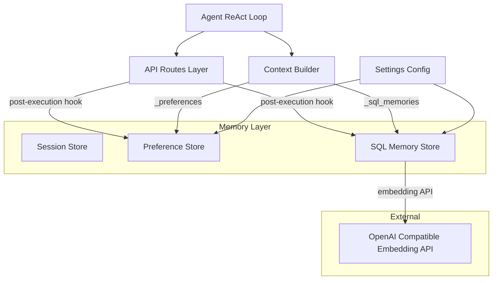
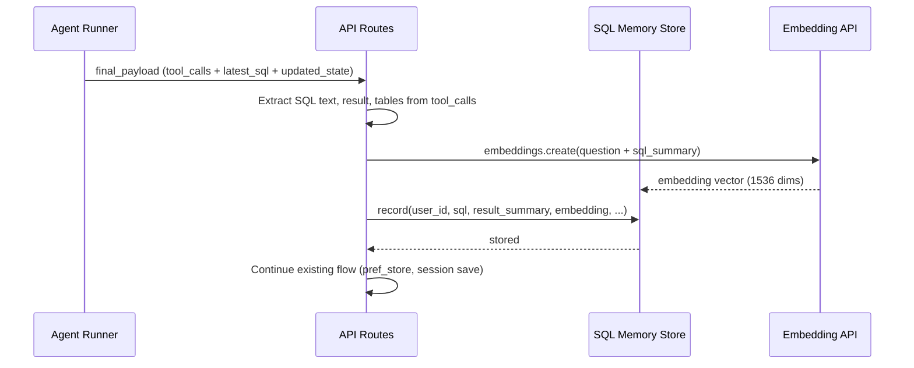
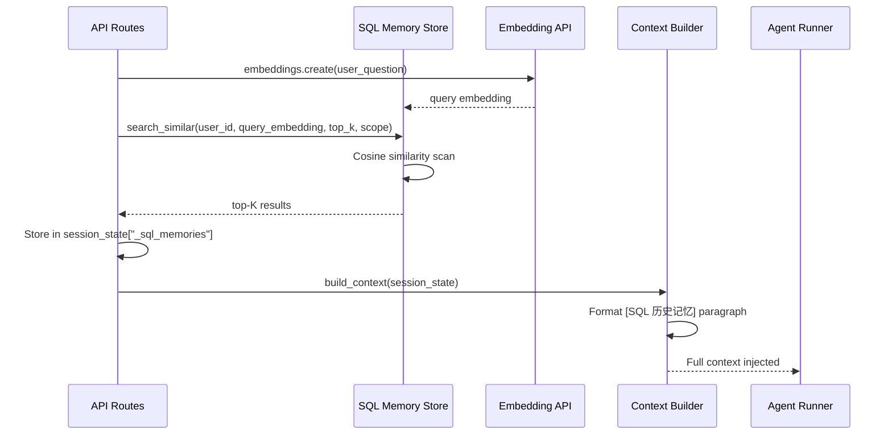

# Design Document

## Overview
**Purpose**: DBAgent Agent 当前每次 NL2SQL 查询为"冷启动"，不利用历史成功 SQL 经验。本设计为 Agent 新增 SQL 历史记忆能力，通过语义检索将相关历史 SQL 作为 few-shot 注入上下文，支持 per-user/per-database 混合作用域及离线模式挖掘。

**Users**: DBAgent 终端用户（通过 Agent 自动使用）+ DBAgent 管理员（通过配置和模式挖掘使用）。

**Impact**: 在现有 3 层记忆系统（OpenViking → 操作偏好 → HDC）基础上新增第 4 层 SQL 历史记忆。不影响现有记忆层，通过独立表与独立配置开关控制。

### Goals
- SQL + 执行结果的自动持久化
- 用户问题语义检索相关历史 SQL（top-K）
- 检索结果格式化为 `[SQL 历史记忆]` 段落注入 Agent 上下文
- Per-user / per-database 混合作用域
- 离线模式挖掘（高频表、高频条件、常见 JOIN）
- 复用现有对比评测框架验证收益

### Non-Goals
- 完整 SQL 执行结果存储（仅存摘要）
- 用户可见查询历史浏览 UI
- 跨服务分布式检索
- 修改 `agent-memory-store` 的 `query_preferences` 表
- 作为 Agent 工具暴露给 LLM 调用

## Boundary Commitments

### This Spec Owns
- `sql_memories` 数据表的 schema 定义和维护
- SQL 记录的写入、语义检索、过期清理全生命周期
- 嵌入向量生成（调用现有 OpenAI 兼容 embedding API）和相似度计算
- 上下文注入段落的格式化（第 8 段 `[SQL 历史记忆 — 相关查询]`）
- 模式挖掘查询逻辑
- 所有可配置参数（K、token 预算、TTL、阈值等）

### Out of Boundary
- OpenViking 的语义记忆存储（不做持久化代理）
- 操作偏好记忆的 `query_preferences` 表（不写入 `sql_patterns` 字段）
- HDC Data Vault 的 schema 知识
- OneDBA 平台的 SQL 执行和数据库连接
- 前端 UI 的任何渲染逻辑

### Allowed Dependencies
- `app/config.py` Settings — 配置读取
- `app/memory/manager.py` StorageManager — 生命周期注册
- `app/memory/__init__.py` — 公共 API 导出
- `app/api/routes.py` — post-execution hook 写入点
- `app/agent/context.py` build_context() — 上下文注入点
- `app/agent/runner.py` 中的 `AsyncOpenAI` 客户端 — embedding 调用
- `aiosqlite` — SQLite 异步驱动
- `openai` — embedding API 调用

### Revalidation Triggers
- `sql_memories` 表 schema 变更（加列、改索引）
- Protocol `SqlMemoryBackend` 接口签名变更
- Context 注入段落格式变更
- 配置项 `sql_memory_*` 新增或重命名
- StorageManager 初始化顺序变更

## Architecture

### Existing Architecture Analysis
当前 Agent 在 `app/api/routes.py` 的 `_execute_agent_stream()` 中，post-execution 阶段已有 `pref_store.record_query()` 调用（记录表名频次）。SQL 记忆模块在此相同位置新增 `sql_memory_store.record()`，利用已可用的 `tool_calls` 数据（含 SQL 文本、执行结果、问题描述）。上下文注入在 `build_context()` 中新增第 8 段，与 `_memories`（第 4 段）和 `_preferences`（第 6 段）并列。

### Architecture Pattern & Boundary Map



**Architecture Integration**:
- Selected pattern: 与现有 3 层记忆平行——每层有独立 Protocol + 双实现 + 工厂 + StorageManager 注册
- Domain boundaries: SQL 记忆层只负责 SQL 记录的 CRUD、检索、模式挖掘；上下文注入的触发由 API routes 层编排
- Existing patterns preserved: 所有现有记忆层不变；新增层为 opt-in（默认 disabled）
- Steering compliance: 遵循 Protocol 驱动可插拔后端（tech.md #3）、错误隔离（#6）、模块级延迟初始化单例（structure.md #4）

### Technology Stack

| Layer | Choice / Version | Role in Feature | Notes |
|-------|------------------|-----------------|-------|
| Backend | Python 3.12 + aiosqlite ≥0.20.0 | SQLite 异步存储 | 无需新增依赖 |
| Embedding | OpenAI `text-embedding-3-small` via AsyncOpenAI | 问题文本 → 向量 | 复用现有 client 实例 |
| Vector Ops | Pure Python math stdlib | 余弦相似度计算 | ≤1000 记录规模，毫秒级 |
| Config | Pydantic pydantic-settings | 参数管理 | 复用 Settings 类 |
| LLM Client | openai ≥1.0.0 | embedding API 调用 | 已存在 |

## File Structure Plan

### Directory Structure
```
app/memory/
├── __init__.py              # 修改：新增 SqlMemoryBackend 等导出
├── manager.py               # 修改：StorageManager 注册 sql_memory_store
├── store.py                 # 不变
├── preferences.py           # 不变
├── sql_memory.py            # 新增：Protocol + 双实现 + 工厂
app/
├── config.py                # 修改：新增 sql_memory_* 配置项
├── agent/
│   └── context.py           # 修改：新增 _sql_memories 段落注入
└── api/
    └── routes.py            # 修改：新增 post-execution 记录钩子
tests/
├── test_sql_memory_store.py # 新增：Layer 1 单元测试
├── test_sql_memory_context.py # 新增：Layer 3 上下文注入测试
└── evaluation/
    ├── cli.py               # 修改：新增 --compare-sql-memory
    └── reporter.py          # 修改：新增对比报告格式（可选）
```

### Modified Files
- `app/memory/__init__.py` — 新增 `SqlMemoryBackend`、`InMemorySqlMemoryStore`、`SqliteSqlMemoryStore`、`get_sql_memory_store` 导出
- `app/memory/manager.py` — `StorageManager` 新增 `sql_memory_store` 属性，`initialize()`/`close()` 管理其生命周期
- `app/config.py` — 新增 `sql_memory_enabled`、`sql_memory_top_k`、`sql_memory_token_budget`、`sql_memory_ttl_days` 等配置项
- `app/agent/context.py` — `build_context()` 新增 `_sql_memories` 键读取，格式化第 8 段
- `app/api/routes.py` — `_execute_agent_stream()` post-execution 新增 SQL 记录写入钩子
- `tests/evaluation/cli.py` — 新增 `--compare-sql-memory` 模式及参数

## System Flows

### Recording Flow (Post-Execution)



### Retrieval & Injection Flow (Pre-Agent)



## Requirements Traceability

| Requirement | Summary | Components | Interfaces | Flows |
|-------------|---------|------------|------------|-------|
| 1.1-1.5 | SQL 执行自动记录 | SqlMemoryStore.record() | Service: record() | Recording Flow |
| 2.1-2.5 | 语义检索 | SqlMemoryStore.search_similar() | Service: search_similar() | Retrieval Flow |
| 3.1-3.5 | Few-shot 上下文注入 | ContextBuilder._inject_sql_memories() | Service: format_memory_context() | Injection Flow |
| 4.1-4.5 | 混合作用域 | SqlMemoryStore (scope filtering) | Service: search_similar(scope=) | Retrieval Flow |
| 5.1-5.4 | 模式挖掘 | SqlMemoryStore.mine_patterns() | Service: mine_patterns() | — (batch query) |
| 6.1-6.5 | 配置与控制 | Settings.sql_memory_* | Config | — |
| 7.1-7.4 | 可量化评估 | Evaluation CLI --compare-sql-memory | CLI | Compare Flow |

## Components and Interfaces

| Component | Domain/Layer | Intent | Req Coverage | Key Dependencies | Contracts |
|-----------|--------------|--------|--------------|------------------|-----------|
| SqlMemoryBackend | Memory/Persistence | Protocol defining SQL memory CRUD + search | 1, 2, 4, 5 | None (Protocol) | Service |
| InMemorySqlMemoryStore | Memory/Persistence | Dict-based implementation for dev/test | 1, 2, 4, 5 | None | Service |
| SqliteSqlMemoryStore | Memory/Persistence | aiosqlite implementation for production | 1, 2, 4, 5 | aiosqlite (P0) | Service |
| SqlMemoryRecorder | Integration/Routes | Post-execution recording hook | 1 | SqlMemoryStore (P0), tool_calls (P0) | Service |
| SqlMemoryRetriever | Integration/Context | Pre-agent retrieval + context formatting | 2, 3 | SqlMemoryStore (P0), OpenAI embed (P1) | Service |
| PatternMiner | Analytics | Offline pattern aggregation queries | 5 | SqliteSqlMemoryStore (P1) | Batch |

### Memory Layer

#### SqlMemoryBackend (Protocol)

| Field | Detail |
|-------|--------|
| Intent | 定义 SQL 记忆存储的标准接口，与 PreferenceBackend 同级 |
| Requirements | 1, 2, 4, 5 |

**Responsibilities & Constraints**
- 定义所有 SQL 记忆操作的契约
- `@runtime_checkable` 支持 isinstance 检查
- 所有方法为 async

**Dependencies**
- Inbound: StorageManager — 生命周期管理 (P0)
- Outbound: None
- External: None

**Contracts**: Service [x]

##### Service Interface
```python
@runtime_checkable
class SqlMemoryBackend(Protocol):
    async def record(
        self, user_id: str, question: str, sql: str,
        table_names: list[str], database_name: str,
        schema_id: int, execution_result: dict,
        embedding: list[float] | None
    ) -> None: ...

    async def search_similar(
        self, user_id: str, query_embedding: list[float],
        database_name: str = "", scope: str = "user",
        limit: int = 5, min_similarity: float = 0.0
    ) -> list[dict]: ...

    async def list_by_user(
        self, user_id: str, limit: int = 50
    ) -> list[dict]: ...

    async def delete_expired(self, ttl_days: int) -> int: ...

    async def mine_patterns(
        self, database_name: str, min_records: int = 20
    ) -> dict: ...

    async def initialize(self) -> None: ...
    async def close(self) -> None: ...
```
- Preconditions: `record()` 调用前 store 已 initialised；`search_similar()` 的 `query_embedding` 长度与已存储向量一致
- Postconditions: `record()` 写入后立即可检索；`search_similar()` 返回按 similarity 降序排列；`delete_expired()` 返回删除数
- Invariants: 每条记录有唯一 id（UUID7）；`user_id` 不可为空

#### InMemorySqlMemoryStore

| Field | Detail |
|-------|--------|
| Intent | 基于 dict 的内存实现，用于开发环境和单元测试 |
| Requirements | 1, 2, 4, 5 |

**Responsibilities & Constraints**
- 数据存储在 `dict[str, list[dict]]`，key 为 user_id
- `threading.Lock` 做防御性并发保护
- 默认每用户最多 100 条记录，LRU 淘汰
- 注入 `time.time` 依赖以便测试（通过构造函数可选参数）

**Dependencies**
- Inbound: StorageManager (P0)
- Outbound: None
- External: None

##### Service Interface
Implement `SqlMemoryBackend` Protocol.

**Implementation Notes**
- Integration: 在 `storage_backend=memory` 模式或无 SQLite 文件时使用
- Validation: `record()` 验证 `user_id` 非空字符串
- Risks: 进程重启数据丢失（by design for dev/test）

#### SqliteSqlMemoryStore

| Field | Detail |
|-------|--------|
| Intent | 基于 aiosqlite 的持久化实现，用于生产环境 |
| Requirements | 1, 2, 4, 5 |

**Responsibilities & Constraints**
- 与 sessions/preferences 共享同一 SQLite 文件，独立表 `sql_memories`
- WAL 模式，aiosqlite.Row 行工厂
- 嵌入向量存储为 JSON 文本列
- 余弦相似度在 Python 中计算（≤1000 记录）
- TTL 过期记录在写入和定期清理时删除

**Dependencies**
- Inbound: StorageManager (P0)
- Outbound: aiosqlite connection (P0)
- External: OpenAI embedding API — embedding 生成 (P1)

**Contracts**: Service [x] / State [x]

##### Service Interface
Implement `SqlMemoryBackend` Protocol.

##### State Management
- State model: 每条 `SqlMemoryRecord` 持久化在 `sql_memories` 表
- Persistence & consistency: aiosqlite WAL 模式，`record()` 使用事务包裹
- Concurrency strategy: aiosqlite 内部连接池，单连接访问使用 `asyncio.Lock`

**Implementation Notes**
- Integration: 通过 `get_sql_memory_store()` 工厂，基于 `storage_backend` 配置选择实现
- Validation: `search_similar()` 验证 embedding 维度匹配；`embedding_json IS NOT NULL` 过滤未补嵌入记录
- Risks: JSON 向量列在 >5000 条时性能退化，需监控搜索延迟

### Integration Layer

#### SqlMemoryRecorder (in routes.py)

| Field | Detail |
|-------|--------|
| Intent | Post-execution hook: 从 final_payload 提取 SQL 数据并写入 SqlMemoryStore |
| Requirements | 1.1, 1.2, 1.3, 1.4, 1.5 |

**Responsibilities & Constraints**
- 在 `_execute_agent_stream()` 中，现有 `pref_store.record_query()` 调用之后执行
- 从 `final_payload["tool_calls"]` 中提取 SQL 文本、表名、执行结果
- 从 `initial_state["user_input"]` 提取原始问题
- 调用 embedding API 生成问题文本的向量（异步，失败时静默降级）
- 包装在 try/except 中，失败不阻断 Agent 主流程

**Dependencies**
- Inbound: Agent runner final_payload (P0)
- Outbound: SqlMemoryStore.record() (P0), OpenAI embedding API (P1)
- External: None

**Contracts**: Service [x]

##### Service Interface
```python
async def _record_sql_memory(
    user_id: str,
    initial_state: dict,
    final_payload: dict,
    sql_memory_store: SqlMemoryBackend,
) -> None:
    """Record SQL memory from agent execution result."""
```

##### Event Contract
- Published events: None (synchronous write)
- Subscribed events: None

**Implementation Notes**
- Integration: 嵌入在 `_execute_agent_stream()` 函数内，不抽取为独立模块
- Validation: 跳过空 tool_calls、无 SQL 文本的记录；去重检查（同一会话内相同 SQL 不重复记录）
- Risks: embedding API 调用增加 post-execution 延迟；静默降级兜底

#### SqlMemoryRetriever (in routes.py + context.py)

| Field | Detail |
|-------|--------|
| Intent | Pre-agent: 检索相关 SQL 记忆并注入到 session_state |
| Requirements | 2.1-2.5, 3.1-3.5 |

**Responsibilities & Constraints**
- 在 `_execute_agent_stream()` 中，上下文构建之前执行
- 调用 embedding API 将 `user_input` 转为查询向量
- 调用 `SqlMemoryStore.search_similar()` 检索 top-K
- 将结果写入 `session_state["_sql_memories"]`
- `build_context()` 读取 `_sql_memories` 并格式化为第 8 段

**Dependencies**
- Inbound: user_input (P0), session_state (P0)
- Outbound: SqlMemoryStore.search_similar() (P0), OpenAI embedding API (P1)
- External: None

**Contracts**: Service [x]

##### Service Interface
```python
# In routes.py
async def _retrieve_sql_memories(
    user_input: str,
    user_id: str,
    selected_database: dict,
    sql_memory_store: SqlMemoryBackend,
) -> list[dict]:
    """Retrieve relevant SQL memories for current question."""

# In context.py
def _format_sql_memories(
    memories: list[dict],
    token_budget: int = 1500,
) -> str:
    """Format SQL memories as context paragraph, respecting token budget."""
```

**Implementation Notes**
- Integration: 检索在 routes.py 中触发，格式化在 context.py 中执行
- Validation: embedding 失败 → 返回空列表；检索结果为空 → 不注入段落；token 预算超限 → 截断
- Risks: embedding API 增加首 token 延迟；需监控 `_retrieve_sql_memories` 耗时

#### PatternMiner

| Field | Detail |
|-------|--------|
| Intent | 离线分析：从 SQL 历史中挖掘查询模式 |
| Requirements | 5.1, 5.2, 5.3, 5.4 |

**Responsibilities & Constraints**
- 提取表名、WHERE 条件子句、JOIN 关系
- WHERE 条件归一化（将具体值替换为占位符）后统计频率
- JOIN 关系提取为表对 + 出现次数
- 结果以结构化字典返回，供语义规则系统消费

**Dependencies**
- Inbound: Admin invocation (P1)
- Outbound: SqliteSqlMemoryStore (P1)
- External: None

**Contracts**: Batch [x] / State [x]

##### Batch / Job Contract
- Trigger: 管理接口调用或定期任务
- Input / validation: `database_name`（必填），`min_records`（默认 20）
- Output / destination: 结构化 dict → 调用方可注入到语义规则
- Idempotency & recovery: 纯读操作，天然幂等

##### Service Interface
```python
async def mine_patterns(
    self, database_name: str, min_records: int = 20
) -> dict:
    """
    Returns:
    {
        "total_records": int,
        "top_tables": [{"table": str, "count": int}, ...],
        "top_condition_patterns": [{"pattern": str, "count": int}, ...],
        "common_joins": [{"tables": [str, str], "count": int}, ...]
    }
    """
```

## Data Models

### Domain Model

核心聚合根：`SqlMemoryRecord` — 单次 SQL 执行的完整记录。

**Entities**: SqlMemoryRecord（数据库层实体，无次级实体）

**Value Objects**:
- `ExecutionResult`: 行数 + 列名列表 + 数据预览（前 3 行）
- `Embedding`: 浮点数列表（1536 维）

**Business Rules**:
- 同一会话内相同 SQL 不重复记录（去重）
- 单条 SQL 文本超过 2000 字符时截断
- TTL 过期记录自动清理（默认 90 天）
- 每用户记录数有软上限（默认 1000），超出时 LRU 淘汰

### Logical Data Model

**Entity: SqlMemoryRecord**

| Attribute | Type | Description | Constraints |
|-----------|------|-------------|-------------|
| id | TEXT | UUID7 主键 | NOT NULL, UNIQUE |
| user_id | TEXT | 用户标识 | NOT NULL, INDEXED |
| question | TEXT | 原始用户问题 | NOT NULL |
| sql_text | TEXT | 执行的 SQL 语句 | NOT NULL |
| sql_truncated | TEXT | SQL 截断版（≤500 字符） | NULLABLE |
| table_names | TEXT | JSON 数组，涉及的表名 | NOT NULL, DEFAULT '[]' |
| database_name | TEXT | 数据库名称 | NOT NULL, INDEXED |
| schema_id | INTEGER | schema 标识 | NOT NULL |
| row_count | INTEGER | 结果行数 | NULLABLE |
| column_names | TEXT | JSON 数组，结果列名 | NULLABLE, DEFAULT '[]' |
| data_preview | TEXT | JSON 数组，前 3 行数据 | NULLABLE, DEFAULT '[]' |
| execution_status | TEXT | "success" / "empty" / "error" | NOT NULL, DEFAULT 'success' |
| embedding_json | TEXT | JSON 数组，1536 维向量 | NULLABLE (supports async backfill) |
| scope | TEXT | "user" / "database" | NOT NULL, DEFAULT 'user' |
| created_at | TEXT | ISO 8601 时间戳 | NOT NULL, DEFAULT (datetime('now')) |

**Indexes**:
- `idx_sql_mem_user_db` ON (user_id, database_name) — 用户+数据库查询
- `idx_sql_mem_db` ON (database_name) — 跨用户数据库查询
- `idx_sql_mem_created` ON (created_at) — TTL 过期清理
- `idx_sql_mem_embedding` ON (embedding_json IS NOT NULL) — 仅扫描已生成嵌入的记录

### Data Contracts & Integration

**API Data Transfer** (注入上下文格式):
```
[SQL 历史记忆 — 相关查询]

以下是你或同事在此数据库上成功执行过的类似查询，可作为参考：

1. **问题**: 有多少已支付的订单？
   **SQL**: SELECT COUNT(*) FROM `order` WHERE status = 'paid'
   **结果**: 1,234 行，列: [COUNT(*)]

2. **问题**: 查询某用户的所有订单
   **SQL**: SELECT * FROM `order` WHERE user_id = 12345
   **结果**: 56 行，列: [id, user_id, status, amount, created_at]
```

**Cross-Service Data Management**: 无。SQL 记忆仅在同一进程中访问，不跨服务共享。

## Error Handling

### Error Strategy
SQL 记忆模块遵循现有的"错误隔离"模式：所有操作用 try/except 包裹，失败时静默降级，不阻断 Agent 主流程。

### Error Categories and Responses
**Embedding API 不可用**: WARN 日志 → embedding_json 留 NULL → 该记录在补嵌入前排除在语义检索外 → search_similar() 返回空列表
**SQLite 写入失败**: ERROR 日志 → 跳过本次记录 → Agent 流程继续
**检索超时（>500ms）**: WARN 日志 → 返回空列表 → 不注入 SQL 记忆段落
**余弦相似度维度不匹配**: ERROR 日志 → 跳过该条记录 → 标记为 embedding 需重建
**Token 预算超限**: 截断至预算上限，优先保留高相似度记录 → INFO 日志记录截断条数

### Monitoring
- 记录成功率指标：embedding 生成成功率、记录写入成功率、检索成功率
- 记录延迟指标：embedding API 调用延迟、检索延迟（P50/P99）
- Langfuse 可观测性集成（复用现有 trace 体系）

## Testing Strategy

### Unit Tests (Layer 1)
测试文件和核心用例覆盖：

`tests/test_sql_memory_store.py`:
1. **记录写入基本流程** (1.1): `InMemorySqlMemoryStore` 和 `SqliteSqlMemoryStore(":memory:")` 的 record/检索循环
2. **作用域隔离** (4.1-4.3): user_a 写入 3 条 + user_b 写入 2 条 → user_a 只能看到自己的；per-database 模式共享可见
3. **去重** (1.3): 同一会话相同 SQL 重复写入被跳过
4. **语义检索排序** (2.1): 给定 10 条预存记录 + 已知查询 → 返回相似度降序且 top-K 正确
5. **TTL 过期清理** (6.4): 插入过期记录 → delete_expired() 只删除过期项

### Integration Tests (Layer 2 & 3)

`tests/test_sql_memory_context.py`:
1. **上下文注入格式** (3.1): `_format_sql_memories()` 输出符合预期 Markdown 格式
2. **空结果不注入** (3.4): `_sql_memories` 为 `[]` 或 None 时不产生额外段落
3. **Token 预算截断** (3.3): 5 条记录总长 3000 字符 + budget=1500 → 截断后 ≤1500
4. **与现有段落共存** (3.2): build_context() 在 7 段基础上正确插入第 8 段

### E2E Tests (Layer 4)

`tests/evaluation/cli.py --compare-sql-memory`:

**核心设计原则：使用"孪生测例"填充记忆，用原始 TC 验证检索泛化能力**——避免循环论证（用同一道题构建记忆又测自己）。

#### 孪生测例设计 (`tests/docs/sql_memory_twin_cases.md`)

基于现有 28 个 TC（TC-001 ~ TC-030，跳过 TC-023/TC-026 因已去重），为每个 TC 构造一个**语义相近但问题不同**的孪生测例，用作记忆库填充数据。孪生测例遵循以下变换规则：

| 变换类型 | 原 TC 示例 | 孪生测例示例 | 适用场景 |
|----------|-----------|-------------|----------|
| **值替换** | `order_type='dataChange'` | `order_type='dataExport'` | 单表过滤 |
| **条件反转** | `is_finished=1` | `is_finished=0`（未完成的工单） | 布尔条件 |
| **聚合函数替换** | `COUNT(*)` | `COUNT(DISTINCT xxx)` | 聚合 |
| **时间窗口平移** | `按月统计 2024 年` | `按季度统计 2024 年` | 时间窗口 |
| **排序方向反转** | `ORDER BY ... DESC` | `ORDER BY ... ASC` | 排名 |
| **同义词替换** | `查询各类型工单数量` | `统计每种工单类型分别有多少` | 描述 |
| **表别名替换** | `order_record` | 同一张表，但问题强调不同字段 | JOIN |

**孪生测例格式**（与原始 TC 一致，但不需要评判要点）：

```markdown
### TWIN-001 单表过滤 - 数据导出类工单

**自然语言问题：**
工单系统：查询 order_type='dataExport' 的工单，返回工单ID、提交人、状态和创建时间，按创建时间升序。

**参考答案 SQL：**
SELECT id, committer_name, status_desc, create_time
FROM order_record
WHERE order_type = 'dataExport'
ORDER BY create_time ASC;

**预期结果：**
- 与 TC-001 查询模式相同，但枚举值不同
- 对应 TC-001（孪生关系）
```

#### 对比评测流程

```
Phase 1: Baseline (无记忆)
  ├── 跑 28 个原始 TC → 记录 SQL Judge 分数 + 效率指标
  └── 输出: baseline_report.json

Phase 2: 填充记忆库
  ├── 用 28 个孪生测例作为 Agent 输入，执行 query_database
  ├── 每个孪生测例的成功 SQL 自动写入 sql_memories 表
  └── 验证: 28 条记录全部写入，embedding 已生成

Phase 3: Memory (有记忆)
  ├── 跑 28 个原始 TC（与 Phase 1 完全相同）
  ├── Agent 自动从记忆库检索相关孪生 SQL
  └── 输出: memory_report.json

Phase 4: Diff 对比
  ├── 生成 sql_memory_comparison_{timestamp}.json/.md
  ├── 标注每个 TC 的 Recall Hit/Miss
  └── 输出 Memory Impact 指标
```

#### Memory Impact 指标

| 指标 | 数据来源 | 预期方向 |
|------|----------|---------|
| SQL Judge 分数变化 | Phase 1 vs Phase 3 的 SQL Judge 得分 | ↑ 提升 |
| find_table 调用次数 | ToolCallRecord 统计 | ↓ 减少 |
| 总 token 消耗 | LLMCallRecord 统计 | ↓ 减少 |
| 首轮 SQL 正确率 | 第一轮就生成正确 SQL 的比例 | ↑ 提升 |
| Recall Hit Rate | 检索到的孪生 SQL 与当前 TC 相关 | → 目标 >80% |
| 响应延迟 | Agent 总耗时 | ← 基本持平或略增 |

#### 孪生测例质量验证

在 Phase 2 之前，先验证孪生测例的质量：
1. **语义距离检查**：计算原始 TC 问题与孪生测例问题的 embedding 余弦相似度，确认在 0.7-0.95 之间（太近 = 循环论证，太远 = 检索不到）
2. **SQL 结构等价性**：确认孪生测例的 SQL 与原始 TC 的 SQL 在结构上高度相似（表名相同、JOIN 模式相同、聚合模式相同），但具体值不同
3. **可执行性**：每个孪生测例的 SQL 在 OneDBA 上能成功执行并返回非空结果

### Performance Tests
- 1000 条记录规模下 `search_similar()` 延迟 <50ms
- embedding API 调用 p99 <200ms
- 检索 + 上下文格式化总耗时 <500ms（首 token 延迟预算）

## Security Considerations
- SQL 记忆中的 SQL 文本在注入前过滤：排除 INSERT/UPDATE/DELETE/DDL 语句（即使历史记录中可能因某种原因存在）
- 作用域过滤通过 SQL WHERE 子句实现，防止跨用户数据泄漏
- 执行结果的数据预览仅保留前 3 行，避免敏感数据长期存储

## Performance & Scalability
- 目标指标：检索延迟（含 embedding API + 余弦相似度）在 1000 条记录内 <500ms
- 扩展路径：记录数超过 5000 时迁移至 `sqlite-vec`；记录数超过 50000 时考虑独立向量数据库
- TTL 自动过期 + LRU 淘汰控制存储增长

## Migration Strategy
本功能为新增模块，无数据迁移需求。部署步骤：
1. 配置 `sql_memory_enabled=false` 部署代码（schema 自动创建但不活跃）
2. 验证 `sql_memories` 表已由 `SqliteSqlMemoryStore.initialize()` 自动创建
3. 配置 `sql_memory_enabled=true` 启用 SQL 记录
4. 观察写入成功率和检索延迟指标
5. 确认 embedding API endpoint 可用性后再开启语义检索
