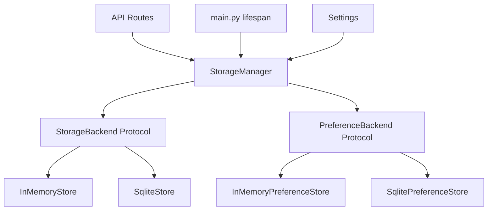
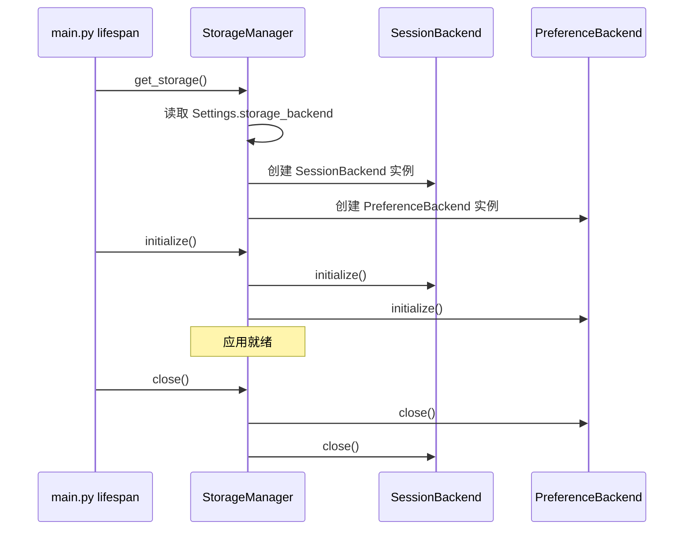
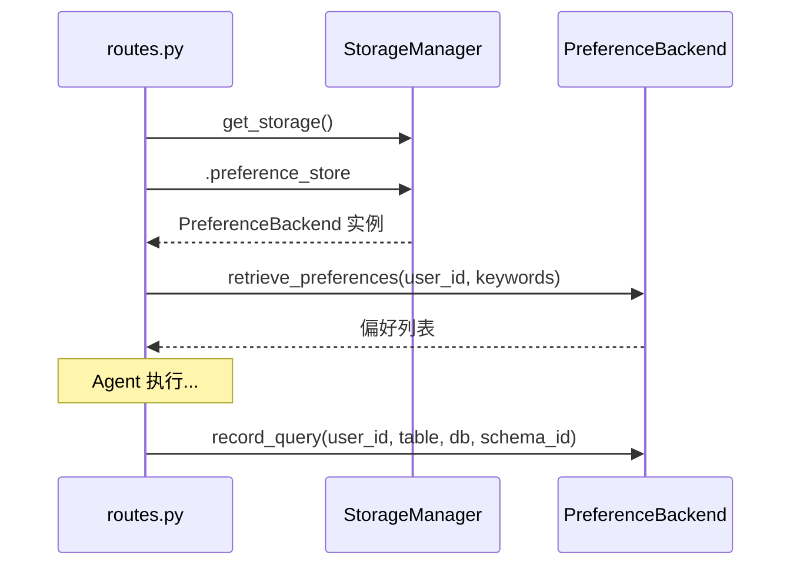

# 设计文档: 存储抽象层

## Overview
**目的**: 为 DBAgent 引入统一的存储抽象层，使会话存储与偏好存储共享相同的抽象模式（Protocol → 多实现 → 工厂 → 生命周期），消除 Agent 核心逻辑与具体存储实现之间的耦合，为后续切换至高并发数据库铺平道路。

**用户**: 后端开发者（通过统一接口访问存储）和运维人员（通过配置切换存储后端）。

**影响**: 将当前两套独立的存储生命周期（`get_store()` + `get_preference_store()`）合并为单一入口 `StorageManager`，偏好存储从硬编码 SQLite 实现改为 Protocol 驱动的可插拔模式。

### Goals
- 会话存储与偏好存储通过统一入口访问，调用方无需区分导入来源
- 偏好存储补齐 Protocol 抽象，支持内存/SQLite 无感知切换
- 存储生命周期（init/close）合并为单一入口，消除双连接管理
- 现有数据文件格式和测试注入模式完全兼容

### Non-Goals
- 不实现 PostgreSQL/MySQL/Redis 等新后端
- 不提供跨后端数据迁移工具
- 不修改 OpenViking、Langfuse 等外部 HTTP 集成
- 不引入 ORM 框架或连接池

## Boundary Commitments

### This Spec Owns
- `StorageManager` 类：统一存储生命周期管理和后端访问入口
- `PreferenceBackend` Protocol：偏好存储的抽象契约
- `InMemoryPreferenceStore`：偏好的内存实现
- `SqlitePreferenceStore`：偏好的 SQLite 实现（从现有 `QueryPreferenceStore` 重构）
- 工厂函数 `get_storage()`：根据配置返回 `StorageManager` 实例
- 旧的 `get_store()` 和 `get_preference_store()` 的兼容包装

### Out of Boundary
- SQLite 连接的内部管理（连接池、WAL 配置）
- 新存储后端（PostgreSQL、MySQL、Redis）的实现
- 数据迁移工具或脚本
- OpenViking 长期记忆集成（`app/memory/viking.py`）
- 前端 UI 变更

### Allowed Dependencies
- `app/config.py`：读取 `storage_backend`、`storage_file_path`、`preference_enabled` 配置
- `aiosqlite`：SQLite 后端的异步驱动（现有依赖，不升级）
- `app/agent/runner.py`、`app/agent/context.py`：不变，仍通过 `routes.py` 间接使用存储
- `app/api/routes.py`：调用方，从 `app.memory` 导入 `get_storage`

### Revalidation Triggers
- `StorageManager` 的公开方法签名变更
- `PreferenceBackend` Protocol 方法签名变更
- `get_storage()` 返回值类型变更
- 配置项 `storage_backend` 的可选值变更
- `app/memory/__init__.py` 的 `__all__` 导出列表变更

## Architecture

### Existing Architecture Analysis
当前架构存在一个已验证的模式（`StorageBackend` Protocol + `InMemoryStore` + `SqliteStore` + `get_store()` 工厂），但仅覆盖会话存储。偏好存储（`QueryPreferenceStore`）未遵循此模式——无 Protocol、无多实现、无工厂分发。两套存储各自管理独立的 `aiosqlite` 连接和生命周期。

本次设计复用并扩展现有 Protocol 模式，对称地应用到偏好存储，再以 `StorageManager` 统一两者的生命周期。

### Architecture Pattern & Boundary Map



**Architecture Integration**:
- Selected pattern: Protocol-driven pluggable backends（复用现有模式）
- Domain/feature boundaries: `StorageManager` 拥有生命周期；各 Protocol 实现拥有持久化细节
- Existing patterns preserved: Protocol 定义契约、工厂函数选择实现、模块级单例
- New components rationale: `StorageManager` 合并两套生命周期；`PreferenceBackend` 补齐缺失抽象
- Steering compliance: 与 `tech.md` 第 3 条「Protocol 驱动的可插拔存储」一致

### Technology Stack

| Layer | Choice / Version | Role in Feature | Notes |
|-------|------------------|-----------------|-------|
| Backend | Python 3.12 + `typing.Protocol` | 定义存储契约接口 | 现有模式，无新依赖 |
| Data | `aiosqlite` ≥ 0.20.0 | SQLite 后端的异步驱动 | 现有依赖，不升级 |
| Config | `pydantic-settings` | 配置驱动后端选择 | 现有 `storage_backend` 字段 |

## File Structure Plan

### Directory Structure
```
app/memory/
├── __init__.py            # 公共 API 导出（新增 StorageManager、PreferenceBackend 等）
├── manager.py             # [NEW] StorageManager — 统一生命周期管理
├── store.py               # [MODIFY] 保持 StorageBackend/InMemoryStore/SqliteStore 不变
├── preferences.py         # [MODIFY] 新增 PreferenceBackend Protocol + InMemoryPreferenceStore
│                          #          重构 QueryPreferenceStore → SqlitePreferenceStore
└── viking.py              # 不变 — OpenViking 集成不属于本次范围

tests/
├── test_storage_manager.py  # [NEW] StorageManager 单元测试
├── test_store.py            # [MODIFY] 导入路径更新
├── test_preferences.py      # [MODIFY] 新增 InMemoryPreferenceStore 测试
├── test_preferences_e2e.py  # [MODIFY] monkeypatch 路径更新
└── test_preferences_integration.py  # [MODIFY] monkeypatch 路径更新
```

### Modified Files
- `app/memory/store.py` — 无逻辑变更，仅确保向后兼容导出
- `app/memory/preferences.py` — 新增 Protocol + InMemory 实现；`QueryPreferenceStore` 重命名为 `SqlitePreferenceStore` 并实现 Protocol；工厂函数 `get_preference_store()` 增加配置分发
- `app/memory/__init__.py` — 新增 `StorageManager`、`PreferenceBackend`、`get_storage` 导出
- `app/main.py` — 用 `get_storage()` 替换两套独立 `get_store()`/`get_preference_store()` 调用
- `app/api/routes.py` — 用 `get_storage()` 替换两套独立导入
- `tests/test_store.py` — 导入路径适配
- `tests/test_preferences.py` — 新增 `InMemoryPreferenceStore` 测试 + `SqlitePreferenceStore` 重命名适配
- `tests/test_preferences_e2e.py` — monkeypatch 路径更新
- `tests/test_preferences_integration.py` — monkeypatch 路径更新

## System Flows

### 应用启动流程



### 偏好记录流程（运行时）



## Requirements Traceability

| Requirement | Summary | Components | Interfaces | Flows |
|-------------|---------|------------|------------|-------|
| 1.1 | 会话操作通过契约接口 | StorageManager, StorageBackend | StorageBackend Protocol | 启动流程 |
| 1.2 | 单一访问入口 | StorageManager, get_storage() | StorageManager.session_store | 启动流程 |
| 1.3 | 后端切换行为一致 | StorageBackend, PreferenceBackend | 两套 Protocol | 启动流程 |
| 2.1 | 偏好存储一致契约 | PreferenceBackend, SqlitePreferenceStore, InMemoryPreferenceStore | PreferenceBackend Protocol | 偏好记录流程 |
| 2.2 | 偏好后端切换语义不变 | PreferenceBackend | PreferenceBackend Protocol | 偏好记录流程 |
| 2.3 | 偏好禁用时优雅降级 | StorageManager | StorageManager.preference_store | 启动流程 |
| 3.1 | 配置指定后端自动初始化 | StorageManager, get_storage() | StorageManager.initialize() | 启动流程 |
| 3.2 | 配置变更重启生效 | get_storage() | Settings.storage_backend | 启动流程 |
| 3.3 | 不支持后端启动报错 | get_storage() | ValueError | 启动流程 |
| 4.1 | 按序初始化所有后端 | StorageManager | StorageManager.initialize() | 启动流程 |
| 4.2 | 逆序关闭释放资源 | StorageManager | StorageManager.close() | 启动流程 |
| 4.3 | 初始化失败阻止启动 | StorageManager | StorageManager.initialize() | 启动流程 |
| 5.1 | 文件持久化后端数据兼容 | SqliteStore, SqlitePreferenceStore | 表结构不变 | — |
| 5.2 | 内存后端行为一致 | InMemoryStore, InMemoryPreferenceStore | 与现有实现相同 | — |
| 5.3 | 测试注入兼容 | get_storage(), reset_storage() | 模块级单例 + reset | — |

## Components and Interfaces

### Component Summary

| Component | Domain/Layer | Intent | Req Coverage | Key Dependencies | Contracts |
|-----------|--------------|--------|--------------|------------------|-----------|
| StorageManager | 存储抽象层 | 统一生命周期管理 + 后端访问入口 | 1.1, 1.2, 2.3, 3.1, 4.1, 4.2, 4.3 | Settings (P0) | Service |
| StorageBackend | 存储抽象层 | 会话存储契约（已有） | 1.1, 1.3, 5.1, 5.2 | 无 | Service |
| PreferenceBackend | 存储抽象层 | 偏好存储契约（新增） | 2.1, 2.2, 5.1, 5.2 | 无 | Service |
| InMemoryStore | 存储实现 | 会话内存存储（已有） | 5.2 | 无 | Service |
| SqliteStore | 存储实现 | 会话 SQLite 存储（已有） | 5.1 | aiosqlite (P0) | Service |
| InMemoryPreferenceStore | 存储实现 | 偏好内存存储（新增） | 2.1, 2.2, 5.2 | 无 | Service |
| SqlitePreferenceStore | 存储实现 | 偏好 SQLite 存储（重构） | 2.1, 2.2, 5.1 | aiosqlite (P0) | Service |
| get_storage() | 工厂 | 根据配置创建 StorageManager | 1.2, 3.1, 3.2, 3.3 | Settings (P0) | Service |

### 存储抽象层

#### StorageManager

| Field | Detail |
|-------|--------|
| Intent | 统一管理会话存储与偏好存储的生命周期，提供单一访问入口 |
| Requirements | 1.1, 1.2, 2.3, 3.1, 4.1, 4.2, 4.3 |

**Responsibilities & Constraints**
- 拥有会话和偏好两个后端的生命周期（initialize / close）
- 按依赖顺序初始化（先会话后偏好），逆序关闭
- 偏好被禁用时 `preference_store` 返回 None，不阻断会话存储
- 任一后端初始化失败时抛出异常并阻止应用启动

**Dependencies**
- Outbound: `app.config.Settings` — 读取 `storage_backend`、`storage_file_path`、`preference_enabled` (P0)
- Outbound: `StorageBackend` 实现类 — 会话存储 (P0)
- Outbound: `PreferenceBackend` 实现类 — 偏好存储 (P0)

**Contracts**: Service [x]

##### Service Interface
```python
class StorageManager:
    """统一存储生命周期管理器"""

    session_store: StorageBackend
    preference_store: PreferenceBackend | None

    async def initialize(self) -> None:
        """按序初始化所有已注册的存储后端"""
        ...

    async def close(self) -> None:
        """按逆序关闭所有已初始化的存储后端"""
        ...
```
- Preconditions: `session_store` 和 `preference_store`（若启用）已通过工厂创建
- Postconditions: `initialize()` 后所有后端就绪；`close()` 后所有连接释放
- Invariants: `session_store` 永不为 None；`preference_store` 在禁用时为 None

**Implementation Notes**
- Integration: 在 `main.py` 的 `lifespan` 中调用 `get_storage()` 获取实例，然后 `await storage.initialize()` / `await storage.close()`
- Validation: 构造函数中验证 `storage_backend` 配置值合法性
- Risks: 低 — 薄封装层，逻辑简单

#### StorageBackend (已有，不变)

| Field | Detail |
|-------|--------|
| Intent | 会话存储的抽象协议，定义 CRUD 契约 |
| Requirements | 1.1, 1.3, 5.1, 5.2 |

**Contracts**: Service [x]

##### Service Interface
```python
@runtime_checkable
class StorageBackend(Protocol):
    async def create_session(self, user_id: str, session_id: str, state: dict[str, Any]) -> None: ...
    async def get_session(self, user_id: str, session_id: str) -> Optional[dict[str, Any]]: ...
    async def save_session(self, user_id: str, session_id: str, state: dict[str, Any]) -> None: ...
    async def delete_session(self, user_id: str, session_id: str) -> bool: ...
    async def list_sessions(self, user_id: str) -> list[dict[str, Any]]: ...
    async def initialize(self) -> None: ...
    async def close(self) -> None: ...
```

**Implementation Notes**
- 此 Protocol 已存在于 `app/memory/store.py`，本次设计不做任何修改
- `InMemoryStore` 和 `SqliteStore` 保持现有实现不变

#### PreferenceBackend (新增)

| Field | Detail |
|-------|--------|
| Intent | 偏好存储的抽象协议，定义偏好 CRUD 契约 |
| Requirements | 2.1, 2.2, 5.1, 5.2 |

**Responsibilities & Constraints**
- 定义偏好存储的最小契约接口
- 只抽象调用方实际使用的方法，内部辅助方法（`_count_user_records`、`_evict_lru`）不属于 Protocol
- LRU 淘汰行为是实现细节，不在 Protocol 层面约束

**Dependencies**
- Outbound: 无外部依赖

**Contracts**: Service [x]

##### Service Interface
```python
@runtime_checkable
class PreferenceBackend(Protocol):
    """偏好存储抽象协议"""

    async def record_query(
        self, user_id: str, table_name: str, database_name: str, schema_id: int
    ) -> None:
        """记录一次查询偏好（UPSERT 语义，含 LRU 淘汰）"""
        ...

    async def retrieve_preferences(
        self, user_id: str, keywords: str, limit: int = 5
    ) -> list[dict[str, Any]]:
        """根据关键词检索匹配的偏好表"""
        ...

    async def retrieve_top_preferences(
        self, user_id: str, limit: int = 5
    ) -> list[dict[str, Any]]:
        """返回用户最常用的偏好表（无关键词时的回退）"""
        ...

    async def initialize(self) -> None:
        """初始化存储（创建表等）"""
        ...

    async def close(self) -> None:
        """关闭存储连接"""
        ...
```
- Preconditions: `initialize()` 必须在其他方法调用前执行
- Postconditions: `record_query` 后偏好记录已持久化；`retrieve_*` 返回按 `query_count` 降序的结果
- Invariants: 每用户偏好记录数不超过配置上限（默认 50）

**Implementation Notes**
- Integration: `InMemoryPreferenceStore` 和 `SqlitePreferenceStore` 实现此 Protocol
- Validation: 存储后端切换时 `retrieve_*` 返回结构和排序语义必须一致
- Risks: 低 — 接口签名从现有 `QueryPreferenceStore` 提取，已在实际运行中验证

#### InMemoryPreferenceStore (新增)

| Field | Detail |
|-------|--------|
| Intent | 偏好存储的内存实现，用于开发/测试环境 |
| Requirements | 2.1, 2.2, 5.2 |

**Responsibilities & Constraints**
- 实现 `PreferenceBackend` Protocol
- 使用进程内存 dict 存储偏好数据
- 实现与 `SqlitePreferenceStore` 相同的 LRU 淘汰语义（每用户上限控制）

**Dependencies**
- Inbound: `PreferenceBackend` Protocol (P0)
- Outbound: 无外部依赖

**Contracts**: Service [x]

**Implementation Notes**
- Integration: 数据结构和 LRU 逻辑与 `QueryPreferenceStore` 保持一致
- Validation: 单元测试验证 CRUD 和 LRU 淘汰行为与 SQLite 实现一致
- Risks: 低 — 遵循与 `InMemoryStore` 相同的简单模式

#### SqlitePreferenceStore (重构)

| Field | Detail |
|-------|--------|
| Intent | 偏好存储的 SQLite 实现，从现有 `QueryPreferenceStore` 重构而来 |
| Requirements | 2.1, 2.2, 5.1 |

**Responsibilities & Constraints**
- 实现 `PreferenceBackend` Protocol
- 保持现有 `query_preferences` 表结构和数据格式不变
- 保持现有 LRU 淘汰逻辑不变

**Dependencies**
- Outbound: `aiosqlite` — 异步 SQLite 驱动 (P0)
- Outbound: `app.config.Settings` — 读取 `storage_file_path` (P0)

**Contracts**: Service [x]

**Implementation Notes**
- Integration: 将 `QueryPreferenceStore` 重命名为 `SqlitePreferenceStore`，添加 `PreferenceBackend` 实现声明
- Validation: 现有 `test_preferences.py` 中的测试用例适配新类名后应全部通过
- Risks: 低 — 仅重命名类 + 添加 Protocol 声明，内部逻辑不变

#### get_storage() (新增工厂)

| Field | Detail |
|-------|--------|
| Intent | 根据配置创建并返回 `StorageManager` 单例 |
| Requirements | 1.2, 3.1, 3.2, 3.3 |

**Responsibilities & Constraints**
- 读取 `storage_backend` 配置，创建对应的会话和偏好后端实例
- 偏好后端跟随会话后端选择（不独立配置）
- 偏好禁用时跳过偏好后端创建
- 配置值非法时抛出 `ValueError` 并阻止启动

**Dependencies**
- Outbound: `app.config.Settings` (P0)
- Outbound: `StorageBackend` 实现类 (P0)
- Outbound: `PreferenceBackend` 实现类 (P0)

**Contracts**: Service [x]

##### Service Interface
```python
def get_storage() -> StorageManager:
    """获取 StorageManager 单例"""
    ...

def reset_storage() -> None:
    """重置全局 StorageManager 实例（仅用于测试）"""
    ...
```

**Implementation Notes**
- Integration: 替换 `main.py` 和 `routes.py` 中的 `get_store()` + `get_preference_store()` 双调用
- Validation: 启动时若 `storage_backend` 值非法，抛出 `ValueError` 明确报告
- Risks: 低 — 遵循现有 `get_store()` 的单例模式

## Data Models

### Domain Model
- **Session**: 聚合根，包含 `chat_history`、`summary`、`selected_database` 等会话状态
- **Preference**: 实体，以 `(user_id, table_name, database_name)` 为唯一标识，记录用户对特定表的查询频次

### Physical Data Model
现有表结构不变。`SqliteStore` 和 `SqlitePreferenceStore` 共享同一 `data/sessions.db` 文件：
- `sessions` 表：`(user_id, session_id)` 复合主键，`state_json` JSON 列
- `query_preferences` 表：`(user_id, table_name, database_name)` 复合主键，`query_count`、`sql_patterns` 等列

## Error Handling

### Error Strategy
- 配置错误 → 启动阶段 `ValueError` 明确报告，阻止启动
- 偏好禁用 → `preference_store` 为 None，调用方检查后跳过
- 存储后端初始化失败 → 异常向上传播，FastAPI lifespan 捕获并阻止启动

### Error Categories and Responses
| 场景 | 类别 | 处理 |
|------|------|------|
| `storage_backend` 配置值非法 | 配置错误 | `ValueError` 启动时抛出 |
| 偏好功能禁用 | 正常降级 | `preference_store` 返回 None |
| SQLite 文件不可写 | 系统错误 | `aiosqlite` 异常向上传播 |

## Testing Strategy

### Unit Tests
- `test_storage_manager.py`: 验证 `StorageManager.initialize()` 按序初始化，`close()` 逆序关闭，偏好禁用时 `preference_store` 为 None
- `test_preferences.py`: 新增 `InMemoryPreferenceStore` 的 CRUD 和 LRU 淘汰测试，与 `SqlitePreferenceStore` 行为对比
- `test_store.py`: 确认现有 `InMemoryStore` 和 `SqliteStore` 测试不受影响

### Integration Tests
- `test_storage_manager.py`: 验证 `get_storage()` 根据 `storage_backend` 配置返回正确后端组合
- `test_preferences_integration.py`: 更新 monkeypatch 路径，确认偏好记录→检索的端到端流程不变

### E2E Tests
- `test_preferences_e2e.py`: 更新 monkeypatch 路径，验证完整 API 请求→偏好检索→偏好记录流程

## Migration Strategy

本次变更为内部重构，不涉及数据迁移。策略：
1. 保留旧 API（`get_store()`、`get_preference_store()`）作为 deprecated wrapper，内部委托给 `get_storage()`
2. 所有现有测试通过后再移除旧 API
3. 回滚：通过 git revert 即可完全恢复