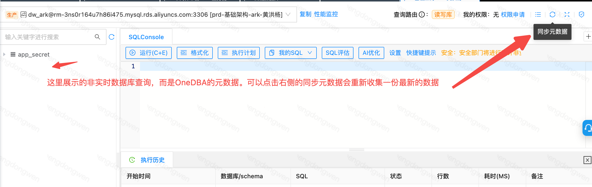

# OneDBA常见问题汇总

# **非OneDBA平台问题请找对应业务域DBA**

OneDBA平台问题可找@东青\(dongwen\)，非OneDBA平台问题请找业务域DBA私聊咨询，谢谢。

https://onedba\.dewu\-inc\.com/notice/notice\-onduty

# 工单使用指南

[OneDBA工单使用指南](https://poizon.feishu.cn/wiki/wikcn073Kj7zXBxpKGJbG1LlCKh)

# 前端页面点击打不开？

一般是由于前端发版后弹窗的页面刷新被用户忽略，可能会碰到点击某个菜单出现一直加载中，尝试刷新页面即可，还是有问题联系管理员。

# 为什么工单选不到数据库？

对于普通数据变更、无锁数据变更、历史数据清理、结构设计工单都需要你有数据库的变更权限才能选到。对于导出工单需要有数据库的导出权限。

需要注意，对于结构设计工单而言，创建工单时只能以开发环境数据库为基准库，就算有其他环境数据库也是选不到的。

# 为什么执行变更后在查询窗口查不表信息？

确定你的变更执行成功后，在查询窗口如果查不到最新表信息可以尝试点击“同步元数据”。当前查询窗口左侧的表信息非实时从数据库拉取的，而是OneDBA最近一次收集的元数据信息。

提示：对于逻辑库变更而言，只有在整个工单结束后才会更新元数据信息。

# 为什么OneDBA搜索不到数据库？

目前只有[权限申请](https://onedba.shizhuang-inc.com/order/permission/apply)页面可以搜索所有数据库，如果这里都没有，应该就是没有同步实例的元数据信息，可联系对应的业务DBA。

在顶部搜索框和左侧搜索框只能搜索出有查询权限的数据库，如果没有权限则搜索不到，需要进行申请权限。

# 为什么OneDBA不显示MySQL只读实例？

OneDBA里面没有从库相关信息，申请权限时只需要申请对应环境的数据库就行。如果这个库有只读实例，\[查询\]\[导出\]操作会自动走只读实例，否则走读写实例。

# 为什么OneDBA搜索不到Redis了？

由于Redis组件（云上\+自建）已经从DBA组移交到了中间件负责维护，按中间件要求已下线OneDBA相关Redis功能已下线（key删除、查询、变更、实例详情），相关功能在架构云支持，地址：[https://middleware\.dewu\-inc\.com/env\-prod/redis\-admin/pub/redis\-list](https://middleware.dewu-inc.com/env-prod/redis-admin/pub/redis-list)，Redis相关问题都可以找 @竹径\(Miro\) 咨询，谢谢。

# 为什么结构设计中删除了表，但测试环境没有被删除？

目前在设计节点删除了新建表后无法同步到测试节点（不论测试节点是否存在当前表），需要提普通数据变更对测试环境进行删除表，工单描述清楚“结构设计中新建表删除后无法带到测试节点，提工单删除”，审批人看到这个信息后自然会明白可审批通过。（关于带删除表到其他节点有一定安全因素，后续方案完整后会支持）。

# 对于分库分表（逻辑库）的支持？

目前结构设计、数据变更、结构同步、历史数据清理等工单都支持逻辑库变更操作。暂时支持简单的逻辑库查询。

业务自行通过“创建数据库”工单创建物理库，然后把相关信息发送给DBA对物理库创建逻辑库即可，在工单选择的时候选择对应的逻辑库变更。

# 老的工单被关闭，新建工单发现基准库已经完成变更无法重新走后续更改，怎么办？

正常不要轻易关闭工单，一旦关闭工单后此工单的新增资源就会变成原有资源，无法再更改字段名称、数据类型之类的操作。

在新建工单中可以通过更改字段注释或索引名称等操作，让这个资源可以重新产生对比，就可以带到后续节点中。对比方式，已存在资源对比变化，不存在资源变成新增。

# 报错“当前流程节点不支持编辑表结构，仅设计节点支持，如果能返回设计节点，请先返回再重试”怎么处理？

当结构设计报这个错误时说明当前工单的活跃节点不是“设计节点”，可能处于“测试节点”或其他节点，需要点击“返回设计节点”再进行编辑表。

返回设计节点的前提条件：当前节点的发布组必须全部已结束，不然不允许返回设计节点。PS：可选择终止发布组来结束当前发布组。

还有一种情况，当前工单看到的活跃节点就是结构设计节点，这是因为没有刷新页面看到了旧的数据（可能其他人在操作此工单），可尝试刷新一下。

# 为什么有库变更权限但在查询窗口中无法执行变更语句？

我们申请的库变更权限仅针对“无锁数据变更”，“历史数据清理”，“结构设计”，“普通数据变更”几类变更工单能选择到数据库。并不是说有变更权限后就可以在查询窗口中执行Create、Update语句等。具体是否允许在查询窗口中针对某个数据库执行变更语句取决于DBA后台配置，当前生产库都不允许在查询窗口执行变更语句，而测试环境库允许执行DML语句（不允许DDL语句）。

# 结构设计工单不允许的高危操作应该走什么工单？

对于 Drop、Rename、Truncate、改自增属性、改表字符集、改字段类型、改字段名称等操作需要走“普通数据变更”工单贴SQL语句，描述清楚需求供审批人员参考，比如删表需要写清楚删表原因，非特殊情况一般不允许删表和改表名。或者找业务域DBA咨询。

# 如何查看、调整数据库Owner？

数据库的Owner默认对数据库有所有权限，并且会涉及到审批这个库涉及的变更工单，需谨慎拥有，可能你只需要申请日常普通变更权限即可。

如果你想成为数据库Owner，目前有两种方式：

1. 通过权限工单进行申请成为数据库Owner

2. 通过让当前数据库Owner手动添加你为数据库Owner（权限申请页面会展示数据库对应Owner是谁）

在“工作台”页面可以查看我Owner的库表。

打开列表可以进行编辑数据库Owner（如果你不是当前数据库Owner则无法编辑）。

# OneDBA支持的数据库类型？

目前已支持的数据库：MySQL、TiDB、Starrocks、ADB、Clickhouse、MongoDB。还未支持的数据库（进行中）：Pg。

