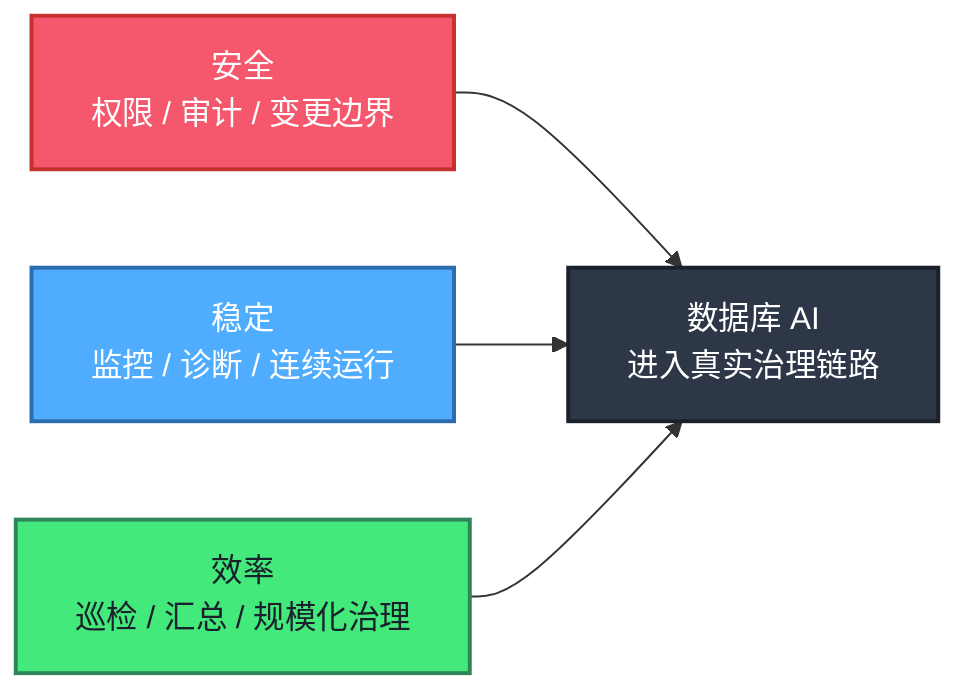
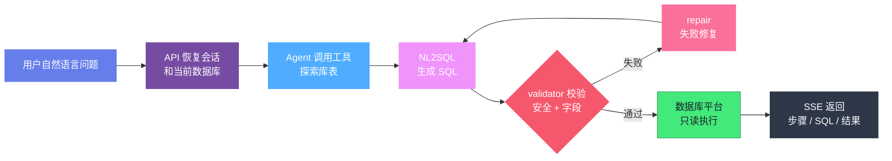
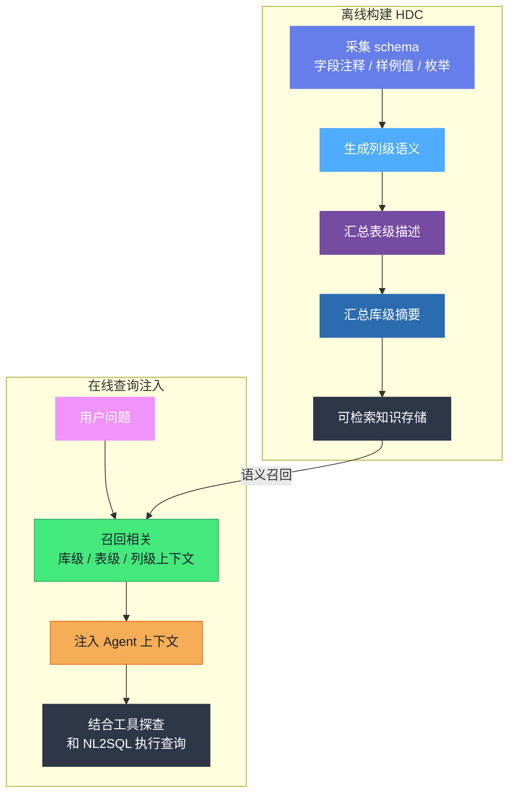
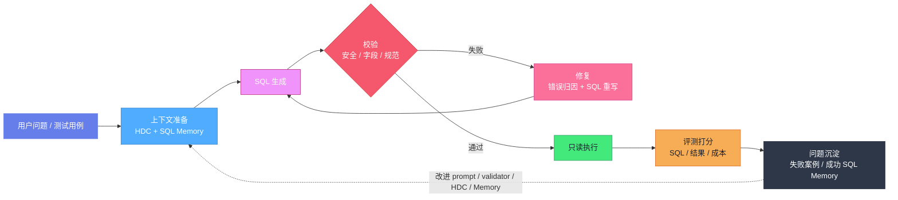

# AI 如何辅助 DBA 提效？真实业务库 Text2SQL Agent 实践复盘

在企业数字化体系里，数据库承载的是交易、履约、库存、商品等核心业务数据。业务规模扩大以后，数据库团队面对的也不再只是某个实例的性能问题。系统链路变长，数据库类型增多，治理工作需要长期回答三个基本问题：数据能力是否安全可控，业务运行是否稳定连续，治理效率是否跟得上业务变化。

安全决定数据库能力能不能被可靠使用。数据库天然涉及核心数据和高权限操作，任何智能化能力都必须服从既有的权限、审计和变更规范。AI 可以辅助理解风险、汇总证据、生成建议，但不能绕过安全边界替代责任主体做高风险决策。

稳定决定业务能不能连续运行。监控平台能及时发现指标越界，却不会天然解释多个异常之间的关系。遇到突发流量、慢 SQL、锁等待、资源瓶颈和变更事件时，工程师仍然要在多个系统之间切换，手工还原问题发生的过程。实例规模越大，这种依赖人工经验的方式越难稳定复制。

效率则决定治理能力能不能规模化。实例巡检、健康评分、告警汇总、风险跟进，这些工作重复、琐碎，却不能省略。如果每次都由工程师从头收集信息、组织结论，团队精力就会长期消耗在信息搬运上，很难投入到更有价值的架构优化和风险治理里。



**图 1：数据库 AI 的三项核心要求**

得物数据库团队探索 AI4DB，也是从这三个要求出发。AI4DB 通常指用人工智能提升数据库配置、优化、设计、监控和安全等能力。放到企业生产环境里，问题不能只停在"模型能做什么"，还要看它能不能进入真实工作链路，在复杂约束下产生持续、可验证的价值。

本文聚焦其中一个阶段性实践：把 Agent 融入数据库团队的日常治理链路。我们没有把 Agent 当成脱离现有体系的新工具，而是把它放进监控、告警、诊断和日常运营的上下文里，观察它能不能缩短信息处理路径，提高问题定位和查询分析效率，并把过程沉淀成可复用的工程能力。

落到这次 Text2SQL Agent 实践上，问题会更具体：一个连接真实业务库的 DBAgent，能不能把 DBA 原本要手工完成的"探索、编写、验证、等待"链路，缩短为"描述意图，等待结果"？它能节省多少时间，结果可信度如何？

这次实践给出的结论是：在明确安全边界、执行护栏和评测口径之后，可以。这个结论来自同一批真实任务的前后对照。AI 辅助 DBA 提效，落到工程上对应四项能力：少翻表、少试错、少等待、少返工。

本文沿着这条主线展开：先分析提效来源，再复盘 DBAgent 从原型到可交付版本的演进过程；随后通过三个典型案例和 28 条真实任务的评测，量化完成这项工作前后 DBA 效率的变化。


**图 2：DBAgent 提效路径**

---

# 一、提效从何而来

手工做查询时，DBA 的时间主要消耗在探索、试错、等待和返工上。对应的提效杠杆也很明确：少翻表、少试错、少等待、少返工。数据库 Agent 的有效性，取决于能否逐项降低这些成本。

| DBA 手工时的麻烦 | 真实表现 | 提效杠杆 | 落地机制 |
|-|-|-|-|
| 🧭 不知道数据在哪张表 | 用户不提供准确表名和字段名 | **少翻表**：先定位库表，再理解字段含义 | HDC 离线沉淀、在线召回 |
| 🎯 多张表都"看起来相关" | 容易选错事实表，行数枚举对不上 | **少翻表**：减少语义相关但数据源错误的 SQL | HDC 提供正确表/列语义 |
| 🧩 枚举和业务口径 | 内部字段常用英文枚举或编码 | **少试错**：把自然语言条件映射到真实取值 | HDC 列级语义 |
| 🔁 需求会变 | "改成最近 7 天""按状态拆分" | **少返工**：保留会话上下文并重构完整查询 | 多轮 Agent 循环 |
| 🛡️ 怕写错 SQL | 模型可能生成危险语句或无界查询 | **少返工**：只读校验、DDL 拦截、默认 LIMIT | 执行护栏 |
| 🧯 报错要自己修 | 字段不存在、函数不兼容、结果为空 | **少等待**：形成生成、校验、修复、执行闭环 | 自动修复 |
| ⚡ 等待和成本 | 面对陌生 schema 多轮查表、查结构、重试 | **少等待**：用 HDC/SQL Memory 减少盲搜和重复探索 | 成本与延迟优化 |
| 📏 结果不敢信 | 只看最终回答无法判断 SQL 是否正确 | **少返工**：同时看执行结果、过程成本和稳定性 | 评测闭环 |

这四个杠杆都有明确的工程落点：少翻表靠 HDC，把 schema 语义前置；少试错靠 SQL Memory，复用历史查询模式；少等待靠探索收敛和自动修复；少返工靠执行护栏和评测闭环。一个连着真实数据库的 Agent，如果只做"调用模型生成 SQL"，这些问题一个都解决不了。

# 二、四阶段演进：从跑通到闭环

四个提效杠杆不是一次做完的。DBAgent 从原型到可交付版本，经历了四次重心调整：

| 阶段 | 为提效做了什么 | 途中遇到的工程问题 | 引发的动作 |
|-|-|-|-|
| 🚀 **阶段 01：先跑通** | 跑通自然语言查库链路，证明"一句话查库"可行 | 运行时探查多，工具和评测契约偏原型 | 先跑通再规范，为提效打地基 |
| 🧰 **阶段 02：先稳住** | 规范工具调用与消息循环，让 Agent 稳定自主探索库表 | 服务化后资源、取消、异常、事件控制失控 | 把运行细节的控制权收回业务代码 |
| 🔑 **阶段 03：少翻表** | 把 schema 理解前置，减少盲搜 | 从零探索延迟高、token 高、易选错表 | 引入 HDC，离线沉淀、在线召回 |
| 🧠 **阶段 04：越用越快** | 复用历史查询模式，并让结果可信 | 手写循环维护成本上升；相似查询仍重复探索 | 通用循环交给框架，补 SQL Memory 与评测闭环 |

## 2.1 阶段 01：先证明"一句话查库"可行

<callout emoji="💡">
**为什么先跑通链路：**只有链路可行，后续工具规范、上下文优化和评测才有真实落点。DBA 提效的第一步，是让"一句话查库"具备可执行的系统链路。
</callout>

第一阶段的目标很简单：先把自然语言查库这条链路跑通。原型已经有了 Text2SQL Agent 的基本骨架：API 接收用户请求，SSE 返回过程事件；Agent 根据问题调用数据库探索工具；NL2SQL 管道负责 SQL 生成、校验和修复；数据库平台负责真实执行；最后把 SQL、解释和查询结果返回给用户。



**图 3：自然语言查库链路**

链路跑通以后，新的问题很快出现。面对未知业务库，系统仍然依赖较多运行时探查和预设流程；Agent 可以调用工具，但自主探索、多步试错、失败后切换路径的能力还不稳定。此时系统已经具备查询能力，但效率和稳定性仍不足。

<callout emoji="✅">
**阶段 01 小结：**第一阶段证明了自然语言查库链路可行，DBA 提效有了前提；但运行时探查多、工具契约松，效率还不稳定。
</callout>

## 2.2 阶段 02：先让服务"稳下来"

链路可行之后，第二阶段的目标是让 Agent **稳定地自主探索库表**，包括工具调用规范、消息循环可靠、流式事件一致。这是"少等待"的前提：工具时好时坏、资源越跑越多，DBA 即便能用，也不敢把查询交给它。

为了让工具调用和消息循环规范化，我们做了三件事：

| 为提效做的动作 | 具体做法 |
|-|-|
| 规范工具调用 | 数据库工具注册为进程内 MCP Server |
| 接管通用消息循环 | 引入 Agent SDK 承担通用状态和工具调用 |
| 统一事件契约 | runner 将 SDK 消息转换成内部 SSE 事件，评测也随之可重复运行 |

模型因此可以稳定地通过工具自主探索库表，评测也从临时脚本逐步走向**可重复运行的模块**。但服务化之后，新的工程问题暴露出来：多用户并发访问下，系统内存持续增长、运行状态不可控；Agent 循环、工具执行、消息重放和资源释放被 SDK 封装后，业务代码很难精细控制每一步的状态、取消、事件和异常处理。

<callout emoji="💡">
**把控制权拿回来：**小场景里，SDK/MCP 能快速规范工具调用和消息循环；但 DBAgent 要作为多用户内部服务长期运行，资源释放、事件输出、取消控制和异常治理会迅速成为一等问题。**通用能力可以交给框架，但业务控制边界必须保留在系统内部**，这也是后续重新设计运行层的原因。
</callout>

<callout emoji="✅">
**阶段 02 小结：**工具调用和消息循环规范化后，服务"稳"了下来；但服务化又暴露出资源释放、取消控制失控的问题。接下来要解决的，是让业务代码重新看见并管理 Agent 的运行过程。
</callout>

## 2.3 阶段 03：把"少翻表"做出来

这一阶段要落地的，是四个杠杆里提效最显著的一个：**少翻表**。

上一阶段暴露出的运行控制问题，要先收住。我们把 Agent 运行过程重新收回到业务代码（从 SDK 主引擎切到 OpenAI 兼容 API + 手写 ReAct）。重点不在手写循环本身，而在业务代码必须能看见、能干预每一步：每轮 LLM 调用如何记录，工具调用如何超时和归一化错误，SSE 事件如何输出，用户断开后如何取消，token、timing、tool count 如何进入评测，多用户并发时状态和资源边界如何控制。拿回这些控制权后，系统才能**观察和评估"查询过程"**，也才有基础继续做延迟优化和可信度评估。

但控制住 Agent 循环只是基础。真正挡住"少翻表"的，是真实业务库的 schema 语义：每次都依赖运行时从零探索，延迟高、token 高、试错成本高；一旦最初选表方向错误，后续 SQL 再规范也无法弥补数据源偏差。DBA 常见的"找错表、结果看着对"就发生在这里。

<callout emoji="🔑">
**HDC 是什么：**HDC 是 Hierarchical Data Context，即层次化数据上下文。它把 schema 理解前置到离线阶段，提前沉淀库、表、列的业务语义；在线查询时再召回相关上下文，减少 Agent 在表选择、结构探查和字段理解上的盲搜成本，也就是帮助 DBA **少翻表**。
*Zhu, Jun-Peng, et al. "TiInsight: A SQL-based Automated Exploratory Data Analysis System through Large Language Models." Companion of the International Conference on Management of Data. 2026.*
</callout>

### 为什么 HDC 是提效的最大杠杆

真实业务库里，DBA 最大的时间黑洞是"找到对的数据"：数据在哪张表、字段表达什么含义、枚举怎么取值、口径怎么对齐。**少翻表直击这个黑洞**。表选对了、字段理解了、口径对齐了，试错、等待和返工自然跟着减少。这正是 HDC 与其它机制的关系：HDC 是主杠杆，SQL Memory、执行护栏和评测闭环，都是在它铺好的底子上进一步发挥作用。

### 三级语义：库、表、列

HDC 的"层次化"体现在三个粒度，每一级都是下一级的语义浓缩：

| 粒度 | 沉淀什么 | 解决 DBA 的什么问题 |
|-|-|-|
| 🗄️ **库级摘要** | 这个库覆盖哪些业务主题、有哪些常用表 | 快速判断"这个库大概是干什么的" |
| 📋 **表级描述** | 每张表记录什么、和哪些表相关、常见查询场景 | 定位"数据可能在哪张表" |
| 🧩 **列级说明** | 每列含义、类型、枚举取值、样例值 | 理解"字段什么意思、枚举怎么取" |



**图 4：HDC 离线构建与在线注入**

HDC 不替代工具，它提供的是更靠前的语义线索。在线查询时，系统不必从零开始推断表结构，而是先获得库级、表级和列级的业务语义描述。

### 设计取舍：只保留利用率高的语义

<callout emoji="💡">
**为什么裁掉论文原有的关系级 HDC：**当前业务库场景下，关系级数据召回利用率低，却会明显增加离线生成延迟和 token 成本。面对大库大表时，这个取舍能节省约 90% 的时间与成本。
</callout>

### 实测证明：HDC 的收益是量出来的

同一个任务、同一套用例下，HDC 的收益主要体现在三类指标上：

| 指标 | 无 HDC | 带 HDC | 变化 |
|-|-|-|-|
| ✅ **通过率** | 71.4%（20/28） | **96.4%（27/28）** | +25pp |
| 表/列引用正确 | 74.66% | **89.18%** | +14.52pp |
| 过滤条件 / 枚举口径 | 72.27% | **92.09%** | +19.82pp |
| 工具调用（平均） | 5.7 次 | **1.3 次** | 探索大幅收敛 |
| 相近表名选错表 | 62.42%，5 次探索 | **94.60%**，1 次选对 | 数据源被修正 |


这组数据也说明了 HDC 的边界：它最擅长解决"数据在哪里、字段是什么意思"这类 schema 语义问题，但对时间窗口、日期截断、聚合粒度这类查询模式，仍需要复用历史成功 SQL 来补足。也就是说，HDC 省掉的不是一次 SQL 重写，而是整条"猜表—试错—返工"的链路。

<callout emoji="✅">
**阶段 03 小结：**"少翻表"从目标变成了可衡量的工程能力。schema 理解前置后，Agent 在线查询不再从零猜表，同源实测中表/列引用正确率从 74.66% 提升到 89.18%。新的压力也随之出现：手写 ReAct 循环能带来控制权，但长期维护成本会继续上升。
</callout>

## 2.4 阶段 04：越用越快、结果可信

第四阶段顺着两个问题继续往前走：运行层要降低维护成本，相似查询也不能每次都从零探索。

第一，通用机制不再自己造轮子。我们把通用 Agent 循环、消息状态、工具调度和流式基础能力交给 Deep Agents（LangChain 的开源通用 Agent 框架）承接，降低手写 ReAct 的维护成本；SQL 正确性仍由 DBAgent 自己的 HDC、SQL Memory、NL2SQL 管道、安全校验和评测闭环负责。业务工具、上下文构建、SSE 契约等业务边界保持不变：

| 交给框架（Deep Agents） | DBAgent 继续控制 |
|-|-|
| Agent 循环、消息状态、工具调度、流式基础能力 | 业务工具、上下文构建、NL2SQL 管道、SSE 契约、HDC、SQL Memory、安全校验、评测 |

第二，相似查询不再重复探索。我们补齐 SQL Memory。**SQL Memory 复用的是查询模式，不是答案**。它记录成功执行过的问题、SQL、表名、数据库、执行结果摘要和 embedding；新问题到来时，按语义相似度召回历史 SQL，作为 few-shot 查询模式注入上下文。当前问题仍然需要重新生成和执行 SQL，历史记录只提供查询模式参考。对 DBA 场景而言，这意味着按天聚合、按状态分组、按时间窗口过滤、按数量排序这类高度相似的查询，不再从零探索。

| 能力 | 解决的问题 | 注入内容 | 对 DBA 的意义 |
|-|-|-|-|
| HDC | 这个库、表、字段是什么意思 | 库级摘要、表级描述、列级说明 | **少翻表** |
| SQL Memory | 相似问题曾经使用过什么查询模式 | 相似问题、成功 SQL、涉及表、结果摘要 | **少试错、复用查询经验** |

<callout emoji="✅">
**阶段 04 小结：**Deep Agents 解决通用运行层维护成本，HDC 解决 schema 语义，SQL Memory 复用历史查询模式，校验器保证执行安全。到这一阶段，少翻表、少试错、少等待、少返工四个杠杆被整合到同一条工程链路中。
</callout>

# 三、任务对照：三个样本的前后差异

下面三个用例分别对应基础查询、表选择错误和探索成本，展示同一个 DBA 任务在初始版（阶段 02 SDK）与最终版（阶段 04 Deep Agents + HDC/SQL Memory）上的差异。数据来自两期实测评测报告（同一套 28 条用例、同一真实业务库 `dw_demo`）。"手工"一列是 DBA 纯手工完成同一任务的估算量级，表中用 ★ 标出，避免和系统实测数据混在一起。

| 案例 | 任务类型 | DBA 手工（★估） | 初始（SDK） | 最终 | 关键结论 |
|-|-|-|-|-|-|
| 📌 **案例一** | 基础聚合 | 5–10 分钟，含找表+验口径 | 97.00%、5 次探索、84.8s | **97.60%**、1 次、22.6s | 链路稳定，耗时成本大降 |
| 🎯 **案例二** | 表选择错误 | 10–15 分钟，易掉进相近表名陷阱 | 62.42% 选错表、5 次探索 | **97.60%**、1 次、21.9s | HDC 修正数据源选择 |
| ⚡ **案例三** | 探索成本 / 超时 | 10–20 分钟，大表聚合易超时 | 120s 超时 0 分、10 次探索 | **97.54%**、1 次、22.8s | SQL Memory 降低盲搜 |

## 3.1 基础聚合查询任务

用户问题：统计每种订单类型的数量，按数量降序排列。

最终版实际 SQL 与参考语义一致，并额外增加了稳定排序：

```sql
-- 为什么这段 SQL 值得看：在语义一致的基础上增加稳定排序，结果更适合评测和复现。
SELECT order_type, COUNT(*) AS order_count
FROM order_record
GROUP BY order_type
ORDER BY order_count DESC, order_type ASC;
```

这个案例展示了 DBAgent 的基本执行方式：定位业务表，理解聚合维度，生成 SQL，执行并返回结果。初始版链路已经跑通，但探索成本偏高；最终版的主要收益来自更稳定的表定位和更少的上下文探索，而不是更复杂的推理过程。

<callout emoji="📊">
**案例数字：**基础聚合场景中，DBA 手工约 **5–10 分钟（★估）**；工具内初始到最终，分数 **97.00% → 97.60%**，工具调用 **5 → 1**，token **约 4.9 万 → 约 1.5 万**，延迟 **约 85s → 约 23s**。
</callout>

## 3.2 选错表：HDC 修正数据源选择

用户问题：事件系统中，统计每种事件级别的数量。

参考 SQL 使用事件日志表 `db_event_log`。初始版选择了事件记录表 `db_event_record_v2`。两张表名称相近，也都包含事件级别字段，但数据源不同，行数和枚举取值不一致，该用例只得 **62.42%**。这类问题在手工排查中也很常见：数据源选择错误，但结果形式仍然合理。

```sql
-- 初始版实际 SQL：数据源选错（db_event_record_v2 ≠ db_event_log），行数不一致
SELECT level AS 事件级别, COUNT(*) AS 数量
FROM db_event_record_v2
GROUP BY level
ORDER BY 数量 DESC;
```

```sql
-- 参考 SQL：使用事件日志表
SELECT level, COUNT(*) AS event_count
FROM db_event_log
GROUP BY level
ORDER BY event_count DESC;
```

最终版一步选对事件日志表，避免了在相近表名之间反复探查。这个案例体现了 HDC 的实际价值：它改善的不是 `GROUP BY` 写法，而是数据源选择。

<callout emoji="📊">
**案例数字：**表选择错误场景中，DBA 手工排查相近表名需 **10–15 分钟（★估）**；工具内初始到最终，分数 **62.42% → 97.60%**，工具调用 **5 → 1**，token **约 4.0 万 → 约 1.5 万**。
</callout>

## 3.3 探索成本：SQL Memory 降低盲搜

用户问题：统计最近一个月每天的事件数量，按日期升序排列。

参考 SQL 是典型的时间窗口聚合，最终版实际 SQL 与参考结构一致：

```sql
-- 为什么这段 SQL 值得看：它体现了半开时间窗口、按天聚合和稳定升序输出的查询模式。
SELECT DATE(event_time) AS event_date, COUNT(*) AS event_count
FROM db_event_log
WHERE event_time >= '2026-07-01' AND event_time < '2026-08-01'
GROUP BY DATE(event_time)
ORDER BY event_date ASC;
```

这个案例更能体现过程成本的变化。初始版在时间窗口聚合上探索过深，最终触发 120s 超时；最终版识别到相邻月份的"按天统计事件数量"共享同一类查询结构：`DATE(event_time)`、半开时间窗口、按日期聚合、按日期升序。这里 SQL Memory 给出查询模式参考，HDC 保证事实表和字段语义正确。

<callout emoji="📊">
**案例数字：**探索成本场景中，DBA 手工做大表时间窗聚合，耗时 **10–20 分钟、且大表执行容易超时（★估）**；工具内初始版 120s 超时（0 分）→ 最终版 **97.54%**，工具调用 **10 → 1**，token → **约 1.5 万**，延迟 → **约 23s**。
</callout>

<callout emoji="✅">
**本章小结：**三个案例分别对应基础查询、事实表选择和探索成本。HDC/SQL Memory 的收益不在于提升 SQL 表达复杂度，而在于帮助 Agent 更快选对数据源，并加快任务收敛。
</callout>

# 四、整体评估：28 条真实任务的效率账

案例能说明局部问题，评测用于回答"这些能力是否整体有效"。DBAgent 的评测不止看 SQL 文本相似度，还会看完整 Agent 任务的效果和成本，包括 SQL 语法、表/列引用、过滤条件、结果数据、SQL 规范，以及工具调用、turns、token、延迟和稳定性。这些指标合在一起，才能覆盖 DBA 关心的效率、准确性和稳定性。

## 4.1 阶段 02（SDK）vs 阶段 04（HDC/SQL Memory）指标对比

把初始评测（阶段 02 SDK 版）与最终评测（阶段 04 Deep Agents + HDC/SQL Memory）放到一起看。同一套 28 条用例、同一真实业务库，结果如下：

| 指标 | 阶段 02：SDK 版（初始） | 阶段 04：HDC/SQL Memory（最终） | 变化 | 可视化结论 |
|-|-|-|-|-|
| ✅ **通过率** | 71.4%（20/28） | **100%（28/28）** ✅ | +28.6pp | 全量通过 |
| 📈 **平均分** | 77.83% | **97.49%** ✅ | +19.66pp | 正确性提升 |
| ⚡ **平均延迟** | 约 107s | **约 29s** ✅ | 约 -73% | 总耗时大幅下降 |
| 🛠️ **工具调用** | 5.7 | **1.0** ✅ | -4.7 | 探索大幅收敛 |
| 🔁 **Turns** | 4.8 | **2.0** ✅ | -2.8 | 对话轮次下降 |
| 🧮 **总 token** | 约 3.5 万 | **约 1.8 万** ✅ | 约 -47% | 成本下降 |
| 🎯 **稳定性** | 工具/token/turns 波动较大，4 条超时 | 波动明显收敛，0 超时 ✅ | 大幅收敛 | 从偶发可用到稳定交付 |

> 数据来源：同一套 28 条用例、同一业务库上的两期实测，比较对象是阶段 02 SDK 基线和阶段 04 最终版（HDC + SQL Memory）。HDC 的单独对照数据已在 2.3 节列出。

从 DBA 工作流角度看，平均查询等待时间从约 107 秒降到约 29 秒，下降约 73%；需要反复追问或重试的对话轮次从 4.8 降到 2.0；28 条任务从 4 条超时降到 0 条。

<callout emoji="⚡">
**TTFB：**最终版 TTFB 约 `6.6s`（首个 LLM 响应或工具调用到达时间）。检索和上下文组装 prep 约 `5ms`，主要耗时仍在首轮 LLM 响应。也就是说，最终版虽然降低了总耗时，但首包等待还没有被充分压缩，TTFB 是下一轮明确的优化点。
</callout>

## 4.2 评测闭环

这套评测不是单独跑一张结果表，而是进入了 Agent 的迭代流程。每次任务都会留下 SQL、执行结果、工具调用、成本和失败原因，成功模式进入 SQL Memory，失败样本反过来推动 prompt、validator、HDC 和 Memory 调整。



再拆到评分维度上，提升主要来自 schema linking、业务条件和结果正确性：

| 维度 | 初始（SDK） | 最终 | 变化 | 说明 | 可视化结论 |
|-|-|-|-|-|-|
| 🧾 **SQL 语法正确** | 89.29% | **100.00%** ✅ | +10.71pp | 探索和试错减少后，语法错误也自然变少 | 语法改善 |
| 🧭 **表/列引用正确** | 74.66% | **99.11%** ✅ | +24.45pp | HDC 对 schema linking 有明显收益 | 找表找列更准 |
| 🧩 **过滤条件正确** | 72.27% | **99.55%** ✅ | +27.28pp | 业务条件和枚举映射更稳定 | 口径更稳 |
| 📊 **结果数据正确** | 79.40% | **100.00%** ✅ | +20.60pp | 最终结果可靠性提升 | 结果更可靠 |
| 🧱 **SQL 规范** | 65.71% | **75.36%** ⚠️ | +9.65pp | 提升有限，后续仍要加强 校验器、prompt 和 SQL 风格约束 | 仍需治理 |

把评测放回阶段演进里看，阶段 02 暴露的是工具探索成本高、超时和错误较多的问题；阶段 03 引入 HDC 后，盲搜明显减少；阶段 04 再用 SQL Memory 补齐相似查询模式，最终把 4 条超时压到 0 条。

提效收益来自 HDC、SQL Memory、工具边界和评测闭环的共同作用；Deep Agents 在其中承担的是降低通用 Agent 循环维护成本的部分。

# 五、效率的刻度：完成前后对比

前几章的材料可以收敛到一张"三态对比"表。"DBA 手工"一列为估算量级，表中用 ★ 标出；初始版 Agent 和最终版 Agent 来自同一套 28 条用例、同一真实业务库 `dw_demo` 的实测。

| 维度 | 工作前：DBA 手工（★估） | 工作前：初始版 Agent（实测） | 工作后：最终版 Agent（实测） |
|-|-|-|-|
| **找对表 / 理解口径** | 翻数据字典、看注释、试查，陌生库 **数分钟级** | 5.7 次工具探索，仍可能选错表 | **1.0 次**，靠 HDC 一步选对 |
| **结果获取耗时** | 一条陌生查询任务 **约 5–20 分钟** | 平均 **~107s**（含 4 条超时） | 平均 **~29s**（单例 ~22s） |
| **正确率 / 可信度** | 有选错表、口径错但结果"看着对"的风险 | 通过率 71.4%，4 条 120s 超时 | **通过率 100%**，0 超时，波动近乎为零 |
| **对话/试错轮次** | 需求变了要自己反复改 SQL | 4.8 次 | **2.0 次** |
| **资源成本（token）** | 不适用（人力成本） | 34603 | **18363** |

**按 DBA 单日任务量换算：**10 条陌生业务库查询任务，纯手工预计需要 **1–3 小时**，且存在"选错表"风险；使用最终版 Agent 后，约 **5 分钟**可以获得全部结果，28 条任务全通过、0 超时。这个差异已经超过 10 倍，也把部分人工反复校验工作转移到系统流程中的校验和评测环节。

提效不意味着 DBA 无事可做。角色从"写 SQL、验口径"转向"描述意图、复核结果"。

# 六、五条经验与后续

<callout emoji="✅">
**经验一：工具粒度要贴近用户任务。**Text2SQL Agent 不应该机械暴露底层 API，让模型自行组合所有步骤。schema 获取、SQL 生成、校验、修复和执行这类单向流程，可以封装在更稳定的边界内，以减少决策轮次、错误分支和等待时间。
</callout>

<callout emoji="✅">
**经验二：框架能降低复杂度，但业务控制边界必须保留。**SDK/MCP 能快速规范工具调用，服务化后又会遇到资源、状态、事件和取消控制问题。关键在于评估业务逻辑与框架能力的耦合度。只有关键控制权保留在业务系统内，效率提升才具备稳定性和可持续性。
</callout>

<callout emoji="✅">
**经验三：真实 Text2SQL 的核心难点是 schema 语义。**SQL 语法错误只是表层问题，更常见的是选错事实表、错用状态字段、误解枚举和业务口径。HDC 的价值在于把这部分理解前置，让 Agent 在线查询时减少从零探索。"少翻表"是四个杠杆中最明显的一项收益。
</callout>

<callout emoji="✅">
**经验四：SQL Memory 复用的是查询模式，不是答案。**它适合沉淀真实执行成功的 SQL 经验，帮助相似问题复用时间窗口、聚合维度、排序方式和事实表选择。它不应该绕过当前问题的 SQL 生成和执行，也需要治理和清理机制，避免错误经验长期污染上下文。记忆可信是查询模式复用的前提。
</callout>

<callout emoji="✅">
**经验五：真实数据库 Agent 必须有执行护栏和评测闭环。**SQL 安全不能只写在 prompt 里，必须在工具层和 NL2SQL 层做只读校验、DDL 拦截、LIMIT 控制和字段检查；评测也不能只看最终 SQL 文本，还要覆盖执行结果、工具调用、turns、token、延迟和失败案例。只有具备护栏和评测，DBA 才能把部分查询流程交给 AI 辅助完成。
</callout>

---

回到开头的问题：**AI 如何辅助 DBA 提效？** 在这次 DBAgent 实践中，答案不是让模型单独生成一条 SQL，而是通过 HDC、SQL Memory、执行护栏和评测闭环，把 DBA 手工的"探索、编写、验证、等待"压缩到一条更短的工程链路中。

这项工作已经带来明确的效率差异。TTFB、SQL 规范、HDC 命中审计和 SQL Memory 治理，是下一轮明确的迭代方向。对 DBAgent 这样的真实业务库 Agent 来说，持续可评测、可治理，比一次性生成一条正确 SQL 更重要。提效能否长期成立，取决于系统能不能把每一次真实查询继续沉淀成可靠经验。
