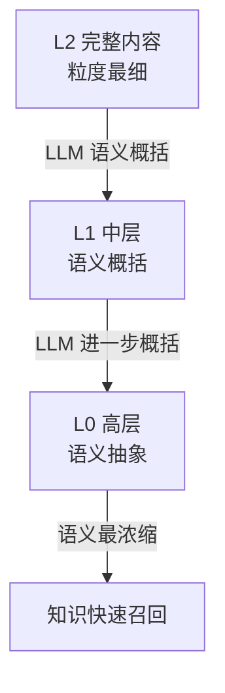
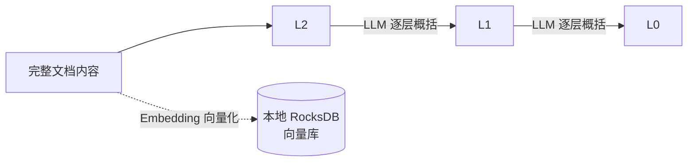
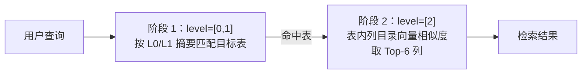
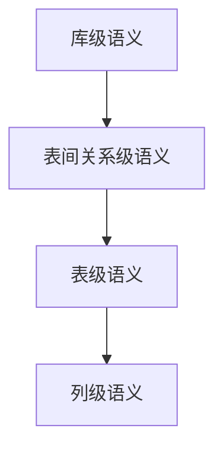

# OpenViking 实践

> 本文是项目在 **OpenViking 记忆体**方向上的技术实践沉淀，由总结大纲展开为完整正文。全文分三部分：**记忆体介绍**、**OpenViking 的关键机制**、以及在本项目（Text2SQL Agent）中的**业务实践**。

## 一、记忆体介绍

本项目以「记忆体（Memory）」作为 Agent 的能力底座之一，涉及的记忆体方案与组件如下。

### 1.1 OpenViking

OpenViking 是本项目采用的长期记忆方案。它提供基于对话的**自动记忆沉淀机制**，能在使用过程中不断将对话内容沉淀为 markdown 文档，原生支持用户画像的自我完善，是 Agent 长期记忆能力的基础。

详细介绍见：<https://poizon.feishu.cn/wiki/Qc6LwPUFgiekOxkFhl0ct03inx6>

### 1.2 向量存储底座：RocksDB（在役）与 LanceDB（未采用）

本项目实际采用的向量存储底座是 **RocksDB**——它是 OpenViking 的 `local` 存储后端，2.2.1 中「Embedding 向量存储在本地 RocksDB 向量库」即指此。OpenViking 本身支持多种向量数据库后端（`local` / RocksDB、`qdrant`、`volcengine` VikingDB、`opengauss`），可按配置切换。

**LanceDB** 是组内调研、对比过的相关记忆体组件，**未在本项目采用**：代码库中无任何引用，仅作为 OpenViking 评测中的对比基线（如 `OpenClaw + LanceDB`）与其设计文档中「可选的向量搜索后端」出现。它与 RocksDB 并非并列在役的两个组件，而是「本项目选用的后端」与「生态中被对比过的候选」的关系。

详见 LanceDB：<https://poizon.feishu.cn/wiki/GlD9w0JojiueYmknZxwcNJA1nAh>

> 说明：上述两个组件的详细能力以各自链接文档为准，本节仅做索引定位。

## 二、OpenViking 的关键机制

### 2.1 设计：三层记忆结构

OpenViking 的核心是**三层（L0 / L1 / L2）记忆结构**，其设计原则是：**上一层是下一层的语义抽象**。

- **L2**：保存**未经 OpenViking 概括的完整文档内容**（在本项目中即 HDC 各粒度的语义描述文档，而非原始 schema 数据），信息最全、粒度最细；
- **L1（中层）**：由 LLM 对 L2 进行语义概括得到；
- **L0（高层）**：对 L1 的进一步抽象，粒度最粗、语义最浓缩。

高层的 **L1 / L0** 由于语义浓缩、覆盖面广，**支持知识的快速召回**——检索时无需每次都读取 L2 完整内容。

### 2.2 实现

#### 2.2.1 生成时（写入路径）

生成（沉淀）时，文档内容先写入 **L2（完整内容层）**，随后由 **LLM 一层一层地进行语义概括**，依次形成 **L1** 和 **L0**；与此同时，使用 **Embedding 模型**将内容向量化，并将向量存储在**本地 RocksDB 向量库**中。

#### 2.2.2 使用时（查询路径）：两阶段检索

查询时通过 `find` 接口进行**两阶段检索**，整体思路是「高层摘要粗定位 + 底层列级向量精排序」。选择 `find`（纯向量检索）而非 OpenViking 的 `search`，是为了**避免在检索阶段额外引入一次 LLM 意图分析**——`search` 独有的 IntentAnalyzer 会先调用 LLM 分析会话意图、再做多路向量检索；**这只针对检索环节，整个 Text2SQL 流程并未省略意图理解**（落点见本节末尾）。

**第一阶段（粗筛，level=[0,1]）**：以用户问题为 query，对表目录的 **L0/L1 摘要**做 **Embedding 向量相似度**匹配（`find` 接口为「向量 + tags」检索，本流程未启用 tags，即纯向量匹配）。参数 `limit=200`、`score_threshold=0.25` 是有意设置的**高召回、低精度**配置——目标是**让正确表进入候选集**，而非一次选中最优表。随后对命中项按表聚合打分：采用**组合分（sum of top-3 命中分）**，让拥有多个命中证据的表排得更前；再按业务实体 `main_entity` **去重（每个实体最多保留 2 张表）**，最终输出**最多 5 张候选表**，每张附带 `_INDEX.md` 的 main_entity、表描述与使用场景。语义高度近似的表（如 user / user_info / user_profile 这类同实体表）能在此阶段被拉开距离，依赖 L0/L1 摘要由 OpenViking 从该表的**列级文档**生成、能够体现具体语义差异。**最终选表由 Agent 结合候选表信息决定，检索只负责提供方向。**

**第二阶段（精排，level=[2]）**：对第一阶段命中的候选表，在其**表内列目录**上按**向量相似度**取 **Top-6 列**，为 Agent 补充列级语义参考。

**兜底与边界**：若第一阶段 `find` 无结果，检索依次回退到**文件系统列举**、**`level=[2]` 重试**（兼容旧格式知识库）。需要说明的是，若正确表未能进入候选集，第二阶段的精排无法挽回，这是**已识别的边界风险**，主要通过高召回参数与多级降级缓解，并在评测数据集中刻意构造了**近似表干扰（overcomplete）**场景来压测。

**意图理解在哪**：用户意图的语义理解并未被省掉，而是由两个本就存在、必须读懂问题的环节承担——**Agent 决策环**（读取用户问题、决定调用哪个工具、选择目标表）与 **SQL 生成**（`query_database` 将完整自然语言问题交给 SQL 生成 LLM，完成「意图 → SQL」的转换）。检索阶段的 `find` 只负责向量召回候选表，不承担意图分析；因此「避开意图分析」不等于「系统不理解意图」。

## 三、业务实践

### 3.1 长期记忆自动沉淀

在用户使用过程中，OpenViking 提供了**自动的记忆沉淀机制**：根据对话内容不断形成 markdown 文档，原生支持用户画像的自我完善，让交互体验更加顺畅自然。这是 OpenViking 的通用能力，适合对话型 Agent 直接受益。

### 3.2 schema 语义知识库的存储与查询

在 Text2SQL 场景下，我们利用 OpenViking 沉淀 **schema 语义知识库**，解决「Agent 找表、生成 SQL」时的语义理解问题。该实践经历了「发现问题 → 引入 HDC → 实践取舍」三个阶段。

#### 3.2.1 问题：记忆沉淀方向难以定向控制

Text2SQL 场景要求记忆能沉淀**库名、表名、列名**这类结构化语义元信息。但实测发现，OpenViking 的记忆沉淀方向**仅能部分人为控制**：`memory_policy` 可以限定记忆的开关（`self` / `peer` / `working_memory`），并用 `memory_types` **白名单**把抽取限制在指定的 memory schema 内。

需要说明的是，`memory_types` 白名单**本身可扩展**：OpenViking 通过 `memory.custom_templates_dir` 支持注册**自定义 memory schema**，理论上可注册一个 `schema_semantic` 类型来定向沉淀库名、表名、列名等结构化元信息。但即便注册这类类型，仍有两个绕不开的限制：**具体沉淀的内容与语义方向仍由 LLM 从对话中自主判断**（schema 只定义字段结构与抽取描述，不保证抽取的可靠性与可控性），且**不与真实库结构校验、不随 schema 演化刷新**。因此靠自定义 memory type 无法可靠、可控地沉淀 schema 元信息——这正是本项目改用 **HDC**（离线主动采集 schema → LLM 生成语义 → 增量更新保鲜 → 运行时 DESCRIBE 兜底）的原因。

随时间推移，默认记忆流程产生的记忆覆盖面虽然越来越广，但对 Agent 业务能力（选表、生成 SQL）的提升**微乎其微**。

#### 3.2.2 方案：HDC（分层数据上下文）

针对上述问题，引入 **HDC（Hierarchical Data Context，分层数据上下文）**。其原理参考了 **TiDB 年初发表在 Arxiv 的一篇论文**：使用**多层次上下文**提供丰富的 schema 语义，从细到粗分为四层：

| 语义层级 | 粒度 | 说明 |
| ---- | ---- | ---- |
| 库级语义 | 最粗 | 数据库整体的语义 |
| 表间关系级语义 | ↑ | 表与表之间的关联关系 |
| 表级语义 | | 单张表的语义 |
| 列级语义 | 最细 | 单个字段（列）的语义 |

各层级**彼此以父子关系链接**，形成层级树状结构。落地到 OpenViking 时，HDC 复用其**资源目录树**：库 = 根目录、表 = 表目录、列 = 目录内文件；OpenViking 会在目录上自动生成 **L0 摘要 / L1 概览**，检索时 `level=[0,1]` 命中表级摘要、`level=[2]` 命中列级内容，从而把 HDC 的表/列粒度映射到 OpenViking 的层级上。需要注意：L0/L1/L2 是 OpenViking 独立的语义压缩轴（完整内容 → 摘要 → 概览），与 HDC 的粒度层级**并非同一概念的一一对应**。

#### 3.2.3 实践发现与取舍

构建 HDC 知识库的实践中，发现了两个关键问题：

- **成本高**：**关系级上下文**占用了约 **90% 的生成延迟和 token 成本**——关系检测需要对表**两两配对**、由 LLM 逐一判断是否关联，表越多开销越大（O(N²) 量级）；
- **检索难**：OpenViking 的检索路径**难以利用关系级信息**（与前述两阶段检索路径不匹配）——即便生成并存储了关系，检索时也无法把它喂进 Agent 上下文。

因此最终选择**去除关系级上下文**，减轻 HDC 的重量，仅保留列级、表级、库级语义（即原始四层中去掉「表间关系级」）。落地后，**在线更新路径直接跳过关系生成**（`relationships=[]`），全量生成虽仍会写出关系文件，但检索与运行链路从不读取——Agent 运行环境中不再存在关系级知识。

**对多表 JOIN 的影响**：表间关系本是跨表 SQL 最直接的依据，去掉后，Agent 生成 JOIN 时不再有「哪些表能关联、用什么键关联」的显式提示，改为**由 LLM 直接阅读多张表的列结构自行推断关联**：`query_database` 支持逗号分隔的多表名，逐表 DESCRIBE 后合并进同一份表结构，LLM 凭借列名命名约定（同名关联键、主外键）与语义写出 `ON` 条件；校验仅覆盖表名与字段存在性，**不校验关联键是否正确**。因此命名规范、关联直观的多表查询可以正常走通；命名不一致或经中间表的多对多关联，则可能推断错误。这一取舍在当前业务下可接受：跨表 JOIN 场景在评测中可正常通过，且关系级本就在检索路径上无法利用，去除并非单纯的成本压缩，而是「存了也用不上」下的必然选择。

#### 3.2.4 在 Agent 中的使用方式

HDC 语义库与 SQL Memory 两个模块都作为**上下文注入到 Agent** 中，以此为 Agent **找表提供方向**、为 **SQL 生成提供参考**，是「语义理解增强模块」的核心组成。

---

## 参考链接

- OpenViking：<https://poizon.feishu.cn/wiki/Qc6LwPUFgiekOxkFhl0ct03inx6>
- LanceDB：<https://poizon.feishu.cn/wiki/GlD9w0JojiueYmknZxwcNJA1nAh>
