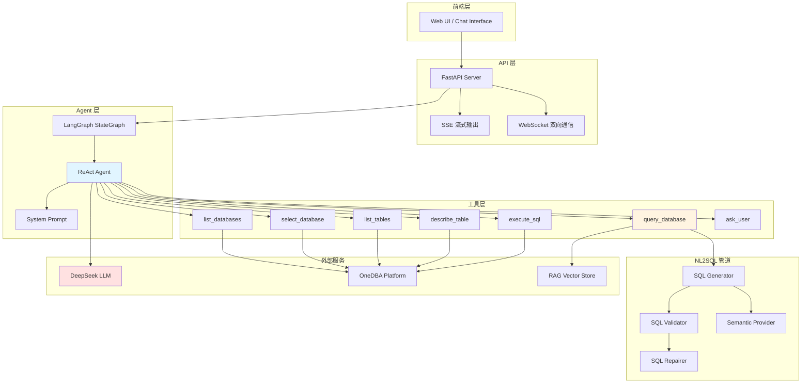
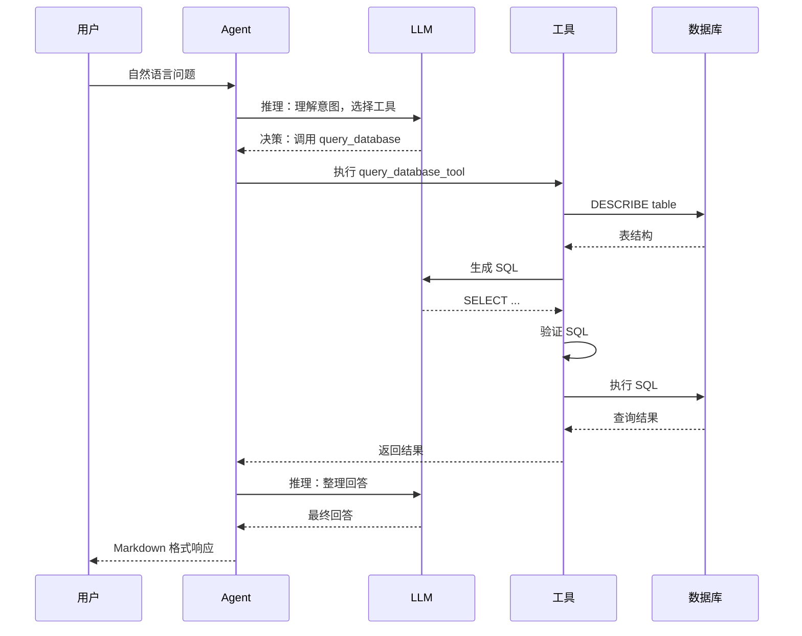
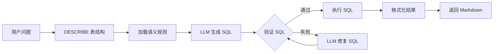
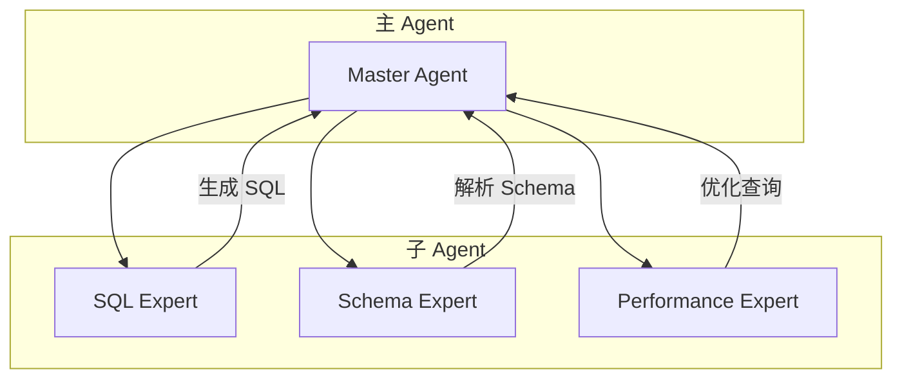
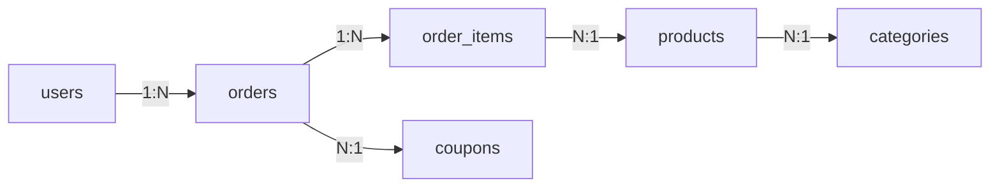

# DBAgent：基于 LLM Agent 的智能数据库助手

> 从正则驱动到 LLM 驱动：构建一个能理解自然语言、自主决策的智能数据库分析助手

## 目录

- [项目背景](#项目背景)
- [核心能力](#核心能力)
- [系统架构](#系统架构)
- [工作机制](#工作机制)
- [代码实现](#代码实现)
- [技术选型](#技术选型)
- [改进方向](#改进方向)
- [Agent 演进展望](#agent-演进展望)

---

## 项目背景

### 问题起源

在企业数据库管理场景中，用户经常需要执行各种数据查询任务：

- "最近 7 天的订单量是多少？"
- "各业务域的 GMV 占比是多少？"
- "哪些商品的退款率最高？"

这些看似简单的问题，背后涉及：
1. **数据库定位**：用户需要知道数据在哪个库、哪张表
2. **Schema 理解**：需要理解表结构、字段含义、枚举值
3. **SQL 编写**：需要掌握 SQL 语法、JOIN、聚合函数
4. **业务语义**：需要理解"有效订单"、"GMV"等业务概念

对于非技术人员，这些门槛很高；对于技术人员，重复编写 SQL 也很耗时。

### 传统方案的局限

传统的 NL2SQL 方案通常采用**规则驱动**的管道：

```
用户输入 → 正则意图识别 → 模板匹配 → SQL 生成 → 执行
```

这种方案存在明显问题：

1. **脆弱的意图识别**：正则匹配无法处理多样化的表达
   - "最近有哪些表" vs "查一下 orders" → 后者可能无法识别
   
2. **僵化的追问能力**：只能处理预定义的修改（改 LIMIT、改时间）
   - 无法处理："加上 WHERE 条件"、"换个 GROUP BY 字段"
   
3. **LLM 形同虚设**：即使调用了 LLM，决策仍由规则驱动
   - LLM 的分类结果很少被真正使用

### 我们的思路

**从"规则路由"转向"LLM Agent"**：

让 LLM 成为真正的决策者，通过 ReAct（推理 + 行动）模式自主完成：
- 理解用户意图
- 选择合适的工具
- 执行多步操作
- 处理追问和澄清

---

## 核心能力

DBAgent 提供以下核心能力：

### 1. 自然语言查询（NL2SQL）

用户用自然语言提问，Agent 自动生成并执行 SQL：

```
用户：查询最近 30 天的有效订单数量
Agent：
  1. 理解"有效订单"的业务语义（paid + completed）
  2. 生成 SQL：SELECT COUNT(*) FROM orders WHERE order_status IN ('paid', 'completed') AND created_at >= DATE_SUB(NOW(), INTERVAL 30 DAY)
  3. 执行并返回结果
```

### 2. 数据库探索

帮助用户了解数据库结构：

```
用户：dw_onedba 库有哪些表？
Agent：
  1. 调用 list_tables 工具
  2. 返回表列表及简要说明
```

### 3. 多轮对话与追问

支持上下文理解的追问：

```
用户：查询 orders 表最近 30 天的订单数
Agent：[返回结果]

用户：改成最近 7 天
Agent：[理解这是对上一轮的修改，重新生成 SQL]
```

### 4. 安全控制

- 只允许 SELECT/SHOW/DESCRIBE 查询
- UPDATE/DELETE/INSERT 需要用户确认
- 禁止 DDL 操作（CREATE/ALTER/DROP）

---

## 系统架构

### 整体架构



### 核心组件说明

| 组件 | 职责 | 技术栈 |
|------|------|--------|
| **API 层** | HTTP/WebSocket 接口，会话管理 | FastAPI, SSE |
| **Agent 层** | ReAct 循环，工具调度 | LangGraph, LangChain |
| **工具层** | 7 个核心工具，封装数据库操作 | LangChain @tool |
| **NL2SQL 管道** | SQL 生成、验证、修复 | LLM Prompt Engineering |
| **语义层** | 业务规则管理（有效订单、GMV 等） | 多 Provider 组合 |
| **RAG** | 向量检索，辅助 SQL 生成 | FAISS, OpenAI Embedding |

---

## 工作机制

### ReAct Agent 工作流

DBAgent 的核心是 **ReAct（Reasoning + Acting）** 模式：



### 关键设计决策

#### 1. 为什么选择 ReAct 而不是固定管道？

**固定管道的问题**：
```
用户输入 → 意图识别 → 路由 → 执行 → 响应
         ↑ 这里出错，后面全错
```

**ReAct 的优势**：
```
用户输入 → LLM 推理 → 选择工具 → 执行 → 观察 → 继续推理 → ...
         ↑ 每一步都可以自我纠正
```

#### 2. 工具设计原则

所有能力都封装为 **LangChain Tool**，让 LLM 自主选择：

| 工具 | 功能 | 何时使用 |
|------|------|----------|
| `list_databases` | 列出可用数据库 | 用户未指定数据库时 |
| `select_database` | 选择当前数据库 | 确定操作目标 |
| `list_tables` | 列出表 | 用户询问表结构时 |
| `describe_table` | 查看表结构 | 需要了解字段时 |
| `query_database` | **核心 NL2SQL** | 自然语言查询 |
| `execute_sql` | 直接执行 SQL | 用户给出 SQL 时 |
| `ask_user` | 向用户提问 | 信息不足时 |

#### 3. NL2SQL 管道设计

`query_database` 工具内部是一个完整的管道：



**关键设计**：
- **语义层**：将"有效订单"、"GMV"等业务概念映射为 SQL 条件
- **验证器**：安全检查（禁止 DDL）、字段检查、LIMIT 控制
- **修复器**：SQL 执行失败时，调用 LLM 修复（最多 3 次）

---

## 代码实现

### 1. Agent 核心：ReAct 循环

```python
# app/agent/llm_agent.py

from langgraph.prebuilt import create_react_agent
from langchain_core.messages import HumanMessage

def create_agent_executor():
    """创建 ReAct Agent"""
    llm = get_llm()  # DeepSeek，通过 ChatOpenAI 封装
    
    tools = [
        list_databases_tool,
        select_database_tool,
        list_tables_tool,
        describe_table_tool,
        query_database_tool,  # 核心 NL2SQL 工具
        execute_sql_tool,
        ask_user_tool,
    ]
    
    # create_react_agent 是 LangGraph 的预构建函数
    # 内部实现了完整的 ReAct 循环：推理 → 工具调用 → 观察 → 继续推理
    agent = create_react_agent(
        model=llm,
        tools=tools,
        prompt=AGENT_SYSTEM_PROMPT,
    )
    
    return agent

async def run_agent_stream(user_input: str, session_state: dict):
    """流式运行 Agent"""
    agent = create_agent_executor()
    
    # 构建上下文（数据库信息 + 对话摘要）
    context_parts = []
    if session_state.get("selected_database"):
        context_parts.append(f"当前数据库: {session_state['selected_database']['schemaName']}")
    if session_state.get("summary"):
        context_parts.append(f"对话摘要: {session_state['summary']}")
    
    full_input = "\n".join(context_parts + [f"用户问题: {user_input}"])
    
    # 启动 ReAct 循环，监听事件流
    async for event in agent.astream_events(
        {"messages": [HumanMessage(content=full_input)]},
        version="v2",
    ):
        event_name = event.get("event", "")
        
        # 工具调用开始
        if event_name == "on_tool_start":
            tool_name = event.get("name", "unknown")
            yield "step", {"step": f"tool:{tool_name}", "status": "running"}
        
        # 工具调用完成
        elif event_name == "on_tool_end":
            tool_name = event.get("name", "unknown")
            tool_output = event.get("data", {}).get("output", "")
            yield "step", {"step": f"tool:{tool_name}", "status": "completed"}
            
            # 提取 SQL 并发送给前端
            if tool_name == "query_database_tool":
                sql = extract_sql_from_tool_output(str(tool_output))
                if sql:
                    yield "sql", {"sql": sql}
        
        # LLM 推理完成
        elif event_name == "on_chat_model_end":
            output = event.get("data", {}).get("output")
            if output and hasattr(output, "content"):
                all_messages.append(output)
    
    # 返回最终响应
    response = all_messages[-1].content if all_messages else "抱歉，无法获取响应"
    yield "final", {"response": response}
```

**关键点**：
- `create_react_agent` 封装了完整的 ReAct 循环
- `astream_events` 提供细粒度的事件流，支持实时展示执行步骤
- 每次请求创建新的 Agent 实例，避免状态污染

### 2. NL2SQL 核心：SQL 生成

```python
# app/nl2sql/generator.py

async def generate_sql(
    question: str,
    table_name: str,
    columns: list[ColumnSchema],
    semantic_provider: SemanticProvider | None = None,
) -> GeneratedSQL:
    """根据自然语言问题生成 SQL"""
    
    # 1. 解析语义规则（有效订单、GMV 等）
    semantic_resolution = await resolve_semantics(
        SemanticContext(
            table_name=table_name,
            columns=columns,
            user_input=question,
        ),
        provider=semantic_provider,
    )
    
    # 2. 构建 Prompt
    prompt = build_generate_sql_prompt(
        question=question,
        table_name=table_name,
        columns=columns,
        semantic_rules=semantic_resolution.rules,
        semantic_candidates=semantic_resolution.candidates,
    )
    
    # 3. 调用 LLM 生成 SQL
    response = await get_llm().ainvoke(prompt)
    payload = extract_json_object(response.content)
    
    return GeneratedSQL(
        sql=payload.get("sql", ""),
        explanation=payload.get("explanation", ""),
        assumptions=payload.get("assumptions", []),
        needs_clarification=payload.get("needs_clarification", False),
    )

def build_generate_sql_prompt(question, table_name, columns, semantic_rules):
    """构建 SQL 生成的 Prompt"""
    return f"""你是 MySQL 8 SQL 生成器。只基于给定 table_schema 生成只读 SQL。

硬性规则：
1. 只生成单条 SELECT 或 WITH 查询，不生成 INSERT/UPDATE/DELETE/DDL。
2. 不得翻译、意译或本地化枚举值。例如用户说"在售商品"，不能写 status = '在售'，
   应使用样例值或语义层给出的真实值。
3. 过滤值只能来自三类来源：用户明确输入的原始值、字段样例值、业务语义层规则。
4. 有效订单、GMV、支付成功等业务口径只能采用业务语义层提供的规则。
5. 使用 MySQL 8 语法。窗口函数需要先聚合再窗口排名。
6. 聚合和 TopN 查询必须给出确定性 ORDER BY。

业务语义层规则：
{render_semantic_rules(semantic_rules)}

用户问题：{question}

表名：{table_name}
表结构：
{schema_to_prompt(columns)}

输出 JSON：
{{
  "sql": "SELECT ...",
  "explanation": "简短解释",
  "assumptions": ["..."],
  "needs_clarification": false
}}
"""
```

**关键点**：
- **语义层**：将业务概念（有效订单、GMV）映射为 SQL 条件
- **Prompt 工程**：明确的规则约束，避免 LLM 幻觉
- **JSON 输出**：结构化返回，便于解析和验证

### 3. 语义层：业务规则管理

```python
# app/nl2sql/semantics.py

@dataclass
class SemanticRule:
    name: str           # 规则名称，如"有效订单"
    description: str    # 规则描述
    sql: str            # SQL 条件，如 "order_status IN ('paid', 'completed')"
    tables: list[str]   # 适用的表
    confidence: float   # 置信度（0-1）

class SemanticProvider:
    """语义规则提供者"""
    
    async def resolve(self, context: SemanticContext) -> SemanticResolution:
        """解析语义规则"""
        rules = []
        candidates = []
        
        # 1. 从静态配置加载规则
        for rule in self.static_rules:
            if self._matches_context(rule, context):
                rules.append(rule)
        
        # 2. 从用户记忆加载规则
        for rule in self.user_rules:
            if self._matches_context(rule, context):
                rules.append(rule)
        
        # 3. 从历史 SQL 推断规则
        for rule in self.history_rules:
            if self._matches_context(rule, context):
                candidates.append(rule)  # 未确认的规则作为候选
        
        return SemanticResolution(rules=rules, candidates=candidates)

# 示例：静态语义规则
STATIC_RULES = [
    SemanticRule(
        name="有效订单",
        description="paid 和 completed 订单才计入有效订单",
        sql="order_status IN ('paid', 'completed')",
        tables=["orders"],
        confidence=0.95,
    ),
    SemanticRule(
        name="GMV",
        description="GMV 使用订单总金额 total_amount 求和",
        sql="SUM(orders.total_amount)",
        tables=["orders"],
        confidence=0.95,
    ),
]
```

**关键点**：
- **多 Provider 组合**：静态规则 + 用户记忆 + 历史推断
- **置信度评分**：高置信度规则直接使用，低置信度作为候选
- **表级匹配**：规则只在相关表上生效

### 4. SQL 验证与修复

```python
# app/nl2sql/validator.py

def validate_sql(sql: str, table_name: str, columns: list[ColumnSchema]) -> ValidationResult:
    """验证 SQL 的安全性和正确性"""
    
    # 1. 安全检查：禁止 DDL 和写操作
    sql_upper = sql.upper()
    if any(keyword in sql_upper for keyword in ["DROP", "TRUNCATE", "CREATE", "ALTER"]):
        return ValidationResult(passed=False, error_message="禁止 DDL 操作")
    
    if any(keyword in sql_upper for keyword in ["UPDATE", "DELETE", "INSERT"]):
        return ValidationResult(passed=False, error_message="禁止写操作")
    
    # 2. 字段检查：确保使用的字段存在
    used_columns = extract_columns_from_sql(sql)
    valid_columns = {col.field_name for col in columns}
    invalid_columns = set(used_columns) - valid_columns
    if invalid_columns:
        return ValidationResult(
            passed=False,
            error_message=f"字段不存在: {', '.join(invalid_columns)}"
        )
    
    # 3. LIMIT 控制：自动添加 LIMIT（如果缺失）
    if "LIMIT" not in sql_upper and "COUNT" not in sql_upper:
        sql = f"{sql} LIMIT 100"
    
    return ValidationResult(passed=True, sql=sql)

# app/nl2sql/repair.py

async def repair_sql(
    question: str,
    table_name: str,
    columns: list[ColumnSchema],
    failed_sql: str,
    error_message: str,
) -> GeneratedSQL:
    """修复失败的 SQL"""
    
    prompt = f"""你是 SQL 修复专家。根据错误信息修复 SQL。

用户问题：{question}
表名：{table_name}
表结构：
{schema_to_prompt(columns)}

失败的 SQL：
{failed_sql}

错误信息：
{error_message}

输出修复后的 SQL（JSON 格式）：
{{
  "sql": "SELECT ...",
  "explanation": "修复说明"
}}
"""
    
    response = await get_llm().ainvoke(prompt)
    payload = extract_json_object(response.content)
    
    return GeneratedSQL(
        sql=payload.get("sql", ""),
        explanation=payload.get("explanation", ""),
    )
```

**关键点**：
- **三层验证**：安全检查 → 字段检查 → LIMIT 控制
- **自动修复**：验证失败时调用 LLM 修复，最多重试 3 次
- **防御性编程**：即使 LLM 出错，验证器也能拦截

---

## 技术选型

### 为什么选择 LangGraph + LangChain？

| 方案 | 优势 | 劣势 | 选择 |
|------|------|------|------|
| **自研 Agent 框架** | 完全可控 | 开发成本高，容易重复造轮子 | ❌ |
| **LangChain AgentExecutor** | 成熟稳定 | 灵活性不足，难以定制 | ❌ |
| **LangGraph** | 灵活的图编排，支持复杂流程 | 学习曲线较陡 | ✅ |
| **LlamaIndex** | 擅长 RAG | Agent 能力较弱 | ❌ |

**选择 LangGraph 的理由**：
1. **ReAct 预构建**：`create_react_agent` 开箱即用
2. **事件流支持**：`astream_events` 提供细粒度的执行步骤
3. **状态管理**：内置状态图，支持复杂流程控制
4. **与 LangChain 无缝集成**：工具、LLM、消息类型都兼容

### 为什么选择 DeepSeek？

| 模型 | 成本 | 中文能力 | SQL 生成能力 | 选择 |
|------|------|----------|--------------|------|
| GPT-4 | 高 | 优秀 | 优秀 | ❌（成本） |
| Claude 3 | 中高 | 优秀 | 优秀 | ❌（成本） |
| DeepSeek | 低 | 优秀 | 优秀 | ✅ |
| Qwen | 低 | 优秀 | 良好 | 备选 |

**选择 DeepSeek 的理由**：
- **性价比高**：成本仅为 GPT-4 的 1/10
- **中文能力强**：对中文业务语义理解准确
- **SQL 生成能力**：在 NL2SQL 任务上表现优秀

### 为什么选择 FastAPI？

| 框架 | 异步支持 | 性能 | 易用性 | 选择 |
|------|----------|------|--------|------|
| Flask | 弱 | 中 | 高 | ❌ |
| Django | 中 | 中 | 高 | ❌ |
| FastAPI | 强 | 高 | 高 | ✅ |

**选择 FastAPI 的理由**：
- **原生异步**：与 LangGraph 的异步 API 完美配合
- **自动文档**：OpenAPI 文档自动生成
- **类型安全**：基于 Pydantic 的请求/响应验证
- **SSE 支持**：流式输出实现简单

---

## 改进方向

### 当前存在的问题

#### 1. `ask_user_tool` 未完整实现

**现状**：
```python
# app/tools/agent_tools.py
@tool
def ask_user_tool(question: str) -> str:
    return f"[需要用户回答] 问题：{question}"
```

这是一个占位符，没有真正的暂停/恢复机制。

**影响**：Agent 无法在信息不足时真正暂停等待用户输入。

**改进方案**：
```python
# 在 graph.py 中添加 ask_user 节点
workflow.add_node("ask_user", ask_user_node)

# 实现 Agent 暂停和恢复
async def ask_user_node(state: AgentState):
    question = state["pending_question"]
    # 发送 SSE 事件，等待用户输入
    yield "ask_user", {"question": question}
    # 暂停执行，等待用户回答
    user_answer = await wait_for_user_input()
    return {"user_answer": user_answer}
```

#### 2. 写操作确认机制不完整

**现状**：
- `execute_sql_tool` 检测到写操作时返回确认提示
- 但 `run_agent_stream` 没有处理这种情况
- `needs_confirmation` 始终为 False

**改进方案**：
```python
# 在 run_agent_stream 中检测确认需求
if tool_name == "execute_sql_tool" and "需要确认" in tool_output:
    yield "confirm", {"sql": extract_sql(tool_output)}
    # 暂停执行，等待用户确认
    user_confirm = await wait_for_user_confirm()
    if user_confirm:
        # 继续执行
        pass
```

#### 3. 会话持久化

**现状**：`SESSION_STORE` 是进程内字典，重启后丢失。

**改进方案**：
```python
# 使用 Redis 持久化会话
import redis

class RedisSessionStore:
    def __init__(self):
        self.redis = redis.Redis(host='localhost', port=6379, db=0)
    
    async def get_session(self, session_id: str) -> dict:
        data = self.redis.get(f"session:{session_id}")
        return json.loads(data) if data else {}
    
    async def save_session(self, session_id: str, state: dict):
        self.redis.setex(
            f"session:{session_id}",
            3600,  # 1 小时过期
            json.dumps(state)
        )
```

#### 4. 性能优化

**问题**：
- 每次请求都创建新的 Agent 实例
- 表结构没有缓存，每次 NL2SQL 都需要 DESCRIBE

**改进方案**：
```python
# 缓存表结构
from functools import lru_cache

@lru_cache(maxsize=1000)
async def get_table_schema(schema_id: int, table_name: str):
    describe_result = await onedba_client.execute_sql(
        schema_id, f"DESCRIBE {table_name}"
    )
    return parse_describe_result(describe_result)

# 在 query_database_tool 中使用
columns = await get_table_schema(schema_id, table_name)
```

### 其他改进方向

1. **RAG 数据初始化**：当前 RAG 向量库为空，需要导入示例数据
2. **错误重试机制**：SQL 修复的重试次数限制
3. **监控与日志**：添加详细的执行日志和性能指标
4. **测试覆盖**：迁移和更新测试用例

---

## Agent 演进展望

### 短期目标（1-3 个月）

#### 1. 完善核心功能

- [ ] 实现 `ask_user_tool` 的真正功能
- [ ] 完善写操作确认机制
- [ ] 初始化 RAG 数据
- [ ] 添加会话持久化

#### 2. 性能优化

- [ ] 缓存表结构（LRU Cache）
- [ ] 优化 Prompt，减少不必要的工具调用
- [ ] 添加执行日志和性能监控

#### 3. 测试与评估

- [ ] 迁移和更新单元测试
- [ ] 基于 OneDBA 真实数据的 NL2SQL 评测
- [ ] 端到端测试（多轮对话、追问场景）

### 中期目标（3-6 个月）

#### 1. 多 Agent 协作

当前是单 Agent 架构，未来可以引入多 Agent 协作：



**场景**：
- **SQL Expert**：专注于 SQL 生成和优化
- **Schema Expert**：专注于表结构理解和关系推理
- **Performance Expert**：专注于查询性能优化

#### 2. 自学习与自适应

**问题**：当前语义规则是静态配置的，无法自动学习。

**改进**：
```python
# 从历史 SQL 自动推断语义规则
class AutoSemanticLearner:
    async def learn_from_history(self, history: list[dict]):
        """从历史 SQL 推断语义规则"""
        for record in history:
            question = record["question"]
            sql = record["sql"]
            
            # 使用 LLM 分析 SQL 中的业务语义
            rules = await self.extract_semantic_rules(question, sql)
            
            # 保存到用户记忆
            for rule in rules:
                await self.save_user_rule(rule)
```

**效果**：
- 用户说"有效订单"，Agent 生成 `WHERE order_status IN ('paid', 'completed')`
- 系统自动学习这个规则，下次直接应用
- 无需手动配置语义规则

#### 3. 多模态交互

**当前**：只支持文本输入/输出

**未来**：
- **图表生成**：查询结果自动生成图表（柱状图、折线图）
- **语音交互**：支持语音输入和语音播报
- **可视化编辑**：用户可以通过拖拽修改查询条件

### 长期目标（6-12 个月）

#### 1. Agent-as-a-Service

将 Agent 能力封装为服务，供其他系统调用：

```python
# API 接口
POST /api/agent/query
{
    "question": "最近 7 天的 GMV",
    "database": "dw_onedba",
    "context": {...}
}

# 返回
{
    "sql": "SELECT ...",
    "result": {...},
    "explanation": "..."
}
```

**应用场景**：
- 集成到 BI 工具
- 集成到聊天机器人
- 集成到自动化脚本

#### 2. 知识图谱集成

**问题**：当前 Schema 理解是扁平的，无法理解表之间的关系。

**改进**：


**效果**：
- 用户说"查询每个用户的订单数"，Agent 自动理解 JOIN 关系
- 用户说"查询各品类的销售额"，Agent 自动推理需要 4 表 JOIN

#### 3. 自主优化

**问题**：当前 SQL 生成后直接执行，没有优化环节。

**改进**：
```python
# SQL 优化 Agent
class SQLOptimizer:
    async def optimize(self, sql: str, schema: dict) -> str:
        """优化 SQL 查询性能"""
        
        # 1. 分析执行计划
        explain_result = await self.analyze_execution_plan(sql)
        
        # 2. 识别性能瓶颈
        bottlenecks = self.identify_bottlenecks(explain_result)
        
        # 3. 重写 SQL
        optimized_sql = await self.rewrite_sql(sql, bottlenecks)
        
        return optimized_sql
```

**效果**：
- 自动添加索引建议
- 自动重写低效查询
- 自动分区裁剪

---

## 总结

DBAgent 从**正则驱动**演进到 **LLM Agent 驱动**，实现了：

1. **更灵活的意图理解**：LLM 替代正则，处理多样化表达
2. **更强大的追问能力**：支持任意形式的追问和修改
3. **更清晰的架构**：ReAct 模式替代复杂的优先级链
4. **更好的可扩展性**：工具化设计，易于添加新功能

**技术亮点**：
- LangGraph + LangChain 的 ReAct Agent
- 多层语义规则管理
- SQL 生成、验证、修复的完整管道
- SSE 流式输出，实时展示执行步骤

**未来方向**：
- 多 Agent 协作
- 自学习与自适应
- 知识图谱集成
- Agent-as-a-Service

DBAgent 不仅是一个 NL2SQL 工具，更是一个**智能数据库分析助手**，它正在从"工具"演进为"助手"，最终成为"专家"。

---

## 附录

### 项目结构

```
DBAgent/
├── app/
│   ├── agent/          # Agent 核心
│   │   ├── graph.py    # 状态图
│   │   ├── llm_agent.py # ReAct Agent
│   │   ├── prompts.py  # 系统提示词
│   │   └── state.py    # 状态定义
│   ├── api/            # API 层
│   │   ├── routes.py   # 路由
│   │   └── schemas.py  # 数据模型
│   ├── client/         # 外部服务客户端
│   │   └── onedba_client.py
│   ├── nl2sql/         # NL2SQL 管道
│   │   ├── generator.py # SQL 生成
│   │   ├── validator.py # SQL 验证
│   │   ├── repair.py   # SQL 修复
│   │   └── semantics.py # 语义规则
│   ├── tools/          # 工具集
│   │   ├── agent_tools.py
│   │   └── query_database.py
│   ├── rag/            # RAG 模块
│   │   ├── embeddings.py
│   │   ├── vector_store.py
│   │   └── retriever.py
│   └── memory/         # 对话记忆
│       └── summary.py
├── data/               # 数据文件
│   ├── semantic_rules.json
│   └── sql_examples.json
├── docs/               # 文档
│   ├── ARCHITECTURE_V2.md
│   └── test_cases_onedba_evaluation.md
└── scripts/            # 脚本
    └── fetch_onedba_schema.py
```

### 依赖清单

```txt
# 核心框架
langgraph>=0.2.0
langchain>=0.2.0
langchain-openai>=0.1.0
fastapi>=0.111.0
uvicorn>=0.29.0

# LLM
openai>=1.30.0

# 向量数据库
faiss-cpu>=1.8.0

# 工具
httpx>=0.27.0
pydantic>=2.7.0
pydantic-settings>=2.2.0
python-dotenv>=1.0.1
```

### 参考资料

- [LangGraph 文档](https://langchain-ai.github.io/langgraph/)
- [LangChain 文档](https://python.langchain.com/)
- [ReAct 论文](https://arxiv.org/abs/2210.03629)
- [FastAPI 文档](https://fastapi.tiangolo.com/)

---

**作者**：DBAgent Team  
**日期**：2026-06-25  
**版本**：v2.0
