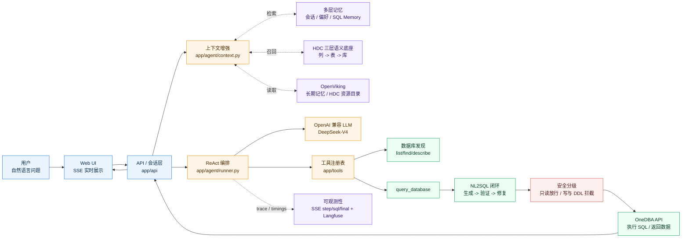
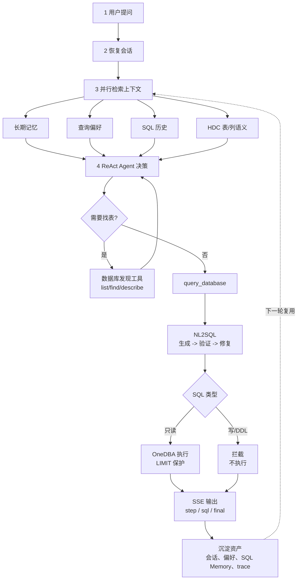

# DBAgent 项目汇报图稿

基于最新 `.kiro` 更新整理。视觉版见 [dbagent-ppt-diagrams.html](./dbagent-ppt-diagrams.html)。

## 已感知的 `.kiro` 变化

- HDC 数据底座从“四层：列 -> 表 -> 关系 -> 库”调整为“三层：列 -> 表 -> 库”。
- 当前前端主流式通道是 SSE；WebSocket 端点已实现，但前端未接入。
- NL2SQL 模块描述移除了 `semantics.py`，核心仍是 `generator.py`、`validator.py`、`repair.py`、`schema.py`。
- 新增 Agent 可观测性侧信道：收集 NL2SQL 阶段耗时、上下文 token、工具耗时，并进入评测报告。
- HDC demo 脚本已从 `tests/datavault/` 迁移到 `tools/hdc/`，测试目录保留纯测试。

## 1. 模块关系图

## 2. 业务流程图

## 汇报讲解主线

- **一眼看主链路**：用户问题 -> 上下文增强 -> ReAct 决策 -> NL2SQL 闭环 -> 安全执行 -> SSE 结果。
- **一眼看创新点**：HDC 三层语义底座、多层记忆、ContextVar 富化、观测侧信道、安全分级。
- **一眼看业务价值**：少找表、少写 SQL、少误操作、过程透明、结果可复用。
