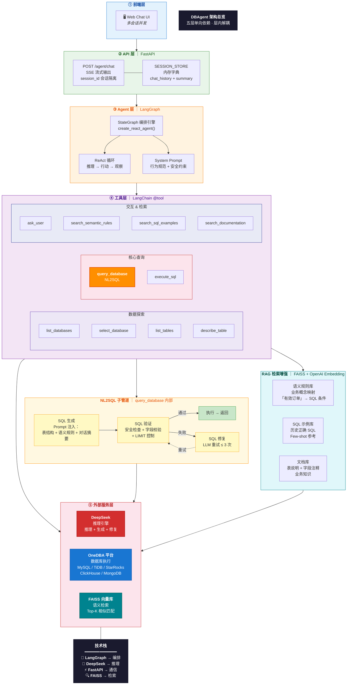

# DBAgent 架构总览图

```mermaid
graph TB
    %% ===== 标题 =====
    TITLE["<b>DBAgent 架构总览</b><br/>五层单向依赖 · 层内解耦"]

    %% ===== 第一层：前端 =====
    subgraph L1["<b>① 前端层</b>"]
        UI["🖥️ Web Chat UI<br/><i>多会话并发</i>"]
    end

    %% ===== 第二层：API =====
    subgraph L2["<b>② API 层</b> ｜ FastAPI"]
        direction LR
        API["POST /agent/chat<br/>SSE 流式输出<br/>session_id 会话隔离"]
        STORE["SESSION_STORE<br/>内存字典<br/>chat_history + summary"]
        API --- STORE
    end

    %% ===== 第三层：Agent =====
    subgraph L3["<b>③ Agent 层</b> ｜ LangGraph"]
        direction TB
        GRAPH["StateGraph 编排引擎<br/>create_react_agent()"]
        LOOP["ReAct 循环<br/>推理 → 行动 → 观察"]
        PROMPT["System Prompt<br/>行为规范 + 安全约束"]
        GRAPH --> LOOP
        GRAPH --> PROMPT
    end

    %% ===== 第四层：工具 =====
    subgraph L4["<b>④ 工具层</b> ｜ LangChain @tool"]
        direction LR
        subgraph L4A["数据探索"]
            T1["list_databases"]
            T2["select_database"]
            T3["list_tables"]
            T4["describe_table"]
        end
        subgraph L4B["核心查询"]
            T5["<b>query_database</b><br/>NL2SQL"]
            T6["execute_sql"]
        end
        subgraph L4C["交互 & 检索"]
            T7["ask_user"]
            T8["search_semantic_rules"]
            T9["search_sql_examples"]
            T10["search_documentation"]
        end
    end

    %% ===== NL2SQL 管道 =====
    subgraph L4D["<b>NL2SQL 子管道</b> ｜ query_database 内部"]
        direction LR
        GEN["SQL 生成<br/>Prompt 注入：<br/>表结构 + 语义规则 + 对话摘要"]
        VAL["SQL 验证<br/>安全检查 + 字段校验<br/>+ LIMIT 控制"]
        REP["SQL 修复<br/>LLM 重试 ≤ 3 次"]
        GEN --> VAL
        VAL -->|通过| EXEC["执行 → 返回"]
        VAL -->|失败| REP
        REP -.->|重试| VAL
    end

    %% ===== RAG 模块 =====
    subgraph L4E["<b>RAG 检索增强</b> ｜ FAISS + OpenAI Embedding"]
        direction LR
        RAG1["语义规则库<br/>业务概念映射<br/>「有效订单」→ SQL 条件"]
        RAG2["SQL 示例库<br/>历史正确 SQL<br/>Few-shot 参考"]
        RAG3["文档库<br/>表说明 + 字段注释<br/>业务知识"]
    end

    %% ===== 第五层：外部服务 =====
    subgraph L5["<b>⑤ 外部服务层</b>"]
        direction LR
        LLM["<b>DeepSeek</b><br/>推理引擎<br/>推理 + 生成 + 修复"]
        ONEDBA["<b>OneDBA 平台</b><br/>数据库执行<br/>MySQL / TiDB / StarRocks<br/>ClickHouse / MongoDB"]
        VECTOR["<b>FAISS 向量库</b><br/>语义检索<br/>Top-K 相似匹配"]
    end

    %% ===== 层间连线（单向依赖） =====
    L1 --> L2
    L2 --> L3
    L3 --> L4
    L4 --> L4D
    L4 --> L4E
    L4 --> L5
    L4D --> L5
    L4E --> L5

    %% ===== 技术栈标注 =====
    TECH["<b>技术栈</b><br/>━━━━━━━━━━━━━<br/>🔧 <b>LangGraph</b> → 编排<br/>🧠 <b>DeepSeek</b>  → 推理<br/>⚡ <b>FastAPI</b>   → 通信<br/>🔍 <b>FAISS</b>     → 检索"]

    L5 --- TECH

    %% ===== 样式 =====
    style L1 fill:#e3f2fd,stroke:#1976d2,color:#0d47a1
    style L2 fill:#e8f5e9,stroke:#388e3c,color:#1b5e20
    style L3 fill:#fff3e0,stroke:#f57c00,color:#e65100
    style L4 fill:#f3e5f5,stroke:#7b1fa2,color:#4a148c
    style L4D fill:#fff8e1,stroke:#ff8f00,color:#e65100
    style L4E fill:#e0f7fa,stroke:#00838f,color:#004d40
    style L5 fill:#fce4ec,stroke:#c62828,color:#b71c1c
    style L4A fill:#ede7f6,stroke:#5e35b1
    style L4B fill:#fce4ec,stroke:#c62828
    style L4C fill:#e8eaf6,stroke:#283593

    style TITLE fill:#1a1a2e,stroke:#1a1a2e,color:#ffffff,stroke-width:2px
    style TECH fill:#1a1a2e,stroke:#1a1a2e,color:#ffffff,stroke-width:2px

    style T5 fill:#ff8f00,stroke:#e65100,color:#fff,stroke-width:2px
    style LLM fill:#d32f2f,stroke:#b71c1c,color:#fff,stroke-width:2px
    style ONEDBA fill:#1976d2,stroke:#0d47a1,color:#fff
    style VECTOR fill:#00838f,stroke:#004d40,color:#fff

    style GEN fill:#fff9c4,stroke:#f9a825
    style VAL fill:#fff9c4,stroke:#f9a825
    style REP fill:#fff9c4,stroke:#f9a825
    style EXEC fill:#c8e6c9,stroke:#43a047
```